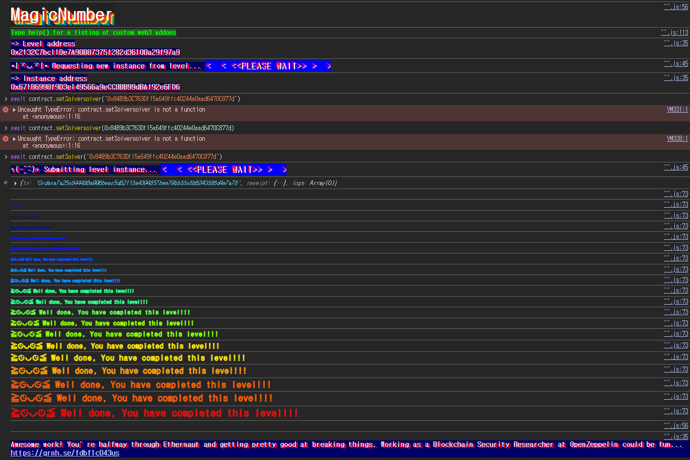

## 문제
### 지문
To solve this level, you only need to provide the Ethernaut with a Solver, a contract that responds to whatIsTheMeaningOfLife() with the right 32 byte number.
Easy right? Well... there's a catch.
The solver's code needs to be really tiny. Really reaaaaaallly tiny. Like freakin' really really itty-bitty tiny: 10 bytes at most.
Hint: Perhaps its time to leave the comfort of the Solidity compiler momentarily, and build this one by hand O_o. That's right: Raw EVM bytecode.
Good luck!
### 코드
```solidity
// SPDX-License-Identifier: MIT
pragma solidity ^0.8.0;

contract MagicNum {
    address public solver;

    constructor() {}

    function setSolver(address _solver) public {
        solver = _solver;
    }

    /*
    ____________/\\\\\\_______/\\\\\\\\\\\\\\\\\\_____        
     __________/\\\\\\\\\\_____/\\\\\\///////\\\\\\___       
      ________/\\\\\\/\\\\\\____\\///______\\//\\\\\\__      
       ______/\\\\\\/\\/\\\\\\______________/\\\\\\/___     
        ____/\\\\\\/__\\/\\\\\\___________/\\\\\\//_____    
         __/\\\\\\\\\\\\\\\\\\\\\\\\\\\\\\\\_____/\\\\\\//________   
          _\\///////////\\\\\\//____/\\\\\\/___________  
           ___________\\/\\\\\\_____/\\\\\\\\\\\\\\\\\\\\\\\\\\\\\\_ 
            ___________\\///_____\\///////////////__
    */
}
```
## 배경지식

---

솔리디티 컨트랙트의 바이트코드는 크게 `creation code`와 `runtime code`로 나뉜다.
`creation code`는 컨트랙트를 배포할 때 한 번 실행되는 코드다. `constructor`도 이 단계에 포함된다. 이 코드는 메모리에 실제로 저장될 `runtime code`를 만들고, 마지막에 `return`으로 그 바이트코드를 반환한다.
`runtime code`는 배포가 끝난 뒤 컨트랙트 주소에 저장되는 코드다. 이후 외부에서 컨트랙트를 호출하면 이 코드가 실행된다. 즉 `extcodesize`로 확인되는 코드 크기도 `creation code`가 아니라 `runtime code`의 크기다.
이번 문제에서 말하는 solver의 코드 길이 10바이트 제한은 배포 코드 전체가 아니라 배포 후 남는 `runtime code`의 길이에 대한 제한이다. 그래서 솔리디티 컴파일러가 만들어주는 일반 컨트랙트 대신, 직접 10바이트짜리 런타임 코드를 만들어서 배포해야 한다.

---

EVM 명령어는 주로 stack을 사용한다. 예를 들어 `PUSH1 0x2a`는 1바이트 값 `0x2a`를 stack에 올린다. `MSTORE`는 stack에서 offset과 value를 꺼내 메모리에 32바이트 값을 저장하고, `RETURN`은 메모리의 특정 구간을 호출 결과로 반환한다.
이번에 필요한 opcode는 세 개뿐이다.
<table>
<tr>
<td>Opcode</td>
<td>명령어</td>
<td>의미</td>
</tr>
<tr>
<td>0x60</td>
<td>PUSH1</td>
<td>1바이트 값을 stack에 올린다</td>
</tr>
<tr>
<td>0x52</td>
<td>MSTORE</td>
<td>메모리의 offset 위치에 32바이트 값을 저장한다</td>
</tr>
<tr>
<td>0xf3</td>
<td>RETURN</td>
<td>메모리의 offset부터 length만큼 반환한다</td>
</tr>
</table>

`whatIsTheMeaningOfLife()`의 selector를 검사하지 않아도 된다. Ethernaut은 이 함수를 호출했을 때 반환값만 확인한다. 런타임 코드가 어떤 calldata가 들어와도 무조건 42를 반환하면 조건을 만족한다.
## 문제 코드 분석

---

먼저 `solver`를 저장하는 부분을 보자.
```solidity
address public solver;

function setSolver(address _solver) public {
    solver = _solver;
}
```
`MagicNum`은 `solver` 주소를 저장하는 기능만 제공한다. 별도의 권한 체크도 없고, `_solver`가 어떤 코드인지 `setSolver` 단계에서 검증하지도 않는다.
검증은 Ethernaut 레벨 완료 과정에서 이루어진다. 저장된 `solver`를 대상으로 `whatIsTheMeaningOfLife()`를 호출했을 때 32바이트 정수 42가 반환되고, solver의 런타임 코드 크기가 10바이트 이하여야 한다.

---

반환해야 하는 값은 42다. 16진수로는 `0x2a`이고, ABI에서 `uint256` 반환값은 32바이트로 표현된다.
먼저 `0x2a`를 메모리 0번 위치에 32바이트 값으로 저장하고, 메모리 0번부터 32바이트를 반환하면 된다.
```plain text
PUSH1 0x2a
PUSH1 0x00
MSTORE
PUSH1 0x20
PUSH1 0x00
RETURN
```
이를 바이트코드로 쓰면 다음과 같다.
```plain text
60 2a 60 00 52 60 20 60 00 f3
```
길이를 세어보면 정확히 10바이트다.
```plain text
602a60005260206000f3
```
여기서 `MSTORE`는 32바이트 단위로 값을 저장한다. `0x2a`는 `uint256` 값으로 저장되므로 실제 반환 데이터는 다음과 같은 32바이트가 된다.
```plain text
000000000000000000000000000000000000000000000000000000000000002a
```

---

10바이트짜리 코드를 그냥 트랜잭션 data로 보내면 배포가 되지 않는다. 컨트랙트 생성 트랜잭션의 data는 먼저 `creation code`로 실행되고, 그 실행 결과로 반환된 바이트열이 컨트랙트의 `runtime code`로 저장된다.
따라서 배포용 컨트랙트의 `constructor`에서 메모리에 `602a60005260206000f3`를 넣고, 그 10바이트만 반환하면 된다.
```solidity
constructor() {
    assembly {
        mstore(0, 0x602a60005260206000f3)
        return(22, 10)
    }
}
```
`mstore(0, value)`는 `value`를 32바이트로 메모리에 저장한다. 값은 오른쪽 정렬되므로 10바이트짜리 런타임 코드는 메모리의 22번 offset부터 시작한다.
즉 메모리 구조를 간단히 보면 다음과 같다.
```plain text
00 ... 00 60 2a 60 00 52 60 20 60 00 f3
<--22B--> <------------- 10B ------------->
```
그래서 `return(22, 10)`을 써야 우리가 만든 10바이트만 `runtime code`로 저장된다.

## 풀이
여기서는 Solidity 함수 문법으로 `whatIsTheMeaningOfLife()`를 구현하지 않는다. 어떤 호출이 들어와도 42를 반환하는 10바이트짜리 `runtime code`를 직접 만든다.
런타임 코드는 `602a60005260206000f3`다. 이 코드는 메모리에 `0x2a`를 32바이트 값으로 저장한 뒤, 그 32바이트를 그대로 반환한다. 함수 selector를 검사하지 않기 때문에 `whatIsTheMeaningOfLife()` 호출에도 42를 반환한다.
배포할 때는 `constructor`에서 이 런타임 코드를 반환하게 만들고, 배포된 `Attack` 컨트랙트 주소를 `setSolver`에 넘기면 된다.

### 익스플로잇
```solidity
// SPDX-License-Identifier: MIT
pragma solidity ^0.8.0;

contract Attack {
    constructor() {
        assembly {
            mstore(0, 0x602a60005260206000f3)
            return(22, 10)
        }
    }
}
```

