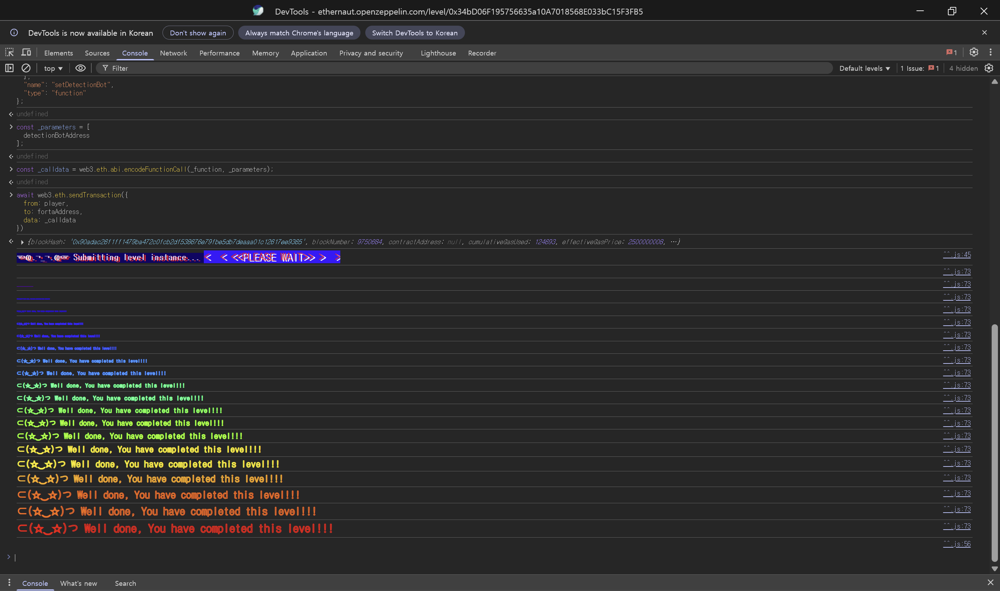

## 문제
### 지문
이 레벨에는 `sweepToken`이라는 기능을 가진 `CryptoVault`가 있다. `sweepToken`은 컨트랙트에 잘못 들어온 토큰을 회수할 때 흔히 쓰는 함수다.
`CryptoVault`는 `underlying` 토큰을 보호 대상으로 다루기 때문에 이 토큰은 회수하면 안 된다. 여기서 `underlying`은 `DoubleEntryPoint` 컨트랙트에 구현된 DET 토큰이고, `CryptoVault`는 DET 100개를 가지고 있다. 동시에 `LegacyToken`인 LGT도 100개 가지고 있다.
목표는 `CryptoVault`의 버그가 어디에 있는지 찾고, 토큰이 빠져나가지 않도록 `Forta`에 등록할 `detection bot`을 구현하는 것이다.
확인해야 할 부분은 LGT 호출이 DET 전송으로 이어지는 구조다.
### 코드
```solidity
// SPDX-License-Identifier: MIT
pragma solidity ^0.8.0;

import "openzeppelin-contracts-08/access/Ownable.sol";
import "openzeppelin-contracts-08/token/ERC20/ERC20.sol";

interface DelegateERC20 {
    function delegateTransfer(address to, uint256 value, address origSender) external returns (bool);
}

interface IDetectionBot {
    function handleTransaction(address user, bytes calldata msgData) external;
}

interface IForta {
    function setDetectionBot(address detectionBotAddress) external;
    function notify(address user, bytes calldata msgData) external;
    function raiseAlert(address user) external;
}

contract Forta is IForta {
    mapping(address => IDetectionBot) public usersDetectionBots;
    mapping(address => uint256) public botRaisedAlerts;

    function setDetectionBot(address detectionBotAddress) external override {
        usersDetectionBots[msg.sender] = IDetectionBot(detectionBotAddress);
    }

    function notify(address user, bytes calldata msgData) external override {
        if (address(usersDetectionBots[user]) == address(0)) return;
        try usersDetectionBots[user].handleTransaction(user, msgData) {
            return;
        } catch {}
    }

    function raiseAlert(address user) external override {
        if (address(usersDetectionBots[user]) != msg.sender) return;
        botRaisedAlerts[msg.sender] += 1;
    }
}

contract CryptoVault {
    address public sweptTokensRecipient;
    IERC20 public underlying;

    constructor(address recipient) {
        sweptTokensRecipient = recipient;
    }

    function setUnderlying(address latestToken) public {
        require(address(underlying) == address(0), "Already set");
        underlying = IERC20(latestToken);
    }

    /*
    ...
    */

    function sweepToken(IERC20 token) public {
        require(token != underlying, "Can't transfer underlying token");
        token.transfer(sweptTokensRecipient, token.balanceOf(address(this)));
    }
}

contract LegacyToken is ERC20("LegacyToken", "LGT"), Ownable {
    DelegateERC20 public delegate;

    function mint(address to, uint256 amount) public onlyOwner {
        _mint(to, amount);
    }

    function delegateToNewContract(DelegateERC20 newContract) public onlyOwner {
        delegate = newContract;
    }

    function transfer(address to, uint256 value) public override returns (bool) {
        if (address(delegate) == address(0)) {
            return super.transfer(to, value);
        } else {
            return delegate.delegateTransfer(to, value, msg.sender);
        }
    }
}

contract DoubleEntryPoint is ERC20("DoubleEntryPointToken", "DET"), DelegateERC20, Ownable {
    address public cryptoVault;
    address public player;
    address public delegatedFrom;
    Forta public forta;

    constructor(address legacyToken, address vaultAddress, address fortaAddress, address playerAddress) {
        delegatedFrom = legacyToken;
        forta = Forta(fortaAddress);
        player = playerAddress;
        cryptoVault = vaultAddress;
        _mint(cryptoVault, 100 ether);
    }

    modifier onlyDelegateFrom() {
        require(msg.sender == delegatedFrom, "Not legacy contract");
        _;
    }

    modifier fortaNotify() {
        address detectionBot = address(forta.usersDetectionBots(player));

        // Cache old number of bot alerts
        uint256 previousValue = forta.botRaisedAlerts(detectionBot);

        // Notify Forta
        forta.notify(player, msg.data);

        // Continue execution
        _;

        // Check if alarms have been raised
        if (forta.botRaisedAlerts(detectionBot) > previousValue) revert("Alert has been triggered, reverting");
    }

    function delegateTransfer(address to, uint256 value, address origSender)
        public
        override
        onlyDelegateFrom
        fortaNotify
        returns (bool)
    {
        _transfer(origSender, to, value);
        return true;
    }
}
```
## 배경지식
<hr />
보통 ERC20 토큰은 하나의 컨트랙트 주소를 진입점으로 가진다. 사용자는 그 주소의 `transfer`, `approve`, `balanceOf`를 호출하고, 다른 프로토콜도 그 주소를 기준으로 토큰을 식별한다.
그런데 이 문제에서는 LGT와 DET가 연결되어 있다. `LegacyToken.transfer`를 호출했는데 실제 잔액 이동은 `DoubleEntryPoint.delegateTransfer`에서 일어난다. LGT 주소로 들어온 호출이 DET 잔액 이동으로 이어지는 구조다.
이런 구조에서는 `token != underlying`처럼 주소 하나만 비교하는 방어가 약해진다. 호출한 토큰 주소는 LGT지만, 실제로 빠져나가는 자산은 DET일 수 있기 때문이다.
<hr />
`DoubleEntryPoint.delegateTransfer`가 호출될 때 `fortaNotify`는 다음처럼 `msg.data`를 Forta 봇에게 넘긴다.
```solidity
forta.notify(player, msg.data);
```
`msg.data`는 앞 4바이트의 함수 selector와 ABI 인코딩된 인자들로 구성된다.
`delegateTransfer(address to, uint256 value, address origSender)`의 calldata는 다음 구조다.
```plain text
0x00000000..0x00000003  function selector
0x00000004..            to
                        value
                        origSender
```
봇에서는 `msgData[4:]`를 `abi.decode`하면 `to`, `value`, `origSender`를 꺼낼 수 있다. 이번 문제에서 봐야 할 값은 `origSender`다.
<hr />
Forta는 취약한 코드를 직접 고치는 장치가 아니라 실행 중인 트랜잭션을 감시하는 장치다. 사용자는 자신의 `detection bot`을 등록하고, DET의 `delegateTransfer`는 실행 전에 봇에게 calldata를 넘긴다.
봇이 `raiseAlert`를 호출하면 `botRaisedAlerts`가 증가한다. 이후 `fortaNotify`는 알림 수가 증가했는지 확인하고, 증가했다면 전체 전송을 revert한다.
## 문제 코드 분석
<hr />
먼저 `CryptoVault`의 sweep 조건을 보자.
```solidity
function sweepToken(IERC20 token) public {
    require(token != underlying, "Can't transfer underlying token");
    token.transfer(sweptTokensRecipient, token.balanceOf(address(this)));
}
```
`CryptoVault`는 `underlying`으로 등록된 토큰만 sweep하지 못하게 막는다. 여기서 `underlying`은 DET 주소다.
겉으로 보면 DET를 직접 넘겨 `sweepToken(DET)`를 호출하면 `require`에서 막힌다. 하지만 `sweepToken(LGT)`를 호출하면 `token`은 LGT 주소이므로 `token != underlying` 조건을 통과한다.
문제는 이 비교가 실제로 이동할 토큰을 확인하지 않는다는 점이다. `token.transfer(...)`가 LGT의 평범한 전송으로 끝난다면 괜찮지만, LGT는 DET로 위임될 수 있다.
<hr />
이제 `LegacyToken`의 delegate 흐름을 보자.
```solidity
function transfer(address to, uint256 value) public override returns (bool) {
    if (address(delegate) == address(0)) {
        return super.transfer(to, value);
    } else {
        return delegate.delegateTransfer(to, value, msg.sender);
    }
}
```
`LegacyToken`에 `delegate`가 설정되어 있으면 `transfer`는 자기 자신의 잔액을 옮기지 않고 `delegate.delegateTransfer`를 호출한다.
`CryptoVault.sweepToken(LGT)` 흐름에서는 LGT의 `transfer`를 호출한 주체가 `CryptoVault`이므로, 여기서 `msg.sender`는 `CryptoVault` 주소가 된다. 따라서 `delegateTransfer`의 세 번째 인자인 `origSender`에는 `CryptoVault`가 들어간다.
즉 흐름은 다음처럼 이어진다.
```plain text
CryptoVault.sweepToken(LGT)
-> LGT.transfer(sweptTokensRecipient, LGT.balanceOf(CryptoVault))
-> DET.delegateTransfer(sweptTokensRecipient, value, CryptoVault)
```
주소 비교는 LGT 기준으로 통과했지만, 실제로는 DET의 `delegateTransfer`가 위험하다.
<hr />
다음으로 `DoubleEntryPoint`의 실제 전송을 보자.
```solidity
function delegateTransfer(address to, uint256 value, address origSender)
    public
    override
    onlyDelegateFrom
    fortaNotify
    returns (bool)
{
    _transfer(origSender, to, value);
    return true;
}
```
`delegateTransfer`는 `onlyDelegateFrom` 때문에 LGT 컨트랙트에서 온 호출만 받는다. 이 조건은 공격을 막기보다는 LGT를 통한 우회 경로를 공식화한다.
실제 전송은 `_transfer(origSender, to, value)`다. `origSender`가 `CryptoVault`라면 DET 컨트랙트 입장에서는 `CryptoVault`가 가진 DET를 `sweptTokensRecipient`로 보내는 전송이 된다.
`CryptoVault`는 `token` 주소만 보고 sweep 가능 여부를 판단한다. LGT라는 다른 진입점으로 들어왔지만 DET의 잔액이 이동하는 구조를 고려하지 못한 것이다.
<hr />
마지막으로 Forta 알림 지점을 보자.
```solidity
modifier fortaNotify() {
    address detectionBot = address(forta.usersDetectionBots(player));
    uint256 previousValue = forta.botRaisedAlerts(detectionBot);

    forta.notify(player, msg.data);
    _;

    if (forta.botRaisedAlerts(detectionBot) > previousValue) revert("Alert has been triggered, reverting");
}
```
`fortaNotify`는 `delegateTransfer` 실행 전에 봇에게 `msg.data`를 넘긴다. 봇이 `origSender == cryptoVault`인 호출을 감지하고 `raiseAlert`를 호출하면, `delegateTransfer` 실행 뒤 알림 수 증가가 확인되어 revert된다.
봇은 `to`나 `value`보다 `origSender`가 `CryptoVault`인지 확인하면 된다. `CryptoVault`에서 DET가 빠져나가는 호출이면 차단해야 한다.
## 풀이
`CryptoVault`는 DET 주소만 `underlying`으로 막고 있지만, LGT의 `transfer`는 DET의 `delegateTransfer`로 이어진다. 그래서 `sweepToken(LGT)`를 호출하면 조건은 통과하면서 DET가 빠져나갈 수 있다.
해결은 `delegateTransfer`가 실행될 때 Forta 봇이 calldata를 읽고, `origSender`가 `CryptoVault`이면 알림을 올리는 것이다. `fortaNotify`는 알림 증가를 보고 전송을 revert하므로 DET가 빠져나가지 않는다.
봇을 배포한 뒤 `Forta.setDetectionBot`에 봇 주소를 등록하면 된다.
### 익스플로잇
```solidity
// SPDX-License-Identifier: MIT
pragma solidity ^0.8.0;

interface IForta {
    function raiseAlert(address user) external;
}

contract DetectionBot {
    address public cryptoVault;

    constructor(address _cryptovault) {
        cryptoVault = _cryptovault;
    }

    function handleTransaction(address user, bytes calldata msgData) external {
        (,, address origSender) = abi.decode(msgData[4:], (address, uint256, address));

        if (origSender == cryptoVault) {
            IForta(msg.sender).raiseAlert(user);
        }
    }
}
```

