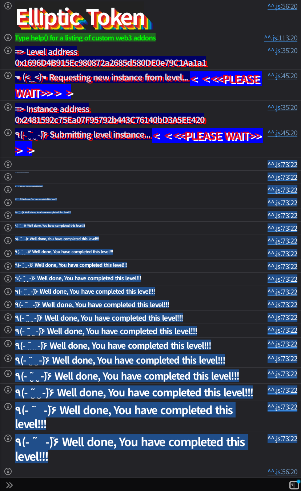

## 문제
### 지문
BOB created and owns a new ERC20 token with an elliptic curve–based <br>signed voucher redemption system called EllipticToken (\$ETK). Bob can <br>create vouchers off-chain that can be redeemed on-chain for \$ETK. The <br>contract also includes a permit system based on elliptic curve <br>signatures.
Bob is a lazy developer and “optimized” some steps of the ECDSA algorithm. Can you find the flaw?
Your goal is to steal the \$ETK tokens that ALICE (`0xA11CE84AcB91Ac59B0A4E2945C9157eF3Ab17D4e`) just redeemed.
Things that might help:
- Look for any missing step in the [Elliptic Curve Digital Signature Algorithm (ECDSA)](https://en.wikipedia.org/wiki/Elliptic_Curve_Digital_Signature_Algorithm).
Good luck. Elliptic curves do not forgive domain confusion.
### 코드
```solidity
// SPDX-License-Identifier: MIT
pragma solidity 0.8.28;

import {Ownable} from "openzeppelin-contracts-08/access/Ownable.sol";
import {ECDSA} from "openzeppelin-contracts-08/utils/cryptography/ECDSA.sol";
import {ERC20} from "openzeppelin-contracts-08/token/ERC20/ERC20.sol";

contract EllipticToken is Ownable, ERC20 {
    error HashAlreadyUsed();
    error InvalidOwner();
    error InvalidReceiver();
    error InvalidSpender();

    constructor() ERC20("EllipticToken", "ETK") {}

    mapping(bytes32 => bool) public usedHashes;

    function redeemVoucher(
        uint256 amount,
        address receiver,
        bytes32 salt,
        bytes memory ownerSignature,
        bytes memory receiverSignature
    ) external {
        bytes32 voucherHash = keccak256(abi.encodePacked(amount, receiver, salt));
        require(!usedHashes[voucherHash], HashAlreadyUsed());

        // Verify that the owner emitted the voucher
        require(ECDSA.recover(voucherHash, ownerSignature) == owner(), InvalidOwner());

        // Verify that the receiver accepted the voucher
        require(ECDSA.recover(voucherHash, receiverSignature) == receiver, InvalidReceiver());

        // Nullify the voucher
        usedHashes[voucherHash] = true;

        // Mint the tokens
        _mint(receiver, amount);
    }

    function permit(uint256 amount, address spender, bytes memory tokenOwnerSignature, bytes memory spenderSignature)
        external
    {
        bytes32 permitHash = keccak256(abi.encode(amount));
        require(!usedHashes[permitHash], HashAlreadyUsed());
        require(!usedHashes[bytes32(amount)], HashAlreadyUsed());

        // Recover the token owner that emitted the permit
        address tokenOwner = ECDSA.recover(bytes32(amount), tokenOwnerSignature);

        // Verify that the spender accepted the permit
        bytes32 permitAcceptHash = keccak256(abi.encodePacked(tokenOwner, spender, amount));
        require(ECDSA.recover(permitAcceptHash, spenderSignature) == spender, InvalidSpender());

        // Nullify the permit
        usedHashes[permitHash] = true;

        // Approve the spender
        _approve(tokenOwner, spender, amount);
    }
}
```
## 배경지식
<hr />
ECDSA에서는 개인키를 `d`, 공개키를 Q=dG 라고 하자. 메시지 해시를 `e`라고 할 때, 서명은 보통 `(r, s, v)`로 표현된다. 여기서 `r`은 nonce `k`로 만든 점 R=kG의 x좌표에서 나오고, `s`는 다음 식으로 만들어진다.
$$
s \equiv k^{-1}(e + rd) \pmod n
$$
검증자는 개인키를 몰라도 공개키 Q, 메시지 해시 `e`, 서명 `(r, s)`만으로 서명을 확인할 수 있다. 먼저 `w = s^{-1}`를 계산하고, 다음 두 값을 만든다.
$$
u_1 \equiv ew \pmod n, \quad u_2 \equiv rw \pmod n
$$
그리고 점 R'을 계산한다.
$$
R' = u_1G + u_2Q
$$
검증은 R'의 x좌표에서 얻은 값이 `r`과 같은지 확인하는 방식이다. 즉 ECDSA 검증은 최종적으로 “이 `(e, r, s)` 조합이 공개키 Q에 대해 같은 점을 만들 수 있는가”를 보는 구조다.
<hr />
ECDSA에서 메시지 해시 `e`를 애플리케이션이 안전하게 고정하지 않으면 문제가 생긴다. 공격자가 검증식에 들어갈 `e`까지 고를 수 있으면, 개인키 없이도 어떤 공개키 Q에 대해 유효한 `(e, r, s)` 조합을 만들 수 있다.
임의의 `u1`, `u2`를 고르고 다음 점을 계산한다고 하자.
$$
R = u_1G + u_2Q
$$
그 다음 R의 x좌표에서 `r`을 얻고, 다음처럼 `s`와 `e`를 맞춘다.
$$
s \equiv r u_2^{-1} \pmod n
$$
$$
e \equiv r u_1 u_2^{-1} \pmod n
$$
그러면 검증 과정에서는 `e / s = u1`, `r / s = u2`가 되므로 다시 같은 R을 만들게 된다. 그러면 `(r, s)`는 메시지 해시 `e`에 대한 유효한 서명처럼 보인다. 특정 의미를 가진 문서에 서명한 것이 아니라, 검증식을 만족하는 값을 역으로 맞춘 것이다.
<hr />
정상적인 permit이라면 “누가, 누구에게, 얼마를, 어떤 컨트랙트에서, 어떤 chain에서, 어떤 nonce로 허락하는가”가 모두 메시지에 들어가야 한다. ERC-2612나 EIP-712가 이런 구조를 쓰는 이유가 이 때문이다.
`permit()`은 토큰 소유자 서명을 검증할 때 `bytes32(amount)` 자체를 메시지 해시로 쓴다. `amount`는 사용자가 고르는 값인데, 이 값이 곧 ECDSA digest가 된다. 즉 permit의 의미와 서명 digest 사이에 도메인 분리가 없다.
## 문제 코드 분석
<hr />
먼저 `redeemVoucher()`에서 얻을 수 있는 정보를 보자.
```solidity
function redeemVoucher(
    uint256 amount,
    address receiver,
    bytes32 salt,
    bytes memory ownerSignature,
    bytes memory receiverSignature
) external {
    bytes32 voucherHash = keccak256(abi.encodePacked(amount, receiver, salt));
    require(!usedHashes[voucherHash], HashAlreadyUsed());

    require(ECDSA.recover(voucherHash, ownerSignature) == owner(), InvalidOwner());
    require(ECDSA.recover(voucherHash, receiverSignature) == receiver, InvalidReceiver());

    usedHashes[voucherHash] = true;
    _mint(receiver, amount);
}
```
`redeemVoucher()`는 `voucherHash`에 대해 Bob의 서명과 receiver의 서명을 확인한다. 문제 설명에 따르면 Alice는 이미 voucher를 redeem했다. 해당 트랜잭션 calldata에는 Alice의 `receiverSignature`가 들어 있고, `amount`, `receiver`, `salt`로 `voucherHash`도 다시 계산할 수 있다.
이 정보가 있으면 오프체인에서 Alice의 공개키 Q를 복구할 수 있다. Solidity의 `ECDSA.recover`는 주소만 돌려주지만, 같은 `(voucherHash, receiverSignature)`를 오프체인 ECDSA 라이브러리에 넣으면 공개키까지 얻을 수 있다. 여기서 얻은 Q가 위조 서명을 만들 때 필요한 공개키다.
<hr />
이제 `permit()`에서 `tokenOwner`를 복구하는 부분을 보자.
```solidity
function permit(uint256 amount, address spender, bytes memory tokenOwnerSignature, bytes memory spenderSignature)
    external
{
    bytes32 permitHash = keccak256(abi.encode(amount));
    require(!usedHashes[permitHash], HashAlreadyUsed());
    require(!usedHashes[bytes32(amount)], HashAlreadyUsed());

    address tokenOwner = ECDSA.recover(bytes32(amount), tokenOwnerSignature);

    bytes32 permitAcceptHash = keccak256(abi.encodePacked(tokenOwner, spender, amount));
    require(ECDSA.recover(permitAcceptHash, spenderSignature) == spender, InvalidSpender());

    usedHashes[permitHash] = true;
    _approve(tokenOwner, spender, amount);
}
```
여기서 `tokenOwner`는 `ECDSA.recover(bytes32(amount), tokenOwnerSignature)`로 계산된다. 즉 `amount`가 단순 승인 수량이 아니라 ECDSA 메시지 해시 역할까지 한다.
공격자는 Alice의 공개키 Q에 대해 유효한 `(e, r, s, v)`를 만든 뒤, `amount = uint256(e)`로 넣으면 된다. 그러면 `ECDSA.recover(bytes32(amount), tokenOwnerSignature)`는 Alice 주소를 반환한다. 컨트랙트는 Alice가 `amount`만큼 permit을 발급했다고 착각한다.
<hr />
`spenderSignature` 쪽은 직접 만들 수 있다.
```solidity
bytes32 permitAcceptHash = keccak256(abi.encodePacked(tokenOwner, spender, amount));
require(ECDSA.recover(permitAcceptHash, spenderSignature) == spender, InvalidSpender());
```
두 번째 서명은 spender가 permit을 받아들였는지 확인하는 용도다. 우리는 spender를 player 주소로 넣을 것이고 player의 개인키를 가지고 있다. `keccak256(abi.encodePacked(ALICE, player, amount))`에 대한 서명은 직접 만들 수 있다.
즉 필요한 것은 Alice의 개인키가 아니라, Alice로 복구되는 `tokenOwnerSignature`와 player가 직접 만든 `spenderSignature`다.
<hr />
마지막으로 `usedHashes` 체크를 보자.
```solidity
bytes32 permitHash = keccak256(abi.encode(amount));
require(!usedHashes[permitHash], HashAlreadyUsed());
require(!usedHashes[bytes32(amount)], HashAlreadyUsed());
```
`redeemVoucher()`가 사용 처리한 값은 `voucherHash`다. exploit에서는 새로 만든 `e`를 `amount`로 쓰므로 `bytes32(amount)`와 `keccak256(abi.encode(amount))`는 기존 voucher에서 사용된 hash와 다르다.
또한 `amount`는 실제 Alice 잔액보다 훨씬 큰 값이다. `_approve(tokenOwner, spender, amount)`는 큰 allowance를 열어주고, 이후에는 Alice의 실제 잔액만큼만 `transferFrom()`으로 가져오면 된다.
## 풀이
Alice가 이미 redeem한 트랜잭션에서 `receiverSignature`와 `voucherHash`를 얻어 Alice의 공개키 Q를 복구한다. 그 다음 위에서 본 방식대로 Q에 대해 유효한 새 메시지 해시 `e`와 서명 `(r, s, v)`를 만든다.
이 풀이에서는 오프체인에서 미리 다음 값을 계산해두었다.
```solidity
uint256 private constant FORGED_AMOUNT =
    0xebf90284f84cb6e234a8ecf9393afda9c0ede46f4d6df12bd11a4757c42903c0;

bytes private constant ALICE_FORGED_SIGNATURE =
    hex"0ab5b8262a97582b1971d68211e37be02ac5d16339cb0278edffc0a465d64aac7b06ed5cd7bc5798089feda2fac7b577ef49e1f2f84a6d2392ff26078f2192a01c";
```
`FORGED_AMOUNT`는 permit에 들어갈 `amount`이면서 동시에 `bytes32(amount)`로 해석되는 ECDSA digest다. `ALICE_FORGED_SIGNATURE`는 이 digest에 대해 Alice 주소로 복구되는 서명이다.
이제 player는 자기 개인키로 `spenderSignature`만 만들면 된다. `permit()` 호출이 성공하면 Alice가 player에게 매우 큰 allowance를 준 상태가 되고, `transferFrom(ALICE, player, aliceBalance)`로 Alice의 ETK를 가져올 수 있다.
### 익스플로잇
```solidity
// SPDX-License-Identifier: MIT
pragma solidity ^0.8.28;

import "forge-std/Script.sol";

interface IEllipticToken {
    function balanceOf(address account) external view returns (uint256);
    function permit(uint256 amount, address spender, bytes calldata tokenOwnerSignature, bytes calldata spenderSignature)
        external;
    function transferFrom(address from, address to, uint256 amount) external returns (bool);
}

contract Sol35 is Script {
    address private constant ALICE = 0xA11CE84AcB91Ac59B0A4E2945C9157eF3Ab17D4e;

    uint256 private constant FORGED_AMOUNT =
        0xebf90284f84cb6e234a8ecf9393afda9c0ede46f4d6df12bd11a4757c42903c0;

    bytes private constant ALICE_FORGED_SIGNATURE =
        hex"0ab5b8262a97582b1971d68211e37be02ac5d16339cb0278edffc0a465d64aac7b06ed5cd7bc5798089feda2fac7b577ef49e1f2f84a6d2392ff26078f2192a01c";

    function run() external {
        uint256 privateKey = vm.envUint("PRIVATE_KEY");
        address player = vm.addr(privateKey);
        IEllipticToken token = IEllipticToken(vm.envAddress("ELLIPTIC_TOKEN_INSTANCE"));
        uint256 aliceBalance = token.balanceOf(ALICE);

        bytes32 permitAcceptHash = keccak256(abi.encodePacked(ALICE, player, FORGED_AMOUNT));
        (uint8 v, bytes32 r, bytes32 s) = vm.sign(privateKey, permitAcceptHash);
        bytes memory spenderSignature = abi.encodePacked(r, s, v);

        vm.startBroadcast(privateKey);

        token.permit(FORGED_AMOUNT, player, ALICE_FORGED_SIGNATURE, spenderSignature);
        require(token.transferFrom(ALICE, player, aliceBalance), "transferFrom failed");
        require(token.balanceOf(ALICE) == 0, "alice still has ETK");

        vm.stopBroadcast();
    }
}
```

