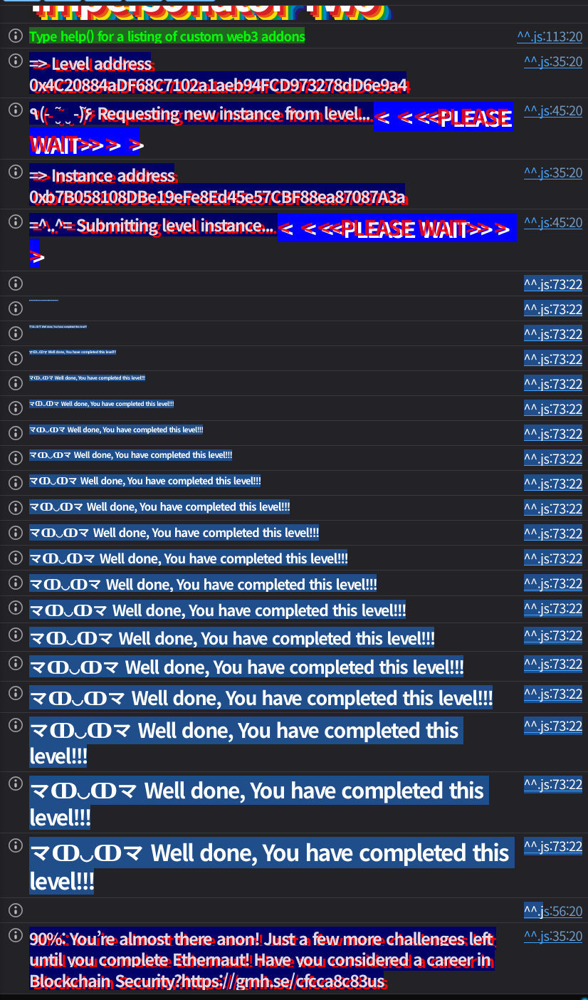

## 문제
### 지문
The goal of this level is for you to steal all the funds from the contract.
Things that might help:
- Look carefully at the 2 signatures that the owner of the contract used to lock it and set the admin.
### 코드
```solidity
// SPDX-License-Identifier: MIT
pragma solidity 0.8.28;

import {Ownable} from "openzeppelin-contracts-08/access/Ownable.sol";
import {ECDSA} from "openzeppelin-contracts-08/utils/cryptography/ECDSA.sol";
import {Strings} from "openzeppelin-contracts-08/utils/Strings.sol";

contract ImpersonatorTwo is Ownable {
    using Strings for uint256;

    error NotAdmin();
    error InvalidSignature();
    error FundsLocked();

    address public admin;
    uint256 public nonce;
    bool locked;

    constructor() payable {}

    modifier onlyAdmin() {
        require(msg.sender == admin, NotAdmin());
        _;
    }

    function setAdmin(bytes memory signature, address newAdmin) public {
        string memory message = string(abi.encodePacked("admin", nonce.toString(), newAdmin));
        require(_verify(hash_message(message), signature), InvalidSignature());
        nonce++;
        admin = newAdmin;
    }

    function switchLock(bytes memory signature) public {
        string memory message = string(abi.encodePacked("lock", nonce.toString()));
        require(_verify(hash_message(message), signature), InvalidSignature());
        nonce++;
        locked = !locked;
    }

    function withdraw() public onlyAdmin {
        require(!locked, FundsLocked());
        payable(admin).transfer(address(this).balance);
    }

    function hash_message(string memory message) public pure returns (bytes32) {
        return ECDSA.toEthSignedMessageHash(abi.encodePacked(message));
    }

    function _verify(bytes32 hash, bytes memory signature) internal view returns (bool) {
        return ECDSA.recover(hash, signature) == owner();
    }
}
```
## 배경지식

---

ECDSA 서명은 메시지 해시를 $z$, 개인키를 $d$, secp256k1의 group order를 $n$이라고 할 때 대략 다음 형태로 만들어진다.
$$
s \equiv k^{-1}(z + rd) \pmod n
$$
여기서 $k$는 서명마다 새로 써야 하는 nonce다. 서명 결과에 들어가는 $r$은 $kG$의 x좌표에서 나온다. 서로 다른 메시지에 대한 두 서명의 $r$이 같다면 같은 $k$를 재사용했다는 강한 신호다.

---

같은 개인키 $d$와 같은 $k$로 두 메시지 $z_1$, $z_2$를 서명했다고 하자.
$$
s_1 \equiv k^{-1}(z_1 + rd) \pmod n
$$
$$
s_2 \equiv k^{-1}(z_2 + rd) \pmod n
$$
두 식을 빼면 개인키 항이 사라진다.
$$
s_1 - s_2 \equiv k^{-1}(z_1-z_2) \pmod n
$$
여기서 $k$를 복구할 수 있다.
$$
k \equiv (z_1-z_2)(s_1-s_2)^{-1} \pmod n
$$
그리고 다시 첫 번째 식에 대입하면 개인키도 나온다.
$$
d \equiv (s_1k-z_1)r^{-1} \pmod n
$$
즉 같은 $r$을 가진 두 서명과 각각의 메시지 해시만 알면 owner의 개인키를 복구할 수 있다.

---

컨트랙트는 `ECDSA.toEthSignedMessageHash`를 사용한다. 따라서 서명 대상은 단순한 `keccak256(message)`가 아니라 다음 prefix가 붙은 해시다.
```solidity
keccak256(abi.encodePacked("\x19Ethereum Signed Message:\n", message.length, message))
```
`setAdmin`의 메시지도 봐야 한다. `abi.encodePacked("admin", nonce.toString(), newAdmin)`에서 `newAdmin`은 `0x...` 문자열이 아니라 20바이트 address 값 그대로 이어 붙는다.
## 문제 코드 분석

---

힌트에서는 owner가 lock과 admin 설정에 사용한 두 서명을 보라고 한다. 실제 인스턴스 생성 시에는 팩토리에서 다음 순서로 호출된다.
```solidity
bytes constant SWITCH_LOCK_SIG = abi.encodePacked(
    hex"e5648161e95dbf2bfc687b72b745269fa906031e2108118050aba59524a23c40", // r
    hex"70026fc30e4e02a15468de57155b080f405bd5b88af05412a9c3217e028537e3", // s
    uint8(27) // v
);
bytes constant SET_ADMIN_SIG = abi.encodePacked(
    hex"e5648161e95dbf2bfc687b72b745269fa906031e2108118050aba59524a23c40", // r
    hex"4c3ac03b268ae1d2aca1201e8a936adf578a8b95a49986d54de87cd0ccb68a79", // s
    uint8(27) // v
);

address constant OWNER = 0x03E2cf81BBE61D1fD1421aFF98e8605a5A9e953a;
address constant ADMIN = 0xADa4aFfe581d1A31d7F75E1c5a3A98b2D4C40f68;

instance.transferOwnership(OWNER);
instance.switchLock(SWITCH_LOCK_SIG);
instance.setAdmin(SET_ADMIN_SIG, ADMIN);
```
두 서명은 `r`이 같다.
```plain text
r = e5648161e95dbf2bfc687b72b745269fa906031e2108118050aba59524a23c40
```
서명 nonce $k$가 재사용됐으므로, `switchLock`에 쓰인 메시지와 `setAdmin`에 쓰인 메시지 해시를 알면 owner 개인키를 복구할 수 있다.

---

팩토리 호출 순서를 기준으로 처음 `nonce`는 0이다.
```solidity
function switchLock(bytes memory signature) public {
    string memory message = string(abi.encodePacked("lock", nonce.toString()));
    require(_verify(hash_message(message), signature), InvalidSignature());
    nonce++;
    locked = !locked;
}
```
첫 호출은 `switchLock`이므로 메시지는 `"lock0"`이다. 이 호출 뒤 `nonce`는 1이 되고 `locked`는 `true`가 된다.
```solidity
function setAdmin(bytes memory signature, address newAdmin) public {
    string memory message = string(abi.encodePacked("admin", nonce.toString(), newAdmin));
    require(_verify(hash_message(message), signature), InvalidSignature());
    nonce++;
    admin = newAdmin;
}
```
두 번째 호출은 `setAdmin`이므로 메시지는 `abi.encodePacked("admin", "1", ADMIN)`이다. 이 호출 뒤 `nonce`는 2가 되고 `admin`은 초기 admin 주소가 된다.

---

서명 검증은 owner 주소로 recover되는지만 본다.
```solidity
function _verify(bytes32 hash, bytes memory signature) internal view returns (bool) {
    return ECDSA.recover(hash, signature) == owner();
}
```
서명 사용 여부를 저장하지도 않고, signer가 `msg.sender`인지도 확인하지 않는다. owner 개인키만 복구하면 이후 `nonce`에 맞는 새 owner 서명을 만들 수 있다.
출금 조건은 두 가지다.
```solidity
function withdraw() public onlyAdmin {
    require(!locked, FundsLocked());
    payable(admin).transfer(address(this).balance);
}
```
`admin`이 우리 주소여야 하고, `locked`가 `false`여야 한다. 초기 상태는 `nonce = 2`, `locked = true`, `admin = ADMIN`이므로 `admin2<player>`에 대한 서명으로 admin을 바꾸고, 이어서 `lock3`에 대한 서명으로 잠금을 다시 끄면 된다.
## 풀이
두 초기 서명에서 owner 개인키를 복구하면 된다.
1. `switchLock` 초기 서명은 `lock0`에 대한 서명이다.
2. `setAdmin` 초기 서명은 `abi.encodePacked("admin", "1", INITIAL_ADMIN)`에 대한 서명이다.
3. 두 서명의 `r`이 같으므로 같은 $k$를 재사용했다.
4. 위 공식으로 owner 개인키 $d$를 복구한다.
5. 현재 플레이어 주소로 `admin2<player>` 메시지를 서명해 `setAdmin`을 호출한다.
6. 그 다음 nonce는 3이므로 `lock3` 메시지를 서명해 `switchLock`을 호출한다.
7. 이제 `admin == player`, `locked == false`이므로 `withdraw`로 잔액을 가져온다.
`vm.sign`은 임의 private key와 digest로 서명을 만들어주므로, 복구한 owner private key를 트랜잭션 송신에 쓰는 것이 아니라 문제 컨트랙트가 요구하는 bytes signature를 만드는 데만 사용한다. 실제 트랜잭션은 플레이어의 `PRIVATE_KEY`로 보낸다.
### 익스플로잇
```solidity
// SPDX-License-Identifier: MIT
pragma solidity ^0.8.28;

import "forge-std/Script.sol";

interface IImpersonatorTwo {
    function nonce() external view returns (uint256);
    function owner() external view returns (address);
    function admin() external view returns (address);
    function setAdmin(bytes memory signature, address newAdmin) external;
    function switchLock(bytes memory signature) external;
    function withdraw() external;
}

contract Sol37 is Script {
    uint256 private constant SECP256K1_N = 0xFFFFFFFFFFFFFFFFFFFFFFFFFFFFFFFEBAAEDCE6AF48A03BBFD25E8CD0364141;
    uint256 private constant SECP256K1_HALF_N = 0x7FFFFFFFFFFFFFFFFFFFFFFFFFFFFFFF5D576E7357A4501DDFE92F46681B20A0;

    uint256 private constant R = 0xe5648161e95dbf2bfc687b72b745269fa906031e2108118050aba59524a23c40;
    uint256 private constant SWITCH_LOCK_S = 0x70026fc30e4e02a15468de57155b080f405bd5b88af05412a9c3217e028537e3;
    uint256 private constant SET_ADMIN_S = 0x4c3ac03b268ae1d2aca1201e8a936adf578a8b95a49986d54de87cd0ccb68a79;

    address private constant OWNER = 0x03E2cf81BBE61D1fD1421aFF98e8605a5A9e953a;
    address private constant INITIAL_ADMIN = 0xADa4aFfe581d1A31d7F75E1c5a3A98b2D4C40f68;

    function run() external {
        uint256 privateKey = vm.envUint("PRIVATE_KEY");
        address player = vm.addr(privateKey);
        IImpersonatorTwo target = IImpersonatorTwo(vm.envAddress("IMPERSONATOR_TWO_INSTANCE"));

        uint256 ownerPrivateKey = _recoverOwnerPrivateKey();
        require(vm.addr(ownerPrivateKey) == OWNER, "owner key recovery failed");
        require(target.owner() == OWNER, "unexpected owner");

        uint256 nonce = target.nonce();
        bytes32 setAdminHash = _hashMessage(abi.encodePacked("admin", _toString(nonce), player));
        bytes memory setAdminSignature = _sign(ownerPrivateKey, setAdminHash);

        bytes32 switchLockHash = _hashMessage(abi.encodePacked("lock", _toString(nonce + 1)));
        bytes memory switchLockSignature = _sign(ownerPrivateKey, switchLockHash);

        vm.startBroadcast(privateKey);
        target.setAdmin(setAdminSignature, player);
        target.switchLock(switchLockSignature);
        target.withdraw();
        vm.stopBroadcast();

        require(target.admin() == player, "admin was not changed");
        require(address(target).balance == 0, "funds still remain");
    }

    function _recoverOwnerPrivateKey() private view returns (uint256) {
        bytes32 lockHash = _hashMessage(abi.encodePacked("lock", "0"));
        bytes32 adminHash = _hashMessage(abi.encodePacked("admin", "1", INITIAL_ADMIN));

        uint256 k = mulmod(
            _subMod(uint256(lockHash), uint256(adminHash)),
            _modInverse(_subMod(SWITCH_LOCK_S, SET_ADMIN_S)),
            SECP256K1_N
        );

        return mulmod(_subMod(mulmod(SWITCH_LOCK_S, k, SECP256K1_N), uint256(lockHash)), _modInverse(R), SECP256K1_N);
    }

    function _sign(uint256 privateKey, bytes32 digest) private pure returns (bytes memory) {
        (uint8 v, bytes32 r, bytes32 s) = vm.sign(privateKey, digest);
        uint256 sValue = uint256(s);

        if (sValue > SECP256K1_HALF_N) {
            s = bytes32(SECP256K1_N - sValue);
            v = 55 - v;
        }

        return abi.encodePacked(r, s, v);
    }

    function _hashMessage(bytes memory message) private pure returns (bytes32) {
        return keccak256(abi.encodePacked("\x19Ethereum Signed Message:\n", _toString(message.length), message));
    }

    function _modInverse(uint256 value) private view returns (uint256) {
        return _modExp(value, SECP256K1_N - 2, SECP256K1_N);
    }

    function _modExp(uint256 base, uint256 exponent, uint256 modulus) private view returns (uint256 result) {
        bytes memory input = abi.encode(uint256(32), uint256(32), uint256(32), base, exponent, modulus);
        bool success;

        assembly {
            success := staticcall(gas(), 0x05, add(input, 0x20), mload(input), 0x00, 0x20)
            result := mload(0x00)
        }

        require(success, "modexp failed");
    }

    function _subMod(uint256 left, uint256 right) private pure returns (uint256) {
        return addmod(left % SECP256K1_N, SECP256K1_N - (right % SECP256K1_N), SECP256K1_N);
    }

    function _toString(uint256 value) private pure returns (string memory) {
        if (value == 0) {
            return "0";
        }

        uint256 temp = value;
        uint256 digits;

        while (temp != 0) {
            digits++;
            temp /= 10;
        }

        bytes memory buffer = new bytes(digits);

        while (value != 0) {
            digits--;
            buffer[digits] = bytes1(uint8(48 + (value % 10)));
            value /= 10;
        }

        return string(buffer);
    }
}
```

