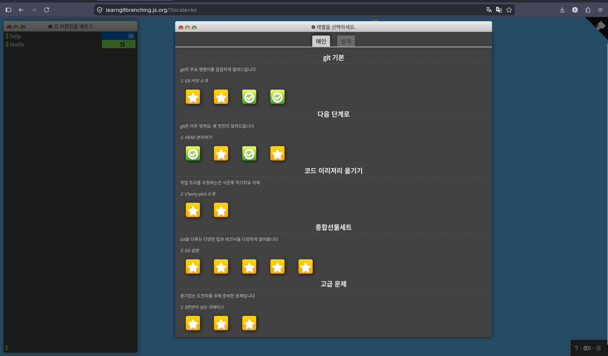
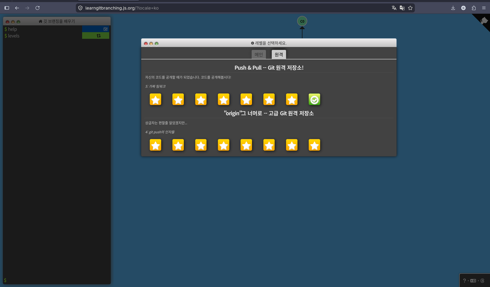

Git은 커밋을 만들고, 브랜치를 움직이고, 갈라진 작업을 다시 합치는 도구다. 커밋 그래프에서 포인터가 어디로 움직이는지를 기준으로 보면 훨씬 이해하기 쉬웠다.

## 1. Git의 기본 단위

커밋은 프로젝트의 특정 시점을 저장한 기록이다. 브랜치는 그 커밋을 가리키는 이름표이고, `HEAD`는 지금 내가 보고 있는 위치다.

- 커밋: 변경사항이 저장된 지점
- 브랜치: 특정 커밋을 가리키는 포인터
- HEAD: 현재 작업 중인 위치
- 원격 브랜치: 원격 저장소의 상태를 로컬에서 기억하는 포인터

## 2. 기록

변경사항은 바로 커밋되는 것이 아니라, 먼저 스테이징 영역에 올라간 뒤 커밋으로 기록된다.


`git add`는 작업 파일의 변경사항을 스테이징 영역으로 올리고, `git commit`은 스테이징된 내용만 새 커밋으로 저장한다.

- `git add .` 현재 디렉터리 아래 변경사항을 스테이징
- `git add <file>` 특정 파일만 스테이징
- `git commit -m "message"` 스테이징된 변경사항을 커밋으로 저장
- `git commit -am "message"` 이미 추적 중인 파일을 add와 commit까지 한 번에 처리
- `git commit --amend` 마지막 커밋의 메시지나 내용 수정

`--amend`는 마지막 커밋을 새 커밋으로 다시 만드는 명령이다. 이미 원격에 올린 커밋에는 신중하게 써야 한다.

## 3. 이동

브랜치는 작업 흐름을 나누기 위해 만든다. 만든 브랜치로 이동한 뒤 커밋하면, 그 브랜치 포인터가 새 커밋으로 이동한다.


`HEAD`가 `feature`에 붙어 있으면 지금 작업 위치는 `feature`다. 이 상태에서 커밋하면 새 커밋은 `feature` 뒤에 이어진다.

- `git branch` 브랜치 목록 확인
- `git branch <branch>` 현재 위치에 새 브랜치 생성
- `git branch -d <branch>` 브랜치 삭제
- `git branch -f <branch> <where>` 브랜치를 특정 위치로 강제 이동
- `git checkout <branch>` / `git switch <branch>` 브랜치 이동
- `git checkout -b <branch>` / `git switch -c <branch>` 브랜치 생성 후 이동

상대 참조를 쓰면 커밋 해시를 몰라도 원하는 위치를 가리킬 수 있다.


`HEAD^`는 현재 커밋의 부모를, `HEAD~2`는 현재 위치에서 두 단계 위의 커밋을 가리킨다.

- `HEAD^` 현재 커밋의 부모
- `HEAD~3` 현재 위치에서 세 단계 위 커밋
- `<branch>^2` merge commit에서 두 번째 부모

## 4. 병합

브랜치를 합치는 대표적인 방법은 `merge`와 `rebase`다. 둘 다 작업을 합치지만, 커밋 그래프가 남는 방식이 다르다.


`merge`는 병합 커밋을 만들어 두 흐름을 연결한다. `rebase`는 작업 커밋을 기준 브랜치 뒤에 다시 쌓아 한 줄처럼 정리한다.

- `git merge <branch>` 현재 브랜치에 지정한 브랜치를 병합
- `git merge --continue` 충돌 해결 후 merge 계속 진행
- `git merge --abort` 진행 중인 merge 취소
- `git merge --no-ff <branch>` fast-forward가 가능해도 merge commit 생성
- `git rebase <base>` 현재 브랜치의 커밋을 기준 브랜치 위로 다시 쌓기
- `git rebase <base> <branch>` 지정한 브랜치를 기준 브랜치 위로 재배치

이미 공유한 커밋에는 rebase를 조심해서 써야 한다. 커밋 해시가 바뀌기 때문이다.

## 5. 되돌리기와 커밋 선택

되돌리기 명령어는 비슷해 보이지만 동작 방식이 다르다. `reset`은 브랜치 포인터를 과거로 옮기고, `revert`는 취소 내용을 새 커밋으로 남긴다.


`reset`은 현재 브랜치가 가리키는 위치를 바꾼다. `revert`는 기존 커밋을 지우지 않고, 반대 변경사항을 담은 새 커밋을 추가한다.

- `git reset HEAD~1` 현재 브랜치를 한 커밋 이전으로 이동
- `git reset --soft HEAD~1` 커밋만 취소하고 스테이징 유지
- `git reset --mixed HEAD~1` 커밋과 스테이징 취소, 작업 파일은 유지
- `git reset --hard HEAD~1` 커밋, 스테이징, 작업 파일 변경까지 되돌림
- `git revert HEAD` 변경을 취소하는 새 커밋 생성

아직 공유하지 않은 로컬 커밋은 `reset`으로 정리할 수 있고, 이미 공유한 커밋은 `revert`로 되돌리는 편이 안전하다.


`cherry-pick`은 다른 브랜치에 있는 특정 커밋의 변경사항만 골라 현재 브랜치 뒤에 새 커밋으로 붙인다.

- `git cherry-pick <commit1> <commit2>` 특정 커밋만 현재 브랜치에 적용


`rebase -i`는 최근 커밋의 순서, 메시지, 포함 여부를 정리할 때 쓴다.

- `git rebase -i HEAD~3` 최근 커밋의 순서, 메시지, 포함 여부 편집

## 6. 표시와 임시 보관

태그는 중요한 커밋에 붙이는 고정 이름표다. stash는 아직 커밋하기 애매한 변경사항을 잠깐 치워두는 용도다.

- `git tag <tag>` 현재 HEAD에 태그 추가
- `git tag <tag> <commit>` 지정한 커밋에 태그 추가
- `git push origin --tags` 태그를 원격에 업로드
- `git describe` 가까운 태그 기준으로 현재 위치 설명


`stash`는 작업 중인 변경사항을 임시로 보관했다가, 나중에 다시 꺼내 적용할 수 있게 해준다.

- `git stash` 커밋하지 않은 변경사항 임시 저장
- `git stash list` stash 목록 확인
- `git stash pop` 저장한 변경사항 다시 적용

## 7. 원격 저장소와 협업

원격 저장소는 내 작업을 공유하고 다른 사람의 작업을 받아오는 공간이다. `fetch`, `pull`, `push`의 차이를 잡는 것이 핵심이다.


`fetch`는 원격 상태를 원격 추적 브랜치에 가져오기만 한다. `pull`은 가져온 내용을 현재 브랜치에 합치고, `push`는 로컬 커밋을 원격 저장소로 올린다.

- `git clone <url>` 원격 저장소를 로컬로 복제
- `git fetch` 원격 변경사항을 가져오되 현재 브랜치에는 합치지 않음
- `git pull` fetch 후 현재 브랜치에 merge
- `git pull --rebase` fetch 후 merge 대신 rebase
- `git push` 로컬 커밋을 원격에 업로드
- `git push -u <remote> <branch>` push하면서 upstream 추적 관계 설정

원격 브랜치는 보통 `origin/main`처럼 표시된다. 학습 환경에서는 `o/main`처럼 짧게 보이기도 한다.

- `git checkout -b <branch> <remote>/<branch>` 원격 브랜치를 기준으로 새 로컬 브랜치 생성 및 추적
- `git branch -u <remote>/<branch> <local-branch>` 기존 로컬 브랜치가 원격 브랜치를 추적하게 설정
- `git fetch <remote> <source>:<destination>` 원격 source를 로컬 destination으로 가져오기
- `git pull <remote> <source>:<destination>` 가져온 뒤 현재 브랜치에 병합
- `git push <remote> <source>:<destination>` 로컬 source를 원격 destination으로 업로드
- `git push <remote> :<branch>` 원격 브랜치 삭제

## 8. 자주 쓰는 흐름

### 새 기능 작업

```bash
git checkout -b <branch>
git add .
git commit -m "message"
git push -u <remote> <branch>
```

### 원격이 앞서 있어서 push가 거부될 때

```bash
git pull --rebase
git push
```

또는

```bash
git fetch
git rebase <remote>/<branch>
git push
```

### 실수로 main에 커밋했을 때

```bash
git branch <branch>
git reset <remote>/<branch>
git checkout <branch>
git push <remote> <branch>
```

## 9. 주의 명령어

- `git reset --hard <where>` 실제 파일 변경까지 사라질 수 있음
- `git push <remote> :<branch>` 원격 브랜치 삭제
- `git branch -f <branch> <where>` 브랜치 포인터 강제 이동
- `git rebase <shared-branch>` 공유된 커밋의 해시 변경 가능
- `git commit --amend` 마지막 커밋을 새 커밋으로 재작성




