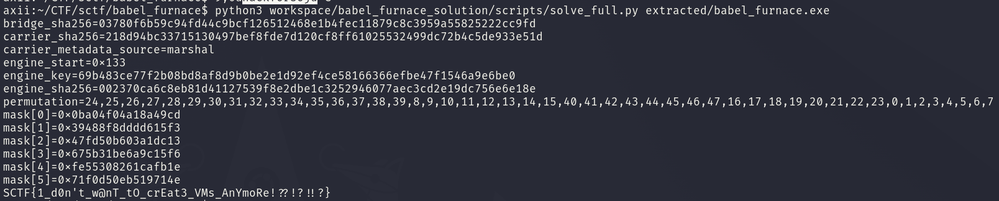

<div class="post-language-switch" data-post-language-switch role="group" aria-label="Article language">
    <a class="post-language-switch__button no-styling" data-post-language-link="ko" href="/posts/sctf-babel-furnace/kr/">KR</a>
    <a class="post-language-switch__button no-styling" data-post-language-link="en" href="/posts/sctf-babel-furnace/en/">EN</a>
</div>

:::section{data-post-language-panel="ko"}
# babel_furnace
## 1. 분석 대상
제공된 실행 파일은 겉으로는 하나의 Windows PE 파일이지만 내부 구조를 따라가면 여러 계층으로 나뉜다. 바깥 PE에는 `0x140`개 블록으로 된 암호화 저장소가 있고 이 저장소에서 Python extension DLL, Python marshal code object, native engine DLL이 순서대로 나온다.

처음 확인한 복호화 호출은 다음 값들을 사용한다.

```text
store_base  = 0x140008bc0
block_count = 0x140
start_index = 0x4b
```

블록 하나는 `0x800`바이트이며 앞쪽 `0x7c0`바이트가 암호문, 뒤쪽이 tag, nonce, 다음 블록 인덱스, fragment 길이, 종료 flag로 구성된다.

```text
+0x000  0x7c0  encrypted payload
+0x7c0  0x010  tag
+0x7d0  0x008  nonce
+0x7d8  0x004  next_xor
+0x7dc  0x002  fragment_len
+0x7df  0x001  flags
```

복호화 루틴은 SHA-256 기반 stream cipher와 linked chain을 같이 사용한다. 각 step에서 payload를 복호화하고 tag를 확인한 뒤, 다음 블록 인덱스와 다음 key를 갱신한다.

```text
stream    = SHA256(key || nonce || counter)
fragment  = encrypted_payload XOR stream
tag       = SHA256("tag" || key || fragment || nonce || step)[:16]
next_idx  = SHA256(key || nonce || step)[:4] XOR next_xor
next_key  = SHA256(key || SHA256(ciphertext) || tail(fragment) || nonce || step)
```

첫 번째 chain에서는 `bridge.pyd`가 나오고 두 번째 chain에서는 Python marshal code object가 나온다. marshal object의 `co_qualname`에는 engine chain을 복호화하는 seed, 입력 permutation share, qword mask share가 들어 있다. bridge는 이 Python metadata와 자기 내부 상수, 바깥 PE의 host mask를 합쳐 사용자 입력을 native engine의 초기 state로 바꾼다.

최종 목표는 `bridge.verify(ctx)`가 요구하는 48바이트 입력 복구다. 입력 길이가 `0x30`이 아니면 바로 실패하고 길이가 맞으면 permutation과 qword mask를 거쳐 6개의 64비트 state가 engine에 전달된다.

## 2. 풀이
먼저 바깥 PE의 block chain 복호화 루틴을 그대로 옮겨 `bridge.pyd`와 `carrier.marshal`을 추출했다. 확인된 값은 다음과 같다.

```text
bridge start = 0x4b
bridge key   = 898a44965aed727eb1c952b97426fe712da57455dd01e6475d60ff38a4f81ed4

carrier start = 0x07
carrier key   = 5bb87fb26f51c94633f87b6b25f28d73ecb9502ec5da8dbe410e896fc8ce10e0
```

`carrier.marshal`에서 읽은 metadata는 `0x86`바이트이다. 앞쪽에는 engine chain 정보가 있고 뒤쪽에는 bridge 입력 변환에 필요한 share가 들어 있다.

```text
offset 0x00, size 0x02 : magic
offset 0x02, size 0x04 : engine start seed
offset 0x06, size 0x20 : engine key share
offset 0x26, size 0x30 : input permutation share
offset 0x56, size 0x30 : input mask words
```

engine chain의 시작 인덱스와 key는 carrier metadata, host table 값, bridge 상수를 XOR해서 얻는다.

```text
engine_start = carrier_seed ^ host_dword ^ 0xd46ceb03
engine_key   = carrier_key_share ^ host_seed ^ bridge_const
```

실제로 계산된 engine chain 정보는 다음과 같다.

```text
engine_start = 0x133
engine_key   = 69b483ce77f2b08bd8af8d9b0be2e1d92ef4ce58166366efbe47f1546a9e6be0
```

bridge의 입력 변환은 두 단계이다. 먼저 48바이트 permutation을 적용하고 그 결과를 8바이트씩 읽어 세 종류의 mask share와 XOR한다.

```c
for (i = 0; i < 48; i++) {
    p = python_perm_share[i] ^ bridge_perm_share[i];
    permuted[i] = raw_input[p];
}

for (i = 0; i < 6; i++) {
    state[i] = little_u64(permuted + i * 8)
             ^ python_mask[i]
             ^ bridge_mask[i]
             ^ host_mask[i];
}
```

계산된 permutation은 8바이트 단위로 보면 다음 순서이다.

```text
input word 3 -> state word 0
input word 4 -> state word 1
input word 1 -> state word 2
input word 5 -> state word 3
input word 2 -> state word 4
input word 0 -> state word 5
```

최종 mask는 아래 6개 qword이다.

```text
mask[0] = 0x0ba04f04a18a49cd
mask[1] = 0x39488f8dddd615f3
mask[2] = 0x47fd50b603a1dc13
mask[3] = 0x675b31be6a9c15f6
mask[4] = 0xfe55308261cafb1e
mask[5] = 0x71f0d50eb519714e
```

남은 부분은 native engine이다. `engine.dll`은 `engine_create`, `engine_resume`, `engine_destroy`를 export하고 내부에서는 고정된 event stream을 따라 VM instruction을 처리한다. 입력은 처음에 들어간 6개 qword뿐이고 event stream 자체는 사용자 입력에 따라 바뀌지 않았다.

그래서 6개의 64비트 값을 symbolic 변수로 두고 VM을 따라갔다. 총 80개 block, block당 8개 instruction이 처리되며 마지막 check까지 만족시키면 engine이 받아야 하는 초기 state는 다음 값으로 정해진다.

```text
state[0] = 0x54d30252feb93dac
state[1] = 0x182ddde2b08f7bb2
state[2] = 0x29bd27e97786b223
state[3] = 0x1a64109f55bd2ac9
state[4] = 0x0bb2753dd2ebea44a
state[5] = 0x15afe475f34d321d
```

이제 bridge 변환을 역으로 풀면 된다.

```text
permuted_word[i] = state[i] ^ mask[i]
raw_input[perm[j]] = permuted_bytes[j]
```

## 3. Exploit
아래 코드는 block chain 복호화, carrier metadata 파싱, engine chain 복호화, bridge 입력 변환 복구, 최종 역변환까지 한 번에 수행하는 전체 solver이다. native VM symbolic execution으로 얻은 6개 state word는 `ENGINE_MODEL_WORDS`에 상수로 넣었다.

```python
#!/usr/bin/env python3
from __future__ import annotations

import argparse
import marshal
import struct
import types
from dataclasses import dataclass
from hashlib import sha256
from pathlib import Path
from typing import Iterator, List, Sequence, Tuple


BLOCK_STORE_OFF = 0x7BC0
BLOCK_COUNT = 0x140
BLOCK_SIZE = 0x800
PAYLOAD_SIZE = 0x7C0

BRIDGE_START_INDEX = 0x4B
BRIDGE_KEY = bytes.fromhex(
    "898a44965aed727eb1c952b97426fe712da57455dd01e6475d60ff38a4f81ed4"
)

CARRIER_START_INDEX = 0x07
CARRIER_KEY = bytes.fromhex(
    "5bb87fb26f51c94633f87b6b25f28d73ecb9502ec5da8dbe410e896fc8ce10e0"
)

ENGINE_KEY_XOR_CONST = bytes([
    0x27, 0x5C, 0xA9, 0x76, 0xC3, 0x49, 0x9E, 0x73,
    0xD5, 0xB8, 0x50, 0x8D, 0x95, 0x47, 0xB8, 0x5D,
    0x2A, 0x0C, 0x6A, 0x65, 0xB7, 0xB6, 0xF9, 0x74,
    0x74, 0xBC, 0x4B, 0x8A, 0x1D, 0x33, 0x1B, 0x55,
])
ENGINE_START_XOR_A = 0xD127FE4D
ENGINE_START_XOR_B = 0xD46CEB03

BRIDGE_PERM_SHARE_RVA = 0x7F50
BRIDGE_MASK_SHARE_RVA = 0x7F80
OUTER_HOST_MASK_RVA = 0x8B60
OUTER_HOST_ENGINE_SEED_RVA = 0xA8BC0

CARRIER_QUALNAME_FALLBACK = bytes.fromhex(
    "bf037d144b057295e86b6825535725229c92f22b263d0293cb98b341a5368d64dc61b"
    "f68a912ffc8e380032c06a2e4dd384439c5c24917ffc6e042a738d009b82b5ed1dd"
    "5ba3edfef25e4ffa36d6a470e0a1e37e5b99604f7f9ee7d6a2a8b2759be4598f3226"
    "d003ea7fd3ce3ec86b6a1798441905e192919fb466b6fa9bee6e7b34e1025251"
)

ENGINE_MODEL_WORDS = [
    0x54D30252FEB93DAC,
    0x182DDDE2B08F7BB2,
    0x29BD27E97786B223,
    0x1A64109F55BD2AC9,
    0x0BB2753DD2EBEA44A,
    0x15AFE475F34D321D,
]


def u16(data: bytes, off: int = 0) -> int:
    return struct.unpack_from("<H", data, off)[0]


def u32(data: bytes, off: int = 0) -> int:
    return struct.unpack_from("<I", data, off)[0]


def u64(data: bytes, off: int = 0) -> int:
    return struct.unpack_from("<Q", data, off)[0]


def p32(x: int) -> bytes:
    return struct.pack("<I", x & 0xFFFFFFFF)


def p64(x: int) -> bytes:
    return struct.pack("<Q", x & 0xFFFFFFFFFFFFFFFF)


def qwords(data: bytes) -> List[int]:
    return [u64(data, off) for off in range(0, len(data), 8)]


def words_to_bytes(words: Sequence[int]) -> bytes:
    return b"".join(p64(w) for w in words)


def xor_bytes(*parts: bytes) -> bytes:
    if not parts:
        return b""
    n = len(parts[0])
    if any(len(p) != n for p in parts):
        raise ValueError("xor inputs must have the same length")
    out = bytearray(n)
    for i in range(n):
        x = 0
        for part in parts:
            x ^= part[i]
        out[i] = x
    return bytes(out)


def keystream(key: bytes, nonce: bytes, nbytes: int) -> bytes:
    out = bytearray()
    counter = 0
    while len(out) < nbytes:
        out += sha256(key + nonce + p32(counter)).digest()
        counter += 1
    return bytes(out[:nbytes])


def decrypt_chain(exe: bytes, start_index: int, key: bytes) -> bytes:
    idx = start_index
    step = 0
    cur_key = key
    out = bytearray()

    while True:
        if not (0 <= idx < BLOCK_COUNT):
            raise ValueError(f"block index out of range: {idx:#x}")

        off = BLOCK_STORE_OFF + idx * BLOCK_SIZE
        block = exe[off:off + BLOCK_SIZE]
        if len(block) != BLOCK_SIZE:
            raise ValueError(f"truncated block at index {idx:#x}")

        ciphertext = block[:PAYLOAD_SIZE]
        tag = block[0x7C0:0x7D0]
        nonce = block[0x7D0:0x7D8]
        next_xor = u32(block, 0x7D8)
        fragment_len = u16(block, 0x7DC)
        flags = block[0x7DF]
        if fragment_len > PAYLOAD_SIZE:
            raise ValueError(f"invalid fragment length: {fragment_len:#x}")

        plain_all = xor_bytes(ciphertext, keystream(cur_key, nonce, PAYLOAD_SIZE))
        fragment = plain_all[:fragment_len]
        expected_tag = sha256(b"tag" + cur_key + fragment + nonce + p32(step)).digest()[:16]
        if expected_tag != tag:
            raise ValueError(f"tag mismatch at step {step}, index {idx:#x}")

        next_index = u32(sha256(cur_key + nonce + p32(step)).digest()) ^ next_xor
        tail = fragment[-0x20:] if len(fragment) > 0x20 else fragment
        next_key = sha256(cur_key + sha256(ciphertext).digest() + tail + nonce + p32(step)).digest()

        out += fragment
        if flags & 1:
            break

        idx = next_index
        cur_key = next_key
        step += 1

    return bytes(out)


@dataclass(frozen=True)
class Section:
    name: str
    virtual_address: int
    virtual_size: int
    raw_offset: int
    raw_size: int


class PEImage:
    def __init__(self, data: bytes):
        self.data = data
        if len(data) < 0x100 or data[:2] != b"MZ":
            raise ValueError("not a PE image")
        pe_off = u32(data, 0x3C)
        if data[pe_off:pe_off + 4] != b"PE\0\0":
            raise ValueError("bad PE signature")
        section_count = struct.unpack_from("<H", data, pe_off + 6)[0]
        optional_size = struct.unpack_from("<H", data, pe_off + 20)[0]
        section_off = pe_off + 24 + optional_size
        sections = []
        for i in range(section_count):
            off = section_off + i * 40
            name = data[off:off + 8].split(b"\0", 1)[0].decode("latin1")
            virtual_size, virtual_address, raw_size, raw_offset = struct.unpack_from(
                "<IIII", data, off + 8
            )
            sections.append(Section(name, virtual_address, virtual_size, raw_offset, raw_size))
        self.sections = sections

    def rva_to_off(self, rva: int) -> int:
        for section in self.sections:
            span = max(section.virtual_size, section.raw_size)
            if section.virtual_address <= rva < section.virtual_address + span:
                return section.raw_offset + (rva - section.virtual_address)
        raise ValueError(f"RVA is not mapped: {rva:#x}")

    def read_rva(self, rva: int, size: int) -> bytes:
        off = self.rva_to_off(rva)
        chunk = self.data[off:off + size]
        if len(chunk) != size:
            raise ValueError(f"short read at RVA {rva:#x}")
        return chunk


def iter_code_objects(co: types.CodeType) -> Iterator[types.CodeType]:
    yield co
    for const in co.co_consts:
        if isinstance(const, types.CodeType):
            yield from iter_code_objects(const)


def extract_carrier_qualname(carrier_marshal: bytes) -> Tuple[bytes, str]:
    try:
        root = marshal.loads(carrier_marshal)
        if isinstance(root, types.CodeType):
            for co in iter_code_objects(root):
                name = getattr(co, "co_name", "")
                qualname = getattr(co, "co_qualname", "")
                if len(name) == 0x50 and len(qualname) == 0x86:
                    raw = qualname.encode("latin1")
                    if raw.startswith(b"\xbf\x03"):
                        return raw, "marshal"
    except Exception:
        pass
    return CARRIER_QUALNAME_FALLBACK, "fallback"


def derive_engine_start_key(exe: bytes, carrier_qualname: bytes) -> Tuple[int, bytes]:
    outer = PEImage(exe)
    start = u32(carrier_qualname, 2) ^ ENGINE_START_XOR_A ^ ENGINE_START_XOR_B
    host_seed = outer.read_rva(OUTER_HOST_ENGINE_SEED_RVA, 32)
    key = xor_bytes(carrier_qualname[6:38], host_seed, ENGINE_KEY_XOR_CONST)
    return start, key


@dataclass(frozen=True)
class InputTransform:
    permutation: List[int]
    mask_words: List[int]


def derive_input_transform(exe: bytes, bridge_pyd: bytes, carrier_qualname: bytes) -> InputTransform:
    bridge = PEImage(bridge_pyd)
    outer = PEImage(exe)

    python_perm_share = carrier_qualname[0x26:0x56]
    python_mask_words = qwords(carrier_qualname[0x56:0x86])
    bridge_perm_share = bridge.read_rva(BRIDGE_PERM_SHARE_RVA, 48)
    bridge_mask_words = qwords(bridge.read_rva(BRIDGE_MASK_SHARE_RVA, 48))
    host_mask_words = qwords(outer.read_rva(OUTER_HOST_MASK_RVA, 48))

    permutation = list(xor_bytes(python_perm_share, bridge_perm_share))
    if sorted(permutation) != list(range(48)):
        raise ValueError(f"invalid permutation: {permutation!r}")

    mask_words = [
        python_mask_words[i] ^ bridge_mask_words[i] ^ host_mask_words[i]
        for i in range(6)
    ]
    return InputTransform(permutation, mask_words)


def invert_bridge_input(engine_words: Sequence[int], transform: InputTransform) -> bytes:
    if len(engine_words) != 6:
        raise ValueError("expected six engine words")

    permuted_words = [
        engine_words[i] ^ transform.mask_words[i]
        for i in range(6)
    ]
    permuted = words_to_bytes(permuted_words)
    raw = bytearray(48)
    for out_pos, src_pos in enumerate(transform.permutation):
        raw[src_pos] = permuted[out_pos]
    return bytes(raw)


def main() -> None:
    parser = argparse.ArgumentParser()
    parser.add_argument("exe", type=Path)
    parser.add_argument("--quiet", action="store_true")
    args = parser.parse_args()

    exe = args.exe.read_bytes()
    bridge = decrypt_chain(exe, BRIDGE_START_INDEX, BRIDGE_KEY)
    carrier = decrypt_chain(exe, CARRIER_START_INDEX, CARRIER_KEY)
    carrier_qualname, metadata_source = extract_carrier_qualname(carrier)
    engine_start, engine_key = derive_engine_start_key(exe, carrier_qualname)
    engine = decrypt_chain(exe, engine_start, engine_key)
    transform = derive_input_transform(exe, bridge, carrier_qualname)
    flag = invert_bridge_input(ENGINE_MODEL_WORDS, transform).decode("ascii")

    if args.quiet:
        print(flag)
        return

    print(f"bridge_sha256={sha256(bridge).hexdigest()}")
    print(f"carrier_sha256={sha256(carrier).hexdigest()}")
    print(f"carrier_metadata_source={metadata_source}")
    print(f"engine_start=0x{engine_start:x}")
    print(f"engine_key={engine_key.hex()}")
    print(f"engine_sha256={sha256(engine).hexdigest()}")
    print("permutation=" + ",".join(str(x) for x in transform.permutation))
    for i, word in enumerate(transform.mask_words):
        print(f"mask[{i}]=0x{word:016x}")
    print(flag)


if __name__ == "__main__":
    main()
```

실행하면 추출한 layer의 hash와 입력 변환 정보를 출력한 뒤 마지막 줄에 flag를 출력한다. 조용히 결과만 보고 싶으면 `--quiet` 옵션을 주면 된다.

## 4. Flag
위 solver로 복구한 48바이트 입력은 그대로 flag 형식이다.

```text
SCTF{1_d0n't_w@nT_tO_crEat3_VMs_AnYmoRe!??!?!!?}
```


:::

:::section{data-post-language-panel="en"}
# babel_furnace

## 1. Analysis focus

The provided executable appears externally to be a single Windows PE file, but following its internal structure shows several layers. The outer PE contains an encrypted store of `0x140` blocks, and from this store come a Python extension DLL, a Python marshal code object, and a native engine DLL in order.

The first decryption call I checked uses the following values.

```
store_base  = 0x140008bc0
block_count = 0x140
start_index = 0x4b
```

Each block is `0x800` bytes. The first `0x7c0` bytes are ciphertext, and the tail consists of the tag, nonce, next block index, fragment length, and end flag.

```
+0x000  0x7c0  encrypted payload
+0x7c0  0x010  tag
+0x7d0  0x008  nonce
+0x7d8  0x004  next_xor
+0x7dc  0x002  fragment_len
+0x7df  0x001  flags
```

The decryption routine combines a SHA-256-based stream cipher with a linked chain. At each step it decrypts the payload, checks the tag, then updates the next block index and the next key.

```
stream    = SHA256(key || nonce || counter)
fragment  = encrypted_payload XOR stream
tag       = SHA256("tag" || key || fragment || nonce || step)[:16]
next_idx  = SHA256(key || nonce || step)[:4] XOR next_xor
next_key  = SHA256(key || SHA256(ciphertext) || tail(fragment) || nonce || step)
```

The first chain yields `bridge.pyd`, and the second chain yields a Python marshal code object. The marshal object’s `co_qualname` contains the seed for decrypting the engine chain, an input permutation share, and a qword mask share. The bridge combines this Python metadata with its own internal constants and the outer PE’s host mask to transform the user input into the native engine’s initial state.

The final goal is to recover the 48-byte input required by `bridge.verify(ctx)`. If the input length is not `0x30`, it fails immediately; if the length is correct, the permutation and qword mask are applied, and six 64-bit state values are passed to the engine.

## 2. Solution approach

First, I ported the outer PE’s block-chain decryption routine as-is and extracted `bridge.pyd` and `carrier.marshal`. The confirmed values are as follows.

```
bridge start = 0x4b
bridge key   = 898a44965aed727eb1c952b97426fe712da57455dd01e6475d60ff38a4f81ed4

carrier start = 0x07
carrier key   = 5bb87fb26f51c94633f87b6b25f28d73ecb9502ec5da8dbe410e896fc8ce10e0
```

The metadata read from `carrier.marshal` is `0x86` bytes. The front part contains the engine chain information, and the latter part contains the shares needed for the bridge input transformation.

```
offset 0x00, size 0x02 : magic
offset 0x02, size 0x04 : engine start seed
offset 0x06, size 0x20 : engine key share
offset 0x26, size 0x30 : input permutation share
offset 0x56, size 0x30 : input mask words
```

The starting index and key of the engine chain are obtained by XORing the carrier metadata, host table values, and bridge constants.

```
engine_start = carrier_seed ^ host_dword ^ 0xd46ceb03
engine_key   = carrier_key_share ^ host_seed ^ bridge_const
```

The actually computed engine chain information is as follows.

```
engine_start = 0x133
engine_key   = 69b483ce77f2b08bd8af8d9b0be2e1d92ef4ce58166366efbe47f1546a9e6be0
```

The bridge input transformation has two stages. First, a 48-byte permutation is applied; then the result is read in 8-byte chunks and XORed with three kinds of mask shares.

```c
for (i = 0; i < 48; i++) {
    p = python_perm_share[i] ^ bridge_perm_share[i];
    permuted[i] = raw_input[p];
}

for (i = 0; i < 6; i++) {
    state[i] = little_u64(permuted + i * 8)
             ^ python_mask[i]
             ^ bridge_mask[i]
             ^ host_mask[i];
}
```

Viewed in 8-byte units, the computed permutation has the following order.

```
input word 3 -> state word 0
input word 4 -> state word 1
input word 1 -> state word 2
input word 5 -> state word 3
input word 2 -> state word 4
input word 0 -> state word 5
```

The final mask is the following six qwords.

```
mask[0] = 0x0ba04f04a18a49cd
mask[1] = 0x39488f8dddd615f3
mask[2] = 0x47fd50b603a1dc13
mask[3] = 0x675b31be6a9c15f6
mask[4] = 0xfe55308261cafb1e
mask[5] = 0x71f0d50eb519714e
```

The last layer is the native engine. `engine.dll` exports `engine_create`, `engine_resume`, and `engine_destroy`, and internally processes VM instructions along a fixed event stream. The only user-dependent input is the initial six qwords; the event stream itself does not change based on user input.

Therefore, I treated the six 64-bit values as symbolic variables and followed the VM. A total of 80 blocks are processed, with 8 instructions per block, and satisfying the final check fixes the initial state required by the engine to the following values.

```
state[0] = 0x54d30252feb93dac
state[1] = 0x182ddde2b08f7bb2
state[2] = 0x29bd27e97786b223
state[3] = 0x1a64109f55bd2ac9
state[4] = 0x0bb2753dd2ebea44a
state[5] = 0x15afe475f34d321d
```

Now the bridge transformation just needs to be inverted.

```
permuted_word[i] = state[i] ^ mask[i]
raw_input[perm[j]] = permuted_bytes[j]
```

## 3. Exploit

```python
#!/usr/bin/env python3
from __future__ import annotations

import argparse
import marshal
import struct
import types
from dataclasses import dataclass
from hashlib import sha256
from pathlib import Path
from typing import Iterator, List, Sequence, Tuple

BLOCK_STORE_OFF = 0x7BC0
BLOCK_COUNT = 0x140
BLOCK_SIZE = 0x800
PAYLOAD_SIZE = 0x7C0

BRIDGE_START_INDEX = 0x4B
BRIDGE_KEY = bytes.fromhex(
    "898a44965aed727eb1c952b97426fe712da57455dd01e6475d60ff38a4f81ed4"
)

CARRIER_START_INDEX = 0x07
CARRIER_KEY = bytes.fromhex(
    "5bb87fb26f51c94633f87b6b25f28d73ecb9502ec5da8dbe410e896fc8ce10e0"
)

ENGINE_KEY_XOR_CONST = bytes([
    0x27, 0x5C, 0xA9, 0x76, 0xC3, 0x49, 0x9E, 0x73,
    0xD5, 0xB8, 0x50, 0x8D, 0x95, 0x47, 0xB8, 0x5D,
    0x2A, 0x0C, 0x6A, 0x65, 0xB7, 0xB6, 0xF9, 0x74,
    0x74, 0xBC, 0x4B, 0x8A, 0x1D, 0x33, 0x1B, 0x55,
])
ENGINE_START_XOR_A = 0xD127FE4D
ENGINE_START_XOR_B = 0xD46CEB03

BRIDGE_PERM_SHARE_RVA = 0x7F50
BRIDGE_MASK_SHARE_RVA = 0x7F80
OUTER_HOST_MASK_RVA = 0x8B60
OUTER_HOST_ENGINE_SEED_RVA = 0xA8BC0

CARRIER_QUALNAME_FALLBACK = bytes.fromhex(
    "bf037d144b057295e86b6825535725229c92f22b263d0293cb98b341a5368d64dc61b"
    "f68a912ffc8e380032c06a2e4dd384439c5c24917ffc6e042a738d009b82b5ed1dd"
    "5ba3edfef25e4ffa36d6a470e0a1e37e5b99604f7f9ee7d6a2a8b2759be4598f3226"
    "d003ea7fd3ce3ec86b6a1798441905e192919fb466b6fa9bee6e7b34e1025251"
)

ENGINE_MODEL_WORDS = [
    0x54D30252FEB93DAC,
    0x182DDDE2B08F7BB2,
    0x29BD27E97786B223,
    0x1A64109F55BD2AC9,
    0x0BB2753DD2EBEA44A,
    0x15AFE475F34D321D,
]

def u16(data: bytes, off: int = 0) -> int:
    return struct.unpack_from("<H", data, off)[0]

def u32(data: bytes, off: int = 0) -> int:
    return struct.unpack_from("<I", data, off)[0]

def u64(data: bytes, off: int = 0) -> int:
    return struct.unpack_from("<Q", data, off)[0]

def p32(x: int) -> bytes:
    return struct.pack("<I", x & 0xFFFFFFFF)

def p64(x: int) -> bytes:
    return struct.pack("<Q", x & 0xFFFFFFFFFFFFFFFF)

def qwords(data: bytes) -> List[int]:
    return [u64(data, off) for off in range(0, len(data), 8)]

def words_to_bytes(words: Sequence[int]) -> bytes:
    return b"".join(p64(w) for w in words)

def xor_bytes(*parts: bytes) -> bytes:
    if not parts:
        return b""
    n = len(parts[0])
    if any(len(p) != n for p in parts):
        raise ValueError("xor inputs must have the same length")
    out = bytearray(n)
    for i in range(n):
        x = 0
        for part in parts:
            x ^= part[i]
        out[i] = x
    return bytes(out)

def keystream(key: bytes, nonce: bytes, nbytes: int) -> bytes:
    out = bytearray()
    counter = 0
    while len(out) < nbytes:
        out += sha256(key + nonce + p32(counter)).digest()
        counter += 1
    return bytes(out[:nbytes])

def decrypt_chain(exe: bytes, start_index: int, key: bytes) -> bytes:
    idx = start_index
    step = 0
    cur_key = key
    out = bytearray()

    while True:
        if not (0 <= idx < BLOCK_COUNT):
            raise ValueError(f"block index out of range:{idx:#x}")

        off = BLOCK_STORE_OFF + idx * BLOCK_SIZE
        block = exe[off:off + BLOCK_SIZE]
        if len(block) != BLOCK_SIZE:
            raise ValueError(f"truncated block at index{idx:#x}")

        ciphertext = block[:PAYLOAD_SIZE]
        tag = block[0x7C0:0x7D0]
        nonce = block[0x7D0:0x7D8]
        next_xor = u32(block, 0x7D8)
        fragment_len = u16(block, 0x7DC)
        flags = block[0x7DF]
        if fragment_len > PAYLOAD_SIZE:
            raise ValueError(f"invalid fragment length:{fragment_len:#x}")

        plain_all = xor_bytes(ciphertext, keystream(cur_key, nonce, PAYLOAD_SIZE))
        fragment = plain_all[:fragment_len]
        expected_tag = sha256(b"tag" + cur_key + fragment + nonce + p32(step)).digest()[:16]
        if expected_tag != tag:
            raise ValueError(f"tag mismatch at step{step}, index{idx:#x}")

        next_index = u32(sha256(cur_key + nonce + p32(step)).digest()) ^ next_xor
        tail = fragment[-0x20:] if len(fragment) > 0x20 else fragment
        next_key = sha256(cur_key + sha256(ciphertext).digest() + tail + nonce + p32(step)).digest()

        out += fragment
        if flags & 1:
            break

        idx = next_index
        cur_key = next_key
        step += 1

    return bytes(out)

@dataclass(frozen=True)
class Section:
    name: str
    virtual_address: int
    virtual_size: int
    raw_offset: int
    raw_size: int

class PEImage:
    def __init__(self, data: bytes):
        self.data = data
        if len(data) < 0x100 or data[:2] != b"MZ":
            raise ValueError("not a PE image")
        pe_off = u32(data, 0x3C)
        if data[pe_off:pe_off + 4] != b"PE\0\0":
            raise ValueError("bad PE signature")
        section_count = struct.unpack_from("<H", data, pe_off + 6)[0]
        optional_size = struct.unpack_from("<H", data, pe_off + 20)[0]
        section_off = pe_off + 24 + optional_size
        sections = []
        for i in range(section_count):
            off = section_off + i * 40
            name = data[off:off + 8].split(b"\0", 1)[0].decode("latin1")
            virtual_size, virtual_address, raw_size, raw_offset = struct.unpack_from(
                "<IIII", data, off + 8
            )
            sections.append(Section(name, virtual_address, virtual_size, raw_offset, raw_size))
        self.sections = sections

    def rva_to_off(self, rva: int) -> int:
        for section in self.sections:
            span = max(section.virtual_size, section.raw_size)
            if section.virtual_address <= rva < section.virtual_address + span:
                return section.raw_offset + (rva - section.virtual_address)
        raise ValueError(f"RVA is not mapped:{rva:#x}")

    def read_rva(self, rva: int, size: int) -> bytes:
        off = self.rva_to_off(rva)
        chunk = self.data[off:off + size]
        if len(chunk) != size:
            raise ValueError(f"short read at RVA{rva:#x}")
        return chunk

def iter_code_objects(co: types.CodeType) -> Iterator[types.CodeType]:
    yield co
    for const in co.co_consts:
        if isinstance(const, types.CodeType):
            yield from iter_code_objects(const)

def extract_carrier_qualname(carrier_marshal: bytes) -> Tuple[bytes, str]:
    try:
        root = marshal.loads(carrier_marshal)
        if isinstance(root, types.CodeType):
            for co in iter_code_objects(root):
                name = getattr(co, "co_name", "")
                qualname = getattr(co, "co_qualname", "")
                if len(name) == 0x50 and len(qualname) == 0x86:
                    raw = qualname.encode("latin1")
                    if raw.startswith(b"\xbf\x03"):
                        return raw, "marshal"
    except Exception:
        pass
    return CARRIER_QUALNAME_FALLBACK, "fallback"

def derive_engine_start_key(exe: bytes, carrier_qualname: bytes) -> Tuple[int, bytes]:
    outer = PEImage(exe)
    start = u32(carrier_qualname, 2) ^ ENGINE_START_XOR_A ^ ENGINE_START_XOR_B
    host_seed = outer.read_rva(OUTER_HOST_ENGINE_SEED_RVA, 32)
    key = xor_bytes(carrier_qualname[6:38], host_seed, ENGINE_KEY_XOR_CONST)
    return start, key

@dataclass(frozen=True)
class InputTransform:
    permutation: List[int]
    mask_words: List[int]

def derive_input_transform(exe: bytes, bridge_pyd: bytes, carrier_qualname: bytes) -> InputTransform:
    bridge = PEImage(bridge_pyd)
    outer = PEImage(exe)

    python_perm_share = carrier_qualname[0x26:0x56]
    python_mask_words = qwords(carrier_qualname[0x56:0x86])
    bridge_perm_share = bridge.read_rva(BRIDGE_PERM_SHARE_RVA, 48)
    bridge_mask_words = qwords(bridge.read_rva(BRIDGE_MASK_SHARE_RVA, 48))
    host_mask_words = qwords(outer.read_rva(OUTER_HOST_MASK_RVA, 48))

    permutation = list(xor_bytes(python_perm_share, bridge_perm_share))
    if sorted(permutation) != list(range(48)):
        raise ValueError(f"invalid permutation:{permutation!r}")

    mask_words = [
        python_mask_words[i] ^ bridge_mask_words[i] ^ host_mask_words[i]
        for i in range(6)
    ]
    return InputTransform(permutation, mask_words)

def invert_bridge_input(engine_words: Sequence[int], transform: InputTransform) -> bytes:
    if len(engine_words) != 6:
        raise ValueError("expected six engine words")

    permuted_words = [
        engine_words[i] ^ transform.mask_words[i]
        for i in range(6)
    ]
    permuted = words_to_bytes(permuted_words)
    raw = bytearray(48)
    for out_pos, src_pos in enumerate(transform.permutation):
        raw[src_pos] = permuted[out_pos]
    return bytes(raw)

def main() -> None:
    parser = argparse.ArgumentParser()
    parser.add_argument("exe", type=Path)
    parser.add_argument("--quiet", action="store_true")
    args = parser.parse_args()

    exe = args.exe.read_bytes()
    bridge = decrypt_chain(exe, BRIDGE_START_INDEX, BRIDGE_KEY)
    carrier = decrypt_chain(exe, CARRIER_START_INDEX, CARRIER_KEY)
    carrier_qualname, metadata_source = extract_carrier_qualname(carrier)
    engine_start, engine_key = derive_engine_start_key(exe, carrier_qualname)
    engine = decrypt_chain(exe, engine_start, engine_key)
    transform = derive_input_transform(exe, bridge, carrier_qualname)
    flag = invert_bridge_input(ENGINE_MODEL_WORDS, transform).decode("ascii")

    if args.quiet:
        print(flag)
        return

    print(f"bridge_sha256={sha256(bridge).hexdigest()}")
    print(f"carrier_sha256={sha256(carrier).hexdigest()}")
    print(f"carrier_metadata_source={metadata_source}")
    print(f"engine_start=0x{engine_start:x}")
    print(f"engine_key={engine_key.hex()}")
    print(f"engine_sha256={sha256(engine).hexdigest()}")
    print("permutation=" + ",".join(str(x) for x in transform.permutation))
    for i, word in enumerate(transform.mask_words):
        print(f"mask[{i}]=0x{word:016x}")
    print(flag)

if __name__ == "__main__":
    main()
```

When run, it prints the hashes of the extracted layers and the input transformation information, then prints the flag on the last line.

## 4. Flag


`SCTF{1_d0n't_w@nT_tO_crEat3_VMs_AnYmoRe!??!?!!?}`
:::
