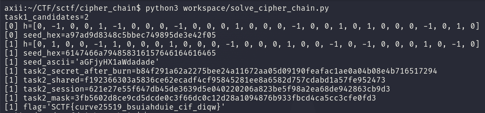

<div class="post-language-switch" data-post-language-switch role="group" aria-label="Article language">
    <a class="post-language-switch__button no-styling" data-post-language-link="ko" href="/posts/sctf-cipher-chain/kr/">KR</a>
    <a class="post-language-switch__button no-styling" data-post-language-link="en" href="/posts/sctf-cipher-chain/en/">EN</a>
</div>

:::section{data-post-language-panel="ko"}
# Cipher_Chain

## 1. 분석 대상

제공 자료는 두 단계로 나뉜다. Task1에서는 `GF(65537)` 위의 행렬 `G`와 ciphertext가 주어지고 숨겨진 벡터 `h`를 복구해야 한다. Task2에서는 Task1에서 얻은 seed를 이용해 X25519 세션 값을 만들고 암호화된 payload를 복호화해야 한다.

Task1에서 `h`는 단순한 nullspace 벡터가 아니다. 조건은 다음과 같이 정리된다.

```text
h_i in {-1, 0, 1}
sum h_i^2 = 10
sum_i h_i * G[i][k] = 0 mod 65537, for k = 0..13
```

즉 `h`는 부호가 있는 weight 10의 sparse ternary vector이다. `GF(65537)`에서 선형 조건만 풀면 후보 공간이 너무 넓고 실제로 써야 하는 제한은 `h` 자체의 작은 weight와 `{-1, 0, 1}` 값 범위에 있다.

Task2 쪽에서는 trace에 다음 정보가 남아 있다.

```text
secret_stage = compress(seed)
burn_counter = 0xc350
exchange = montgomery25519
payload_mode = stream-mask
```

여기서 확인해야 할 부분은 burn이 X25519 교환 전인지 후인지이다. 올바른 순서를 찾으면 `task2.log`의 `session_prefix`로 중간 상태를 검증할 수 있고 이후 payload는 반복 mask로 복호화된다.

## 2. 풀이

Task1은 전체 `3^30` 공간을 직접 보는 대신 meet-in-the-middle로 나누어 풀었다. 좌표 `0..14`와 `15..29`를 분리하고 각 절반에서 가능한 signed sum을 만든다.

```text
S = sum sign_i * G[i]
S_left + S_right = 0 mod 65537
```

weight도 함께 나눈다.

```text
w_left + w_right = 10
```

한쪽 절반의 signed sum을 테이블에 저장하고 다른 절반을 열거하면서 `-S`가 존재하는지 찾으면 된다. 각 원소의 부호 조합은 Gray code로 순회해서 한 단계마다 바뀐 row 하나만 더하거나 빼도록 했다. 이렇게 하면 매 후보마다 14차원 합을 처음부터 다시 계산하지 않아도 된다.

이 방식으로 나온 후보는 정확히 두 개였다. 두 후보는 서로 부호가 반대인 pair였고 Task2 로그와 맞는 seed를 만드는 쪽은 다음 벡터였다.

```text
h = [0, 1, 0, 0, -1, 1, 0, 0, 0, 1, 0, 0, 0, -1, 0,
     0, 0, 1, 0, 0, -1, 0, -1, 0, 0, 0, 1, 0, -1, 0]
```

Task1 설명에 있는 KDF를 그대로 적용하면 seed가 나온다.

```text
material = b"Curve_Link_Task1_Hard|P=65537|w=10|h=" + b",".join(str(h_i).encode() for h_i in h)
stream   = SHA256(material || uint32_be(0)) || SHA256(material || uint32_be(1)) || ...
seed     = ciphertext XOR stream[:len(ciphertext)]
```

복구된 seed는 아래 값이다.

```text
seed_hex = 6147466a794858316157646164616465
seed_ascii = aGFjyHX1aWdadade
```

Task2에서는 이 seed를 먼저 SHA-256으로 압축하고 그 결과를 `0xc350`번 더 해시한 뒤 X25519 private scalar로 사용했다.

```text
secret  = SHA256(seed)
secret  = SHA256(secret), repeated 0xc350 times
shared  = X25519(secret, task2.pub)
session = SHA256(shared)
```

이 순서로 계산한 session의 앞 8바이트가 로그와 일치한다.

```text
session = 621e27e55f647db45de3639d5e040220206a823be5f98a2ea68de942863cb9d3
session_prefix = 621e27e55f647db4
```

이제 payload 복호화는 간단하다. `SHA256(session)`을 32바이트 mask로 만들고 암호문 길이만큼 반복해서 XOR하면 된다.

```text
mask = SHA256(session)
plaintext = ciphertext XOR repeat(mask)
```

## 3. Exploit

solver는 Task1 후보를 meet-in-the-middle로 복구한 뒤, 각 후보에서 seed를 만들고 Task2의 session prefix를 만족하는 후보만 payload 복호화까지 진행한다. 아래는 전체 코드이다.

```python
#!/usr/bin/env python3
import ast
import hashlib
import re
import struct
from itertools import combinations
from pathlib import Path

from cryptography.hazmat.primitives.asymmetric import x25519


ROOT = Path(__file__).resolve().parents[1]
P = 65537
N = 30
M = 14
WEIGHT = 10
BURN = 0xC350


def load_task1():
    text = (ROOT / "extracted/attachment/task1.txt").read_text()
    g_text = text.split("G =", 1)[1].split("ciphertext_hex", 1)[0].strip()
    if g_text.endswith(","):
        g_text = g_text[:-1]
    g = ast.literal_eval(g_text)
    ct_hex = re.search(r"ciphertext_hex\s*=\s*([0-9a-fA-F]+)", text).group(1)
    return g, bytes.fromhex(ct_hex)


def vec_key(vec):
    out = 0
    for x in vec:
        out = out * P + (x % P)
    return out


def neg_vec_key(vec):
    out = 0
    for x in vec:
        out = out * P + ((-x) % P)
    return out


def count_half(weight, n=15):
    from math import comb

    return comb(n, weight) * (1 << weight)


def enumerate_signed(rows, weight, offset):
    """Yield (sum_key, encoded_half) for exact signed Hamming weight."""
    indexes = range(len(rows))
    for comb in combinations(indexes, weight):
        acc = [0] * M
        code = 0
        for pos in comb:
            row = rows[pos]
            for j, value in enumerate(row):
                acc[j] += value
            code |= 1 << (2 * (offset + pos))

        prev_gray = 0
        yield vec_key(acc), code

        for mask in range(1, 1 << weight):
            gray = mask ^ (mask >> 1)
            changed = gray ^ prev_gray
            bit = changed.bit_length() - 1
            pos = comb[bit]
            row = rows[pos]
            shift = 2 * (offset + pos)
            if (gray >> bit) & 1:
                # +1 -> -1 changes the contribution by -2*row.
                for j, value in enumerate(row):
                    acc[j] -= 2 * value
                code = (code & ~(3 << shift)) | (2 << shift)
            else:
                # -1 -> +1 changes the contribution by +2*row.
                for j, value in enumerate(row):
                    acc[j] += 2 * value
                code = (code & ~(3 << shift)) | (1 << shift)
            prev_gray = gray
            yield vec_key(acc), code


def enumerate_signed_for_query(rows, weight, offset):
    indexes = range(len(rows))
    for comb in combinations(indexes, weight):
        acc = [0] * M
        code = 0
        for pos in comb:
            row = rows[pos]
            for j, value in enumerate(row):
                acc[j] += value
            code |= 1 << (2 * (offset + pos))

        prev_gray = 0
        yield neg_vec_key(acc), code

        for mask in range(1, 1 << weight):
            gray = mask ^ (mask >> 1)
            changed = gray ^ prev_gray
            bit = changed.bit_length() - 1
            pos = comb[bit]
            row = rows[pos]
            shift = 2 * (offset + pos)
            if (gray >> bit) & 1:
                for j, value in enumerate(row):
                    acc[j] -= 2 * value
                code = (code & ~(3 << shift)) | (2 << shift)
            else:
                for j, value in enumerate(row):
                    acc[j] += 2 * value
                code = (code & ~(3 << shift)) | (1 << shift)
            prev_gray = gray
            yield neg_vec_key(acc), code


def decode_code(code):
    h = []
    for i in range(N):
        v = (code >> (2 * i)) & 3
        if v == 0:
            h.append(0)
        elif v == 1:
            h.append(1)
        elif v == 2:
            h.append(-1)
        else:
            raise ValueError("invalid encoded ternary value")
    return h


def verify_h(h, g):
    if len(h) != N:
        return False
    if any(x not in (-1, 0, 1) for x in h):
        return False
    if sum(x * x for x in h) != WEIGHT:
        return False
    for k in range(M):
        total = sum(h[i] * g[i][k] for i in range(N)) % P
        if total != 0:
            return False
    return True


def recover_h_candidates(g):
    left = g[:15]
    right = g[15:]
    found = {}

    for w_left in range(WEIGHT + 1):
        w_right = WEIGHT - w_left
        left_count = count_half(w_left)
        right_count = count_half(w_right)
        if left_count <= right_count:
            store_rows, store_w, store_off = left, w_left, 0
            query_rows, query_w, query_off = right, w_right, 15
        else:
            store_rows, store_w, store_off = right, w_right, 15
            query_rows, query_w, query_off = left, w_left, 0

        table = {}
        for key, code in enumerate_signed(store_rows, store_w, store_off):
            # Collisions are mathematically possible only for duplicate sums; keep all.
            previous = table.get(key)
            if previous is None:
                table[key] = code
            elif isinstance(previous, list):
                previous.append(code)
            else:
                table[key] = [previous, code]

        for key, code in enumerate_signed_for_query(query_rows, query_w, query_off):
            hit = table.get(key)
            if hit is None:
                continue
            hits = hit if isinstance(hit, list) else [hit]
            for stored_code in hits:
                h = decode_code(stored_code | code)
                if verify_h(h, g):
                    found[tuple(h)] = h

    return list(found.values())


def task1_seed(h, ciphertext):
    material = (
        b"Curve_Link_Task1_Hard|P=65537|w=10|h="
        + b",".join(str(x).encode() for x in h)
    )
    stream = b""
    counter = 0
    while len(stream) < len(ciphertext):
        stream += hashlib.sha256(material + struct.pack(">I", counter)).digest()
        counter += 1
    return bytes(a ^ b for a, b in zip(ciphertext, stream))


def burn_secret(secret):
    out = secret
    for _ in range(BURN):
        out = hashlib.sha256(out).digest()
    return out


def x25519_exchange(secret32, pub32):
    priv = x25519.X25519PrivateKey.from_private_bytes(secret32)
    pub = x25519.X25519PublicKey.from_public_bytes(pub32)
    return priv.exchange(pub)


def load_task2():
    task2_dir = ROOT / "extracted/attachment/task2"
    peer_pub = (task2_dir / "task2.pub").read_bytes()
    ciphertext = (task2_dir / "task2.enc").read_bytes()
    log_text = (task2_dir / "task2.log").read_text()
    prefix_hex = re.search(r"session_prefix\s*=\s*([0-9a-fA-F]+)", log_text).group(1)
    return peer_pub, ciphertext, bytes.fromhex(prefix_hex)


def try_task2(seed):
    peer_pub, ciphertext, expected_prefix = load_task2()

    # trace: secret_stage=compress(seed), burn_counter=0xc350, exchange=montgomery25519
    secret = burn_secret(hashlib.sha256(seed).digest())
    shared = x25519_exchange(secret, peer_pub)
    session = hashlib.sha256(shared).digest()
    if session[: len(expected_prefix)] != expected_prefix:
        return None

    # payload_mode=stream-mask: the 32-byte session mask is repeated over the payload.
    mask = hashlib.sha256(session).digest()
    stream = bytes(mask[i % len(mask)] for i in range(len(ciphertext)))
    plaintext = bytes(a ^ b for a, b in zip(ciphertext, stream))
    return {
        "secret": secret,
        "shared": shared,
        "session": session,
        "mask": mask,
        "plaintext": plaintext,
    }


def main():
    g, task1_ct = load_task1()
    candidates = recover_h_candidates(g)
    print(f"task1_candidates={len(candidates)}")
    for idx, h in enumerate(candidates):
        seed = task1_seed(h, task1_ct)
        print(f"[{idx}] h={h}")
        print(f"[{idx}] seed_hex={seed.hex()}")
        try:
            print(f"[{idx}] seed_ascii={seed.decode()!r}")
        except UnicodeDecodeError:
            pass
        task2 = try_task2(seed)
        if task2 is not None:
            print(f"[{idx}] task2_secret_after_burn={task2['secret'].hex()}")
            print(f"[{idx}] task2_shared={task2['shared'].hex()}")
            print(f"[{idx}] task2_session={task2['session'].hex()}")
            print(f"[{idx}] task2_mask={task2['mask'].hex()}")
            print(f"[{idx}] flag={task2['plaintext'].decode()!r}")


if __name__ == "__main__":
    main()
```

실행하면 후보 두 개가 나오고 두 번째 후보만 Task2 로그의 session prefix를 만족한다.

```text
task1_candidates=2
[1] seed_hex=6147466a794858316157646164616465
[1] seed_ascii='aGFjyHX1aWdadade'
[1] task2_session=621e27e55f647db45de3639d5e040220206a823be5f98a2ea68de942863cb9d3
[1] flag='SCTF{curve25519_bsuiahduie_cif_diqw}'
```

## 4. Flag

```text
SCTF{curve25519_bsuiahduie_cif_diqw}
```


:::

:::section{data-post-language-panel="en"}
# Cipher_Chain

## 1. Analysis focus

The provided materials are split into two stages. In Task1, a matrix `G` over `GF(65537)` and a ciphertext are given, and the hidden vector `h` must be recovered. In Task2, the seed obtained from Task1 is used to create an X25519 session value and decrypt the encrypted payload.

In Task1, `h` is not a simple nullspace vector. The conditions can be summarized as follows.

```
h_i in {-1, 0, 1}
sum h_i^2 = 10
sum_i h_i * G[i][k] = 0 mod 65537, for k = 0..13
```

In other words, `h` is a sparse ternary vector of signed weight 10. Solving only the linear condition over `GF(65537)` leaves a candidate space that is too large; the actual constraints to use are the small weight of `h` itself and the value range `{-1, 0, 1}`.

For Task2, the trace contains the following information.

```
secret_stage = compress(seed)
burn_counter = 0xc350
exchange = montgomery25519
payload_mode = stream-mask
```

The part to verify here is whether the burn happens before or after the X25519 exchange. Once the correct order is found, the `session_prefix` in `task2.log` can be used to validate the intermediate state, and the payload can then be decrypted with a repeating mask.

## 2. Solution approach

I solved Task1 with meet-in-the-middle instead of directly searching the full `3^30` space. I split the coordinates into `0..14` and `15..29`, and generated all possible signed sums for each half.

```
S = sum sign_i * G[i]
S_left + S_right = 0 mod 65537
```

The weight is split as well.

```
w_left + w_right = 10
```

Store the signed sums from one half in a table, then enumerate the other half and check whether `-S` exists. I iterated through each element’s sign combinations in Gray-code order so that only one changed row had to be added or subtracted at each step. This avoids recomputing the 14-dimensional sum from scratch for every candidate.

This method produced exactly two candidates. The two candidates were a pair with opposite signs, and the one that produced the seed matching the Task2 log was the following vector.

```
h = [0, 1, 0, 0, -1, 1, 0, 0, 0, 1, 0, 0, 0, -1, 0,
     0, 0, 1, 0, 0, -1, 0, -1, 0, 0, 0, 1, 0, -1, 0]
```

Applying the KDF described in Task1 directly gives the seed.

```
material = b"Curve_Link_Task1_Hard|P=65537|w=10|h=" + b",".join(str(h_i).encode() for h_i in h)
stream   = SHA256(material || uint32_be(0)) || SHA256(material || uint32_be(1)) || ...
seed     = ciphertext XOR stream[:len(ciphertext)]
```

The recovered seed is below.

```
seed_hex = 6147466a794858316157646164616465
seed_ascii = aGFjyHX1aWdadade
```

In Task2, this seed is first compressed with SHA-256, then hashed `0xc350` additional times, and the result is used as the X25519 private scalar.

```
secret  = SHA256(seed)
secret  = SHA256(secret), repeated 0xc350 times
shared  = X25519(secret, task2.pub)
session = SHA256(shared)
```

The first 8 bytes of the session computed in this order match the log.

```
session = 621e27e55f647db45de3639d5e040220206a823be5f98a2ea68de942863cb9d3
session_prefix = 621e27e55f647db4
```

Payload decryption then only needs the mask. Compute `SHA256(session)` as a 32-byte mask and repeat it for the ciphertext length, then XOR.

```
mask = SHA256(session)
plaintext = ciphertext XOR repeat(mask)
```

## 3. Exploit

The solver recovers Task1 candidates with meet-in-the-middle, derives a seed from each candidate, and proceeds to payload decryption only for the candidate that satisfies Task2’s session prefix. The full code is below.

```python
#!/usr/bin/env python3
import ast
import hashlib
import re
import struct
from itertools import combinations
from pathlib import Path

from cryptography.hazmat.primitives.asymmetric import x25519

ROOT = Path(__file__).resolve().parents[1]
P = 65537
N = 30
M = 14
WEIGHT = 10
BURN = 0xC350

def load_task1():
    text = (ROOT / "extracted/attachment/task1.txt").read_text()
    g_text = text.split("G =", 1)[1].split("ciphertext_hex", 1)[0].strip()
    if g_text.endswith(","):
        g_text = g_text[:-1]
    g = ast.literal_eval(g_text)
    ct_hex = re.search(r"ciphertext_hex\s*=\s*([0-9a-fA-F]+)", text).group(1)
    return g, bytes.fromhex(ct_hex)

def vec_key(vec):
    out = 0
    for x in vec:
        out = out * P + (x % P)
    return out

def neg_vec_key(vec):
    out = 0
    for x in vec:
        out = out * P + ((-x) % P)
    return out

def count_half(weight, n=15):
    from math import comb

    return comb(n, weight) * (1 << weight)

def enumerate_signed(rows, weight, offset):
    """Yield (sum_key, encoded_half) for exact signed Hamming weight."""
    indexes = range(len(rows))
    for comb in combinations(indexes, weight):
        acc = [0] * M
        code = 0
        for pos in comb:
            row = rows[pos]
            for j, value in enumerate(row):
                acc[j] += value
            code |= 1 << (2 * (offset + pos))

        prev_gray = 0
        yield vec_key(acc), code

        for mask in range(1, 1 << weight):
            gray = mask ^ (mask >> 1)
            changed = gray ^ prev_gray
            bit = changed.bit_length() - 1
            pos = comb[bit]
            row = rows[pos]
            shift = 2 * (offset + pos)
            if (gray >> bit) & 1:
                # +1 -> -1 changes the contribution by -2*row.
                for j, value in enumerate(row):
                    acc[j] -= 2 * value
                code = (code & ~(3 << shift)) | (2 << shift)
            else:
                # -1 -> +1 changes the contribution by +2*row.
                for j, value in enumerate(row):
                    acc[j] += 2 * value
                code = (code & ~(3 << shift)) | (1 << shift)
            prev_gray = gray
            yield vec_key(acc), code

def enumerate_signed_for_query(rows, weight, offset):
    indexes = range(len(rows))
    for comb in combinations(indexes, weight):
        acc = [0] * M
        code = 0
        for pos in comb:
            row = rows[pos]
            for j, value in enumerate(row):
                acc[j] += value
            code |= 1 << (2 * (offset + pos))

        prev_gray = 0
        yield neg_vec_key(acc), code

        for mask in range(1, 1 << weight):
            gray = mask ^ (mask >> 1)
            changed = gray ^ prev_gray
            bit = changed.bit_length() - 1
            pos = comb[bit]
            row = rows[pos]
            shift = 2 * (offset + pos)
            if (gray >> bit) & 1:
                for j, value in enumerate(row):
                    acc[j] -= 2 * value
                code = (code & ~(3 << shift)) | (2 << shift)
            else:
                for j, value in enumerate(row):
                    acc[j] += 2 * value
                code = (code & ~(3 << shift)) | (1 << shift)
            prev_gray = gray
            yield neg_vec_key(acc), code

def decode_code(code):
    h = []
    for i in range(N):
        v = (code >> (2 * i)) & 3
        if v == 0:
            h.append(0)
        elif v == 1:
            h.append(1)
        elif v == 2:
            h.append(-1)
        else:
            raise ValueError("invalid encoded ternary value")
    return h

def verify_h(h, g):
    if len(h) != N:
        return False
    if any(x not in (-1, 0, 1) for x in h):
        return False
    if sum(x * x for x in h) != WEIGHT:
        return False
    for k in range(M):
        total = sum(h[i] * g[i][k] for i in range(N)) % P
        if total != 0:
            return False
    return True

def recover_h_candidates(g):
    left = g[:15]
    right = g[15:]
    found = {}

    for w_left in range(WEIGHT + 1):
        w_right = WEIGHT - w_left
        left_count = count_half(w_left)
        right_count = count_half(w_right)
        if left_count <= right_count:
            store_rows, store_w, store_off = left, w_left, 0
            query_rows, query_w, query_off = right, w_right, 15
        else:
            store_rows, store_w, store_off = right, w_right, 15
            query_rows, query_w, query_off = left, w_left, 0

        table = {}
        for key, code in enumerate_signed(store_rows, store_w, store_off):
            # Collisions are mathematically possible only for duplicate sums; keep all.
            previous = table.get(key)
            if previous is None:
                table[key] = code
            elif isinstance(previous, list):
                previous.append(code)
            else:
                table[key] = [previous, code]

        for key, code in enumerate_signed_for_query(query_rows, query_w, query_off):
            hit = table.get(key)
            if hit is None:
                continue
            hits = hit if isinstance(hit, list) else [hit]
            for stored_code in hits:
                h = decode_code(stored_code | code)
                if verify_h(h, g):
                    found[tuple(h)] = h

    return list(found.values())

def task1_seed(h, ciphertext):
    material = (
        b"Curve_Link_Task1_Hard|P=65537|w=10|h="
        + b",".join(str(x).encode() for x in h)
    )
    stream = b""
    counter = 0
    while len(stream) < len(ciphertext):
        stream += hashlib.sha256(material + struct.pack(">I", counter)).digest()
        counter += 1
    return bytes(a ^ b for a, b in zip(ciphertext, stream))

def burn_secret(secret):
    out = secret
    for _ in range(BURN):
        out = hashlib.sha256(out).digest()
    return out

def x25519_exchange(secret32, pub32):
    priv = x25519.X25519PrivateKey.from_private_bytes(secret32)
    pub = x25519.X25519PublicKey.from_public_bytes(pub32)
    return priv.exchange(pub)

def load_task2():
    task2_dir = ROOT / "extracted/attachment/task2"
    peer_pub = (task2_dir / "task2.pub").read_bytes()
    ciphertext = (task2_dir / "task2.enc").read_bytes()
    log_text = (task2_dir / "task2.log").read_text()
    prefix_hex = re.search(r"session_prefix\s*=\s*([0-9a-fA-F]+)", log_text).group(1)
    return peer_pub, ciphertext, bytes.fromhex(prefix_hex)

def try_task2(seed):
    peer_pub, ciphertext, expected_prefix = load_task2()

    # trace: secret_stage=compress(seed), burn_counter=0xc350, exchange=montgomery25519
    secret = burn_secret(hashlib.sha256(seed).digest())
    shared = x25519_exchange(secret, peer_pub)
    session = hashlib.sha256(shared).digest()
    if session[: len(expected_prefix)] != expected_prefix:
        return None

    # payload_mode=stream-mask: the 32-byte session mask is repeated over the payload.
    mask = hashlib.sha256(session).digest()
    stream = bytes(mask[i % len(mask)] for i in range(len(ciphertext)))
    plaintext = bytes(a ^ b for a, b in zip(ciphertext, stream))
    return {
        "secret": secret,
        "shared": shared,
        "session": session,
        "mask": mask,
        "plaintext": plaintext,
    }

def main():
    g, task1_ct = load_task1()
    candidates = recover_h_candidates(g)
    print(f"task1_candidates={len(candidates)}")
    for idx, h in enumerate(candidates):
        seed = task1_seed(h, task1_ct)
        print(f"[{idx}] h={h}")
        print(f"[{idx}] seed_hex={seed.hex()}")
        try:
            print(f"[{idx}] seed_ascii={seed.decode()!r}")
        except UnicodeDecodeError:
            pass
        task2 = try_task2(seed)
        if task2 is not None:
            print(f"[{idx}] task2_secret_after_burn={task2['secret'].hex()}")
            print(f"[{idx}] task2_shared={task2['shared'].hex()}")
            print(f"[{idx}] task2_session={task2['session'].hex()}")
            print(f"[{idx}] task2_mask={task2['mask'].hex()}")
            print(f"[{idx}] flag={task2['plaintext'].decode()!r}")

if __name__ == "__main__":
    main()
```

When run, it finds two candidates, and only the second candidate satisfies the session prefix in the Task2 log.

```
task1_candidates=2
[1] seed_hex=6147466a794858316157646164616465
[1] seed_ascii='aGFjyHX1aWdadade'
[1] task2_session=621e27e55f647db45de3639d5e040220206a823be5f98a2ea68de942863cb9d3
[1] flag='SCTF{curve25519_bsuiahduie_cif_diqw}'
```

## 4. Flag


`SCTF{curve25519_bsuiahduie_cif_diqw}`
:::
