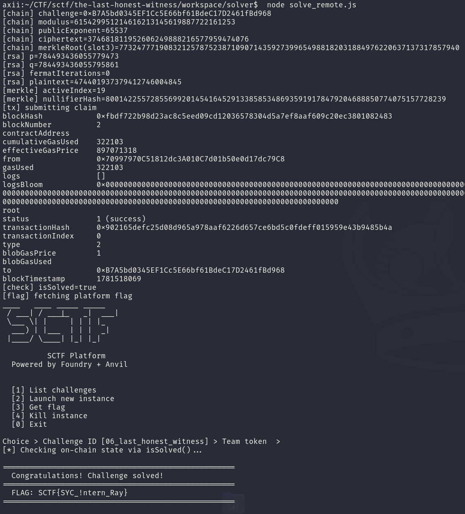

<div class="post-language-switch" data-post-language-switch role="group" aria-label="Article language">
    <a class="post-language-switch__button no-styling" data-post-language-link="ko" href="/posts/sctf-the-last-honest-witness/kr/">KR</a>
    <a class="post-language-switch__button no-styling" data-post-language-link="en" href="/posts/sctf-the-last-honest-witness/en/">EN</a>
</div>

:::section{data-post-language-panel="ko"}
# The Last Honest Witness

## 1. 분석 대상

이 문제는 SCTF의 misc 문제이다. 제공된 자료에는 `Setup`과 `LastHonestWitness` 계열 컨트랙트, Groth16 verifier, 회로 파일, 증명 생성에 필요한 자료가 들어 있다. 문제 설명에는 손상된 문서와 OCR 로그처럼 보이는 문장이 섞여 있지만 실제로 믿을 수 있는 것은 컨트랙트가 검사하는 값과 체인에 올라간 상태이다.

최종 목표는 `claim(...)` 호출 통과다. 이 함수는 크게 네 가지를 본다.

```text
1. LastHonestWitness 회로에 대한 Groth16 proof
2. Page A plaintext
3. Page B ECDSA signature
4. Page C low 40-bit Keccak collision
```

`Setup`에는 `Challenge` 주소와 RSA 관련 값이 남아 있다.

```text
slot 0 = challenge address
slot 1 = modulus N
slot 2 = public exponent e
slot 3 = ciphertext c
```

`LastHonestWitness` 쪽에서는 `merkleRoot`가 storage slot 3에 있고 `claim(...)`은 proof의 public signal이 아래 값들과 일치하는지 먼저 검사한다.

```text
publicSignals[0] = modulus
publicSignals[1] = merkleRoot
publicSignals[2] = RECIPIENT_COMMITMENT
publicSignals[3] = nullifierHash
publicSignals[4] = EXTERNAL_NULLIFIER
```

풀이는 체인에서 RSA 값과 Merkle root를 읽는 데서 시작한다. 숨겨진 witness plaintext를 복구한 뒤 회로가 요구하는 Merkle path와 proof를 만든다. 이후 세 장의 loose page는 독립적인 보조 조건으로 처리하면 된다.

## 2. 풀이

먼저 RSA 부분을 본다. 회로는 `p`와 `q`를 각각 60비트 이하로 제한하고 `p * q = modulus`만 강제한다. 실제 인스턴스에서 읽은 `N`은 두 소수가 매우 가까운 형태였고 Fermat factorization으로 바로 분해됐다.

실행한 인스턴스에서는 다음 값을 확인했다.

```text
N = 615429951214616213145619887722161253
e = 65537
c = 374681811952606249888216577959474076

p = 784493436055779473
q = 784493436055795861
plaintext = 474401937379412746004845
```

`p`와 `q`를 얻으면 `phi = (p - 1) * (q - 1)`에서 개인 지수 `d`를 계산하고 `c^d mod N`으로 plaintext를 복구할 수 있다.

회로에서 witness는 Poseidon 기반 commitment와 Merkle path로 검증된다. 확인해야 하는 관계는 다음과 같다.

```text
p * q = modulus
commitment = Poseidon(1, plaintext)
identity = Poseidon(2, plaintext, p, q, externalNullifier)
leaf = Poseidon(3, identity, commitment)
node = Poseidon(4, left, right)
nullifier = Poseidon(5, identity, externalNullifier)
```

트리는 32개 leaf로 구성된다. 실제 witness leaf는 아래 인덱스에 들어가고 나머지는 빈 leaf 규칙으로 채워진다.

```text
activeIndex = (plaintext + p + q) mod 32
emptyLeaf = Poseidon(6, index, externalNullifier)
```

복구한 값으로 계산한 Merkle root가 체인에서 읽은 root와 일치하면, 같은 입력으로 Groth16 proof를 만들 수 있다. 위 인스턴스에서는 `activeIndex = 19`였고 계산된 `nullifierHash`도 proof의 public signal로 사용했다.

Loose page 세 개는 각각 다른 약점을 갖고 있다.

Page A는 Franklin-Reiter related-message 형태이다.

```text
c1 = m^3 mod n
c2 = (m + 1337)^3 mod n
```

`x^3 - c1`과 `(x + 1337)^3 - c2`의 polynomial gcd를 `Z/nZ`에서 구하면 선형 인자가 나오고 여기서 plaintext를 얻을 수 있다.

```text
pageAPlaintext = 25774616630246150697727911729
```

Page B는 secp256k1 public key의 scalar가 `2^20`보다 작다고 알려준다. scalar multiplication을 작은 범위에서 brute force하면 개인키가 `789123`임을 확인할 수 있다. 컨트랙트는 `PAGE_B_MESSAGE_HASH`에 대해 `ecrecover` 결과가 고정된 signer 주소인지 검사하므로, 이 hash를 그대로 서명해야 한다.

```text
private scalar = 789123
v = 28
r = 0xc3349965986bd706337e04fd1a6a740e1f759a5d95ec4d2854655fc414ec6402
s = 0x432d7ce0d69b4a37abd4504c03aac315e27d666b6720d0624a2d2984cfcd346a
```

Page C는 `keccak256(abi.encodePacked(PAGE_C_TAG, value))`의 하위 40비트만 비교한다. 입력은 서로 다른 `uint32` 두 개면 되므로 birthday search로 충분히 충돌을 찾을 수 있다.

```text
pageCLeft = 1656330
pageCRight = 2582757
low40 = 0x6bdab550bd
```

## 3. Exploit

solver는 체인 상태를 읽고 RSA plaintext를 복구하고 Merkle input과 Groth16 proof를 만든 뒤 `claim(...)`을 호출하는 흐름이다. RSA 복구의 핵심은 아래처럼 정리할 수 있다.

```javascript
const [p, q] = fermatFactor(N);
const phi = (p - 1n) * (q - 1n);
const d = inv(e, phi);
const plaintext = modPow(c, d, N);
```

Fermat factorization은 `ceil(sqrt(N))`에서 시작해 `a^2 - N`이 제곱수가 되는 지점을 찾는다. 이번 인스턴스에서는 두 소수가 충분히 가까워서 반복 없이 바로 분해됐다.

```javascript
function fermatFactor(n) {
  let a = isqrt(n);
  if (a * a < n) a++;

  while (true) {
    const b2 = a * a - n;
    const b = isqrt(b2);
    if (b * b === b2) return [a - b, a + b];
    a++;
  }
}
```

그다음 Poseidon/Merkle 계산으로 회로 입력을 만들고 Groth16 proof를 생성한다. proof의 public signal에는 `modulus`, `merkleRoot`, `RECIPIENT_COMMITMENT`, `nullifierHash`, `EXTERNAL_NULLIFIER`가 들어가야 한다.

마지막 호출에 들어가는 고정 page 값은 다음과 같다.

```text
pageAPlaintext = 25774616630246150697727911729
pageBv = 28
pageBr = 0xc3349965986bd706337e04fd1a6a740e1f759a5d95ec4d2854655fc414ec6402
pageBs = 0x432d7ce0d69b4a37abd4504c03aac315e27d666b6720d0624a2d2984cfcd346a
pageCLeft = 1656330
pageCRight = 2582757
```

`claim(...)`의 인자는 proof와 public signal을 제외하면 위 값들로 채워진다.

```text
claim(
  proofA,
  proofB,
  proofC,
  publicSignals,
  pageAPlaintext,
  pageBv,
  pageBr,
  pageBs,
  pageCLeft,
  pageCRight
)
```

실행 결과 트랜잭션은 성공했고 `isSolved()`도 `true`로 바뀌었다.

```text
transactionHash = 0xe089268d902d0a2c82296bcb2f69995e0bdfe70509781cbe395e6b43580fce54
status = 1
isSolved = true
```

## 4. Flag

```text
SCTF{SYC_!ntern_Ray}
```


:::

:::section{data-post-language-panel="en"}
# The Last Honest Witness

## 1. Analysis focus

The provided files contain the `Setup` and `LastHonestWitness` contract family, a Groth16 verifier, the circuit files, and the materials needed to generate a proof.

The target is to make `claim(...)` accept. It checks four inputs.

```
1. Groth16 proof for the LastHonestWitness circuit
2. Page A plaintext
3. Page B ECDSA signature
4. Page C low 40-bit Keccak collision
```

`Setup` contains the `Challenge` address and the RSA-related values.

```
slot 0 = challenge address
slot 1 = modulus N
slot 2 = public exponent e
slot 3 = ciphertext c
```

In `LastHonestWitness`, `merkleRoot` is stored in storage slot 3, and `claim(...)` first checks that the proof’s public signals match the following values.

```
publicSignals[0] = modulus
publicSignals[1] = merkleRoot
publicSignals[2] = RECIPIENT_COMMITMENT
publicSignals[3] = nullifierHash
publicSignals[4] = EXTERNAL_NULLIFIER
```

The solve starts by reading the RSA values and Merkle root from the chain. After recovering the hidden witness plaintext, we can build the Merkle path and proof required by the circuit. The three loose pages can then be handled as independent auxiliary conditions.

## 2. Solution approach

I first looked at the RSA part. The circuit restricts `p` and `q` to at most 60 bits each, and only enforces `p * q = modulus`. In the actual instance, `N` read from the chain consisted of two primes that were very close to each other, so it factored immediately with Fermat factorization.

In the instance I ran, I confirmed the following values.

```
N = 615429951214616213145619887722161253
e = 65537
c = 374681811952606249888216577959474076

p = 784493436055779473
q = 784493436055795861
plaintext = 474401937379412746004845
```

Once `p` and `q` are known, we can compute the private exponent `d` from `phi = (p - 1) * (q - 1)` and recover the plaintext as `c^d mod N`.

In the circuit, the witness is verified through a Poseidon-based commitment and a Merkle path. The relationships that need to hold are as follows.

```
p * q = modulus
commitment = Poseidon(1, plaintext)
identity = Poseidon(2, plaintext, p, q, externalNullifier)
leaf = Poseidon(3, identity, commitment)
node = Poseidon(4, left, right)
nullifier = Poseidon(5, identity, externalNullifier)
```

The tree consists of 32 leaves. The real witness leaf goes into the index below, and the rest are filled using the empty-leaf rule.

```
activeIndex = (plaintext + p + q) mod 32
emptyLeaf = Poseidon(6, index, externalNullifier)
```

If the Merkle root computed from the recovered values matches the root read from the chain, a Groth16 proof can be generated with the same inputs. In this instance, `activeIndex = 19`, and the computed `nullifierHash` was also used as a public signal for the proof.

The three loose pages each have different weaknesses.

Page A is a Franklin-Reiter related-message case.

```
c1 = m^3 mod n
c2 = (m + 1337)^3 mod n
```

If we compute the polynomial gcd of `x^3 - c1` and `(x + 1337)^3 - c2` over `Z/nZ`, a linear factor appears, and the plaintext can be recovered from it.

```
pageAPlaintext = 25774616630246150697727911729
```

Page B tells us that the scalar of the secp256k1 public key is smaller than `2^20`. Brute forcing scalar multiplication in that small range shows that the private key is `789123`. The contract checks whether `ecrecover` on `PAGE_B_MESSAGE_HASH` returns the fixed signer address, so this exact hash has to be signed.

```
private scalar = 789123
v = 28
r = 0xc3349965986bd706337e04fd1a6a740e1f759a5d95ec4d2854655fc414ec6402
s = 0x432d7ce0d69b4a37abd4504c03aac315e27d666b6720d0624a2d2984cfcd346a
```

Page C only compares the low 40 bits of `keccak256(abi.encodePacked(PAGE_C_TAG, value))`. Since the inputs only need to be two distinct `uint32` values, a birthday search is enough to find a collision.

```
pageCLeft = 1656330
pageCRight = 2582757
low40 = 0x6bdab550bd
```

## 3. Exploit

### solve_remote.js

```javascript
#!/usr/bin/env node
const fs = require("fs");
const path = require("path");
const { execFileSync } = require("child_process");
const circomlibjs = require("circomlibjs");
const { solvePageA, solvePageC } = require("./solve_fixed");

const EXTERNAL_NULLIFIER = 48879n;
const LEAF_COUNT = 32;
const RECIPIENT_COMMITMENT =
  9377985761090098792458769157668700179213141594497154267610801610404565099971n;

const PAGE_B_V = "28";
const PAGE_B_R = "0xc3349965986bd706337e04fd1a6a740e1f759a5d95ec4d2854655fc414ec6402";
const PAGE_B_S = "0x432d7ce0d69b4a37abd4504c03aac315e27d666b6720d0624a2d2984cfcd346a";

function usage() {
  console.error("usage: RPC=<url> SETUP=<addr> PRIVATE_KEY=<key> node solve_remote.js");
  process.exit(2);
}

function sh(cmd, args, opts = {}) {
  const out = execFileSync(cmd, args, {
    cwd: opts.cwd || __dirname,
    encoding: "utf8",
    stdio: opts.stdio || ["ignore", "pipe", "pipe"],
    env: process.env,
  });
  return out == null ? "" : out.trim();
}

function parseHexWord(s, name) {
  const m = s.match(/0x[0-9a-fA-F]+/);
  if (!m) throw new Error(`missing hex word for${name}:${s}`);
  return BigInt(m[0]);
}

function parseAddress(s, name) {
  const words = [...s.matchAll(/0x[0-9a-fA-F]{40,64}/g)].map((m) => m[0]);
  if (words.length === 0) throw new Error(`missing address for${name}:${s}`);
  const word = words[words.length - 1];
  return "0x" + word.slice(-40);
}

function mod(a, n) {
  const r = a % n;
  return r >= 0n ? r : r + n;
}

function egcd(a, b) {
  let x0 = 1n, x1 = 0n;
  while (b !== 0n) {
    const q = a / b;
    [a, b] = [b, a - q * b];
    [x0, x1] = [x1, x0 - q * x1];
  }
  return [a, x0];
}

function inv(a, n) {
  const [g, x] = egcd(mod(a, n), n);
  if (g !== 1n) throw new Error(`inverse does not exist, gcd=${g}`);
  return mod(x, n);
}

function modPow(base, exp, n) {
  base = mod(base, n);
  let result = 1n;
  while (exp > 0n) {
    if (exp & 1n) result = (result * base) % n;
    base = (base * base) % n;
    exp >>= 1n;
  }
  return result;
}

function isqrt(n) {
  if (n < 0n) throw new Error("negative sqrt");
  if (n < 2n) return n;
  let x0 = 1n << BigInt((n.toString(2).length + 1) >> 1);
  while (true) {
    const x1 = (x0 + n / x0) >> 1n;
    if (x1 >= x0) return x0;
    x0 = x1;
  }
}

function fermatFactor(n, maxIterations = 10000000) {
  let a = isqrt(n);
  if (a * a < n) a++;
  for (let i = 0; i <= maxIterations; i++) {
    const b2 = a * a - n;
    const b = isqrt(b2);
    if (b * b === b2) {
      const p = a - b;
      const q = a + b;
      if (p > 1n && p * q === n) return p < q ? [p, q, i] : [q, p, i];
    }
    a++;
  }
  throw new Error(`Fermat factorization exceeded${maxIterations} iterations`);
}

async function buildPrimitives() {
  const poseidon = await circomlibjs.buildPoseidon();
  const field = poseidon.F;
  const hash = (values) => BigInt(field.toString(poseidon(values)));
  return {
    commitment: (plaintext) => hash([1n, plaintext]),
    identitySecret: (plaintext, p, q) => hash([2n, plaintext, p, q, EXTERNAL_NULLIFIER]),
    leaf: (identity, commitment) => hash([3n, identity, commitment]),
    node: (left, right) => hash([4n, left, right]),
    nullifierHash: (identity) => hash([5n, identity, EXTERNAL_NULLIFIER]),
    emptyLeaf: (index) => hash([6n, BigInt(index), EXTERNAL_NULLIFIER]),
  };
}

async function merkleData(p, q, plaintext) {
  const h = await buildPrimitives();
  const activeIndex = Number((plaintext + p + q) % BigInt(LEAF_COUNT));
  const commitment = h.commitment(plaintext);
  const identitySecret = h.identitySecret(plaintext, p, q);
  const nullifierHash = h.nullifierHash(identitySecret);
  const leaves = Array.from({ length: LEAF_COUNT }, (_, i) => h.emptyLeaf(i));
  leaves[activeIndex] = h.leaf(identitySecret, commitment);

  const pathElements = [];
  const pathIndices = [];
  let pos = activeIndex;
  let level = leaves;
  while (level.length > 1) {
    pathElements.push(level[pos ^ 1]);
    pathIndices.push(pos & 1);
    const next = [];
    for (let i = 0; i < level.length; i += 2) next.push(h.node(level[i], level[i + 1]));
    level = next;
    pos = Math.floor(pos / 2);
  }

  return {
    activeIndex,
    commitment,
    identitySecret,
    nullifierHash,
    merkleRoot: level[0],
    input: {
      p: p.toString(),
      q: q.toString(),
      plaintext: plaintext.toString(),
      pathElements: pathElements.map((x) => x.toString()),
      pathIndices: pathIndices.map((x) => x.toString()),
      modulus: (p * q).toString(),
      merkleRoot: level[0].toString(),
      recipientCommitment: commitment.toString(),
      nullifierHash: nullifierHash.toString(),
      externalNullifier: EXTERNAL_NULLIFIER.toString(),
    },
  };
}

function arrayArg(value) {
  if (Array.isArray(value)) return `[${value.map(arrayArg).join(",")}]`;
  return value.toString();
}

async function main() {
  const rpc = process.env.RPC;
  const setup = process.env.SETUP;
  const privateKey = process.env.PRIVATE_KEY;
  if (!rpc || !setup || !privateKey) usage();

  const challenge = parseAddress(
    sh("cast", ["call", setup, "challenge()(address)", "--rpc-url", rpc]),
    "challenge",
  );
  const modulus = parseHexWord(sh("cast", ["storage", setup, "1", "--rpc-url", rpc]), "setup.slot1");
  const publicExponent = parseHexWord(sh("cast", ["storage", setup, "2", "--rpc-url", rpc]), "setup.slot2");
  const ciphertext = parseHexWord(sh("cast", ["storage", setup, "3", "--rpc-url", rpc]), "setup.slot3");
  const chainRoot = parseHexWord(sh("cast", ["storage", challenge, "3", "--rpc-url", rpc]), "challenge.slot3");

  console.log(`[chain] challenge=${challenge}`);
  console.log(`[chain] modulus=${modulus}`);
  console.log(`[chain] publicExponent=${publicExponent}`);
  console.log(`[chain] ciphertext=${ciphertext}`);
  console.log(`[chain] merkleRoot(slot3)=${chainRoot}`);

  const [p, q, fermatIterations] = fermatFactor(modulus);
  const phi = (p - 1n) * (q - 1n);
  const d = inv(publicExponent, phi);
  const plaintext = modPow(ciphertext, d, modulus);
  if (modPow(plaintext, publicExponent, modulus) !== ciphertext) {
    throw new Error("RSA plaintext check failed");
  }
  console.log(`[rsa] p=${p}`);
  console.log(`[rsa] q=${q}`);
  console.log(`[rsa] fermatIterations=${fermatIterations}`);
  console.log(`[rsa] plaintext=${plaintext}`);

  const data = await merkleData(p, q, plaintext);
  if (data.commitment !== RECIPIENT_COMMITMENT) {
    throw new Error(`recipient commitment mismatch:${data.commitment}`);
  }
  if (data.merkleRoot !== chainRoot) {
    throw new Error(`computed root${data.merkleRoot} != chain root${chainRoot}`);
  }
  console.log(`[merkle] activeIndex=${data.activeIndex}`);
  console.log(`[merkle] nullifierHash=${data.nullifierHash}`);

  const runDir = path.join(__dirname, "run");
  fs.mkdirSync(runDir, { recursive: true });
  const inputPath = path.join(runDir, "input.json");
  const proofPath = path.join(runDir, "proof.json");
  const publicPath = path.join(runDir, "public.json");
  fs.writeFileSync(inputPath, JSON.stringify(data.input, null, 2) + "\n");

  const snarkjs = path.join(__dirname, "node_modules", ".bin", "snarkjs");
  sh(snarkjs, [
    "groth16",
    "fullprove",
    inputPath,
    path.resolve(__dirname, "../../extracted/zk/LastHonestWitness.wasm"),
    path.resolve(__dirname, "../../extracted/zk/LastHonestWitness_final.zkey"),
    proofPath,
    publicPath,
  ], { stdio: ["ignore", "inherit", "inherit"] });
  const calldata = sh(snarkjs, ["zkey", "export", "soliditycalldata", publicPath, proofPath]);
  const [proofA, proofB, proofC, publicSignals] = JSON.parse(`[${calldata}]`);

  const pageAPlaintext = solvePageA().toString();
  const [pageCLeft, pageCRight] = solvePageC();
  const signature =
    "claim(uint256[2],uint256[2][2],uint256[2],uint256[5],uint256,uint8,bytes32,bytes32,uint256,uint256)";
  const args = [
    "send",
    challenge,
    signature,
    arrayArg(proofA),
    arrayArg(proofB),
    arrayArg(proofC),
    arrayArg(publicSignals),
    pageAPlaintext,
    PAGE_B_V,
    PAGE_B_R,
    PAGE_B_S,
    pageCLeft.toString(),
    pageCRight.toString(),
    "--rpc-url",
    rpc,
    "--private-key",
    privateKey,
  ];
  console.log("[tx] submitting claim");
  console.log(sh("cast", args));

  const solved = sh("cast", ["call", challenge, "isSolved()(bool)", "--rpc-url", rpc]);
  console.log(`[check] isSolved=${solved}`);

  if (solved === "true" && process.env.TEAM_TOKEN) {
    console.log("[flag] fetching platform flag");
    console.log(sh("python3", [path.resolve(__dirname, "../platform.py"), "flag", process.env.TEAM_TOKEN]));
  } else if (solved === "true") {
    console.log("[flag] TEAM_TOKEN is not set; run `python3 ../platform.py flag\"$TEAM_TOKEN\"` to print the flag.");
  }
}

main().catch((err) => {
  console.error(err.stack || err.message);
  process.exit(1);
});
```

The solver reads chain state, recovers the RSA plaintext, builds the Merkle input and Groth16 proof, and then calls `claim(...)`. The core of the RSA recovery can be summarized as follows.

```javascript
const [p, q] = fermatFactor(N);
const phi = (p - 1n) * (q - 1n);
const d = inv(e, phi);
const plaintext = modPow(c, d, N);
```

Fermat factorization starts from `ceil(sqrt(N))` and searches for a point where `a^2 - N` is a square.

```javascript
function fermatFactor(n) {
  let a = isqrt(n);
  if (a * a < n) a++;

  while (true) {
    const b2 = a * a - n;
    const b = isqrt(b2);
    if (b * b === b2) return [a - b, a + b];
    a++;
  }
}
```

Next, the Poseidon/Merkle computation is used to build the circuit input and generate the Groth16 proof. The proof public signals must contain `modulus`, `merkleRoot`, `RECIPIENT_COMMITMENT`, `nullifierHash`, and `EXTERNAL_NULLIFIER`.

The fixed page values used in the final call are as follows.

```
pageAPlaintext = 25774616630246150697727911729
pageBv = 28
pageBr = 0xc3349965986bd706337e04fd1a6a740e1f759a5d95ec4d2854655fc414ec6402
pageBs = 0x432d7ce0d69b4a37abd4504c03aac315e27d666b6720d0624a2d2984cfcd346a
pageCLeft = 1656330
pageCRight = 2582757
```

Except for the proof and public signals, the arguments to `claim(...)` are filled with the values above.

```
claim(
  proofA,
  proofB,
  proofC,
  publicSignals,
  pageAPlaintext,
  pageBv,
  pageBr,
  pageBs,
  pageCLeft,
  pageCRight
)
```

The transaction succeeded, and `isSolved()` also changed to `true`.

```
transactionHash = 0xe089268d902d0a2c82296bcb2f69995e0bdfe70509781cbe395e6b43580fce54
status = 1
isSolved = true
```

## 4. Flag


`SCTF{SYC_!ntern_Ray}`
:::
