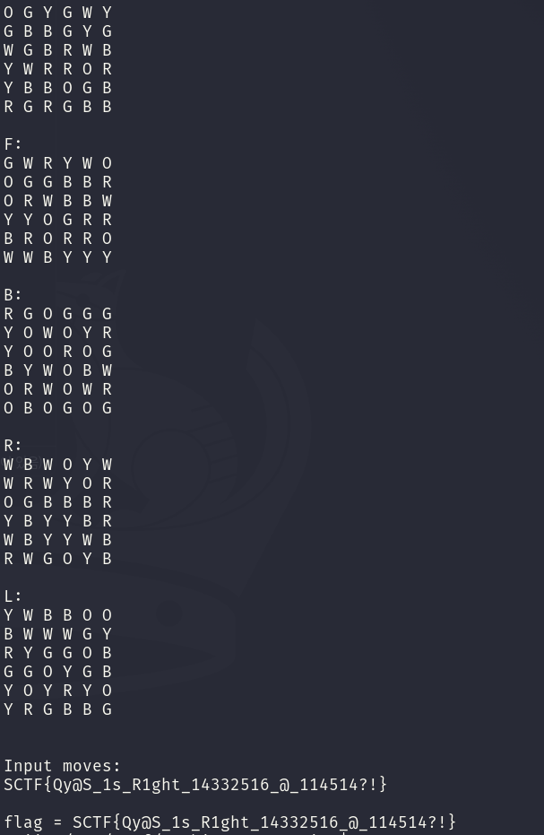

<div class="post-language-switch" data-post-language-switch role="group" aria-label="Article language">
    <a class="post-language-switch__button no-styling" data-post-language-link="ko" href="/posts/sctf-zombie-progression/kr/">KR</a>
    <a class="post-language-switch__button no-styling" data-post-language-link="en" href="/posts/sctf-zombie-progression/en/">EN</a>
</div>

:::section{data-post-language-panel="ko"}
# Zombie_progression

## 1. 분석 대상

제공 바이너리는 `CubeIPC-6` runtime을 시작하고 6x6 cube 상태를 출력한 뒤 한 줄짜리 move sequence를 입력으로 받는다. 입력을 처리한 다음 cube를 다시 렌더링하고 내부 validator가 통과할 때만 flag를 출력한다.

입력 표기는 일반적인 큐브 move notation과 비슷하다. face move, 숫자 prefix, wide move, 전체 cube rotation을 받는다.

```text
faces     : U D F B R L
wide      : Uw, 2Uw, 3Rw ...
rotations : x y z
suffix    : ' or 2
```

처음에는 화면에 보이는 색상만 맞춰 보려고 했다. 하지만 색상만 맞춘 입력은 마지막에 `Cube looks unstable.`을 출력했다. 즉 validator는 렌더링된 색뿐 아니라 sticker마다 붙어 있는 내부 상태까지 확인한다.

분석 중 move가 36개 단위로 처리되고 validator가 이를 3개씩 묶은 12개 block으로 검사한다는 점을 확인했다. 각 block에서는 첫 번째 move 뒤 누적 상태를 `q380`, 두 번째 move 뒤 상태를 `q388`, 세 번째 move 뒤 상태를 `q390`과 비교한다. block이 통과해야 다음 checkpoint가 복호화되므로 flag 출력 루틴만 patch해도 올바른 flag가 나오지 않는다. 복호화 key가 맞지 않기 때문이다.

일부 환경에서는 runtime 초기화 중 `getsockopt(SO_PEERCRED)` 검사가 실패해 `failed to boot runtime`이 출력된다. 이때는 `LD_PRELOAD` hook으로 peer credential을 부모 프로세스의 `pid`, `euid`, `egid`로 맞춰 주면 validator까지 실행된다.

## 2. 풀이

검증은 순차적이다. 36개 move를 한 번에 찾을 필요가 없고 현재 block에 필요한 3개 move만 앞에서부터 찾으면 된다.

validator가 `send()`로 응답할 때 실제 응답 길이는 51바이트지만 그 뒤 stack에는 현재 검증 상태가 남아 있었다. 이 값을 oracle로 쓰면 후보 move가 checkpoint와 어디까지 맞았는지 알 수 있다.

```text
cnt  = p + 0x180
sub  = p + 0x184
blk  = p + 0x188
ok   = p + 0x198
peer = p + 0x199

q380 = p + 0x150
q388 = p + 0x158
q390 = p + 0x160

checkpoint record = p + 0x40 .. p + 0x70
```

`cnt`는 처리된 move 수, `sub`는 block 안의 위치, `blk`는 현재 block 번호다. `q380`, `q388`, `q390`은 block 안에서 순서대로 비교되는 값이고 checkpoint record에는 다음 block의 target 값이 들어 있다.

한 block은 아래 순서로 복구했다.

1. 현재 prefix 뒤에 후보 move 하나를 붙이고 `q380`이 첫 checkpoint 값과 맞는지 본다.
2. 첫 move를 고정한 뒤 두 번째 후보를 붙이고 `q388`을 맞춘다.
3. 세 번째 후보를 붙였을 때 다음 checkpoint record가 나타나면 block을 확정한다.
4. 새 checkpoint record를 다음 block의 target으로 사용한다.

마지막 block만 예외가 있다. 36번째 move가 맞으면 block 12 checkpoint가 메모리에 남기 전에 바로 flag 출력 경로로 들어간다. 그래서 마지막 세 번째 move는 새 checkpoint가 아니라 flag 출력 여부로 판단했다.

10번째 block을 통과한 뒤 읽은 checkpoint는 다음과 같았다. 남은 6개 move도 같은 oracle로 복구했다.

```text
block = 0x0a
q0    = 7e896a4a45f1b559
q1    = 3c943d4fb973a099
q2    = 0ec3a8a26b0c39dc
agg   = 1b30732954ab635e
chain = fc8efe5d9464ad17
hash  = b6bfa9d3ef3e09d7
```

## 3. Exploit

최종 solver는 복구한 36개 move를 바이너리에 넣고 runtime boot가 실패하면 `SO_PEERCRED` hook을 빌드해 `LD_PRELOAD`로 다시 실행한다.

```python
#!/usr/bin/env python3
import os
import pathlib
import re
import selectors
import shutil
import signal
import subprocess
import sys
import tempfile
import time


MOVES = (
    "3Rw' U2 F 2L' z Rw2 B 3U x' 2R Fw U' "
    "3Dw2 L B2 y 2F' Rw D2 3Lw' z2 U F' 2B "
    "R2 x 3Uw' L2 Dw Fw' 3R U2 B' y' 2D 3Fw"
)

HOOK_C = r'''
#define _GNU_SOURCE
#include <dlfcn.h>
#include <sys/socket.h>
#include <sys/types.h>
#include <unistd.h>

static int (*real_getsockopt)(int, int, int, void *, socklen_t *) = 0;

int getsockopt(int fd, int level, int optname, void *optval, socklen_t *optlen) {
    if (!real_getsockopt) {
        real_getsockopt = dlsym(RTLD_NEXT, "getsockopt");
    }

    int ret = real_getsockopt(fd, level, optname, optval, optlen);
    if (level == SOL_SOCKET && optname == SO_PEERCRED &&
        optval != 0 && optlen != 0 && *optlen >= sizeof(struct ucred)) {
        struct ucred *u = (struct ucred *)optval;
        u->pid = getppid();
        u->uid = geteuid();
        u->gid = getegid();
        *optlen = sizeof(struct ucred);
        ret = 0;
    }
    return ret;
}
'''


def find_binary():
    candidates = []
    if os.environ.get("BIN"):
        candidates.append(pathlib.Path(os.environ["BIN"]))
    candidates += [
        pathlib.Path("./Zombie_progression"),
        pathlib.Path("./extracted/Zombie_progression"),
    ]

    for path in candidates:
        if path.exists():
            return path.resolve()
    raise FileNotFoundError("set BIN to the Zombie_progression binary path")


def command_for(binary):
    if os.access(binary, os.X_OK):
        return [str(binary)]
    return [os.environ.get("LOADER", "/lib64/ld-linux-x86-64.so.2"), str(binary)]


def build_hook(workdir):
    gcc = shutil.which("gcc")
    if gcc is None:
        return None

    src = workdir / "peercred.c"
    so = workdir / "peercred.so"
    src.write_text(HOOK_C)
    subprocess.run(
        [gcc, "-shared", "-fPIC", "-O2", str(src), "-o", str(so), "-ldl"],
        check=True,
    )
    return so


def run_once(binary, hook=None, timeout=8.0):
    env = os.environ.copy()
    if hook is not None:
        prev = env.get("LD_PRELOAD")
        env["LD_PRELOAD"] = str(hook) if not prev else f"{hook}:{prev}"

    proc = subprocess.Popen(
        command_for(binary),
        stdin=subprocess.PIPE,
        stdout=subprocess.PIPE,
        stderr=subprocess.STDOUT,
        env=env,
        start_new_session=True,
    )
    assert proc.stdin is not None and proc.stdout is not None
    proc.stdin.write((MOVES + "\n").encode())
    proc.stdin.close()

    sel = selectors.DefaultSelector()
    sel.register(proc.stdout, selectors.EVENT_READ)
    out = bytearray()
    end = time.time() + timeout

    try:
        while time.time() < end:
            events = sel.select(0.1)
            for key, _ in events:
                chunk = key.fileobj.read1(4096)
                if not chunk:
                    return bytes(out)
                out += chunk
                if (
                    re.search(rb"SCTF\{[^}\n]*\}", out)
                    or b"Cube looks unstable." in out
                    or b"failed to boot runtime" in out
                ):
                    return bytes(out)
            if proc.poll() is not None and not events:
                return bytes(out)
        return bytes(out)
    finally:
        try:
            os.killpg(proc.pid, signal.SIGTERM)
        except ProcessLookupError:
            pass
        try:
            proc.wait(timeout=1)
        except subprocess.TimeoutExpired:
            try:
                os.killpg(proc.pid, signal.SIGKILL)
            except ProcessLookupError:
                pass


def main():
    binary = find_binary()
    out = run_once(binary)

    if b"SCTF{" not in out and b"failed to boot runtime" in out:
        with tempfile.TemporaryDirectory() as td:
            hook = build_hook(pathlib.Path(td))
            if hook is None:
                sys.stderr.write(
                    "runtime boot failed and gcc is unavailable for the peercred hook\n"
                )
                sys.stdout.buffer.write(out)
                return 1
            out = run_once(binary, hook)

    sys.stdout.buffer.write(out)
    match = re.search(rb"SCTF\{[^}\n]*\}", out)
    if not match:
        return 1

    print("\nflag =", match.group(0).decode())
    return 0


if __name__ == "__main__":
    raise SystemExit(main())
```

## 4. Flag



```text
SCTF{Qy@S_1s_R1ght_14332516_@_114514?!}
```
:::

:::section{data-post-language-panel="en"}
# Zombie_progression

## 1. Analysis focus

The provided binary starts a `CubeIPC-6` runtime, prints a 6x6 cube state, and takes a one-line move sequence as input. After processing the input, it renders the cube again and prints the flag only if the internal validator passes.

The input notation is similar to standard cube moves. It accepts face moves, numeric prefixes, wide moves, and whole-cube rotations.

```
faces     : U D F B R L
wide      : Uw, 2Uw, 3Rw ...
rotations : x y z
suffix    : ' or 2
```

At first, I tried to solve it by matching the visible colored cube. However, an input that fixed only the colors printed `Cube looks unstable.` at the end. This suggests the validation target includes not only the rendered colors but also the internal state attached to each sticker.

During analysis, I found that moves are processed in groups of 36 and that the validator checks them as 12 blocks of 3 moves each. For each block, it compares the accumulated state after the first move with `q380`, after the second with `q388`, and after the third with `q390`. Each block has to pass to decrypt the next checkpoint, so simply patching the flag-printing routine does not produce the correct flag because the decryption key is wrong.

In some environments, the `getsockopt(SO_PEERCRED)` check fails during runtime initialization and prints `failed to boot runtime`. In that case, an `LD_PRELOAD` hook that sets the peer credentials to the parent process’s `pid`, `euid`, and `egid` lets execution reach the validator.

## 2. Solution approach

The validation is sequential: the next checkpoint is opened only after the previous block passes. There is no need to search all 36 moves at once; it is enough to find the three moves needed for the current block in order.

When the validator sends a reply with `send()`, the actual reply length is 51 bytes, but the stack after that still contains the current validation state. Using this as an oracle reveals how far each candidate move matched the checkpoints.

```
cnt  = p + 0x180
sub  = p + 0x184
blk  = p + 0x188
ok   = p + 0x198
peer = p + 0x199

q380 = p + 0x150
q388 = p + 0x158
q390 = p + 0x160

checkpoint record = p + 0x40 .. p + 0x70
```

Here, `cnt` is the number of processed moves, `sub` is the position inside the block, and `blk` is the current block number. `q380`, `q388`, and `q390` are the values compared in order within a block, and the checkpoint record contains the target values for the next block.

I reconstructed one block in the following order.

1. Append one candidate move after the current prefix and check whether `q380` matches the first checkpoint value.
2. Fix the first move, append a second candidate, and match `q388`.
3. When the next checkpoint record appears after appending the third candidate, confirm the block.
4. Use the new checkpoint record as the target values for the next block.

The last block had one exception. Once the 36th move is correct, execution enters the flag-printing path immediately, before the block 12 checkpoint remains in memory. Therefore, I judged the final third move by whether the flag was printed rather than by a new checkpoint.

After passing the 10th block, the checkpoint I read was as follows. I then recovered the remaining 6 moves with the same oracle.

```
block = 0x0a
q0    = 7e896a4a45f1b559
q1    = 3c943d4fb973a099
q2    = 0ec3a8a26b0c39dc
agg   = 1b30732954ab635e
chain = fc8efe5d9464ad17
hash  = b6bfa9d3ef3e09d7
```

## 3. Exploit

```python
import os
import pathlib
import re
import selectors
import shutil
import signal
import subprocess
import sys
import tempfile
import time

HOOK_C = r'''
#define _GNU_SOURCE
#include <dlfcn.h>
#include <fcntl.h>
#include <stdint.h>
#include <stdio.h>
#include <stdlib.h>
#include <string.h>
#include <sys/socket.h>
#include <sys/types.h>
#include <unistd.h>

static ssize_t(*real_send)(int, const void*, size_t, int);
static int(*real_getsockopt)(int, int, int, void*, socklen_t*);

static uint32_t rd32(const unsigned char*p) {
    uint32_t v;
    memcpy(&v, p, sizeof(v));
    return v;
}

static uint64_t rd64(const unsigned char*p) {
    uint64_t v;
    memcpy(&v, p, sizeof(v));
    return v;
}

int getsockopt(int fd, int level, int optname, void*optval, socklen_t*optlen) {
    if(!real_getsockopt) {
        real_getsockopt = dlsym(RTLD_NEXT, "getsockopt");
    }

    int ret = real_getsockopt(fd, level, optname, optval, optlen);
    if(level == SOL_SOCKET && optname == SO_PEERCRED &&
        optval != 0 && optlen != 0 &&*optlen >= sizeof(struct ucred)) {
        struct ucred*u =(struct ucred*)optval;
        u->pid = getppid();
        u->uid = geteuid();
        u->gid = getegid();
*optlen = sizeof(struct ucred);
        ret = 0;
    }
    return ret;
}

ssize_t send(int fd, const void*buf, size_t len, int flags) {
    if(!real_send) {
        real_send = dlsym(RTLD_NEXT, "send");
    }

    const char*path = getenv("ZOMBIE_ORACLE_LOG");
    if(path != 0 && buf != 0 && len == 0x33) {
        const unsigned char*p =(const unsigned char*)buf;
        uint64_t mark = rd64(p+ 0x40);
        uint32_t mark_hi =(uint32_t)(mark >> 32);
        uint32_t mark_lo =(uint32_t)mark;
        uint32_t cnt = rd32(p+ 0x180);
        uint32_t sub = rd32(p+ 0x184);
        uint32_t blk = rd32(p+ 0x188);
        unsigned int ok = p[0x198];
        unsigned int peer = p[0x199];

        if(mark_hi == 3 && mark_lo <= 12 && cnt <= 36 &&
            blk <= 12 && ok <= 1 && peer == 1) {
            char line[1024];
            int n = snprintf(
                line, sizeof(line),
                "cnt=%u sub=%u blk=%u ok=%u mark=%u "
                "q380=%016llx q388=%016llx q390=%016llx "
                "cp0=%016llx cp1=%016llx cp2=%016llx "
                "agg=%016llx chain=%016llx hash=%016llx\n",
                cnt, sub, blk, ok, mark_lo,
(unsigned long long)rd64(p+ 0x150),
(unsigned long long)rd64(p+ 0x158),
(unsigned long long)rd64(p+ 0x160),
(unsigned long long)rd64(p+ 0x48),
(unsigned long long)rd64(p+ 0x50),
(unsigned long long)rd64(p+ 0x58),
(unsigned long long)rd64(p+ 0x60),
(unsigned long long)rd64(p+ 0x68),
(unsigned long long)rd64(p+ 0x70));
            int out = open(path, O_WRONLY| O_CREAT| O_APPEND, 0600);
            if(out >= 0) {
                ssize_t ignored = write(out, line,(size_t)n);
(void)ignored;
                close(out);
            }
        }
    }

    return real_send(fd, buf, len, flags);
}
'''

RECORD_RE = re.compile(
    r"cnt=(?P<cnt>\d+) sub=(?P<sub>\d+) blk=(?P<blk>\d+) ok=(?P<ok>\d+) "
    r"mark=(?P<mark>\d+) q380=(?P<q380>[0-9a-f]{16}) "
    r"q388=(?P<q388>[0-9a-f]{16}) q390=(?P<q390>[0-9a-f]{16}) "
    r"cp0=(?P<cp0>[0-9a-f]{16}) cp1=(?P<cp1>[0-9a-f]{16}) "
    r"cp2=(?P<cp2>[0-9a-f]{16}) agg=(?P<agg>[0-9a-f]{16}) "
    r"chain=(?P<chain>[0-9a-f]{16}) hash=(?P<hash>[0-9a-f]{16})"
)

def find_binary():
    candidates = []
    if os.environ.get("BIN"):
        candidates.append(pathlib.Path(os.environ["BIN"]))
    candidates += [
        pathlib.Path("./Zombie_progression"),
        pathlib.Path("./extracted/Zombie_progression"),
    ]

    for path in candidates:
        if path.exists():
            return path.resolve()
    raise FileNotFoundError("set BIN to the Zombie_progression binary path")

def command_for(binary):
    if os.access(binary, os.X_OK):
        return [str(binary)]
    return [os.environ.get("LOADER", "/lib64/ld-linux-x86-64.so.2"), str(binary)]

def build_hook(workdir):
    gcc = shutil.which("gcc")
    if gcc is None:
        raise RuntimeError("gcc is required to build the LD_PRELOAD hook")

    src = workdir / "oracle_hook.c"
    so = workdir / "oracle_hook.so"
    src.write_text(HOOK_C)
    subprocess.run(
        [gcc, "-shared", "-fPIC", "-O2", str(src), "-o", str(so), "-ldl"],
        check=True,
    )
    return so

def candidate_moves():
    faces = "UDFBRL"
    suffixes = ["", "'", "2"]
    moves = []

    for face in faces:
        for suf in suffixes:
            moves.append(face + suf)
    for prefix in ["2", "3"]:
        for face in faces:
            for suf in suffixes:
                moves.append(prefix + face + suf)
    for face in faces:
        for suf in suffixes:
            moves.append(face + "w" + suf)
    for prefix in ["2", "3"]:
        for face in faces:
            for suf in suffixes:
                moves.append(prefix + face + "w" + suf)
    for rot in "xyz":
        for suf in suffixes:
            moves.append(rot + suf)

    seen = set()
    uniq = []
    for move in moves:
        if move not in seen:
            seen.add(move)
            uniq.append(move)
    return uniq

def read_records(path):
    records = []
    if not path.exists():
        return records
    for line in path.read_text(errors="ignore").splitlines():
        m = RECORD_RE.fullmatch(line.strip())
        if not m:
            continue
        rec = {}
        for key, value in m.groupdict().items():
            rec[key] = int(value, 16) if key.startswith(("q", "cp")) or key in {"agg", "chain", "hash"} else int(value)
        records.append(rec)
    return records

def run_program(binary, hook, moves, workdir, timeout=8.0):
    log_path = workdir / f"oracle-{time.time_ns()}.log"
    env = os.environ.copy()
    env["LD_PRELOAD"] = str(hook)
    env["ZOMBIE_ORACLE_LOG"] = str(log_path)

    proc = subprocess.Popen(
        command_for(binary),
        stdin=subprocess.PIPE,
        stdout=subprocess.PIPE,
        stderr=subprocess.STDOUT,
        env=env,
        start_new_session=True,
    )
    assert proc.stdin is not None and proc.stdout is not None
    proc.stdin.write((" ".join(moves) + "\n").encode())
    proc.stdin.close()

    sel = selectors.DefaultSelector()
    sel.register(proc.stdout, selectors.EVENT_READ)
    out = bytearray()
    end = time.time() + timeout

    try:
        while time.time() < end:
            events = sel.select(0.1)
            for key, _ in events:
                chunk = key.fileobj.read1(4096)
                if not chunk:
                    return bytes(out), read_records(log_path)
                out += chunk
                if (
                    re.search(rb"SCTF\{[^}\n]*\}", out)
                    or b"Cube looks unstable." in out
                    or b"parse error" in out
                    or b"failed to boot runtime" in out
                ):
                    return bytes(out), read_records(log_path)
            if proc.poll() is not None and not events:
                return bytes(out), read_records(log_path)
        return bytes(out), read_records(log_path)
    finally:
        try:
            os.killpg(proc.pid, signal.SIGTERM)
        except ProcessLookupError:
            pass
        try:
            proc.wait(timeout=1)
        except subprocess.TimeoutExpired:
            try:
                os.killpg(proc.pid, signal.SIGKILL)
            except ProcessLookupError:
                pass

def last_record(records, **need):
    for rec in reversed(records):
        if all(rec.get(k) == v for k, v in need.items()):
            return rec
    return None

def checkpoint_record(records, block, cnt):
    return last_record(records, mark=block, blk=block, cnt=cnt, sub=0, ok=1)

def recover_moves(binary, hook, workdir):
    candidates = candidate_moves()
    prefix = []

    _, records = run_program(binary, hook, prefix, workdir)
    cp = checkpoint_record(records, 0, 0)
    if cp is None:
        raise RuntimeError("failed to read the initial checkpoint")

    for block in range(12):
        q0, q1, q2 = cp["cp0"], cp["cp1"], cp["cp2"]

        found = None
        target_cnt = block * 3 + 1
        for cand in candidates:
            _, records = run_program(binary, hook, prefix + [cand], workdir)
            rec = last_record(records, mark=block, blk=block, cnt=target_cnt, sub=1, ok=1)
            if rec and rec["q380"] == q0:
                found = cand
                break
        if found is None:
            raise RuntimeError(f"failed to recover move{target_cnt}")
        prefix.append(found)

        found = None
        target_cnt = block * 3 + 2
        for cand in candidates:
            _, records = run_program(binary, hook, prefix + [cand], workdir)
            rec = last_record(records, mark=block, blk=block, cnt=target_cnt, sub=2, ok=1)
            if rec and rec["q380"] == q0 and rec["q388"] == q1:
                found = cand
                break
        if found is None:
            raise RuntimeError(f"failed to recover move{target_cnt}")
        prefix.append(found)

        found = None
        target_cnt = block * 3 + 3
        next_cp = None
        for cand in candidates:
            out, records = run_program(binary, hook, prefix + [cand], workdir)
            if block == 11 and re.search(rb"SCTF\{[^}\n]*\}", out):
                found = cand
                next_cp = cp
                break
            rec = checkpoint_record(records, block + 1, target_cnt)
            if rec is not None:
                found = cand
                next_cp = rec
                break
        if found is None:
            raise RuntimeError(f"failed to recover move{target_cnt}")
        prefix.append(found)
        cp = next_cp

        print(f"[block{block:02d}]{' '.join(prefix[-3:])}", flush=True)

    return prefix

def main():
    binary = find_binary()
    with tempfile.TemporaryDirectory() as td:
        workdir = pathlib.Path(td)
        hook = build_hook(workdir)
        moves = recover_moves(binary, hook, workdir)
        print("[moves]", " ".join(moves))

        out, _ = run_program(binary, hook, moves, workdir)
        sys.stdout.buffer.write(out)
        match = re.search(rb"SCTF\{[^}\n]*\}", out)
        if not match:
            return 1
        print("\nflag =", match.group(0).decode())
        return 0

if __name__ == "__main__":
    raise SystemExit(main())
```

## 4. Flag


`SCTF{Qy@S_1s_R1ght_14332516_@_114514?!}`
:::
